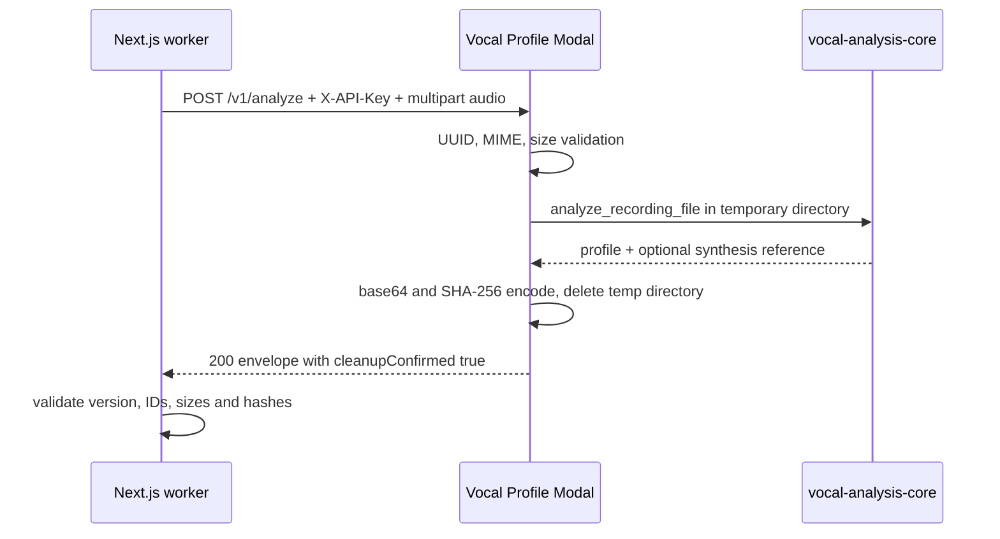
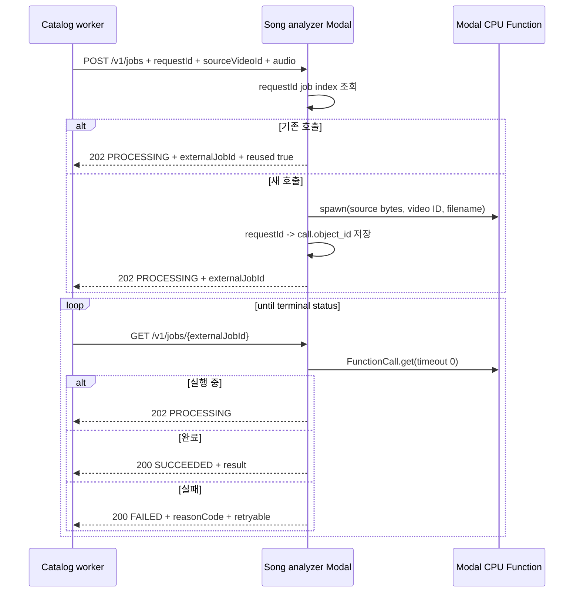
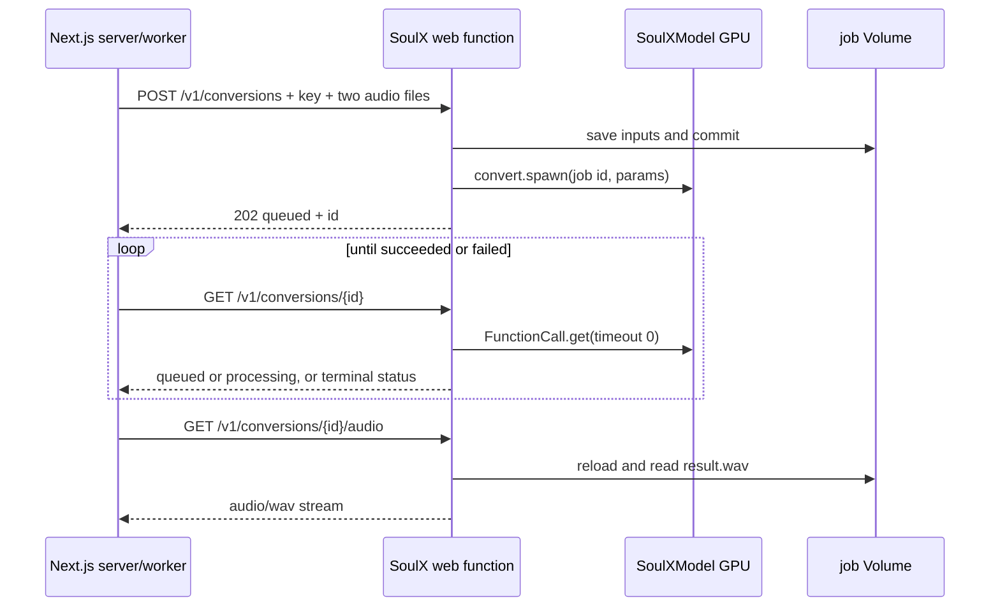

# Modal Analysis and SoulX-Singer Contracts

이 문서는 세 가지를 구분한다.

- **Vocal Profile Modal**: 사용자 녹음을 CPU에서 분석하고 프로필 및 합성용 reference를 반환한다. 동기 HTTP compute primitive이며 사용자-facing 비동기 처리는 Next.js/PostgreSQL durable queue가 소유한다.
- **Song Catalog Analyzer**: 관리자가 등록한 `CatalogTargetAsset`을 CPU에서 분석한다. Demucs로 보컬을 분리한 뒤 공유 분석 코어로 음역을 계산하고 chroma로 원키를 추정한다.
- **SoulX-Singer SVC**: prompt 음성과 target 음성을 GPU에서 변환한다. 입력과 결과는 Modal Volume에 보관하고 `FunctionCall` ID를 기반으로 상태를 조회한다.

세 서비스 모두 Modal Secret `soulx-api-secret`의 `SOULX_API_KEY`를 서버에서 constant-time 비교한다. 브라우저는 Modal을 직접 호출하지 않고 Next.js 서버 경계를 거쳐야 한다.

## 경계와 책임

| 경계 | 입력/출력 | 실행 책임 | 데이터 수명 |
| --- | --- | --- | --- |
| Vocal Profile Modal | `POST /v1/analyze` multipart → JSON `modal-analysis-envelope-v1` | `vocal-analysis-core`의 librosa-pYIN 분석, reference 생성, artifact 인코딩 | request-scoped temporary directory만 사용하고 응답 전 cleanup 확인 |
| Song Catalog Analyzer | `POST /v1/jobs` → `externalJobId`, `GET /v1/jobs/{externalJobId}` → 결과 | 8 vCPU/16 GiB CPU 함수에서 FFmpeg, Demucs CPU, 공유 분석 코어 실행 | 작업별 임시 디렉터리 삭제 후에만 성공 반환; job index는 request identity와 Modal call ID 연결 |
| SoulX-Singer | `POST /v1/conversions` → job `id`, status/audio/delete API | CPU web function은 업로드와 dispatch, GPU `SoulXModel`은 모델 로드와 변환 | `/jobs/{id}`의 입력/결과는 24시간 TTL 또는 명시적 DELETE |

공유 코어는 runtime-neutral이며 서비스별 이미지에 `/opt/vocal_analysis_core`로 추가된다. 따라서 모델/런타임의 무거운 책임은 Modal 이미지와 함수에 있고, 앱 worker와 adapter는 계약 검증·재시도·영속화만 담당한다.

## Vocal Profile: 동기 분석 계약

### 요청

`POST {VOCAL_PROFILE_MODAL_URL}/v1/analyze`에 다음을 보낸다.

- `X-API-Key`: `VOCAL_PROFILE_MODAL_API_KEY`가 우선이며 없으면 `MODAL_API_KEY`를 사용하는 서버 전용 key
- `X-Recording-ID`: UUID여야 한다.
- multipart file `audio`
- 선택 form: `preset`, `melody_start_ms`, `melody_end_ms`, `glissando_start_ms`, `glissando_end_ms`, `trim_to_max_duration`

업로드는 chunk 단위로 저장되며 25 MB를 초과하면 `413 PAYLOAD_TOO_LARGE`를 반환한다. MIME allowlist는 WAV, MP3, M4A, WebM 계열이고, 분석 코어의 기본 입력은 5초 이상 60초 이하이다. `trim_to_max_duration`이 켜지면 임시 `upload` 파일을 대상으로 최대 길이 처리를 한다.

성공 응답은 다음 envelope이다.

```json
{
  "transportVersion": "modal-analysis-envelope-v1",
  "profile": { "recordingId": "<uuid>", "mimeType": "audio/wav", "sizeBytes": 123 },
  "artifacts": {
    "source": { "fileName": "source.wav", "mimeType": "audio/wav", "sizeBytes": 123, "sha256": "...", "contentBase64": "..." },
    "synthesisReference": null
  },
  "cleanupConfirmed": true
}
```

실제 `profile`에는 duration/sample rate, MIDI min·max·p10·median·p90, tessitura, voiced ratio, pitch stability, clipping ratio, RMS, analyzer/version, descriptors가 포함된다. reference가 생성되면 `synthesisReference` metadata와 같은 bytes를 `artifacts.synthesisReference`에 담는다. 각 artifact는 base64와 SHA-256 및 크기를 함께 전달한다.

앱 adapter는 transport version과 `cleanupConfirmed: true`를 필수로 확인하고, recording ID, MIME/크기 일치, base64 decode, 크기, SHA-256을 검증한 뒤에만 persistence 계층에 넘긴다. 이 검증은 임시 응답이므로 Modal이 사용자 오디오를 저장하지 않는다는 경계와 함께 동작한다.



이 다이어그램은 Vocal Profile의 추적 가능한 동기 요청과 응답 계약을 보여준다.

오류는 `INVALID_RECORDING_ID`(400), `UNSUPPORTED_AUDIO`(415), `PAYLOAD_TOO_LARGE`/`TOO_LONG`(413), 분석 거부(422), 예기치 않은 분석 오류(500)로 표현된다. 응답에는 `reasonCode`, `detail`, `retryable`이 포함된다. 앱 adapter는 401/403을 인증 실패(비재시도), 429와 5xx 및 network/timeout을 retryable infrastructure error로 매핑하며 요청 내부 재시도는 하지 않는다.

### 개발용 song target capability

`POST /v1/song-target`은 `{ "sourceUrl": "...", "expectedVideoId": "..........." }`를 받아 yt-dlp와 FFmpeg로 WAV를 만든다. URL의 video ID가 `expectedVideoId`와 일치하는지만 확인하는 개발·진단 capability이며 production mixing의 catalog allowlist가 아니다. 응답은 `audio/wav` streaming이고 stream 종료 시 request-scoped directory를 삭제한다. production mixing은 저장된 `CatalogTargetAsset`을 사용한다.

## Song Catalog Analyzer: 비동기 분석과 polling

### 제출 및 입력 제한

`POST {SONG_ANALYSIS_MODAL_URL}/v1/jobs`는 multipart `audio`, form `requestId`, `sourceVideoId`를 받는다. `sourceVideoId`는 11자리 YouTube ID이고 `requestId`는 필수이며 200자를 넘을 수 없다. 허용 확장자는 `.m4a`, `.mp3`, `.mp4`, `.wav`, `.webm`, 업로드는 비어 있지 않은 최대 100 MB이다.

같은 `requestId`가 이미 job index에 있으면 새 upload나 함수를 만들지 않고 `202 {"status":"PROCESSING","externalJobId":"...","reused":true}`를 반환한다. 새 요청은 8 vCPU, 16 GiB, CPU Demucs(`htdemucs`) 함수로 spawn되고 `reused:false`를 반환한다. 함수는 FFmpeg로 44.1 kHz stereo WAV를 만들고, 분석에는 최대 600초를 로드하며, Demucs `--two-stems=vocals --device cpu` 후 공유 `SONG_ANALYSIS_CONFIG`를 적용한다. 결과에는 음역 통계와 `estimatedKey`, `keyConfidence`, analyzer/separator 버전·모델, `sourceVideoId`, `cleanupConfirmed`가 포함된다.



이 다이어그램은 catalog submit의 idempotency와 Modal FunctionCall polling 계약을 보여준다.

### polling 상태와 실패

- `202 PROCESSING`: 아직 결과가 준비되지 않았으므로 worker가 다시 조회한다.
- `200 SUCCEEDED`: `result`를 schema 검증하고 `SongAnalysis` revision에 저장한다.
- `200 FAILED`: 일반 함수 예외는 `MODAL_ANALYSIS_FAILED`, `retryable:true`다.
- `410 FAILED`: Modal 결과가 수집 전에 만료된 `MODAL_RESULT_EXPIRED`, `retryable:true`다.

submit adapter는 120초, poll은 30초 timeout을 사용하고 API key를 매 요청에 보낸다. worker는 저장된 READY catalog target bytes와 DB `SongAnalysisJob.id`를 stable `requestId`로 연결해 중복 제출을 피한다. 업로드, 변환 WAV, Demucs stem은 temporary directory 안에 두며 cleanup 확인이 거짓이면 함수가 `CLEANUP_FAILED`로 실패한다.

## SoulX-Singer: CPU ingress와 GPU conversion

### 배포 및 모델 경계

`modal deploy modal_app.py`로 web function과 GPU class를 함께 배포한다. 기본 GPU는 L4, `max_containers=1`, scaledown window 60초이며 `SOULX_GPU`, `SOULX_MAX_CONTAINERS`, `SOULX_SCALEDOWN_WINDOW`로 조정할 수 있다. GPU class는 timeout 3600초와 `queue_size=1`로 동작한다.

`modal run modal_app.py::setup`이 약 4.7 GB의 고정 revision SVC/RMVPE/분리 모델을 `soulx-singer-models` Volume에 한 번 내려받는다. `SoulXModel.load()`는 컨테이너 시작 시 Volume의 두 모델 directory를 `/opt/SoulX-Singer/pretrained_models`에 연결하고 `SoulXEngine`을 메모리에 로드한다. 모델 weight가 없으면 명시적으로 setup을 요구한다. 즉 web function은 업로드/상태 관리, GPU class는 추론과 결과 WAV 생성이라는 책임 분리다.

### conversion API

모든 endpoint는 `X-API-Key`가 필요하다.

1. `POST /v1/conversions`: multipart `prompt_audio`, `target_audio`와 선택 form `prompt_vocal_separation`(기본 false), `target_vocal_separation`(true), `auto_pitch_shift`(true), `auto_mix_accompaniment`(true), `pitch_shift`(-36..36, 기본 0), `steps`(1..100, 기본 32), `cfg`(0..10, 기본 1.0), `seed`(0..2147483647, 기본 42)을 받는다. prompt는 최대 128 MB/30초, target은 최대 256 MB/300초이다.
2. 두 파일은 안전한 prefix filename으로 `/jobs/{id}`에 chunk 저장하고 Volume commit 후 GPU `convert.spawn`을 호출한다. 응답은 `202`와 `id`, `status:"queued"`, `created_at`, `result_url:null`이다.
3. `GET /v1/conversions/{id}`는 `queued`/`processing`을 반환하거나 FunctionCall 결과를 수집해 `succeeded`/`failed`로 갱신한다. 성공 시 `result_url`은 audio endpoint다.
4. `GET /v1/conversions/{id}/audio`는 성공 상태에서만 Volume을 reload하고 WAV를 streaming한다. 미완료 상태는 409, 결과 파일이 없으면 410이다.
5. `DELETE /v1/conversions/{id}`는 진행 중 call을 cancel하고 job directory와 job index를 제거한다. 매일 `03:17` UTC cleanup function이 24시간보다 오래된 directory와 index를 삭제한다.



이 다이어그램은 업로드·GPU dispatch·상태 polling·결과 다운로드의 구현된 요청 순서를 보여준다.

## 앱 통합과 보안 운영

- 보컬 adapter는 `VOCAL_PROFILE_MODAL_URL`과 `VOCAL_PROFILE_MODAL_API_KEY`를 서버에서만 읽고, catalog adapter는 호출자가 주입한 `SONG_ANALYSIS_MODAL_API_KEY` 또는 서버 설정의 key를 사용한다. SoulX mixing worker는 `MODAL_API_URL`/`MODAL_API_KEY`를 읽는다.
- 브라우저에는 어떤 Modal URL/key도 공개하지 않는다. Next.js API route 또는 background worker가 `X-API-Key`를 추가한다. Modal 쪽 key 미설정은 503, 불일치 key는 401이다.
- mixing worker는 reference asset과 READY `targetAsset`을 먼저 fetch하고 `POST /v1/conversions` 후 `SUBMITTED`로 저장한다. 이후 상태를 polling하며 성공 WAV를 받아 압축·media storage 저장 후 DB job을 `SUCCEEDED`로 만든다. submit 전 실패는 retryable이면 lease/attempt 정책으로 재시도하고 최종 실패 시 refund 대상이 될 수 있지만, submit 후 실패는 자동 환불하지 않는다.
- Modal FunctionCall/Dict는 장기 보관소가 아니다. SoulX 입력·결과도 24시간 TTL이므로 앱은 성공 결과를 자체 media storage로 옮겨야 한다. 공개 서비스로 확장할 때는 사용자 인증, rate limit, 동의와 저작권/음성 권리 절차를 별도로 마련한다.

## 변경 시 확인할 테스트와 명령

계약 변경은 다음 focused test를 먼저 확인한다.

- `tests/vocal-profile-analyzer-adapter.test.ts`: key 전송, envelope/bytes/hash 검증, cleanup/version mismatch, 401 비재시도, 429·5xx·timeout retryable, 422 분석 거부.
- `tests/song-analysis-modal-adapter.test.ts`: stable request identity와 multipart field, 202 processing 및 terminal failure schema.
- catalog Modal 로컬 계약: `uv run --with-requirements services/song-catalog-analyzer/requirements-local.txt python -m unittest services/song-catalog-analyzer/test_modal_app.py`
- 배포는 원격/비용 승인 이후에만 `pnpm run modal:vocal-profile:deploy` 또는 `pnpm run modal:song-catalog:deploy`를 실행한다. SoulX 독립 배포는 `modal deploy modal_app.py`, 모델 준비는 `modal run modal_app.py::setup`이다.

계약을 확장할 때는 먼저 transport version과 artifact integrity를 함께 바꾸고 adapter schema/test를 갱신한다. binary multipart로 바꾸려면 현재 base64 envelope의 serialization/memory overhead benchmark를 다시 확인해야 하며, 서버 전용 key와 cleanup 확인을 완화해서는 안 된다.
