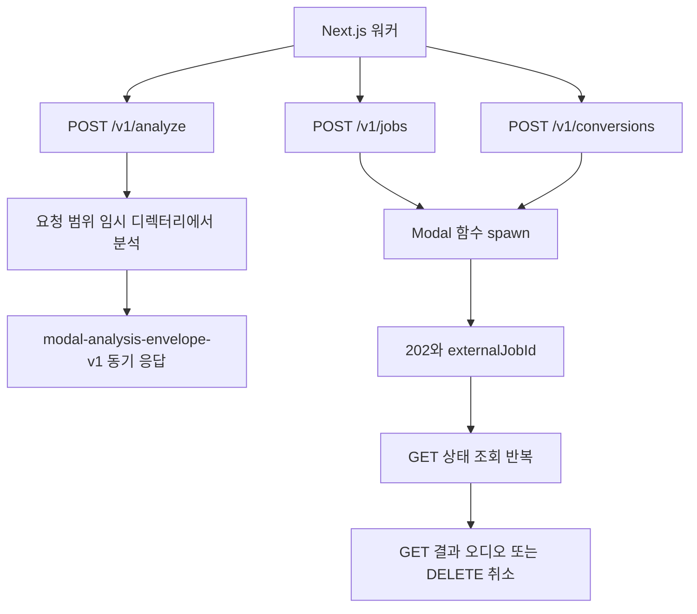

호출할 endpoint를 정하기 전에 응답 형태부터 확인하세요. 보컬 프로필 분석은 HTTP 요청 하나에 대한 동기 envelope로 끝나고, 곡 카탈로그 분석과 믹싱은 외부 작업 ID를 받아 poll하는 비동기 계약이에요. 세 서비스 모두 Python으로 작성해 Modal에 배포하고, 같은 Modal Secret `soulx-api-secret`의 `X-API-Key` 헤더로 인증해요.

## 서비스 한눈에 보기

| 서비스 | 컴퓨트 | endpoint | 배포·테스트 진입점 |
| --- | --- | --- | --- |
| `vocal-profile-modal` | CPU 전용. 2 core, 4096 MiB, timeout 120초, `min_containers` 0, `max_containers` 10, container당 동시 요청 1개([modal_app.py](repo://services/vocal-profile-modal/modal_app.py#L26-L32), [README.md](repo://services/vocal-profile-modal/README.md#L46-L55)) | `GET /health`, `POST /v1/analyze`, 진단용 `POST /v1/song-target`([modal_app.py](repo://services/vocal-profile-modal/modal_app.py#L125-L202)) | `pnpm run modal:vocal-profile:deploy`([package.json](repo://package.json#L43-L43)) |
| `song-catalog-analyzer` | CPU 전용. 분석 함수 8 vCPU·16384 MB·timeout 3600초([modal_app.py](repo://services/song-catalog-analyzer/modal_app.py#L153-L160)), 웹 함수 1 CPU·512 MB·timeout 120초([modal_app.py](repo://services/song-catalog-analyzer/modal_app.py#L329-L338)) | `GET /health`, `POST /v1/jobs`, `GET /v1/jobs/{externalJobId}`, `DELETE /v1/jobs/{externalJobId}`([modal_app.py](repo://services/song-catalog-analyzer/modal_app.py#L250-L326)) | `pnpm run modal:song-catalog:deploy`, `python -m unittest services/song-catalog-analyzer/test_modal_app.py`([README.md](repo://services/song-catalog-analyzer/README.md#L12-L23)) |
| `soulx-singer-svc` | GPU. 기본 `L4`, container 1개, idle 유지 60초, timeout 3600초([modal_app.py](repo://services/soulx-singer-svc/modal_app.py#L23-L25), [modal_app.py](repo://services/soulx-singer-svc/modal_app.py#L99-L106)) | `GET /health`, `POST /v1/conversions`, `GET /v1/conversions/{id}`, `GET /v1/conversions/{id}/audio`, `DELETE /v1/conversions/{id}`([modal_app.py](repo://services/soulx-singer-svc/modal_app.py#L272-L381)) | `modal deploy modal_app.py`([README.md](repo://services/soulx-singer-svc/README.md#L47-L57)) |
| `vocal-analysis-core` | HTTP 서버 없음. 두 CPU 이미지에 함께 패키징되는 Python 분석 패키지 | endpoint 없음([README.md](repo://services/vocal-analysis-core/README.md#L1-L7)) | `python -m pytest -q services/vocal-analysis-core/tests`([README.md](repo://services/vocal-analysis-core/README.md#L9-L14)) |

`soulx-singer-svc`만 배포 명령이 `package.json` script가 아니에요. `services/soulx-singer-svc` 안에서 `modal deploy modal_app.py`를 직접 실행하고, 배포 전에 `modal run modal_app.py::setup`으로 모델 가중치를 Volume에 한 번 내려받아요([modal_app.py](repo://services/soulx-singer-svc/modal_app.py#L58-L78), [README.md](repo://services/soulx-singer-svc/README.md#L39-L55)).

## 인증 계약

세 Web Function은 모두 Modal Secret `soulx-api-secret`을 주입받고, FastAPI 의존성이 `SOULX_API_KEY` 환경 변수와 요청 헤더 `X-API-Key`를 constant-time으로 비교해요([vocal-profile-modal](repo://services/vocal-profile-modal/modal_app.py#L49-L57), [song-catalog-analyzer](repo://services/song-catalog-analyzer/modal_app.py#L35-L39), [soulx-singer-svc](repo://services/soulx-singer-svc/modal_app.py#L30-L35)). 세 서비스의 key 검사 함수는 같은 모양이고, 헤더 이름도 셋 다 `X-API-Key`예요([song-catalog-analyzer](repo://services/song-catalog-analyzer/modal_app.py#L75-L80), [soulx-singer-svc](repo://services/soulx-singer-svc/modal_app.py#L233-L238)).

- `SOULX_API_KEY`가 비어 있으면 서버가 503 `Server API key is not configured`로 응답해요.
- 헤더가 없거나 값이 다르면 401 `Invalid API key`예요.
- `vocal-profile-modal`과 `song-catalog-analyzer`는 FastAPI 앱 전체에 인증 의존성을 걸어서 `/health`도 키가 필요해요([vocal-profile-modal](repo://services/vocal-profile-modal/modal_app.py#L60-L64), [song-catalog-analyzer](repo://services/song-catalog-analyzer/modal_app.py#L243-L247)). `soulx-singer-svc`의 `/health`에는 의존성이 없어 키 없이 호출할 수 있어요([modal_app.py](repo://services/soulx-singer-svc/modal_app.py#L272-L274)).

서버 쪽 credential은 전용 환경 변수를 먼저 보고, 없으면 `MODAL_API_KEY`를 재사용해요.

| 호출 주체 | URL 변수 | API key 우선순위 | 근거 |
| --- | --- | --- | --- |
| 보컬 프로필 분석 워커 | `VOCAL_PROFILE_MODAL_URL` | `VOCAL_PROFILE_MODAL_API_KEY` → `MODAL_API_KEY` | [modal-adapter.ts](repo://src/entities/vocal-profile/api/analyzer/modal-adapter.ts#L34-L46) |
| 곡 카탈로그 분석 워커 | `SONG_ANALYSIS_MODAL_URL` | `SONG_ANALYSIS_MODAL_API_KEY` → `MODAL_API_KEY` | [server-env.ts](repo://src/shared/config/server-env.ts#L70-L74) |
| 믹싱 워커·관리자 커스텀 믹싱 | `MODAL_API_URL` | `MODAL_API_KEY` | [worker.ts](repo://src/_app/background-jobs/mixing/worker.ts#L79-L86), [modal.ts](repo://src/features/admin-custom-mixing/api/modal.ts#L9-L13) |

키가 없으면 서버는 호출을 시도하지 않고 `ANALYZER_NOT_CONFIGURED`, `MODAL_NOT_CONFIGURED` 같은 설정 오류를 돌려줘요. 키 값 자체는 이 문서에 적지 않아요.

## 응답 형태: 동기 envelope와 작업 ID

세 서비스의 가장 큰 계약 차이는 "호출이 끝날 때까지 기다리는가"예요. 보컬 프로필 분석만 단일 동기 응답이고, 나머지 둘은 `externalJobId`를 돌려주고 상태를 조회해요.

첫 번째 갈래가 `POST /v1/analyze`의 단일 응답 경로이고, 두 번째·세 번째 갈래가 spawn 뒤 `externalJobId`를 저장하고 상태를 조회하는 경로예요.

| 서비스 | 외부 작업 ID 처리 | 완료 확인 방법 |
| --- | --- | --- |
| `vocal-profile-modal` | 저장하지 않아요. 워커가 `analyzeVocalProfileBytes` 결과를 그 자리에서 써요([worker.ts](repo://src/_app/background-jobs/vocal-profile-analysis/worker.ts#L299-L312)). `VocalProfileAnalysisJob`에는 `externalJobId` 컬럼이 없어요([schema.prisma](repo://prisma/schema.prisma#L540-L569)) | 응답 본문의 `transportVersion`과 `cleanupConfirmed`를 검증해 그 자리에서 결과를 사용해요 |
| `song-catalog-analyzer` | `SongAnalysisJob.externalJobId`에 저장해요([schema.prisma](repo://prisma/schema.prisma#L286-L311)) | `GET /v1/jobs/{externalJobId}`를 반복 호출해요 |
| `soulx-singer-svc` | 응답의 `id`를 `MixingJob.modalJobId`로 저장해요([schema.prisma](repo://prisma/schema.prisma#L593-L593), [worker.ts](repo://src/_app/background-jobs/mixing/worker.ts#L415-L445)) | `GET /v1/conversions/{id}`를 반복 호출하고, 완료 후 `/audio`를 내려받아요 |

### 보컬 프로필 분석 envelope

`POST /v1/analyze`의 성공 응답은 `transportVersion = "modal-analysis-envelope-v1"`인 JSON envelope예요([transport.py](repo://services/vocal-profile-modal/transport.py#L78-L105)). envelope의 필드는 다음 세 묶음이에요.

| envelope 필드 | 담는 값 | 근거 |
| --- | --- | --- |
| `profile` | MIDI 통계, `voicedRatio`, `pitchStability`, `clippingRatio`, `rmsDb`, `analyzerVersion`, `descriptors`, `synthesisReference` descriptor | [transport.py](repo://services/vocal-profile-modal/transport.py#L12-L62) |
| `artifacts.source` | `fileName`, `mimeType`, `sizeBytes`, `sha256`, `contentBase64` | [transport.py](repo://services/vocal-profile-modal/transport.py#L54-L62) |
| `artifacts.synthesisReference` | 선택적이에요. 값이 있으면 `source`와 같은 다섯 필드를 담고, 없으면 `null`이에요 | [transport.py](repo://services/vocal-profile-modal/transport.py#L78-L105) |

서버 adapter는 base64를 디코딩한 뒤 `sizeBytes`와 SHA-256을 다시 계산해 다르면 `ANALYZER_INVALID_RESPONSE`로 실패시켜요. `transportVersion`이 다르거나 `cleanupConfirmed`가 `true`가 아니면 "analyzer transport or cleanup contract is incompatible"으로 거절해요([modal-adapter.ts](repo://src/entities/vocal-profile/api/analyzer/modal-adapter.ts#L48-L100)). 요청 타임아웃은 120초, `/health` 확인 타임아웃은 10초예요([modal-adapter.ts](repo://src/entities/vocal-profile/api/analyzer/modal-adapter.ts#L13-L14), [modal-adapter.ts](repo://src/entities/vocal-profile/api/analyzer/modal-adapter.ts#L198-L215)).

입력은 multipart이고 `X-Recording-ID` 헤더가 UUID여야 해요. 형식이 틀리면 400 `INVALID_RECORDING_ID`예요([modal_app.py](repo://services/vocal-profile-modal/modal_app.py#L118-L122), [modal_app.py](repo://services/vocal-profile-modal/modal_app.py#L202-L226)). `recordingId`는 Modal Dict `copy-singer-vocal-analysis-claims`의 claim 키로도 쓰여요. 같은 입력을 다시 보내면 409 `ANALYSIS_ALREADY_SUBMITTED`, 다른 입력이면 409 `IDEMPOTENCY_CONFLICT`이고 재분석은 하지 않아요([modal_app.py](repo://services/vocal-profile-modal/modal_app.py#L249-L262)). 이 Dict에는 입력 지문 같은 metadata만 들어가고, 분석 대상 오디오와 결과 bytes는 남기지 않아요([modal_app.py](repo://services/vocal-profile-modal/modal_app.py#L263-L263)).

`POST /v1/song-target`은 YouTube URL을 `yt-dlp==2026.7.4`와 FFmpeg로 WAV 변환해 `audio/wav`로 스트리밍하는 개발·진단용 endpoint예요. 요청 URL의 video ID가 `expectedVideoId`와 같은지 정도만 검증하고 별도 카탈로그 allowlist는 쓰지 않아요([song_pipeline.py](repo://services/vocal-analysis-core/vocal_analysis_core/song_pipeline.py#L52-L60)). 스트림이 끝나면 임시 디렉터리를 지우고, production 믹싱은 이 경로 대신 사전 등록된 카탈로그 자산을 사용해요([modal_app.py](repo://services/vocal-profile-modal/modal_app.py#L149-L199), [README.md](repo://services/vocal-profile-modal/README.md#L87-L100)).

### 곡 카탈로그 분석 job 계약

`POST /v1/jobs`는 multipart로 `audio` 파일, `requestId`, `sourceVideoId`를 받고 202와 함께 `status = "PROCESSING"`, `externalJobId`, `reused`를 돌려줘요([modal_app.py](repo://services/song-catalog-analyzer/modal_app.py#L259-L290)). 같은 `requestId`의 재호출은 이미 spawn한 `FunctionCall` ID를 재사용하고, 그 ID를 아직 확정하지 못했으면 503 `SUBMISSION_UNKNOWN`과 `Retry-After: 5`를 반환해요. 입력 지문이 다르면 409 `IDEMPOTENCY_CONFLICT`예요([modal_app.py](repo://services/song-catalog-analyzer/modal_app.py#L66-L72)).

| 입력·오류 | 값과 응답 | 근거 |
| --- | --- | --- |
| `requestId` | 필수, 최대 200자. 위반 시 422 `INVALID_REQUEST_ID` | [modal_app.py](repo://services/song-catalog-analyzer/modal_app.py#L90-L99) |
| `sourceVideoId` | YouTube video ID 형식 11자. 위반 시 422 `INVALID_SOURCE_VIDEO_ID` | [modal_app.py](repo://services/song-catalog-analyzer/modal_app.py#L28-L28), [modal_app.py](repo://services/song-catalog-analyzer/modal_app.py#L93-L94) |
| 업로드 크기 | 100 MB 이하, 0바이트 불가. 초과 시 413 `PAYLOAD_TOO_LARGE`, 빈 파일은 422 `EMPTY_AUDIO` | [modal_app.py](repo://services/song-catalog-analyzer/modal_app.py#L26-L26), [modal_app.py](repo://services/song-catalog-analyzer/modal_app.py#L95-L98) |
| 파일 확장자 | `.m4a`, `.mp3`, `.mp4`, `.wav`, `.webm`만 허용. 그 외 422 `UNSUPPORTED_AUDIO` | [modal_app.py](repo://services/song-catalog-analyzer/modal_app.py#L29-L29), [modal_app.py](repo://services/song-catalog-analyzer/modal_app.py#L83-L87) |
| poll 응답 | 202 `PROCESSING`, 200 `SUCCEEDED` + `result`, 410 `MODAL_RESULT_EXPIRED`, 200 `FAILED` + `MODAL_ANALYSIS_FAILED` | [modal_app.py](repo://services/song-catalog-analyzer/modal_app.py#L293-L320) |
| 취소 | `DELETE /v1/jobs/{externalJobId}`가 204로 응답하고 container를 종료해요 | [modal_app.py](repo://services/song-catalog-analyzer/modal_app.py#L323-L326) |

분석 함수는 임시 디렉터리 안에서 ffmpeg로 44.1 kHz 스테레오 WAV를 만들고, librosa `chroma_cqt`와 장·단조 key profile 상관으로 원키와 신뢰도를 추정한 뒤, Demucs `htdemucs`로 vocal stem을 분리해 `SONG_ANALYSIS_CONFIG`로 음역을 분석해요([modal_app.py](repo://services/song-catalog-analyzer/modal_app.py#L161-L208)). 응답의 `ytDlpVersion`은 이 Modal 경로에서 항상 `null`이고, `separator`는 `demucs`, `separatorModel`은 `htdemucs`예요([modal_app.py](repo://services/song-catalog-analyzer/modal_app.py#L209-L235)). 작업별 임시 파일이 남아 있으면 `CLEANUP_FAILED`로 실패시켜서 정리 실패를 결과로 감추지 않아요([modal_app.py](repo://services/song-catalog-analyzer/modal_app.py#L237-L239)).

서버 adapter는 `cleanupConfirmed`가 정확히 `true`인지 zod schema로 검증하고, 제출 타임아웃 120초·poll 타임아웃 30초를 써요([analyzer.ts](repo://src/features/manage-song-catalog/api/analyzer.ts#L6-L42), [analyzer.ts](repo://src/features/manage-song-catalog/api/analyzer.ts#L81-L137)).

### 믹싱(SoulX-Singer) job 계약

`POST /v1/conversions`는 두 오디오를 Volume에 저장한 뒤 GPU 클래스 함수를 spawn하고 202로 job을 돌려줘요([modal_app.py](repo://services/soulx-singer-svc/modal_app.py#L276-L349)). 폼 필드 기본값과 허용 범위는 다음과 같아요.

| 필드 | 기본값·범위 | 설명 |
| --- | --- | --- |
| `prompt_audio` | 필수 파일, 업로드 최대 128 MB | 목표 가수의 레퍼런스 음성 |
| `target_audio` | 필수 파일, 업로드 최대 256 MB | 변환할 대상 음원 |
| `prompt_vocal_separation` | `false` | prompt에 반주가 있으면 `true` |
| `target_vocal_separation` | `true` | target에 반주가 있으면 `true` |
| `auto_pitch_shift` | `true` | 두 음역 차이 자동 보정 |
| `auto_mix_accompaniment` | `true` | 분리한 반주를 결과와 다시 믹스 |
| `pitch_shift` | `0`, `-36`~`36` | 반음 단위 수동 이동 |
| `steps` | `32`, `1`~`100` | diffusion step 수 |
| `cfg` | `1.0`, `0.0`~`10.0` | classifier-free guidance |
| `seed` | `42`, `0`~`2147483647` | 난수 시드 |
| `request_id` | 선택, 최대 200자 | 주면 제출 멱등 키로 사용해요 |

값과 범위는 [modal_app.py](repo://services/soulx-singer-svc/modal_app.py#L276-L289), 업로드 상한은 [modal_app.py](repo://services/soulx-singer-svc/modal_app.py#L26-L27)에서 확인할 수 있어요. 업로드가 상한을 넘으면 413과 `exceeds the N MB limit` 상세를 돌려주고, 저장에 실패하면 작업 디렉터리를 지워요([modal_app.py](repo://services/soulx-singer-svc/modal_app.py#L188-L308)).

응답의 `id`로 `GET /v1/conversions/{id}`를 호출하면 `queued`, `processing`, `succeeded`, `failed` 중 하나의 상태와 `result_url`을 받아요([modal_app.py](repo://services/soulx-singer-svc/modal_app.py#L208-L215), [modal_app.py](repo://services/soulx-singer-svc/modal_app.py#L351-L359)). `succeeded`가 아니면 `/audio`는 409, 결과 파일이 지워졌으면 410이에요. `DELETE /v1/conversions/{id}`는 실행 중이면 `FunctionCall`을 취소하고 저장된 입력·결과와 job metadata를 지운 뒤 204로 응답해요([modal_app.py](repo://services/soulx-singer-svc/modal_app.py#L361-L381)). 저장된 입력과 결과는 `modal.Cron("17 3 * * *")`로 도는 정리 함수가 24시간(`JOB_TTL_SECONDS`)이 지난 작업 디렉터리를 삭제해요([modal_app.py](repo://services/soulx-singer-svc/modal_app.py#L28-L28), [modal_app.py](repo://services/soulx-singer-svc/modal_app.py#L386-L405)).

엔진은 `prompt`를 30초, `target`을 300초로 잘라 써요. `Settings`에 그 값이 있고 엔진의 `_normalize`가 `max_seconds * sample_rate` 이후를 버려요([modal_app.py](repo://services/soulx-singer-svc/modal_app.py#L114-L124), [engine.py](repo://services/soulx-singer-svc/api/engine.py#L84-L90)). README의 입력 기준(prompt 최대 30초, target 최대 300초·256 MB, prompt 업로드 128 MB)과 코드 값이 일치해요([README.md](repo://services/soulx-singer-svc/README.md#L99-L109)).

`max_containers=1`이 기본이라 여러 요청은 Modal 안에서 순차 대기해요. `SOULX_GPU`, `SOULX_MAX_CONTAINERS`, `SOULX_SCALEDOWN_WINDOW`로 배포 시 바꿀 수 있어요([modal_app.py](repo://services/soulx-singer-svc/modal_app.py#L23-L25), [README.md](repo://services/soulx-singer-svc/README.md#L59-L65)).

## 믹싱 요청의 고정 preset

production 믹싱과 관리자 커스텀 믹싱은 요청마다 서버가 `SYNTHESIS_PRESET`을 폼에 그대로 실어 보내요([synthesis-state.ts](repo://src/entities/recommendation/model/synthesis-state.ts#L1-L9), [worker.ts](repo://src/_app/background-jobs/mixing/worker.ts#L358-L367), [modal.ts](repo://src/features/admin-custom-mixing/api/modal.ts#L40-L56)).

| 필드 | `SYNTHESIS_PRESET` 값 | production 믹싱 워커가 보내는 값 |
| --- | --- | --- |
| `prompt_vocal_separation` | `false` | `false` |
| `target_vocal_separation` | `true` | `true` |
| `auto_pitch_shift` | `false` | `"false"`로 다시 덮어써요 |
| `auto_mix_accompaniment` | `true` | `true` |
| `pitch_shift` | `0` | `String(job.recommendedShift)`로 덮어써요 |
| `steps` | `32` | `32` |
| `cfg` | `1` | `1` |
| `seed` | `42` | `42` |

production 믹싱 워커는 preset을 붙인 뒤 `auto_pitch_shift`를 `"false"`, `pitch_shift`를 `String(job.recommendedShift)`로 덮어써요([worker.ts](repo://src/_app/background-jobs/mixing/worker.ts#L365-L367)). 그래서 endpoint 기본값인 `auto_pitch_shift = true`와 실제 production 요청이 달라지고, 워커는 변경 범위 테스트에서 이 값을 확인해요([mixing-queue.integration.ts](repo://tests/mixing-queue.integration.ts#L468-L475)). 관리자 커스텀 믹싱은 preset만 붙이고 `target_audio`를 관리자가 올린 파일로 채워요([modal.ts](repo://src/features/admin-custom-mixing/api/modal.ts#L40-L56)).

참조 음성 선택 규칙(스마트 참조가 있으면 우선 사용, `smart-reference-mid-v1` 계약이면 없을 때 대체하지 않음)은 [src/features/create-mixing/model/reference.ts](repo://src/features/create-mixing/model/reference.ts#L12-L29)와 [contract.ts](repo://src/entities/vocal-profile/model/contract.ts#L201-L212)에 있어요. 전체 믹싱 절차는 [AI 믹싱 작업 흐름](../workflows/ai-mixing.md)이 소유해요.

## 공유 분석 코어 `vocal_analysis_core`

`services/vocal-analysis-core/vocal_analysis_core`는 HTTP 서버도, 영속화도, 로컬 분석 런타임도 제공하지 않는 순수 Python 패키지예요([README.md](repo://services/vocal-analysis-core/README.md#L1-L7)). `vocal-profile-modal`과 `song-catalog-analyzer`가 각자의 Modal 이미지에 이 디렉터리를 `add_local_dir`로 넣어 `/opt/vocal_analysis_core`에서 import해요([vocal-profile-modal](repo://services/vocal-profile-modal/modal_app.py#L66-L86), [song-catalog-analyzer](repo://services/song-catalog-analyzer/modal_app.py#L41-L58)).

두 서비스가 같은 패키지를 쓰지만 설정은 달라요. `config.py`는 사용자 녹음용 `DEFAULT_ANALYSIS_CONFIG`(최대 60초, `min_voiced_ratio` 0.25)와 분리된 보컬 stem용 `SONG_ANALYSIS_CONFIG`(최대 900초, `min_voiced_ratio` 0.05)를 따로 정의해요([config.py](repo://services/vocal-analysis-core/vocal_analysis_core/config.py#L4-L22)). `MAX_UPLOAD_BYTES = 25 * 1024 * 1024`도 이 패키지가 정의하고, 보컬 프로필 endpoint가 이 상수로 업로드를 자르면서 413 `PAYLOAD_TOO_LARGE`를 내요([config.py](repo://services/vocal-analysis-core/vocal_analysis_core/config.py#L32-L33), [modal_app.py](repo://services/vocal-profile-modal/modal_app.py#L239-L247)).

분석 계약을 바꿀 때는 버전 정합성에 주의하세요. 분석 코어는 `librosa==0.11.0`, `numpy==2.3.5`, `soundfile==0.14.0`을 고정하는데, 두 Modal 이미지도 같은 패키지를 각자 따로 고정해요([requirements.txt](repo://services/vocal-analysis-core/requirements.txt#L1-L3), [vocal-profile-modal](repo://services/vocal-profile-modal/modal_app.py#L66-L77), [song-catalog-analyzer](repo://services/song-catalog-analyzer/modal_app.py#L41-L53)). 한 이미지에서만 버전을 올리면 분석 계약이 어긋나니 함께 맞추세요([README.md](repo://services/vocal-analysis-core/README.md#L16-L16)). 스마트 참조 산출물은 `REFERENCE_VERSION = "smart-reference-mid-v1"`, `REFERENCE_MAX_SECONDS = 30.0`이고, 중음 phrase를 못 만들면 synthesis reference 파일을 지우고 descriptor에 `status: "unavailable"`과 `fallbackReason`만 남겨요([reference.py](repo://services/vocal-analysis-core/vocal_analysis_core/reference.py#L14-L22), [analysis_service.py](repo://services/vocal-analysis-core/vocal_analysis_core/analysis_service.py#L117-L140)).

## 변경 범위 테스트

- `python -m unittest services/song-catalog-analyzer/test_modal_app.py` — 제출 검증, 확장자 allowlist, key 추정, CPU spawn·poll 구조를 확인해요. README는 의존성을 맞추기 위해 `uv run --with-requirements services/song-catalog-analyzer/requirements-local.txt`로 감싸 실행하도록 안내해요([test_modal_app.py](repo://services/song-catalog-analyzer/test_modal_app.py#L12-L58), [README.md](repo://services/song-catalog-analyzer/README.md#L12-L17)).
- `python -m pytest -q services/vocal-analysis-core/tests` — 분석, 참조 생성, song pipeline 테스트를 돌려요. 먼저 `python -m pip install -r services/vocal-analysis-core/requirements-dev.txt`로 `pytest`를 설치하세요([README.md](repo://services/vocal-analysis-core/README.md#L9-L14)).
- `python3 tests/modal-submission-contract.py` — 세 서비스의 `_claim_submission`, `submit_job`, `create_conversion`, `analyze`를 AST로 추출해 동시 claim 원자성, 입력 지문 불일치 409, spawn 응답 유실 후 503, 보컬 분석 재실행 금지를 검사해요([modal-submission-contract.py](repo://tests/modal-submission-contract.py#L39-L60), [modal-submission-contract.py](repo://tests/modal-submission-contract.py#L128-L168)). 이 파일은 `pnpm run test:readiness`의 마지막 단계로 연결돼 있어요([package.json](repo://package.json#L70-L70)).
- `services/vocal-profile-modal`에는 소스 문자열과 transport 직렬화를 검사하는 pytest 파일(`test_modal_app_source.py`, `test_transport.py`, `test_runtime.py`)이 있어요([test_modal_app_source.py](repo://services/vocal-profile-modal/test_modal_app_source.py#L10-L46)). 다만 이 입력에서 그 디렉터리를 실행하는 `package.json` script나 `requirements-local.txt`의 `pytest` 의존성은 확인하지 못했어요.

## 더 볼 문서

| 알고 싶은 것 | 문서 |
| --- | --- |
| 어떤 환경 변수가 URL과 키를 정하는지 | [환경 변수와 런타임 한도](../operations/configuration.md) |
| 작업 점유·heartbeat·재시도·종료 확정 | [Job 큐와 lease 복구 계약](../operations/job-processing.md) |
| 업로드부터 결과 표시까지 절차 | [보컬 프로필 분석 흐름](../workflows/vocal-profile-analysis.md), [AI 믹싱 작업 흐름](../workflows/ai-mixing.md), [곡 카탈로그 등록과 공개](../workflows/song-catalog-lifecycle.md) |
| Python 서비스가 놓이는 런타임 경계 | [시스템 지도와 경계](../architecture/system-map.md) |
