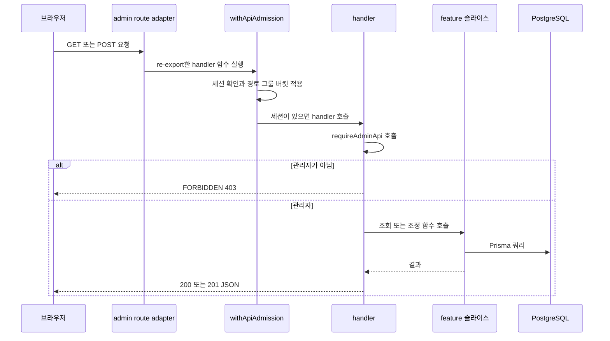
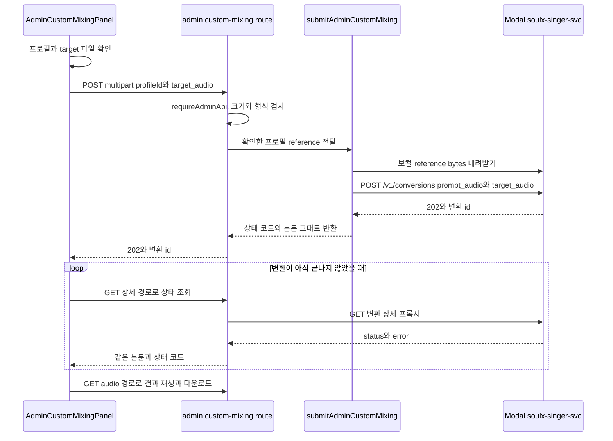

# 관리자 콘솔과 커스텀 믹싱

관리자 기능을 고칠 때는 `app/`이 아니라 그 뒤의 slice를 열어야 해요. 관리자 경로는 다른 제품 경로와 같은 계층 배치를 따라요. `app/admin`과 `app/api/admin`은 얇은 re-export만 두고, `src/_pages/admin*`이 화면을, `src/_app/api-routes/admin/`이 HTTP handler를, `src/features/*` slice가 실제 로직을 맡아요. 이 배치는 [시스템 지도와 경계](../architecture/system-map.md)의 "관리자 화면과 관리자 API" 행과 같은 규칙이에요.

이 페이지는 관리자 진입점 표면과 확장 절차를 다뤄요. 관리자 여부를 어떻게 판정하는지, 티켓 원장의 불변식이 무엇인지, 카탈로그 수명 주기가 어떤 단계를 지나는지는 각 소유 페이지가 맡고 여기서는 링크만 해요.

## 관리자 화면은 얇은 re-export로 끝나요

`app/admin` 아래 page 파일은 이름만 노출하고 구현은 `src/_pages`가 가져요. 그래서 화면 로직을 바꿀 때는 `app/`이 아니라 `src/_pages/admin*/ui/`를 열어야 해요.

| 화면 경로 | re-export 파일 | 구현 파일 |
| --- | --- | --- |
| `/admin` | [app/admin/page.tsx](repo://app/admin/page.tsx#L1-L1) | [src/_pages/admin/ui/admin-page.tsx](repo://src/_pages/admin/ui/admin-page.tsx#L55-L91) |
| `/admin` 로딩 UI | [app/admin/loading.tsx](repo://app/admin/loading.tsx#L1-L1) | [src/_pages/admin/ui/admin-loading.tsx](repo://src/_pages/admin/ui/admin-loading.tsx#L3-L10) |
| `/admin/songs` | [app/admin/songs/page.tsx](repo://app/admin/songs/page.tsx#L1-L4) | [src/_pages/admin-song-catalog/ui/admin-song-catalog-page.tsx](repo://src/_pages/admin-song-catalog/ui/admin-song-catalog-page.tsx#L69-L97) |
| `/admin/songs` 로딩 UI | [app/admin/songs/loading.tsx](repo://app/admin/songs/loading.tsx#L1-L1) | [src/_pages/admin-song-catalog/ui/admin-song-catalog-loading.tsx](repo://src/_pages/admin-song-catalog/ui/admin-song-catalog-loading.tsx#L3-L10) |
| `/admin/custom-mixing` | [app/admin/custom-mixing/page.tsx](repo://app/admin/custom-mixing/page.tsx#L1-L4) | [src/_pages/admin-custom-mixing/ui/admin-custom-mixing-page.tsx](repo://src/_pages/admin-custom-mixing/ui/admin-custom-mixing-page.tsx#L11-L33) |
| `/admin/custom-mixing` 로딩 UI | [app/admin/custom-mixing/loading.tsx](repo://app/admin/custom-mixing/loading.tsx#L1-L1) | [src/_pages/admin-custom-mixing/ui/admin-custom-mixing-loading.tsx](repo://src/_pages/admin-custom-mixing/ui/admin-custom-mixing-loading.tsx#L3-L10) |

세 화면 모두 본문을 그리기 전에 `requireAdminPage()`를 먼저 호출해요. 이 함수는 관리자가 아니면 `notFound()`를 태워서 화면 존재 자체를 감춰요([admin-page.tsx](repo://src/_pages/admin/ui/admin-page.tsx#L65-L66), [admin-custom-mixing-page.tsx](repo://src/_pages/admin-custom-mixing/ui/admin-custom-mixing-page.tsx#L11-L12)). allowlist 판정 규칙과 페이지·API의 실패 응답 차이는 [인증과 소유권 경계](../integrations/auth-and-ownership.md)가 소유해요.

세 화면의 `metadata`는 모두 `PRIVATE_METADATA`를 그대로 써요. 이 상수는 `robots`를 `index: false`, `follow: false`로 고정해 검색 노출을 막아요([site-metadata.ts](repo://src/shared/config/site-metadata.ts#L8-L17), [admin-page.tsx](repo://src/_pages/admin/ui/admin-page.tsx#L28-L28), [admin-song-catalog-page.tsx](repo://src/_pages/admin-song-catalog/ui/admin-song-catalog-page.tsx#L12-L12)). 관리자 화면을 새로 만들 때도 같은 상수를 `metadata`로 노출하세요.

## 요청은 handler 안에서 권한을 확인해요

관리자 API의 모든 handler는 handler 본문 첫 줄에서 `requireAdminApi(request)`를 호출하고, `access.response`가 있으면 그 값을 그대로 반환해요([overview-route.ts](repo://src/_app/api-routes/admin/overview-route.ts#L5-L8), [custom-mixing-route.ts](repo://src/_app/api-routes/admin/custom-mixing/custom-mixing-route.ts#L22-L24)). 권한 검사가 handler마다 명시적으로 들어가므로, 새 handler를 만들 때도 본문 앞부분에 같은 두 줄을 넣어야 해요.

그림: 관리자 API 요청이 admission, 세션, allowlist 검사를 차례로 지나 feature 슬라이스에 닿는 순서예요.

`withApiAdmission`은 세션 확인과 요청 그룹 버킷, multipart 업로드 슬롯을 handler 앞에서 처리해요([admission.ts](repo://src/_app/api-routes/admission.ts#L11-L33)). 그룹별 rate·burst 값과 IP 버킷 조건은 [HTTP API 표면과 요청 접수 규칙](../architecture/http-api-surface.md)이 표로 소유해요.

한 가지 예외를 기억하세요. 티켓 조정 POST만 `withApiAdmission`으로 감싸지 않고 `requireAdminApi`를 직접 불러요([ticket-adjustments-route.ts](repo://src/_app/api-routes/admin/ticket-adjustments-route.ts#L7-L9)). 그래서 이 경로는 관리자 그룹 버킷을 거치지 않아요. 새 관리자 쓰기 경로를 추가할 때 이 형태를 따라 하면 admission 제한이 빠지니, 다른 handler처럼 래퍼 안에 넣으세요.

## 관리자 경로별 구현 위치

경로 그룹마다 구현 슬라이스가 달라요. 새 endpoint를 찾을 때는 `app/api/admin`이 아니라 이 표의 구현 파일을 열면 돼요.

| 경로 | 메서드 | adapter | 구현 슬라이스 |
| --- | --- | --- | --- |
| `/api/admin/overview` | GET | [app/api/admin/overview/route.ts](repo://app/api/admin/overview/route.ts#L1-L3) | [overview-route.ts](repo://src/_app/api-routes/admin/overview-route.ts#L5-L8), `getAdminOverview()` 결과를 그대로 JSON으로 |
| `/api/admin/users` | GET | [app/api/admin/users/route.ts](repo://app/api/admin/users/route.ts#L1-L3) | [users-route.ts](repo://src/_app/api-routes/admin/users-route.ts#L5-L13), `q`·`page` 쿼리, `createdAt`은 ISO 문자열 |
| `/api/admin/mixing-jobs` | GET | [app/api/admin/mixing-jobs/route.ts](repo://app/api/admin/mixing-jobs/route.ts#L1-L3) | [mixing-jobs-route.ts](repo://src/_app/api-routes/admin/mixing-jobs-route.ts#L5-L21), `q`·`status`·`page`, `completedAt`은 ISO 또는 `null` |
| `/api/admin/ticket-adjustments` | POST | [app/api/admin/ticket-adjustments/route.ts](repo://app/api/admin/ticket-adjustments/route.ts#L1-L3) | [ticket-adjustments-route.ts](repo://src/_app/api-routes/admin/ticket-adjustments-route.ts#L7-L48), admission 래퍼 밖, 201과 400·409 |
| `/api/admin/catalog` | GET, POST | [app/api/admin/catalog/route.ts](repo://app/api/admin/catalog/route.ts#L1-L3) | [catalog-route.ts](repo://src/_app/api-routes/admin/catalog/catalog-route.ts#L13-L46), 목록 조회와 곡 등록 201 |
| `/api/admin/catalog/export`, `/import` | GET, POST | [export/route.ts](repo://app/api/admin/catalog/export/route.ts#L1-L3), [import/route.ts](repo://app/api/admin/catalog/import/route.ts#L1-L3) | [export-route.ts](repo://src/_app/api-routes/admin/catalog/export-route.ts#L6-L21), [import-route.ts](repo://src/_app/api-routes/admin/catalog/import-route.ts#L14-L60), 파일 다운로드와 20MiB 스냅샷 가져오기 |
| `/api/admin/catalog/{songId}/sources`, `/{songId}/sources/{sourceId}/publish`, `/{songId}/archive`, `/sources/{sourceId}/retry`, `/sources/{sourceId}/target` | POST | `app/api/admin/catalog/` 아래 route 파일 | [catalog/index.server.ts](repo://src/_app/api-routes/admin/catalog/index.server.ts#L1-L10)가 노출하는 route 파일들, 곡 등록·공개·보관·재시도·원곡 업로드 |
| `/api/admin/custom-mixing`, `/profiles`, `/{id}`, `/{id}/audio` | POST, GET, DELETE | `app/api/admin/custom-mixing/` 아래 route 파일 | [custom-mixing/index.server.ts](repo://src/_app/api-routes/admin/custom-mixing/index.server.ts#L1-L9), Modal 프록시와 `detail`만 있는 얇은 오류 |

`app/api/admin/**/route.ts`는 구현을 `@/_app/api-routes/admin/**`에서 re-export해요. 그룹 단위 집계 파일이 [admin/index.server.ts](repo://src/_app/api-routes/admin/index.server.ts#L1-L7)이고, custom-mixing은 자체 `index.server.ts`로 노출해요. 대부분의 route 어댑터는 `export const runtime = "nodejs"`를 선언하지만, custom-mixing 아래 네 파일은 선언하지 않아요([app/api/admin/overview/route.ts](repo://app/api/admin/overview/route.ts#L1-L3), [app/api/admin/custom-mixing/route.ts](repo://app/api/admin/custom-mixing/route.ts#L1-L1)). 새 Node.js 전용 handler를 추가하면 `runtime` 선언을 잊지 마세요.

## 대시보드 표를 바꿀 때 여는 파일

`/admin` 화면은 한 번의 `Promise.all`로 지표와 두 표를 함께 읽어요([admin-page.tsx](repo://src/_pages/admin/ui/admin-page.tsx#L71-L76)). 조회 함수는 모두 [inspect-admin-operations/api/admin-service.ts](repo://src/features/inspect-admin-operations/api/admin-service.ts#L16-L32)에 있고, API와 화면이 같은 함수를 공유해요.

지표 밴드는 `getAdminOverview()`가 돌려주는 `users`, `jobs`, `recentFailures`, `ticketNet`을 그대로 쓰고, "진행 작업"만 `pending`·`preparing`·`submitted`·`processing` 네 값을 화면에서 합산해요([admin-page.tsx](repo://src/_pages/admin/ui/admin-page.tsx#L77-L100)). 지표를 추가하려면 `getAdminOverview`의 반환 필드와 화면의 `metrics` 배열을 함께 늘리세요.

| 화면 영역 | 호출 | 세부 |
| --- | --- | --- |
| 사용자 표 | `listAdminUsers(query, usersPage, 10)` | 이메일·이름 부분 일치, `createdAt` 내림차순, 페이지당 10명 |
| 믹싱 작업 표 | `listAdminMixingJobs(query, status, jobsPage, 10)` | 이메일·곡 제목·아티스트 검색, 상태 필터, 페이지당 10건 |
| 티켓 조정 폼의 사용자 목록 | `listAdminUsers("", 1, 100)` | 최대 100명 |

상태 필터는 7개 `MixingJobStatus` 값 중 하나일 때만 적용돼요. 그 밖의 문자열은 무시되고 전체 상태가 조회돼요([admin-service.ts](repo://src/features/inspect-admin-operations/api/admin-service.ts#L6-L14), [admin-service.ts](repo://src/features/inspect-admin-operations/api/admin-service.ts#L60-L75)). 쿼리 파라미터 이름은 두 표면이 달라요. API는 `q`·`status`·`page`를 읽고([mixing-jobs-route.ts](repo://src/_app/api-routes/admin/mixing-jobs-route.ts#L8-L13)), 화면은 `q`·`status`에 더해 표마다 별도 페이지 파라미터 `usersPage`와 `jobsPage`를 써요([admin-page.tsx](repo://src/_pages/admin/ui/admin-page.tsx#L35-L53)). 검색 조건이나 페이지 크기를 바꾸면 두 곳을 함께 고쳐야 해요.

## 새 관리자 기능을 추가하는 순서

1. 로직을 담을 feature 슬라이스를 정해요. 관리자 조회는 `inspect-admin-operations`, 조정은 `manage-tickets`처럼 기존 슬라이스에 넣거나 `admin-*` 이름으로 새로 만들어요.
2. API가 필요하면 `src/_app/api-routes/admin/<그룹>/`에 handler를 만들고 `index.server.ts`에서 이름을 노출해요. 기존 그룹에 붙일 때는 [admin/index.server.ts](repo://src/_app/api-routes/admin/index.server.ts#L1-L7)에 export 줄을 추가하세요.
3. `app/api/admin/<그룹>/route.ts`에 `runtime` 선언과 re-export만 써요.
4. 화면이 필요하면 `src/_pages/admin-<기능>/ui/`에 server component와 loading component를 만들고, `index.server.ts`가 `default`와 `metadata`를 노출하게 해요([admin-song-catalog/index.server.ts](repo://src/_pages/admin-song-catalog/index.server.ts#L1-L4)).
5. `app/admin/<경로>/page.tsx`와 `loading.tsx`를 re-export로 채워요.
6. 대시보드에서 들어가야 하면 [admin-page.tsx](repo://src/_pages/admin/ui/admin-page.tsx#L102-L132)의 진입 카드 섹션을 본떠 링크를 추가해요.
7. 브라우저에서 도는 client component와 hook은 feature의 `index.ts`로 노출해요. server capability가 섞이면 `index.server.ts`로 분리해야 하고, 그 경계는 [시스템 지도와 경계](../architecture/system-map.md)가 설명해요.

`pnpm run check:architecture`가 `steiger ./src`와 `test:architecture-boundaries`를 차례로 돌려 이 계층 배치를 검사해요([package.json](repo://package.json#L31-L31), [package.json](repo://package.json#L58-L58)).

## 커스텀 믹싱은 Modal 변환을 그대로 중계해요

`/admin/custom-mixing`은 카탈로그에 등록하지 않는 일회성 변환을 만들어요. 그래서 다른 관리자 기능과 달리 DB에 작업 행을 만들지 않고 Modal 응답을 그대로 흘려보내요.

그림: 커스텀 믹싱 제출, 상태 폴링, 결과 오디오 조회가 모두 Modal 변환 endpoint를 중계하는 흐름이에요.

요청 계약은 multipart 두 필드예요. 폼 필드 이름은 `profileId`와 `target_audio`이고, `target_audio`는 `File`이어야 해요([custom-mixing-route.ts](repo://src/_app/api-routes/admin/custom-mixing/custom-mixing-route.ts#L39-L42)).

| 상한·조건 | 값 | 확인하는 곳 |
| --- | --- | --- |
| 요청 본문 | target 256MiB + 1MiB | `multipartBodyLimit(ADMIN_CUSTOM_MIXING_LIMITS.targetBytes)` |
| target 파일 | 256MiB, 0바이트 거부 | route의 크기 검사 |
| target 형식 | `audio/*` 또는 `.wav`·`.mp3`·`.flac`·`.m4a`·`.ogg`·`.aac`·`.webm` | route의 형식 검사 |
| 보컬 reference | 128MiB | reference 내려받기 뒤 크기 검사 |
| target 길이 | `targetDurationSeconds` 300 | 계약 상수와 화면 안내 문구뿐, 서버 검사 없음 |

`ADMIN_CUSTOM_MIXING_LIMITS`는 [contract.ts](repo://src/features/admin-custom-mixing/model/contract.ts#L3-L7)에 `referenceBytes`, `targetBytes`, `targetDurationSeconds`로 고정돼 있어요. 앞의 두 값은 서버가 실제로 검사하지만, 길이 값은 route가 파일 길이를 재지 않아요. 화면이 "최대 5분"으로 안내하고, 실제로 자르는 쪽은 Modal 엔진이에요. 그쪽 `Settings`가 `target_max_seconds=300`을 받고 `_normalize`가 그 지점 이후를 버려요([modal_app.py](repo://services/soulx-singer-svc/modal_app.py#L114-L124), [engine.py](repo://services/soulx-singer-svc/api/engine.py#L84-L90)). 그래서 5분을 넘는 파일은 거부되지 않고 잘린 결과가 나와요. 길이를 서버에서 거부하고 싶다면 검사를 새로 추가해야 해요.

프로필 목록과 reference 해석은 관리자 본인 소유 자산으로만 좁혀져요. `getAdminCustomMixingReference`는 `sourceType: "USER"`이면서 `userId`가 호출자와 같은 프로필만 보고, `SYNTHESIS_REFERENCE`가 `READY`면 그것을, 아니면 `REFERENCE`를 골라요. 둘 다 없으면 `null`이고 route는 404로 응답해요([profiles.ts](repo://src/features/admin-custom-mixing/api/profiles.ts#L37-L70), [custom-mixing-route.ts](repo://src/_app/api-routes/admin/custom-mixing/custom-mixing-route.ts#L53-L54)).

제출은 서버가 reference bytes를 내려받아 `prompt_audio`, 관리자가 올린 파일을 `target_audio`로 붙이고 `SYNTHESIS_PRESET` 값을 덧붙여 `POST {MODAL_API_URL}/v1/conversions`에 `X-API-Key`로 보내는 방식이에요([modal.ts](repo://src/features/admin-custom-mixing/api/modal.ts#L40-L70)). `MODAL_API_URL`이나 `MODAL_API_KEY`가 없으면 503, reference 내려받기가 실패하거나 크기가 맞지 않으면 502예요([modal.ts](repo://src/features/admin-custom-mixing/api/modal.ts#L9-L38)). endpoint·preset 계약은 [Modal 서비스와 외부 계약](../integrations/modal-services.md)이 소유해요.

결과는 저장하지 않아요. 화면은 변환이 `queued`이거나 `processing`인 동안에만 상세를 폴링하고, 제출이 성공하면 응답을 상세 쿼리 키에 직접 써요([client.ts](repo://src/features/admin-custom-mixing/api/client.ts#L24-L30), [admin-custom-mixing-panel.tsx](repo://src/features/admin-custom-mixing/ui/admin-custom-mixing-panel.tsx#L124-L134)). 폴링 간격 표는 [브라우저 상태와 API 오류 계약](../architecture/client-data-flow.md)에 있어요.

결과 WAV는 `/api/admin/custom-mixing/{id}/audio`로 받아요. 이 경로는 Modal 응답 본문과 상태 코드를 그대로 흘려보내면서 요청 헤더와 응답 헤더를 다음처럼 옮겨요([modal.ts](repo://src/features/admin-custom-mixing/api/modal.ts#L103-L122)).

| 방향 | 헤더 | 규칙 |
| --- | --- | --- |
| 요청 | `Range` | 값이 있을 때만 같은 이름으로 Modal 변환 endpoint에 전달해요 |
| 응답 | `Content-Type`, `Content-Length`, `Content-Range`, `Accept-Ranges`, `Content-Disposition` | 값이 있는 헤더만 그대로 복사해요 |

재생과 다운로드는 이 헤더가 있어야 동작하므로, 화면을 벗어나기 전에 내려받으세요([admin-custom-mixing-panel.tsx](repo://src/features/admin-custom-mixing/ui/admin-custom-mixing-panel.tsx#L251-L274)).

이 경로는 `MediaAsset`·`CatalogTargetAsset`·`MixingJob` 행을 만들지 않는지가 통합 테스트로 고정돼 있어요([admin-custom-mixing.integration.ts](repo://tests/admin-custom-mixing.integration.ts#L120-L152)). 변환의 `queued`·`processing`·`succeeded`·`failed` 상태 전이와 lease·정리 규칙은 [Job 큐와 lease 복구 계약](../operations/job-processing.md)과 [미디어 저장과 정리 의도](../operations/media-storage.md)가 맡아요.

## 티켓 조정은 actor와 요청 키를 남겨요

티켓 조정 handler는 `actorUserId`를 요청 본문이 아니라 세션에서 채워요. 그래서 클라이언트가 보낸 사용자 id를 조정 주체로 위조할 수 없어요([ticket-adjustments-route.ts](repo://src/_app/api-routes/admin/ticket-adjustments-route.ts#L18-L25)).

| 항목 | 규칙 |
| --- | --- |
| 요청 필드 | `userId`, `kind`, `amount`, `reason`, `idempotencyKey` |
| `amount` | 0이 아닌 정수, 절댓값 10,000 이하 |
| `reason` | trim 후 3~500자 |
| `idempotencyKey` | trim 후 1~200자 |
| 원장 키 | `admin:{actorUserId}:{요청 키}` |
| 성공 응답 | 201, `id`·`kind`·`amount`·`balanceAfter`·`reason`·`createdAt` |

요청 스키마는 [manage-tickets/model/contract.ts](repo://src/features/manage-tickets/model/contract.ts#L4-L14)에 있고, 실제 기록은 [adjustUserTickets](repo://src/features/manage-tickets/api/adjust-user-tickets.ts#L15-L29)가 `applyTicketChange`에 `ADMIN_ADJUSTMENT` 유형과 actor·reason을 넘겨 만들어요. 양수 조정이면 대상 사용자에게 `TICKET_CREDIT` 알림도 한 건 만들어지고, 중복 방지는 원장 행 id를 키로 써요([adjust-user-tickets.ts](repo://src/features/manage-tickets/api/adjust-user-tickets.ts#L30-L41), [알림과 중복 방지](../concepts/notifications.md)).

실패 응답은 세 갈래예요. 본문 검증 실패는 `INVALID_REQUEST` 400, 잔액보다 큰 차감은 `INSUFFICIENT_TICKETS` 409, 그 밖의 조정 오류는 `TICKET_ADJUSTMENT_FAILED` 400이에요([ticket-adjustments-route.ts](repo://src/_app/api-routes/admin/ticket-adjustments-route.ts#L10-L48)). 같은 요청 키를 다시 보내면 원장 행 하나만 남고 잔액도 한 번만 바뀌어요([admin-operations.integration.ts](repo://tests/admin-operations.integration.ts#L40-L92)). 지갑·원장 불변식과 키 재사용 규칙 자체는 [티켓 원장과 멱등성](../concepts/ticket-ledger.md)이 소유해요.

## 곡 카탈로그 운영 경로의 실패 응답

카탈로그 등록·공개·재시도·보관과 스냅샷 이동은 `/admin/songs`와 `/api/admin/catalog/*`가 맡아요. 단계 순서와 준비 조건 판정은 [곡 카탈로그 등록과 공개](../workflows/song-catalog-lifecycle.md)가 소유하므로, 여기서는 관리자 경로에서 보이는 실패 응답만 정리해요.

| 동작 | 실패 응답 |
| --- | --- |
| 곡 등록 | `audio` 파일이 없으면 `AUDIO_REQUIRED` 400, 카탈로그 행이 없으면 `CATALOG_NOT_FOUND` 409 |
| 출처 교체 | 곡이 없으면 `SONG_NOT_FOUND` 404 |
| 원곡 파일 업로드 | 지원하지 않는 형식은 `UNSUPPORTED_AUDIO` 415, 49,000,000 bytes 초과는 `PAYLOAD_TOO_LARGE` 413, WAV 헤더 불일치는 `INVALID_AUDIO` 400 |
| 공개 | `SOURCE_NOT_FOUND` 404, `ANALYSIS_NOT_READY` 409, `TARGET_NOT_READY` 409, `CATALOG_ENTRY_NOT_FOUND` 404 |
| 재시도 | 작업 행이 없으면 `ANALYSIS_JOB_NOT_FOUND` 404, 상태가 `FAILED`가 아니면 `ANALYSIS_JOB_NOT_FAILED` 409, `SONG` 큐가 가득 찼으면 `USER_QUEUE_CAPACITY` 429 또는 `QUEUE_CAPACITY` 503([admin-service.ts](repo://src/features/manage-song-catalog/api/admin-service.ts#L197-L226)) |
| 보관 | 곡이 없으면 `SONG_NOT_FOUND` 404([admin-service.ts](repo://src/features/manage-song-catalog/api/admin-service.ts#L278-L288)), 그 밖에는 같은 `error` 봉투로 코드와 상태를 그대로 전달해요 |

요청 키 재사용과 등록 경쟁이 만드는 `IDEMPOTENCY_CONFLICT`·`SONG_CONFLICT`·`SOURCE_CONFLICT` 409는 [곡 카탈로그 등록과 공개](../workflows/song-catalog-lifecycle.md)가 표로 정리해요.

catalog handler는 실패를 한 곳에서 봉투로 바꿔요. `SongCatalogAdminError`는 자기 `code`와 `status`로, Zod 검증 실패는 `INVALID_INPUT` 400으로, JSON 파싱 실패는 `INVALID_JSON` 400으로, 그 밖의 오류는 `INTERNAL_ERROR` 500으로 응답해요([catalog/http.ts](repo://src/_app/api-routes/admin/catalog/http.ts#L34-L49)). 업로드 형식·크기 코드는 [target-assets.ts](repo://src/features/manage-song-catalog/api/target-assets.ts#L22-L34)에서 나와요.

스냅샷은 두 방향이 비대칭이에요. 내보내기는 `Content-Disposition: attachment`가 붙은 JSON 파일로 응답하고([export-route.ts](repo://src/_app/api-routes/admin/catalog/export-route.ts#L6-L21)), 가져오기는 파일이 없으면 `SNAPSHOT_REQUIRED` 400, 20MiB를 넘으면 `SNAPSHOT_TOO_LARGE` 400, JSON이 아니면 `INVALID_JSON` 400, 형식이 맞지 않으면 `INVALID_SNAPSHOT` 400으로 거절해요([import-route.ts](repo://src/_app/api-routes/admin/catalog/import-route.ts#L12-L60)). 20MiB 옆에 1MiB가 더 붙는 이유는 [HTTP API 표면과 요청 접수 규칙](../architecture/http-api-surface.md)이 설명해요.

`/admin/songs`는 카탈로그 행이 아직 없으면 `findAdminCatalog`가 `null`을 돌려주고, 화면은 검색 폼과 관리자 도구 대신 스냅샷 먼저 가져오라는 안내만 보여줘요([admin-song-catalog-page.tsx](repo://src/_pages/admin-song-catalog/ui/admin-song-catalog-page.tsx#L81-L148)). 그래서 새 환경에서는 내보내기·검색·곡 추가를 쓰기 전에 가져오기부터 가능해야 해요.

## 관리자 화면이 일부러 감추는 값

관리자 화면은 사용자 레퍼런스 오디오 재생·다운로드와 저장소 URL을 제공하지 않아요([admin-page.tsx](repo://src/_pages/admin/ui/admin-page.tsx#L334-L336)). 이 제한은 문구뿐 아니라 테스트로도 고정돼 있어서, 조정 폼과 사용자 목록 응답에 `<audio>` 요소나 `externalUrl`이 들어가면 실패해요([admin-ui.test.tsx](repo://tests/admin-ui.test.tsx#L30-L31), [admin-operations.integration.ts](repo://tests/admin-operations.integration.ts#L94-L97)). 관리자용 표를 확장할 때 자산 URL을 컬럼으로 추가하고 싶다면, 이 계약을 먼저 바꿔야 한다는 뜻이에요.

## 변경 뒤 확인할 테스트

| 명령 | 확인하는 것 |
| --- | --- |
| `pnpm run test:admin` | 관리자 폼·카탈로그 화면 렌더링과 관리자 조회·티켓 조정 통합 동작 |
| `pnpm run test:query` | 그중 [admin-custom-mixing.integration.ts](repo://tests/admin-custom-mixing.integration.ts#L7-L118)가 프로필 소유권과 reference 해석을 확인해요 |
| `pnpm run check:architecture` | `app/`·`src/`의 slice 경계 위반 |
| `pnpm run test:e2e` | 비관리자 403 거부와 관리자 조정 멱등성 |

`test:admin`이 실행하는 파일 목록은 [package.json](repo://package.json#L69-L69)에 있고, custom-mixing 통합 테스트는 `test:query` 스크립트에 묶여 있어요([package.json](repo://package.json#L26-L26)). E2E는 만료 세션의 401, 일반 사용자의 관리자 조회·조정 403, 그리고 같은 조정 본문을 다시 보냈을 때 같은 잔액이 나오는지를 확인해요([tests/e2e/TESTING.md](repo://tests/e2e/TESTING.md#L47-L48), [journeys.spec.mjs](repo://tests/e2e/journeys.spec.mjs#L267-L321)). 변경 범위에 맞는 명령 선택은 [변경 검증 경로](../testing/verification.md)에서 고르세요.

## 더 볼 문서

| 알고 싶은 것 | 문서 |
| --- | --- |
| 관리자 allowlist 판정과 세션·소유권 순서 | [인증과 소유권 경계](../integrations/auth-and-ownership.md) |
| admission 그룹, 오류 봉투, 본문 크기 한도 | [HTTP API 표면과 요청 접수 규칙](../architecture/http-api-surface.md) |
| 티켓 원장 불변식과 멱등성 키 규칙 | [티켓 원장과 멱등성](../concepts/ticket-ledger.md) |
| 곡 등록·분석·공개·스냅샷 수명 주기 | [곡 카탈로그 등록과 공개](../workflows/song-catalog-lifecycle.md) |
| 변환 상태와 정리 규칙 | [Modal 서비스와 외부 계약](../integrations/modal-services.md) |
| 미디어 자산 저장과 삭제 거부 | [미디어 저장과 정리 의도](../operations/media-storage.md) |
