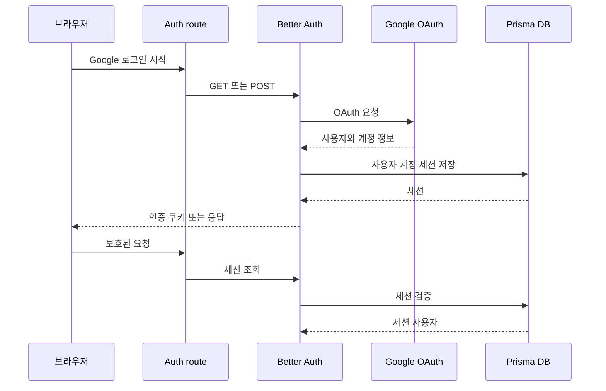
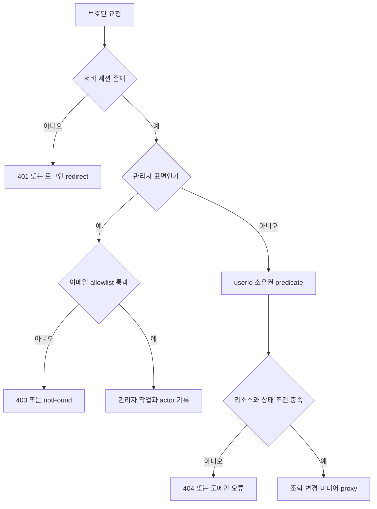

# 인증, 권한 부여, 데이터 소유권

이 시스템의 안전 경계는 클라이언트 UI가 아니라 서버의 세션과 `userId` 조건이다. 로그인하지 않은 사용자는 보호된 페이지에서 `/login`으로 이동하고, 보호된 API에서는 `401 UNAUTHENTICATED`를 받는다. 관리자 기능은 일반 로그인만으로는 충분하지 않고 별도의 이메일 allowlist를 통과해야 한다.

## 인증 구성과 진입점

Better Auth 설정은 `src/features/authentication/api/auth.ts`에 있다. Prisma PostgreSQL adapter로 Better Auth의 사용자·계정·세션 데이터를 저장하고, 이메일/비밀번호 로그인은 비활성화되어 있다. 소셜 제공자는 Google 하나이며 OAuth 범위는 `openid`, `email`, `profile`이다. 새 사용자가 생성된 뒤에는 데이터베이스 hook이 `ensureSignupTicketGrants(user.id)`를 호출해 가입 보너스 티켓을 보장한다. `googleAuthConfigured()`는 운영 설정이 필요한 네 가지 구성요소가 모두 존재하는지 확인하지만, 비밀값 자체를 애플리케이션 문서나 로그에 노출하지 않는다.

인증 API adapter는 `src/_app/api-routes/auth/auth-route.ts`에서 Better Auth의 `GET`·`POST` handler를 Next.js route handler로 노출한다. 서버 전용 모듈인 `src/features/authentication/index.server.ts`는 세션, 관리자 정책, 개발 우회 정책을 한 곳에서 export하므로 서버 호출자는 이 경계를 사용해야 한다.

*그림은 Google OAuth 로그인부터 세션 조회까지의 서버 요청 흐름을 나타낸다.*

## 서버 측 세션 검사

`getRequestSession(request?)`는 명시된 `Request`의 headers, 또는 Next.js `headers()`를 사용한다. 먼저 개발 인증 우회 세션을 확인하고, 없으면 `auth.api.getSession`으로 Better Auth 세션을 조회한다. 유효한 세션이 있으면 매 요청마다 `ensureSignupTicketGrants`도 호출하므로 가입 보너스 지급은 idempotent하게 재확인된다.

- 페이지는 `requirePageSession(returnTo)`를 사용한다. 세션이 없으면 `callbackURL`에 로컬 경로를 넣어 `/login`으로 redirect한다. 프로필, 보컬 프로필, Library, 추천/믹싱 상세, 알림, 계정 등 제품 페이지가 이 경계를 사용한다.
- API는 `requireApiSession(request)` 뒤에 명시적으로 `if (!session) return unauthorizedResponse()`를 둔다. JSON 오류 코드는 `UNAUTHENTICATED`, HTTP 상태는 `401`이다.
- 로그인 callback은 `safeCallbackURL`로 로컬 경로만 허용한다. 외부 URL, `//`로 시작하는 ambiguous destination, 역슬래시 우회 경로는 제품 진입 경로 `/profile`로 되돌린다.

이 검사는 서버에서 다시 수행되어야 한다. 로그인 화면이나 메뉴를 숨기는 것은 UX일 뿐 접근 통제가 아니다.

## 관리자 전용 표면

관리자 이메일은 `ADMIN_EMAILS`를 쉼표로 나누고 trim·소문자화한 allowlist로 해석한다. `isAdminEmail`은 같은 정규화로 비교하므로 대소문자 차이는 권한 판단에 영향을 주지 않는다.

- 관리자 페이지는 `requireAdminPage()`를 사용하며, 세션이 없거나 allowlist 밖이면 `notFound()`를 반환한다.
- 관리자 API는 먼저 일반 세션을 검사한다. 세션이 없으면 `401`, 로그인했지만 관리자가 아니면 `403 FORBIDDEN`을 반환한다.
- 이 경계를 사용하는 표면에는 관리자 사용자 목록, 티켓 조정, 운영 개요, 믹싱 작업, 카탈로그 import/publish/archive/retry/export 및 custom mixing API가 포함된다.
- 티켓 조정은 대상 사용자와 행위자(`actorUserId`)를 분리해 기록한다. 사유와 idempotency key도 ledger에 남기므로 지원 작업을 사후 감사할 수 있다.

따라서 관리자 UI의 노출 여부와 무관하게 각 관리자 route handler의 첫 단계는 `requireAdminApi`여야 한다. 관리자가 일반 사용자의 리소스를 조회·변경하는 운영 기능과, 사용자가 자기 리소스만 다루는 제품 API를 혼동하지 않는다.

## 개발 인증 우회와 운영 인증의 차이

개발 우회는 운영 인증의 대체가 아니다. `developmentAuthBypassUserId`는 `NODE_ENV`가 `development` 또는 `test`이고 `DEV_AUTH_BYPASS_ENABLED`가 정확히 `true`이며 `DEV_AUTH_BYPASS_USER_ID`가 비어 있지 않을 때만 user ID를 반환한다. 그 밖의 환경, 특히 `production`에서는 항상 비활성이다.

우회가 켜지면 `getDevelopmentAuthBypassSession`이 해당 ID의 로컬 DB 사용자를 조회해 가짜 세션을 만든다. 사용자가 존재하지 않으면 오류를 발생시키며, 임의의 user ID를 자동 생성하지 않는다. 세션 token은 `dev-auth-bypass`이고 만료 시각은 생성 시각으로부터 24시간이다. 이 세션도 일반 `getRequestSession` 경로를 통과하므로 이후의 사용자 소유권 조건은 그대로 적용된다. 운영에서는 `BETTER_AUTH_SECRET`이 명시되지 않으면 인증 초기화가 실패하도록 정책이 fail-closed이며, 개발에서만 기본 secret 동작이 허용된다.

## 소유권 집행 규칙

세션에서 얻은 `session.user.id`를 서비스 함수에 전달하고, 서비스 함수가 DB predicate에 그 값을 포함한다. ID만으로 조회하거나 클라이언트가 보낸 `userId`를 신뢰하지 않는 것이 핵심 불변식이다.

*그림은 일반 사용자와 관리자 요청이 서로 다른 서버 안전 경계를 통과하는 흐름을 나타낸다.*

### 보컬 프로필과 오디오

보컬 프로필 history·detail·reference 조회는 `where: { id, userId, sourceType: "USER" }`를 사용한다. 사용자 분석으로 저장되는 profile도 입력 `userId`에 연결되고 `sourceType: "USER"`로 기록된다. reference audio endpoint는 이 소유권 조회가 성공한 뒤에만 외부 저장소 URL을 private audio proxy에 전달한다. reference asset은 추가로 `userId`, kind `REFERENCE` 또는 `SYNTHESIS_REFERENCE`, `READY` 상태를 확인한다.

### 믹싱 작업과 결과 미디어

믹싱 history는 모든 필터에 앞서 `userId`를 where 조건에 넣고, 단건 조회도 `{ id, userId }`로 제한한다. 생성 시 profile 역시 `{ id: vocalProfileId, userId, sourceType: "USER" }`로 확인하고, 추천 분석·published catalog revision·target asset 상태를 함께 검증한다. 이 검증이 실패하면 stale recommendation 또는 source-not-found 도메인 오류가 된다.

결과 오디오 route는 성공 상태의 작업을 `{ id, userId, status: "SUCCEEDED" }`로 조회하고, 결과 asset이 `READY`인지 확인한 후에만 upstream media를 proxy한다. 삭제도 transaction 안에서 `{ id, userId }`와 terminal 상태를 재확인하며, 결과 asset의 owner와 kind가 맞지 않으면 중단한다. 즉 작업 ID를 아는 것만으로 다른 사용자의 결과를 읽거나 삭제할 수 없다.

### 티켓과 원자성

티켓 wallet과 ledger의 모든 변경은 입력 `userId`를 기준으로 한다. 차감은 잔액이 충분한 경우에만 조건부 update가 성공하고, 부족하면 `InsufficientTicketsError`를 던져 잔액이 음수가 되지 않는다. ledger idempotency key를 먼저 검사하고 wallet 변경과 ledger 기록을 `Serializable` transaction으로 묶으며, write conflict는 제한적으로 재시도한다. 믹싱 생성도 작업 생성과 `AI_MIXING` 차감을 같은 transaction에서 수행하므로 요청이 중복되거나 동시 실행되어도 사용자별 잔액과 작업 소유권이 어긋나지 않도록 한다.

## 설정·운영 체크리스트

- 운영 배포 전 Better Auth secret, canonical Better Auth URL, Google OAuth client ID/secret이 구성되어야 한다. 문서·로그·클라이언트 코드에는 실제 값을 기록하지 않는다.
- 운영 환경에서 개발 우회 관련 설정이 남아 있어도 정책상 무시되지만, 운영 점검에서는 이를 명시적으로 비활성화해 오해를 방지한다.
- `ADMIN_EMAILS`는 실제 관리자 이메일만 포함하고, 쉼표 구분 값의 공백과 대소문자 정규화 결과를 확인한다.
- `DATABASE_URL`이 없으면 DB 통합 테스트는 skip될 수 있다. 로컬 우회를 사용하려면 먼저 지정된 사용자가 로컬 DB에 존재해야 한다.
- 미디어 URL은 public URL로 직접 반환하지 말고 소유권 확인 후 private proxy 경로를 사용한다.

## 검증해야 할 테스트

- `tests/auth-navigation.test.ts`: 운영 secret 누락 fail-closed, 안전한 callback URL, 로그인 UI, 제품 route 구성을 검증한다.
- `tests/dev-auth-bypass.integration.ts`: production·미지정 환경에서 우회가 꺼지고, development/test에서만 켜지며, 존재하는 로컬 사용자만 우회 세션을 얻는지 검증한다.
- `tests/auth-ownership.integration.ts`: 두 사용자 사이에서 보컬 프로필과 Google account 연결 요약이 섞이지 않는지 검증한다.
- `tests/admin-operations.integration.ts`: allowlist 정규화, 행위자·사유 보존, idempotent 티켓 조정, 음수 잔액 방지, 대상 사용자 알림 및 관리자 목록의 민감한 외부 URL 비노출을 검증한다.

새로운 보호 API나 데이터 조회를 추가할 때는 (1) 서버 세션 획득, (2) 관리자 표면이면 `requireAdminApi`, (3) 일반 표면이면 세션 user ID를 서비스 계층에 전달, (4) 모든 관련 entity·media predicate에 owner 조건 추가, (5) 타 사용자·비정상 상태의 401/403/404 테스트 순서로 검토한다.
