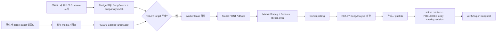

# 곡 카탈로그 수집·분석·게시 운영

이 페이지는 관리자가 곡을 등록하거나 출처를 교체한 뒤, 검증된 분석 결과와 target asset을 카탈로그에 게시하는 현재 운영 경계를 설명한다. 핵심은 네 가지를 같은 상태로 취급하지 않는 것이다.

- **곡 identity**: `Song`의 `title`과 `artist` 조합이다. 곡 자체와 출처 revision을 구분한다.
- **source revision**: 한 곡에 연결된 YouTube 출처다. 새 출처는 `SongSource.revision`을 증가시켜 새 row로 만든다.
- **analysis revision**: source와 `pipelineContract` 조합으로 식별되는 `SongAnalysis`다. 분석 결과는 source에 종속되며, `READY`와 `cleanupConfirmed`가 모두 필요하다.
- **target asset**: 분석기에 전달하고 실제 믹싱에서 참조하는 외부 저장소 음원 파일(`CatalogTargetAsset`)이다. asset의 `sourceVideoId`와 source를 일치시킨다.
- **catalog revision**: 게시 결과의 버전이다. source/analysis revision과 별개로, 실제 게시 결과가 바뀔 때 증가한다.

게시 가능한 행은 곡, 활성 source, 현재 analysis, target asset, catalog entry의 포인터가 모두 같은 source를 가리키고 각 상태가 준비된 경우뿐이다. 이 판정은 [`catalogReadiness`](repo://src/entities/song-catalog/lib/readiness.ts#L3-L44)가 단일 규칙으로 수행한다.

## 전체 흐름

관리자 API는 카탈로그가 먼저 존재해야 한다. 곡 등록은 `DRAFT` 곡, `DRAFT` source, `DRAFT` catalog entry와 `SongAnalysisJob`을 하나의 transaction으로 만든다. source 교체는 기존 source를 덮어쓰지 않고 다음 revision의 `DRAFT` source와 새 job을 만든다. 구현은 [`admin-service.ts`](repo://src/features/manage-song-catalog/api/admin-service.ts#L72-L190)에 있다.

## 1. 곡과 YouTube 출처를 등록하거나 교체하기

### 신규 곡 등록

`createAdminSong`은 `idempotencyKey`를 먼저 조회한다. 같은 키가 이미 있고 title, artist, `sourceVideoId`가 동일하면 기존 곡을 반환하므로 재시도해도 중복 곡이나 job을 만들지 않는다. 같은 키에 다른 입력을 보내면 `IDEMPOTENCY_CONFLICT`(409)다. 동시 요청이 unique constraint에서 충돌한 경우에도 동일 입력이면 경합으로 생성된 row를 반환하고, 곡·순위·출처가 다르면 `SONG_CONFLICT`(409)로 거절한다.

신규 source는 `revision: 1`, `status: DRAFT`로 저장된다. `catalogPosition`이 없으면 현재 가장 큰 position 다음 번호를 사용한다. 따라서 등록 직후에는 게시되지 않으며, target 업로드와 분석 완료가 필요하다.

### source 교체

`replaceAdminSongSource(songId, input, adminUserId)`는 곡을 확인한 뒤 해당 곡의 최대 revision에 1을 더한 source를 만든다. 새 source와 job만 만들고 기존 active source를 즉시 폐기하지 않는다. 같은 idempotency key를 같은 곡과 같은 YouTube video ID로 반복하면 기존 source를 반환한다. 다른 곡 또는 다른 video ID에 재사용하면 `IDEMPOTENCY_CONFLICT`(409)이고, unique 충돌의 다른 입력은 `SOURCE_CONFLICT`(409)다.

이 경계 덕분에 분석이 실패하거나 target이 아직 없는 새 revision 동안에도 기존 게시 상태의 연결을 함부로 끊지 않는다. 새 revision은 분석과 target을 준비한 후 명시적으로 publish해야 한다.

## 2. target asset을 준비하기

관리자는 [`uploadAdminCatalogTarget`](repo://src/features/manage-song-catalog/api/target-assets.ts#L10-L67)으로 source에 대응하는 원곡 음원 파일을 업로드한다. 지원 MIME type인지 확인하고 파일은 49,000,000 bytes 이하이며 비어 있지 않아야 한다. WAV라면 `RIFF` 헤더도 검사한다. 파일 bytes의 SHA-256이 같은 source의 `READY` asset에 이미 있으면 외부 업로드 없이 기존 asset을 반환한다.

새 파일은 Leemage 외부 media 저장소에 업로드한 뒤, project/file ID, URL, 파일명, MIME type, 크기, SHA-256, source video ID를 PostgreSQL의 `CatalogTargetAsset`에 저장한다. DB 저장이 실패하면 외부 파일 삭제를 시도한다. 교체 publish 뒤 더 이상 mixing job이나 active song이 참조하지 않는 이전 asset은 삭제한다. 외부 삭제가 실패하면 DB row를 `DELETE_PENDING`으로 남겨 나중에 정리할 수 있다.

**경계:** target asset은 분석기와 믹싱이 읽는 외부 파일의 metadata와 참조다. 카탈로그 snapshot은 asset metadata(`externalUrl`, `externalFileId`, `sizeBytes`, `sha256` 등)를 포함하지만 원본 음원 bytes를 포함하지 않는다. snapshot export/import는 `audioBytes`, base64, 임시·저장 경로 같은 키를 차단한다. [`catalog-snapshot.ts`](repo://src/entities/song-catalog/api/catalog-snapshot.ts#L7-L39)와 snapshot schema의 검사는 이 경계를 유지한다.

## 3. PostgreSQL 큐에서 Modal 분석기로 보내기

worker는 `SongAnalysisJob.attempts < maxAttempts`, `nextAttemptAt` 도달, `PENDING` 또는 만료된 `PROCESSING` 상태인 job만 고른다. source에 `READY` target이 없으면 claim하지 않는다. PostgreSQL의 `FOR UPDATE SKIP LOCKED`로 한 번에 하나의 worker만 claim하며, lease owner와 만료 시각을 기록한다. worker는 60초 heartbeat로 lease를 연장한다. 자세한 claim과 lease 동작은 [`worker.ts`](repo://src/_app/background-jobs/song-analysis/worker.ts#L30-L75)를 따른다.

claim한 worker는 최신 `READY` target을 외부 URL에서 다운로드한다. analyzer URL 또는 API key가 없으면 `ANALYZER_NOT_CONFIGURED`(재시도 불가)다. 그 다음 `requestId = job.id`, source의 YouTube ID, target 파일명과 MIME type을 multipart로 Modal `POST /v1/jobs`에 보낸다. 이미 `externalJobId`가 저장된 job은 재제출하지 않고 해당 job을 polling한다. 제출 후 lease를 잃었다면 결과를 임의로 저장하지 않고 오류 처리한다.

Modal web API는 API key를 요구한다. `requestId`는 최대 200자, YouTube ID는 정확히 11자, 업로드는 0보다 크고 100MB 이하여야 하며 확장자는 `.m4a`, `.mp3`, `.mp4`, `.wav`, `.webm` 중 하나여야 한다. Modal 함수는 ffmpeg로 44.1kHz stereo WAV를 만들고, 최대 600초 구간에서 chroma 기반 key를 추정한 뒤 Demucs `htdemucs`의 vocals stem을 `librosa-pyin` 분석기에 전달한다. 임시 디렉터리가 남으면 `CLEANUP_FAILED`로 실패한다. 실행 자원과 retry 설정은 [`modal_app.py`](repo://services/song-catalog-analyzer/modal_app.py#L141-L228)에 정의되어 있다.

## 4. 분석 결과 저장과 retry

worker는 Modal의 `PROCESSING`을 polling하며, 성공하면 `SongAnalysis`를 source와 `SONG_ANALYSIS_PIPELINE_CONTRACT`로 upsert한다. duration, MIDI 통계, 음성 비율, pitch 안정성, clipping, RMS, 추정 key와 confidence, analyzer 버전, separator metadata를 저장하고 `cleanupConfirmed: true`를 요구한다. 같은 transaction에서 job에 analysis ID를 기록하고 `SUCCEEDED`로 끝낸다. API 응답의 구조와 오류 분류는 [`analyzer.ts`](repo://src/features/manage-song-catalog/api/analyzer.ts#L27-L137)에서 검증한다.

실패는 `SongAnalyzerError`의 `reasonCode`, 상세, `retryable`을 보존한다. retryable이고 `attempts < maxAttempts`이면 job은 `PENDING`으로 돌아가고 5초부터 최대 60초까지 exponential backoff를 적용한다. 그 외에는 job과 analysis를 `FAILED`로 종료한다. 네트워크 timeout, 429, 5xx, Modal 결과 만료는 retryable이 될 수 있지만 인증 실패와 analyzer 미설정은 retry하지 않는다. 관리자가 수동 retry할 때는 `FAILED` job만 허용하며 attempts, external job ID, 오류와 lease를 초기화하고 즉시 `PENDING`으로 만든다. 이 조건은 [`retryAdminSongAnalysis`](repo://src/features/manage-song-catalog/api/admin-service.ts#L192-L213)와 큐 integration test에 고정되어 있다.

## 5. 검증 후 publish하기

관리자는 source ID를 지정해 `publishAdminSongSource`를 호출한다. transaction 안에서 다음을 모두 검사한다.

1. source가 해당 곡에 속한다.
2. 해당 pipeline contract의 analysis가 `READY`이고 `cleanupConfirmed`가 true다.
3. 같은 source ID의 `READY` target이 있고 target의 `sourceVideoId`가 source와 같다.
4. 곡의 catalog entry가 존재한다.

검사가 통과하면 기존 다른 `READY` source는 `SUPERSEDED`가 되고, 선택한 source는 `READY`, entry는 `PUBLISHED`가 된다. 곡의 `lifecycleStatus`를 `ACTIVE`로 바꾸고 `activeSourceId`, `currentAnalysisId`, `targetAssetId`, `originalKey`를 새 revision에 맞춘다. 게시 결과가 실제로 바뀐 경우에만 catalog `revision`을 1 증가시킨다. 같은 source를 다시 publish해도 revision은 증가하지 않는다. 구현과 오류 경계는 [`publishAdminSongSource`](repo://src/features/manage-song-catalog/api/admin-service.ts#L215-L261)에 있다.

archive는 entry를 `ARCHIVED`로 만들고 곡을 `ARCHIVED`로 바꾸며, 실제 entry 상태가 바뀐 catalog만 revision을 증가시킨다. 이후 publish는 필요한 준비가 그대로 남아 있으면 곡을 다시 `ACTIVE`로 복원할 수 있다.

## snapshot export/import와 최종 검증

`exportDatabaseSongCatalog`는 먼저 published row 전체를 읽어 readiness와 position 중복을 검사한다. published 수와 export 대상 row 수가 다르거나 invalid row가 하나라도 있으면 export하지 않는다. 성공한 snapshot에는 catalog revision, 각 곡의 identity, active YouTube source, 분석 결과, 외부 target metadata가 들어가며 원본 음원 bytes는 들어가지 않는다. snapshot schema version은 현재 `3`이다.

`importDatabaseSongCatalog`는 schema와 snapshot 내부의 position, 곡 identity, source video ID, target key 중복을 검사한 뒤 하나의 transaction으로 upsert한다. source video ID와 URL이 맞지 않거나 target이 source와 다르면 거절한다. 기존 catalog revision보다 낮은 snapshot을 가져와도 revision을 낮추지 않는다. 각 행은 source, analysis, target이 모두 `READY`이고 analysis cleanup이 확인되며 video ID가 일치할 때만 `PUBLISHED`/`ACTIVE`가 된다. import 구현은 [`catalog-import.ts`](repo://src/entities/song-catalog/api/catalog-import.ts#L22-L45)와 [`catalog-import.ts`](repo://src/entities/song-catalog/api/catalog-import.ts#L211-L300)에 있다.

런타임 조회인 [`loadPublishedCatalog`](repo://src/entities/song-catalog/api/published-catalog.ts#L6-L61)도 catalog와 entry가 `PUBLISHED`이고 곡이 `ACTIVE`, source·analysis·target이 각각 `READY`인지 다시 필터링한다. 따라서 publish row가 DB에 있어도 포인터가 어긋난 행은 실제 추천·믹싱 입력에 노출되지 않는다.

## 운영 점검과 변경 시 확인할 테스트

- 관리자 mutation의 중복 호출, idempotency conflict, 분석·target 미준비 publish 거절, publish 반복 시 revision 불변, archive/re-publish는 [`admin-song-catalog.integration.ts`](repo://tests/admin-song-catalog.integration.ts#L23-L194)에서 확인한다.
- worker가 target 전에는 claim하지 않고, lease를 독점하며 만료 lease를 회수하고, 성공 결과를 `READY`로 저장하는 흐름은 [`song-analysis-queue.integration.ts`](repo://tests/song-analysis-queue.integration.ts#L36-L123)에서 확인한다.
- retryable analyzer 오류가 job을 `PENDING`으로 되돌리는 조건은 [`song-analysis-queue.integration.ts`](repo://tests/song-analysis-queue.integration.ts#L125-L186)에서 확인한다.
- snapshot의 bytes/경로 누출 방지, schema mismatch, 중복 rejection, import idempotency와 revision 하한 보장은 [`catalog-snapshot.integration.ts`](repo://tests/catalog-snapshot.integration.ts#L8-L227)에서 확인한다.
- READY 상태의 active pointer와 sourceVideoId unique 제약을 직접 검증하는 DB 테스트는 [`song-catalog-db.integration.ts`](repo://tests/song-catalog-db.integration.ts#L7-L158)에 있다.

관리자 화면·API 인증 경계는 [검증 운영](/openwiki/testing/verification.md)과 함께 확인하고, worker lease 일반 원칙은 [durable worker](/openwiki/architecture/durable-workers.md), 외부 media 저장소 수명주기는 [미디어 수명주기](/openwiki/operations/media-lifecycle.md)를 참고한다. 게시된 곡이 추천과 mixing에 들어가는 다음 단계는 [추천·믹싱 workflow](/openwiki/workflows/recommendation-and-mixing.md)다.
