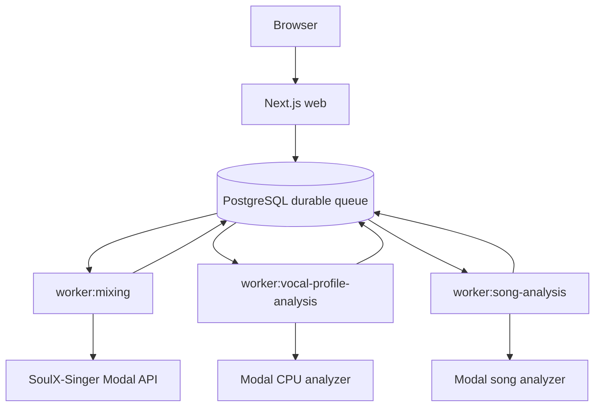

# 설정·로컬 실행·배포 운영

이 페이지의 기준은 현재 repository의 tracked script와 서비스 README다. 앱은 Next.js 웹 프로세스와 세 개의 background worker를 같은 Node 프로젝트에서 실행한다. PostgreSQL은 작업 큐와 애플리케이션 상태를 보존하고, Modal은 보컬·곡 분석 및 AI 믹싱의 외부 실행 경계다. 따라서 **로컬/production**, **migration/seed**, **web/worker**를 섞지 말고 아래 순서대로 준비한다.

## 실행 전 준비

필수 버전과 외부 전제는 다음과 같다.

- Node.js `>=22.13.0`
- pnpm `11.9.0`
- Docker 20 이상과 PostgreSQL 16 계열
- Google OAuth web client
- Leemage project와 API key
- 배포된 Modal 보컬 프로필·곡 분석·SoulX-Singer 서비스
- production 결과 오디오 변환용 FFmpeg

`pnpm install --frozen-lockfile`로 lockfile과 정확히 맞는 의존성을 설치한다. 애플리케이션은 `DATABASE_URL`로 PostgreSQL에 연결한다. 로컬 Compose는 `postgres:16-alpine`을 `POSTGRES_PORT`(기본 `5433`)로 호스트에 노출하며, 컨테이너 내부 포트는 `5432`다. `POSTGRES_DB`, `POSTGRES_USER`, `POSTGRES_PASSWORD`의 Compose 기본값은 각각 `copy_singer`, `copy_singer`, `copy_singer_dev`다. secret 값 자체는 문서에 저장하지 않는다.

```bash
pnpm install --frozen-lockfile
cp .env.example .env.local
docker compose up -d
```

`.env.example`의 각 선택 조건을 따르되, 서버 전용 credential을 Browser 코드나 공개 문서에 넣지 않는다. Google 로그인이 활성화되려면 `BETTER_AUTH_SECRET`, `BETTER_AUTH_URL`, `GOOGLE_CLIENT_ID`, `GOOGLE_CLIENT_SECRET`가 모두 있어야 한다. `BETTER_AUTH_URL`이 없을 때 auth 기본 URL은 `http://localhost:3000`이지만 `googleAuthConfigured()`는 production 설정이 완비되지 않은 것으로 본다. 인증 사용자 생성 후에는 가입 ticket grant가 database hook에서 적용된다.

## 로컬: PostgreSQL, migration, seed

로컬 PostgreSQL을 먼저 올린 뒤 migration을 적용하고 Prisma client를 생성한다.

```bash
docker compose up -d
pnpm run db:migrate:deploy
pnpm run db:generate
```

- `pnpm run db:migrate:deploy`: 이미 만들어진 migration을 현재 database에 적용한다. production과 재현 가능한 로컬 초기화에 사용한다.
- `pnpm run db:migrate`: Prisma 개발 흐름에서 schema 변경을 migration으로 만들고 적용한다.
- `pnpm run db:status`: 적용 상태를 확인한다.
- `pnpm run db:validate`: Prisma schema를 검증한다.
- `pnpm run db:seed`: `prisma/seed.ts`를 실행한다. seed는 `DATABASE_URL`이 없으면 실패하며, fixture recording/profile/song 관계를 `upsert`로 만든다. migration과 달리 schema를 만들지 않는다.
- `pnpm run db:verify`: user profile이 `USER_TEST` recording에 연결되고 song profile 관계가 있는지 확인한다.
- `pnpm run catalog:db:verify`: catalog가 비어 있지 않고 invalid 항목이 없을 때만 `ready`로 종료한다.

seed가 필요한 개발·검증 환경에서만 다음처럼 별도로 실행한다. production 배포의 migration 단계에 seed를 자동으로 포함하지 않는다.

```bash
pnpm run db:seed
pnpm run db:verify
pnpm run catalog:db:verify
```

## 환경 변수: 비용과 worker 제어

정수형 설정은 값이 없거나 빈 문자열이면 기본값을 사용한다. 숫자가 아니거나 범위를 벗어나면 프로세스가 오류를 낸다. 금액·grant는 `0`을 허용한다.

| 목적 | 환경 변수 | 기본값 | 허용 범위 |
| --- | --- | ---: | --- |
| 가입 보컬 분석 ticket | `SIGNUP_VOCAL_ANALYSIS_TICKET_GRANT` | `5` | 0–1000 |
| 가입 믹싱 ticket | `SIGNUP_MIXING_TICKET_GRANT` | `1` | 0–1000 |
| 믹싱 ticket 비용 | `MIXING_TICKET_COST` | `1` | 0–1000 |
| 보컬 분석 ticket 비용 | `VOCAL_PROFILE_ANALYSIS_TICKET_COST` | `1` | 0–1000 |
| 믹싱 동시성 | `MIXING_WORKER_CONCURRENCY` | `1` | 1–32 |
| 믹싱 최대 시도 | `MIXING_MAX_ATTEMPTS` | `3` | 1–20 |
| 믹싱 lease | `MIXING_LEASE_SECONDS` | `120`초 | 30–3600초 |
| 믹싱 poll 주기 | `MIXING_POLL_INTERVAL_MS` | `5000`ms | 100–60000ms |
| 보컬 분석 동시성 | `VOCAL_PROFILE_ANALYSIS_WORKER_CONCURRENCY` | `1` | 1–16 |
| 보컬 분석 최대 시도 | `VOCAL_PROFILE_ANALYSIS_MAX_ATTEMPTS` | `3` | 1–10 |
| 보컬 분석 lease | `VOCAL_PROFILE_ANALYSIS_LEASE_SECONDS` | `300`초 | 180–3600초 |
| 곡 분석 동시성 | `SONG_ANALYSIS_WORKER_CONCURRENCY` | `1` | 1–8 |
| 곡 분석 lease | `SONG_ANALYSIS_LEASE_SECONDS` | `300`초 | 180–3600초 |
| 곡 분석 poll 주기 | `SONG_ANALYSIS_POLL_INTERVAL_MS` | `2500`ms | 250–30000ms |

동시성을 올리면 외부 Modal 비용과 PostgreSQL·메모리 부하도 함께 커진다. lease는 작업이 고아가 된 뒤 재점유되기까지의 시간이고, poll 주기는 외부 job 상태를 다시 확인하는 간격이다. 값은 `src/shared/config/server-env.ts`의 검증을 통과해야 한다.

외부 endpoint와 서버 credential은 다음 규칙을 따른다.

- SoulX 믹싱: `MODAL_API_URL` + `MODAL_API_KEY`
- 보컬 프로필 분석: `VOCAL_PROFILE_MODAL_URL` + `VOCAL_PROFILE_MODAL_API_KEY`; key가 없으면 `MODAL_API_KEY` fallback
- 곡 분석: `SONG_ANALYSIS_MODAL_URL` + `SONG_ANALYSIS_MODAL_API_KEY`; key가 없으면 `MODAL_API_KEY` fallback
- Leemage: 선택적 `LEEMAGE_BASE_URL`(기본 `https://leemage.leey00nsu.com/api/v1`)
- 결과 압축: 선택적 `FFMPEG_BIN`(기본 `ffmpeg`)

곡 분석 URL과 key가 모두 없으면 `songAnalysisModalConfig()`는 `null`을 반환하므로 해당 외부 기능을 실행하기 전에 배포 설정을 확인한다. Modal key는 `X-API-Key`로 서버에서만 전달한다.

## 웹과 worker의 런타임 흐름

웹 요청은 분석·믹싱을 PostgreSQL durable queue에 등록하고 즉시 응답한다. worker는 DB row를 원자적으로 claim하고 lease를 heartbeat로 갱신한다. 유효한 lease를 가진 다른 worker의 작업은 건드리지 않으며, lease가 없거나 만료된 `PENDING`·처리 중 작업만 재점유한다.



세 worker의 외부 호출 방식은 다르다. 보컬 프로필 worker는 단일 동기 HTTP 응답을 기다리며 외부 job ID를 저장하거나 poll하지 않는다. 곡 분석 worker는 `POST /v1/jobs`로 외부 job을 제출하고 ID를 저장한 뒤 `GET /v1/jobs/{externalJobId}`를 poll한다. 믹싱 worker도 SoulX job ID를 저장하고 상태·결과를 poll한다. 최종 사용자 reference와 결과 audio bytes는 Leemage에 저장하고 PostgreSQL에는 소유권과 metadata를 유지한다.

믹싱에서 network 오류, HTTP `408`, `425`, `429`, `5xx`는 retryable 후보이며, 재시도 가능하고 남은 시도가 있으면 backoff 후 같은 단계 상태로 돌려보낸다. lease를 잃으면 worker가 작업을 계속 소유한다고 가정해서는 안 된다. 외부 서비스에 접수되기 전 실패는 ticket refund 경로를 사용하며, refund에는 idempotency key가 있어 중복 환불을 막는다.

## 로컬 web + worker 실행

DB와 migration 준비 후 `pnpm dev`를 실행한다. 이 script는 `concurrently --kill-others-on-fail`로 web과 세 worker를 함께 띄운다. 하나가 실패하면 나머지도 종료되므로 로그에서 최초 실패 프로세스를 확인한다.

```bash
pnpm run db:migrate:deploy
pnpm run db:generate
pnpm dev
```

개별 진입점이 필요하면 tracked script를 사용한다.

```bash
pnpm run dev:web
pnpm run worker:mixing
pnpm run worker:vocal-profile-analysis
pnpm run worker:song-analysis
```

`pnpm run dev:web`만 실행하면 웹은 뜨지만 queue를 소비할 worker가 없다. 분석 서비스는 로컬 Python 서버가 아니라 배포된 Modal endpoint를 사용한다. Modal 서비스 자체를 개발할 때는 각 서비스 README의 명령을 사용한다. 예를 들어 보컬 분석기는 `.venv`에 `requirements-local.txt`를 설치한 뒤 `.venv/bin/modal serve modal_app.py`로 ephemeral endpoint를 띄우고, 곡 분석기는 계약 테스트를 다음 명령으로 실행한다.

```bash
uv run --with-requirements services/song-catalog-analyzer/requirements-local.txt \
  python -m unittest services/song-catalog-analyzer/test_modal_app.py
```

## Production 배포 순서

단일 인스턴스 production은 다음 순서를 따른다. 애플리케이션 환경 변수와 외부 URL·credential은 배포 플랫폼에 먼저 설정하되, secret을 repository에 커밋하지 않는다.

```bash
pnpm install --frozen-lockfile
pnpm run db:migrate:deploy
pnpm build
pnpm start
```

`pnpm start`는 `next start`와 `worker:mixing`, `worker:vocal-profile-analysis`, `worker:song-analysis`를 하나의 supervisor로 실행한다. `--kill-others-on-fail` 때문에 한 프로세스가 실패하면 전체가 종료되어 배포 관리자가 재시작할 수 있다. migration은 build보다 먼저 적용한다. 새 PostgreSQL이라면 migration 뒤 필요한 경우에만 `pnpm run db:seed`를 실행하고, catalog 운영 데이터는 `/admin/songs`에서 snapshot을 가져온 뒤 `pnpm run catalog:db:verify`로 확인한다.

Modal 배포는 원격 변경·비용 승인 후에만 실행한다.

```bash
pnpm run modal:vocal-profile:deploy
pnpm run modal:song-catalog:deploy
```

SoulX-Singer는 서비스 README의 `modal setup`, `modal run modal_app.py::setup`, `modal deploy modal_app.py` 절차를 따르고 배포 URL을 `MODAL_API_URL`에 설정한다. 보컬 프로필·곡 분석 배포 명령은 각각의 `requirements-local.txt`를 사용하므로 전역 Modal CLI 버전에 의존하지 않는다. production 믹싱은 SoulX 진단 endpoint가 아니라 사전 등록된 Leemage `CatalogTargetAsset`을 사용한다.

## 배포 후 점검과 다음 문서

1. `pnpm run db:status`로 migration 상태를 확인한다.
2. `pnpm run db:verify`와 `pnpm run catalog:db:verify`로 seed·catalog 관계와 공개 catalog 유효성을 확인한다.
3. `/health`와 worker 로그에서 외부 endpoint 인증·응답을 확인한다. API key는 로그에 출력하지 않는다.
4. 짧은 분석·믹싱 작업을 제출해 queue claim, heartbeat, 외부 poll, Leemage 결과 저장까지 확인한다.
5. 작업 lifecycle과 retry·lease 상세는 [작업 처리 운영](/openwiki/operations/job-processing.md), 외부 서비스 계약은 [외부 서비스 연동](/openwiki/integrations/external-services.md), 기본 온보딩은 [빠른 시작](/openwiki/quickstart.md), 검증 범위는 [테스트 전략](/openwiki/testing/test-strategy.md)으로 이어간다.

관련 source: [`package.json`](repo://package.json), [`docker-compose.yml`](repo://docker-compose.yml), [`server-env.ts`](repo://src/shared/config/server-env.ts), [`auth.ts`](repo://src/features/authentication/api/auth.ts), [`mixing worker`](repo://src/_app/background-jobs/mixing/worker.ts), [`song catalog analyzer README`](repo://services/song-catalog-analyzer/README.md), [`vocal profile Modal README`](repo://services/vocal-profile-modal/README.md), [`SoulX-Singer README`](repo://services/soulx-singer-svc/README.md), [`prisma.config.ts`](repo://prisma.config.ts).
