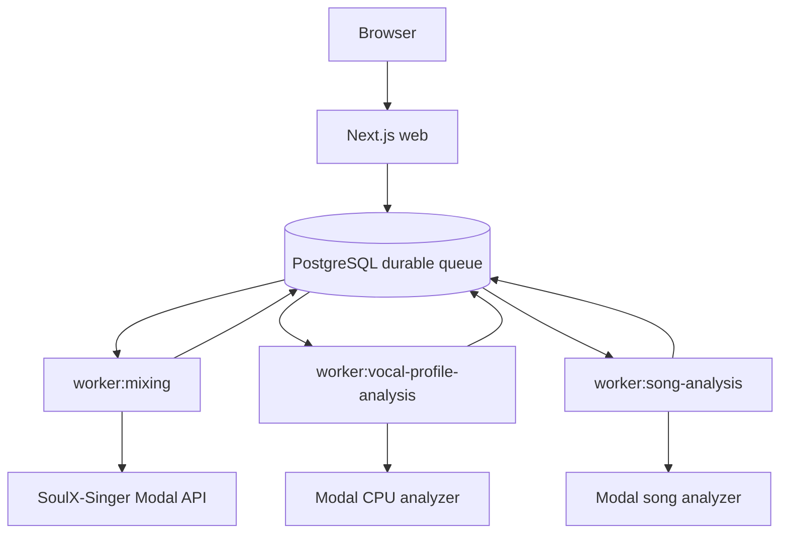

# 설정·로컬 실행·배포 운영

이 페이지는 현재 repository의 `package.json`, Compose 설정, Prisma 설정과 서비스 README를 기준으로 한다. Copysinger는 Next.js 웹 프로세스와 세 개의 background worker를 같은 Node 프로젝트에서 실행한다. PostgreSQL은 애플리케이션 상태와 durable queue를 보존하고, Modal은 보컬 분석·곡 분석·AI 믹싱의 외부 실행 경계다.

## 실행 전 준비

다음 환경을 준비한다.

- Node.js `>=22.13.0`
- pnpm `11.9.0`
- Docker 20 이상과 PostgreSQL 16 계열
- Google OAuth web client
- Leemage project와 API key
- 배포된 Modal 보컬 프로필·곡 분석·SoulX-Singer 서비스
- production 결과 오디오 변환용 FFmpeg

의존성은 lockfile에 맞춰 설치한다. `docker-compose.yml`은 `postgres:16-alpine`을 사용하고, 컨테이너의 `5432` 포트를 호스트의 `POSTGRES_PORT`로 공개한다. `POSTGRES_PORT` 기본값은 `5433`이며, `POSTGRES_DB`, `POSTGRES_USER`, `POSTGRES_PASSWORD`의 Compose 기본값은 각각 `copy_singer`, `copy_singer`, `copy_singer_dev`다. 비밀번호와 API key 같은 secret 값은 repository에 저장하지 않는다.

```bash
pnpm install --frozen-lockfile
cp .env.example .env.local
docker compose up -d
```

Prisma는 `.env.local`을 `.env`보다 먼저 읽고 `DATABASE_URL`을 datasource URL로 사용한다. `DATABASE_URL`이 없는 상태에서는 migration, seed와 database verification을 실행할 수 없다.

인증을 production에서 활성화하려면 `BETTER_AUTH_SECRET`, `BETTER_AUTH_URL`, `GOOGLE_CLIENT_ID`, `GOOGLE_CLIENT_SECRET`를 모두 설정한다. `BETTER_AUTH_URL`이 없을 때 auth의 기본 URL은 `http://localhost:3000`이지만 Google 설정이 완비된 것으로 판정되지는 않는다. 관리자 및 저장소 smoke test까지 점검하려면 `pnpm run verify:feature-config`가 요구하는 `ADMIN_EMAILS`, `LEEMAGE_API_KEY`, `LEEMAGE_PROJECT_ID`도 설정해야 한다.

## PostgreSQL과 Prisma 준비

PostgreSQL을 먼저 시작하고, 이미 존재하는 migration을 적용한 다음 Prisma Client를 생성한다.

```bash
docker compose up -d
pnpm run db:migrate:deploy
pnpm run db:generate
```

명령의 역할은 다음과 같다.

- `pnpm run db:migrate:deploy`: 생성된 migration을 현재 database에 적용한다. production과 재현 가능한 초기화에 사용한다.
- `pnpm run db:migrate`: 개발 중 schema 변경으로 migration을 만들고 적용한다.
- `pnpm run db:status`: migration 적용 상태를 확인한다.
- `pnpm run db:validate`: Prisma schema를 검증한다.
- `pnpm run db:seed`: `prisma/seed.ts`를 실행한다. schema를 만들지는 않으며 fixture recording/profile/song 관계를 `upsert`로 구성한다.
- `pnpm run db:verify`: `USER_TEST` recording에 연결된 사용자 profile과 song profile 관계를 확인한다. 실패하면 `DATABASE_URL`이 없거나 seed 관계가 불완전한 것이다.
- `pnpm run catalog:db:verify`: catalog가 비어 있지 않고 invalid 항목이 없을 때만 성공한다.

Seed는 개발·검증 환경에서만 필요한 경우 별도로 실행한다. production의 migration 단계에 seed를 자동으로 포함하지 않는다.

```bash
pnpm run db:seed
pnpm run db:verify
pnpm run catalog:db:verify
```

## 환경 변수와 운영 제어

정수형 설정은 값이 없거나 빈 문자열이면 기본값을 사용한다. 숫자가 아니거나 허용 범위를 벗어나면 프로세스가 오류를 낸다. ticket grant와 비용은 `0`을 허용한다.

| 목적 | 환경 변수 | 기본값 | 허용 범위 |
| --- | --- | ---: | --- |
| 가입 보컬 분석 ticket | `SIGNUP_VOCAL_ANALYSIS_TICKET_GRANT` | `5` | 0–1000 |
| 가입 믹싱 ticket | `SIGNUP_MIXING_TICKET_GRANT` | `1` | 0–1000 |
| 믹싱 ticket 비용 | `MIXING_TICKET_COST` | `1` | 0–1000 |
| 보컬 분석 ticket 비용 | `VOCAL_PROFILE_ANALYSIS_TICKET_COST` | `1` | 0–1000 |
| 믹싱 동시성 | `MIXING_WORKER_CONCURRENCY` | `1` | 1–32 |
| 믹싱 최대 시도 | `MIXING_MAX_ATTEMPTS` | `3` | 1–20 |
| 믹싱 lease | `MIXING_LEASE_SECONDS` | `120`초 | 30–3600초 |
| 믹싱 poll 주기 | `MIXING_POLL_INTERVAL_MS` | `5000`ms | 100–60000ms |
| 보컬 분석 동시성 | `VOCAL_PROFILE_ANALYSIS_WORKER_CONCURRENCY` | `1` | 1–16 |
| 보컬 분석 최대 시도 | `VOCAL_PROFILE_ANALYSIS_MAX_ATTEMPTS` | `3` | 1–10 |
| 보컬 분석 lease | `VOCAL_PROFILE_ANALYSIS_LEASE_SECONDS` | `300`초 | 180–3600초 |
| 곡 분석 동시성 | `SONG_ANALYSIS_WORKER_CONCURRENCY` | `1` | 1–8 |
| 곡 분석 lease | `SONG_ANALYSIS_LEASE_SECONDS` | `300`초 | 180–3600초 |
| 곡 분석 poll 주기 | `SONG_ANALYSIS_POLL_INTERVAL_MS` | `2500`ms | 250–30000ms |

동시성을 높이면 Modal 비용과 PostgreSQL·메모리 부하가 함께 증가한다. lease는 고아 작업을 다시 점유할 수 있게 되는 시간이고, poll 주기는 외부 job 상태를 다시 확인하는 간격이다. 이 값들의 실제 검증은 `src/shared/config/server-env.ts`가 소유한다.

외부 서비스 변수는 다음과 같이 설정한다.

- SoulX 믹싱: `MODAL_API_URL`과 `MODAL_API_KEY`
- 보컬 프로필 분석: `VOCAL_PROFILE_MODAL_URL`과 `VOCAL_PROFILE_MODAL_API_KEY`; 후자가 없으면 `MODAL_API_KEY`를 fallback으로 사용
- 곡 분석: `SONG_ANALYSIS_MODAL_URL`과 `SONG_ANALYSIS_MODAL_API_KEY`; 후자가 없으면 `MODAL_API_KEY`를 fallback으로 사용
- Leemage: 선택적 `LEEMAGE_BASE_URL` (기본 `https://leemage.leey00nsu.com/api/v1`), 그리고 기능 검증에 필요한 `LEEMAGE_API_KEY`, `LEEMAGE_PROJECT_ID`
- 결과 압축: 선택적 `FFMPEG_BIN` (기본 `ffmpeg`)

곡 분석 URL과 key 중 하나라도 없으면 `songAnalysisModalConfig()`는 `null`을 반환한다. 해당 worker를 실행하기 전에 두 설정을 확인한다. Modal key는 서버에서만 `X-API-Key` header로 전달한다.

## 웹과 worker의 실행 흐름

웹 요청은 분석·믹싱을 PostgreSQL durable queue에 등록하고 즉시 응답한다. 각 worker는 DB row를 원자적으로 claim하고 lease를 heartbeat로 갱신한다. 새 `PENDING` 작업 또는 lease가 없거나 만료된 처리 중 작업만 재점유하며, 유효한 lease를 가진 다른 worker의 작업은 건드리지 않는다.



*그림은 웹 요청, PostgreSQL queue, 세 worker와 외부 Modal service 사이의 현재 실행 경계를 보여준다.*

보컬 프로필 worker는 단일 동기 HTTP 응답을 기다리며 외부 job ID를 저장하거나 poll하지 않는다. 곡 분석 worker는 `POST /v1/jobs`로 외부 job을 제출하고 `externalJobId`를 저장한 뒤 `GET /v1/jobs/{externalJobId}`를 poll한다. 믹싱 worker도 SoulX job ID를 저장하고 상태·결과를 poll한다. 사용자 reference와 최종 audio bytes는 Leemage에 저장하고 PostgreSQL에는 소유권과 metadata를 유지한다.

믹싱의 network 오류와 HTTP `408`, `425`, `429`, `5xx`는 retryable 후보이다. 재시도 가능하고 남은 시도가 있으면 backoff 후 같은 단계 상태로 돌아간다. lease를 잃은 worker는 작업을 계속 소유한다고 가정하면 안 된다. 외부 서비스에 접수되기 전 실패는 idempotency key를 사용하는 ticket refund 경로를 따른다.

## 로컬 웹과 worker 실행

DB와 migration을 준비한 뒤 `pnpm dev`를 실행한다. 이 script는 `concurrently --kill-others-on-fail`로 웹과 세 worker를 함께 띄운다. 하나가 실패하면 나머지도 종료되므로 로그에서 최초 실패 프로세스를 확인한다.

```bash
pnpm run db:migrate:deploy
pnpm run db:generate
pnpm dev
```

개별 프로세스가 필요하면 다음 tracked script를 사용한다.

```bash
pnpm run dev:web
pnpm run worker:mixing
pnpm run worker:vocal-profile-analysis
pnpm run worker:song-analysis
```

`pnpm run dev:web`만 실행하면 queue를 소비할 worker가 없다. 분석 worker는 로컬 Python 서버가 아니라 설정된 Modal endpoint를 호출한다. Modal service 자체를 개발할 때는 해당 서비스 README의 로컬 환경을 사용한다. 보컬 분석기는 `.venv`에 `requirements-local.txt`를 설치한 뒤 `.venv/bin/modal serve modal_app.py`로 ephemeral endpoint를 실행한다. 곡 분석기의 계약 테스트는 다음 명령으로 실행한다.

```bash
uv run --with-requirements services/song-catalog-analyzer/requirements-local.txt \
  python -m unittest services/song-catalog-analyzer/test_modal_app.py
```

## Production 배포

단일 인스턴스 배포는 환경 변수와 외부 URL·credential을 배포 플랫폼에 설정한 뒤 다음 순서로 진행한다.

```bash
pnpm install --frozen-lockfile
pnpm run db:migrate:deploy
pnpm build
pnpm start
```

`pnpm start`는 `next start`와 `worker:mixing`, `worker:vocal-profile-analysis`, `worker:song-analysis`를 `concurrently --kill-others-on-fail`로 감독한다. 한 프로세스가 실패하면 전체가 종료되므로 배포 관리자가 인스턴스를 재시작해야 한다. migration은 build보다 먼저 적용한다. 새 PostgreSQL에서 fixture가 필요할 때만 migration 뒤 `pnpm run db:seed`를 실행하고, 운영 catalog는 `/admin/songs`에서 snapshot을 가져온 뒤 `pnpm run catalog:db:verify`로 확인한다. snapshot에는 분석 결과와 외부 asset metadata가 들어가지만 원본 음원 bytes는 들어가지 않는다.

Modal 원격 배포는 비용과 원격 변경을 승인한 뒤 실행한다. root script는 각 service의 `requirements-local.txt`를 통해 고정된 Modal CLI 환경에서 배포한다.

```bash
pnpm run modal:vocal-profile:deploy
pnpm run modal:song-catalog:deploy
```

SoulX-Singer는 서비스 README의 `modal setup`, `modal run modal_app.py::setup`, `modal deploy modal_app.py` 순서를 따른다. 배포 URL을 `MODAL_API_URL`에 설정한다. production 믹싱은 SoulX 진단용 `/v1/song-target`이 아니라 사전 등록된 Leemage `CatalogTargetAsset`을 사용한다.

## 배포 후 검증과 로컬 quality scripts

다음 순서로 상태를 확인한다.

1. `pnpm run db:status`로 migration 상태를 확인한다.
2. `pnpm run db:verify`와 `pnpm run catalog:db:verify`로 seed 관계와 공개 catalog를 확인한다.
3. `pnpm run verify:feature-config`로 auth·admin·Leemage 환경 변수의 존재를 확인한다. 실제 값은 출력하지 않는다.
4. Leemage 저장소까지 점검하려면 `pnpm run verify:feature-config --leemage`를 실행한다. smoke file을 upload한 뒤 삭제하므로 test project에서 실행한다.
5. `/health`와 worker 로그에서 외부 endpoint 인증·응답을 확인한다. API key는 로그에 출력하지 않는다.
6. 짧은 분석·믹싱 작업을 제출해 queue claim, heartbeat, 외부 poll과 Leemage 결과 저장을 확인한다.

품질 검사는 현재 repository의 로컬 script다. `pnpm run check`는 Biome, ESLint, TypeScript와 architecture 검사를 순서대로 실행하고, `pnpm test`는 production build와 다수의 unit·integration·contract·UI test를 실행한다. 별도로 `pnpm run lint`, `pnpm run typecheck`, `pnpm run check:architecture`, `pnpm run db:validate`를 사용할 수 있다. 이 명령들은 CI 상태나 feature 문서의 pending metadata를 판정하는 절차가 아니라, 개발자가 로컬에서 현재 코드를 점검하는 진입점이다.

작업 lifecycle과 retry·lease 상세는 [작업 처리 운영](/openwiki/operations/job-processing.md), 외부 서비스 계약은 [외부 서비스 연동](/openwiki/integrations/external-services.md), 기본 온보딩은 [빠른 시작](/openwiki/quickstart.md), 검증 범위는 [테스트 전략](/openwiki/testing/test-strategy.md)으로 이어간다.

관련 source: [`package.json`](repo://package.json), [`docker-compose.yml`](repo://docker-compose.yml), [`prisma.config.ts`](repo://prisma.config.ts), [`verify-database.ts`](repo://scripts/verify-database.ts), [`verify-feature-config.ts`](repo://scripts/verify-feature-config.ts), [`server-env.ts`](repo://src/shared/config/server-env.ts), [`song catalog analyzer README`](repo://services/song-catalog-analyzer/README.md), [`vocal profile Modal README`](repo://services/vocal-profile-modal/README.md), [`SoulX-Singer README`](repo://services/soulx-singer-svc/README.md), [`README.md`](repo://README.md).
