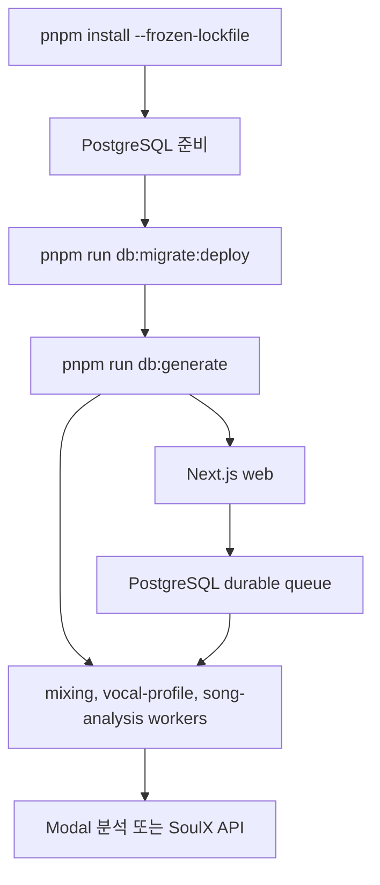

# Configuration, local operation, and deployment

이 프로젝트는 Next.js 웹 서버와 PostgreSQL 기반 작업 큐를 중심으로 동작한다. 사용자 보컬 프로필·곡 카탈로그 분석은 CPU Modal 서비스로, AI 믹싱은 SoulX-Singer Modal API로 위임하고, 웹 프로세스와 세 worker는 같은 Node 프로젝트에서 실행한다.

## 실행 모델



이 그림은 로컬과 production에서 공통으로 지켜야 할 준비·실행 순서를 보여준다.

- 요구 버전은 Node.js `>=22.13.0`, pnpm `11.9.0`이다(`package.json`의 `engines`와 `packageManager`).
- `pnpm dev`는 `next dev`, mixing worker, vocal-profile-analysis worker, song-analysis worker를 `concurrently --kill-others-on-fail`로 함께 띄운다. `pnpm start`도 동일한 네 프로세스를 production용 명령으로 감독한다.
- 단일 인스턴스에서 한 프로세스가 실패하면 `concurrently`가 나머지도 종료한다. 따라서 process supervisor 또는 배포 관리자가 인스턴스를 재시작해야 한다. 이 저장소에는 별도의 hosting·CI 설정이 정의되어 있지 않다.
- 각 worker는 lease 소유자를 만들고 작업이 없으면 1초 쉰다. SIGINT/SIGTERM을 받으면 새 반복을 멈추고, 동시성은 환경 변수로 제한된다. 유효한 lease를 가진 다른 worker의 작업을 빼앗지 않으며, 만료된 작업은 재점유할 수 있다.

## 환경 설정

비밀값 자체는 저장소에 기록하지 말고 `.env.example`의 변수명을 기준으로 `.env.local`을 준비한다. Prisma 설정은 `.env.local`을 먼저, 다음으로 `.env`를 읽으며 `DATABASE_URL`을 필수로 사용한다.

| 영역 | 변수 | 용도 및 동작 |
| --- | --- | --- |
| DB | `DATABASE_URL` | Prisma/PostgreSQL 연결 문자열. migration, seed, 검증 및 애플리케이션 모두 이 값을 사용한다. |
| 인증·관리자 | `BETTER_AUTH_SECRET`, `BETTER_AUTH_URL`, `GOOGLE_CLIENT_ID`, `GOOGLE_CLIENT_SECRET`, `ADMIN_EMAILS` | Better Auth와 Google OAuth, 관리자 이메일 정책. `pnpm run verify:feature-config`가 이 변수들을 필수로 검사한다. |
| 미디어 | `LEEMAGE_API_KEY`, `LEEMAGE_PROJECT_ID`, `LEEMAGE_BASE_URL` | Leemage 프로젝트 인증·대상과 API endpoint. `LEEMAGE_BASE_URL`은 미설정 시 코드 기본 endpoint를 사용한다. |
| 믹싱 Modal | `MODAL_API_URL`, `MODAL_API_KEY` | SoulX-Singer API URL과 서버 전용 API key. 브라우저에 노출하지 않는다. |
| 보컬 분석 Modal | `VOCAL_PROFILE_MODAL_URL`, `VOCAL_PROFILE_MODAL_API_KEY` | 보컬 프로필 analyzer endpoint와 key. key는 없으면 `MODAL_API_KEY`로 fallback한다. |
| 곡 분석 Modal | `SONG_ANALYSIS_MODAL_URL`, `SONG_ANALYSIS_MODAL_API_KEY` | 곡 분석 ASGI endpoint와 key. key는 없으면 `MODAL_API_KEY`로 fallback한다. URL과 key가 모두 있어야 adapter가 활성화된다. |
| 오디오 | `FFMPEG_BIN` | 믹싱 결과 변환에 사용할 FFmpeg 실행 파일. 미설정 시 `ffmpeg`를 찾는다. |
| worker 튜닝 | `*_WORKER_CONCURRENCY`, `*_LEASE_SECONDS`, `*_POLL_INTERVAL_MS`, `MIXING_MAX_ATTEMPTS` | worker 병렬도, lease, 외부 job polling, mixing 재시도 횟수. 서버 설정은 정수·범위를 검증하며 기본값과 허용 범위는 `src/shared/config/server-env.ts`에 있다. |
| 티켓 | `SIGNUP_VOCAL_ANALYSIS_TICKET_GRANT`, `SIGNUP_MIXING_TICKET_GRANT`, `MIXING_TICKET_COST`, `VOCAL_PROFILE_ANALYSIS_TICKET_COST` | 가입 지급량과 작업 비용. 모두 정수이며 0~1,000 범위로 검증된다. |

`MODAL_API_KEY`와 Modal Secret `soulx-api-secret`의 `SOULX_API_KEY`는 같은 서버 전용 credential 계약을 공유한다. Modal API를 브라우저에서 직접 호출하지 말고 Next.js 서버를 통해 호출한다.

## PostgreSQL, migration 및 seed

로컬 PostgreSQL은 `docker-compose.yml`의 `postgres:16-alpine`으로 실행한다. 기본 database/user와 개발 password는 compose의 환경 치환값이 사용하며, 호스트 port 기본값은 `5433`이고 컨테이너 내부 PostgreSQL `5432`로 전달된다. `postgres_data` named volume으로 데이터를 보존하고 `pg_isready` healthcheck를 사용한다.

```bash
pnpm install --frozen-lockfile
cp .env.example .env.local
docker compose up -d
pnpm run db:migrate:deploy
pnpm run db:generate
```

`prisma.config.ts`는 schema를 `prisma/schema.prisma`, migration 경로를 `prisma/migrations`, seed 명령을 `tsx prisma/seed.ts`로 지정한다. 새 DB나 production에 application을 시작하기 전에 반드시 `pnpm run db:migrate:deploy`를 먼저 실행한다. 개발 중 schema 변경을 만들 때만 `pnpm run db:migrate`를 사용하고, 상태 확인에는 `pnpm run db:status`, schema 검증에는 `pnpm run db:validate`를 사용한다.

fixture가 필요한 환경에서는 migration 이후 다음을 실행한다.

```bash
pnpm run db:seed
```

seed는 `upsert`로 사용자 테스트 recording/profile과 곡 profile을 만들며, 데이터베이스 연결 문자열이 없으면 실패한다. seed fixture가 실제로 연결됐는지는 다음 검증이 확인한다.

```bash
pnpm run db:verify
```

이 검증은 사용자 `VocalProfile`이 `USER_TEST` recording과 연결됐는지, 곡에 vocal profile이 있는지를 확인하고 실패 시 exit code 1을 설정한다. 카탈로그가 운영 가능한지 확인하려면 다음을 사용한다.

```bash
pnpm run catalog:db:verify
```

카탈로그 검증은 total이 0이거나 invalid 항목이 있으면 `invalid`로 종료한다. 새 PostgreSQL에 기존 추천 카탈로그를 복원할 때는 migration 뒤 관리자 화면 `/admin/songs`에서 snapshot을 가져온다. snapshot에는 분석 결과·외부 asset metadata가 들어가지만 원본 음원 bytes는 들어 있지 않다.

## 로컬 웹·worker 실행

DB 준비가 끝난 뒤 다음 명령이 웹과 background worker를 함께 시작한다.

```bash
pnpm dev
```

웹은 작업을 PostgreSQL에 접수하고 즉시 응답하며 worker가 원자적으로 점유한다. 보컬 프로필 analyzer는 동기 HTTP 응답을 기다리고, 곡 분석과 mixing은 외부 job ID를 저장한 뒤 상태와 결과를 polling한다. 이 구조 때문에 worker가 재시작되어도 lease가 만료된 작업을 다시 처리할 수 있다.

### Modal 서비스

#### 보컬 프로필 analyzer

`services/vocal-profile-modal`은 CPU-only Modal Web Function이다. 사용자 오디오는 request-scoped temporary directory에서만 처리하고 Modal Volume/Dict, PostgreSQL, Leemage에 저장하지 않는다. `/v1/analyze`는 `audio` multipart와 `X-Recording-ID`를 받아 profile 및 optional synthesis reference envelope을 반환하며, `X-API-Key` 인증이 필요하다.

```bash
pnpm run modal:vocal-profile:deploy
```

배포 명령은 `requirements-local.txt`를 사용한다. baseline은 2 physical cores, 4096 MiB, GPU 없음, 120초 timeout, scale-to-zero, container concurrency 1, 최대 10 containers다. worker-facing 요청은 durable queue에서 비동기로 처리하지만 endpoint 자체는 동기 계산 primitive다.

#### 곡 카탈로그 analyzer

`services/song-catalog-analyzer`는 관리자가 준비한 `CatalogTargetAsset`을 분석한다. worker가 `POST /v1/jobs`로 제출하고 `externalJobId`를 받은 뒤 `GET /v1/jobs/{externalJobId}`를 polling하며 분석 revision에 음역·추정 원키·신뢰도를 저장한다. 업로드, WAV, stem은 작업별 임시 directory와 함께 삭제된다.

```bash
pnpm run modal:song-catalog:deploy
```

배포 출력의 ASGI URL은 `SONG_ANALYSIS_MODAL_URL`, key는 `SONG_ANALYSIS_MODAL_API_KEY`(없으면 `MODAL_API_KEY`)에 설정한다. 로컬 계약 테스트는 다음과 같다.

```bash
uv run --with-requirements services/song-catalog-analyzer/requirements-local.txt \
  python -m unittest services/song-catalog-analyzer/test_modal_app.py
```

#### SoulX-Singer 믹싱 API

SoulX 서비스는 CPU FastAPI function이 오디오를 Modal Volume에 저장하고 GPU function을 비동기로 실행한다. FunctionCall ID를 작업 ID로 연결하고, 클라이언트는 `POST /v1/conversions` 후 `GET /v1/conversions/{id}`로 polling하며 완료 시 `/audio`를 다운로드한다. 서버 전용 key로 `X-API-Key`를 보내며 browser가 Modal URL을 직접 호출하지 않는다. production mixing은 진단용 YouTube endpoint가 아니라 사전 등록된 Leemage `CatalogTargetAsset`을 사용한다.

## Production startup 및 확인

단일 인스턴스 production 순서는 migration을 application startup보다 앞에 두고 build 후 start하는 것이다.

```bash
pnpm install --frozen-lockfile
pnpm run db:migrate:deploy
pnpm build
pnpm start
```

배포된 Modal endpoint와 환경 변수를 먼저 준비하고, Leemage·인증·관리자 설정은 다음으로 빠르게 점검할 수 있다.

```bash
pnpm run verify:feature-config
pnpm run verify:feature-config --leemage
```

두 번째 명령은 짧은 text smoke file을 Leemage에 업로드한 뒤 finally에서 삭제한다. secret 값은 출력하지 않는다. 품질 및 회귀 확인에는 tracked script만 사용한다.

```bash
pnpm run check
pnpm run test
```

`pnpm run check`는 Biome, lint, typecheck, architecture 검사를 실행한다. `pnpm test`는 production build를 포함해 domain/unit, PostgreSQL integration, API contract, FSD boundary와 Storybook 검사를 실행하므로 production 전 검증의 대표 진입점이다. 필요한 경우 `pnpm run db:status`, `pnpm run db:verify`, `pnpm run catalog:db:verify`를 함께 실행해 migration 상태와 seed/catalog 관계를 별도로 확인한다.
