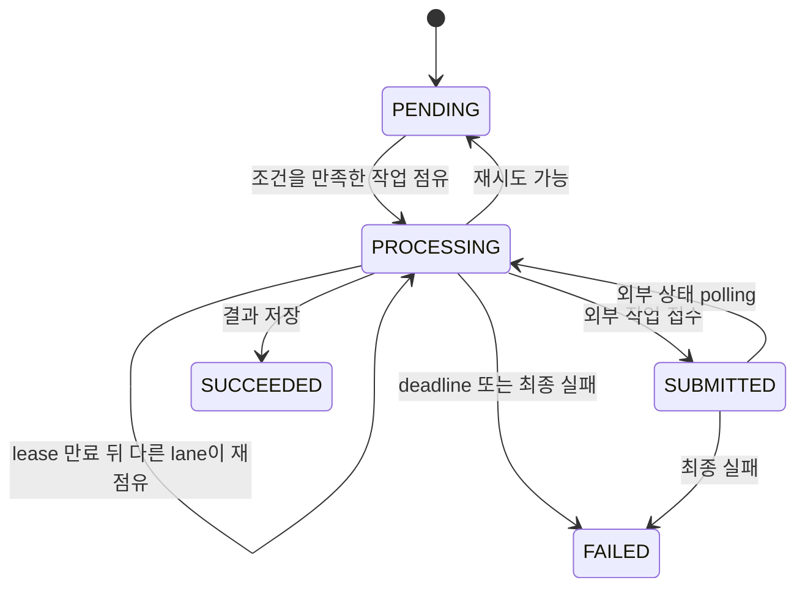

운영 중 런타임을 바꾸려면 환경 변수를 검증 가능한 범위 안에서 설정하고, 웹과 워커를 같은 릴리스로 재시작하세요. 로컬은 `docker compose up -d` → migration → `pnpm dev` 순서로 시작하고, 운영 단일 인스턴스는 `pnpm run db:migrate:deploy` → `pnpm build` → `pnpm start` 순서로 준비하세요. `pnpm dev`와 `pnpm start`는 웹과 믹싱·보컬 프로필 분석·곡 분석 워커를 함께 실행하며, 한 프로세스가 실패하면 `concurrently`가 전체를 종료해요. 실행 진입점은 [`package.json`의 scripts](repo://package.json#L9-L73)에서 다시 확인할 수 있어요.

## 데이터베이스와 프로세스 준비

필요한 버전은 Node.js `>=22.13.0`, pnpm `11.9.0`이에요. 로컬 PostgreSQL은 Compose의 `postgres:16-alpine`으로 실행하며 호스트 `5433`을 컨테이너 `5432`에 연결해요.

```bash
pnpm install --frozen-lockfile
docker compose up -d
pnpm run db:migrate:deploy
pnpm run db:generate
pnpm dev
```

Prisma 설정은 `.env.local`을 `.env`보다 먼저 읽고 `DATABASE_URL`을 datasource URL로 사용해요. 개발 중 migration을 만들고 적용할 때는 `pnpm run db:migrate`를 사용하고, 배포에는 `pnpm run db:migrate:deploy`를 사용하세요. 운영 상태를 점검할 때는 다음 명령을 구분해서 실행하세요.

- `pnpm run db:status`: 적용되지 않은 migration 상태를 확인해요.
- `pnpm run db:verify`: 데이터베이스 연결과 seed 관계 그래프를 확인해요.
- `pnpm run verify:feature-config`: 인증·관리자·Leemage 설정 누락을 검사해요. `--leemage`를 추가하면 임시 파일 업로드·삭제 smoke test도 실행해요.

운영에서 웹만 실행하려면 `pnpm run start:web`를 사용하고, 워커를 개별 실행하려면 아래 명령을 사용하세요.

```bash
pnpm run worker:mixing
pnpm run worker:vocal-profile-analysis
pnpm run worker:song-analysis
```

## 워커 수명 주기와 작업 점유

세 워커 런처는 설정된 concurrency만큼 lane을 만들고 lane마다 고유한 owner 문자열을 만들어요. `SIGINT` 또는 `SIGTERM`을 받으면 새 반복을 시작하지 않고 현재 lane이 끝나기를 기다려요. 작업을 찾지 못한 반복은 1초 쉬고, 반복 자체가 오류를 내면 최대 30초까지 지수 백오프로 다시 시도해요.



그림은 세 영속 작업 큐의 점유·lease 갱신·외부 polling·종료 흐름을 요약해요.

워커는 `nextAttemptAt`이 지난 작업을 대상으로 점유해요. 믹싱은 `PENDING` 또는 lease가 없거나 만료된 `PREPARING`·`SUBMITTED`·`PROCESSING` 작업을, 보컬 프로필 분석과 곡 분석은 `PENDING` 또는 만료된 `PROCESSING` 작업을 선택해요. 선택은 `FOR UPDATE SKIP LOCKED`와 update를 한 트랜잭션 흐름으로 수행해 같은 작업을 동시에 고르는 것을 피하고, 점유 때 `leaseOwner`, `leaseExpiresAt`, `heartbeatAt`, `attempts`를 갱신해요. 유효한 lease를 가진 작업은 다른 lane이 다시 점유하지 않아요.

`startJobLease`는 lease를 확인하고 작업 deadline을 감시해요. deadline이 저장되어 있지 않으면 믹싱과 곡 분석은 75분, 보컬 프로필 분석은 15분을 사용해요. heartbeat는 lease 시간의 3분의 1 간격으로 실행하되 최대 30초 간격이며, lease를 잃으면 `LeaseLostError`를 abort signal로 전달해요. 외부 작업은 믹싱과 곡 분석이 external job ID를 저장한 뒤 polling으로 이어가고, 보컬 프로필 분석은 동기 analyzer 결과를 처리해요.

## 환경 변수 레퍼런스

정수 환경 변수는 앞뒤 공백을 제거해 읽어요. 값이 없거나 빈 문자열이면 기본값을 사용하고, 정수가 아니거나 허용 범위를 벗어나면 프로세스가 오류를 던져요. 아래 표에는 현재 코드에서 기본값과 범위를 확인한 값만 넣었어요. `SONG_ANALYSIS_MAX_ATTEMPTS`처럼 표에 없는 이름을 임의로 설정해도 곡 분석 최대 시도 횟수를 바꾸지 못해요.

### 워커 concurrency·lease·poll·재시도

| 환경 변수 | 적용 워커 | 기본값 | 허용 범위 | 의미 |
| --- | --- | ---: | ---: | --- |
| `MIXING_WORKER_CONCURRENCY` | 믹싱 | `1` | `1`–`32` | 동시에 실행할 lane 수 |
| `MIXING_MAX_ATTEMPTS` | 믹싱 | `3` | `1`–`20` | 작업 최대 시도 횟수 |
| `MIXING_LEASE_SECONDS` | 믹싱 | `120` | `30`–`3,600` | lease 유지 시간(초) |
| `MIXING_POLL_INTERVAL_MS` | 믹싱 | `5,000` | `100`–`60,000` | 외부 믹싱 작업 polling 간격(밀리초) |
| `VOCAL_PROFILE_ANALYSIS_WORKER_CONCURRENCY` | 보컬 프로필 분석 | `1` | `1`–`16` | 동시에 실행할 lane 수 |
| `VOCAL_PROFILE_ANALYSIS_MAX_ATTEMPTS` | 보컬 프로필 분석 | `3` | `1`–`10` | 작업 최대 시도 횟수 |
| `VOCAL_PROFILE_ANALYSIS_LEASE_SECONDS` | 보컬 프로필 분석 | `300` | `180`–`3,600` | lease 유지 시간(초) |
| `SONG_ANALYSIS_WORKER_CONCURRENCY` | 곡 분석 | `1` | `1`–`8` | 동시에 실행할 lane 수 |
| `SONG_ANALYSIS_LEASE_SECONDS` | 곡 분석 | `300` | `180`–`3,600` | lease 유지 시간(초) |
| `SONG_ANALYSIS_POLL_INTERVAL_MS` | 곡 분석 | `2,500` | `250`–`30,000` | 외부 분석 작업 polling 간격(밀리초) |

구성 구현은 [`server-env.ts`](repo://src/shared/config/server-env.ts#L3-L74)에서 확인하세요.

### 데이터베이스·HTTP·미디어 제한 시간

| 환경 변수 | 기본값 | 허용 범위 | 의미 |
| --- | ---: | ---: | --- |
| `DB_POOL_MAX` | `5` | `1`–`100` | 데이터베이스 pool 최대 연결 수 |
| `DB_CONNECT_TIMEOUT_MS` | `5,000` | `1`–`3,600,000` | DB 연결 제한 시간(밀리초) |
| `DB_QUERY_TIMEOUT_MS` | `30,000` | `1`–`3,600,000` | DB query 제한 시간(밀리초) |
| `HTTP_METADATA_TIMEOUT_MS` | `15,000` | `1`–`3,600,000` | metadata HTTP 제한 시간(밀리초) |
| `HTTP_FILE_TIMEOUT_MS` | `120,000` | `1`–`3,600,000` | 파일 HTTP 제한 시간(밀리초) |
| `MEDIA_UPLOAD_TIMEOUT_MS` | `180,000` | `1`–`3,600,000` | media upload 제한 시간(밀리초) |
| `FFMPEG_TIMEOUT_MS` | `120,000` | `1`–`3,600,000` | FFmpeg 실행 제한 시간(밀리초) |

### 큐 수용량과 티켓

큐 수용량은 요청을 작업 큐에 넣기 전에 advisory transaction lock을 잡고 확인해요. 전역 수용량과 사용자별 수용량을 모두 넘지 않아야 하며, 전역 한도에 닿으면 30초 `Retry-After`와 함께 `503`을, 사용자 한도에 닿으면 `429`를 반환해요.

| 환경 변수 | 기본값 | 허용 범위 | 의미 |
| --- | ---: | ---: | --- |
| `VOCAL_QUEUE_CAPACITY` | `20` | `1`–`10,000` | 보컬 분석 전역 큐 수용량 |
| `VOCAL_USER_QUEUE_CAPACITY` | `1` | `1`–`100` | 사용자별 보컬 분석 큐 수용량 |
| `MIXING_QUEUE_CAPACITY` | `20` | `1`–`10,000` | 믹싱 전역 큐 수용량 |
| `MIXING_USER_QUEUE_CAPACITY` | `3` | `1`–`100` | 사용자별 믹싱 큐 수용량 |
| `SONG_QUEUE_CAPACITY` | `50` | `1`–`10,000` | 곡 분석 전역 큐 수용량 |
| `SONG_USER_QUEUE_CAPACITY` | `3` | `1`–`100` | 곡 분석 사용자별 수용량은 코드에서 사용하지 않아요 |
| `SIGNUP_VOCAL_ANALYSIS_TICKET_GRANT` | `5` | `0`–`1,000` | 가입 시 보컬 분석 티켓 지급량 |
| `SIGNUP_MIXING_TICKET_GRANT` | `1` | `0`–`1,000` | 가입 시 믹싱 티켓 지급량 |
| `MIXING_TICKET_COST` | `1` | `0`–`1,000` | 믹싱 1건의 티켓 비용 |
| `VOCAL_PROFILE_ANALYSIS_TICKET_COST` | `1` | `0`–`1,000` | 보컬 프로필 분석 1건의 티켓 비용 |

큐·티켓 구현은 [`admission queue`](repo://src/shared/lib/admission/queue.ts#L6-L23)와 [`server-env.ts`](repo://src/shared/config/server-env.ts#L14-L27)에서 확인하세요. `SONG_USER_QUEUE_CAPACITY`는 큐 코드가 값을 읽지만 곡 분석 사용자별 count 조건은 `FALSE`로 고정되어 있어요.

## 외부 서비스와 복구 명령

곡 분석은 `SONG_ANALYSIS_MODAL_URL`과 `SONG_ANALYSIS_MODAL_API_KEY`를 사용하고, API key가 없으면 `MODAL_API_KEY`를 대체값으로 사용해요. 믹싱은 `MODAL_API_URL`과 `MODAL_API_KEY`가 모두 필요해요. 두 URL은 끝 슬래시를 제거해 사용하며, 설정이 없으면 해당 작업을 실행할 수 없어요. 보컬 프로필 analyzer의 별도 환경 변수 이름은 이 페이지의 추적 범위에서 확인하지 못했어요.

외부 작업 접수 여부가 불명확한 믹싱·곡 분석 작업은 워커가 reconciliation record를 남겨요. 목록을 먼저 보고, 믹싱 작업이 terminal 상태인지와 외부 근거를 확인한 뒤 `--apply`를 붙여 반영하세요. `jobs:reconcile`는 기본적으로 `PENDING`·`UNRESOLVED` 항목을 최대 100개 조회해요. `--outcome`은 `submitted`, `not-submitted`, `cleaned` 중 하나이며 `--operator`와 `--reason`이 필요해요.

```bash
pnpm run jobs:reconcile
pnpm run jobs:reconcile -- --id JOB_RECONCILIATION_ID --outcome submitted --operator NAME --reason VERIFIED_EVIDENCE
pnpm run jobs:reconcile -- --id JOB_RECONCILIATION_ID --outcome not-submitted --operator NAME --reason VERIFIED_EVIDENCE --apply
```

미디어 삭제가 확인되지 않은 항목은 다음처럼 목록을 조회한 뒤 처리하세요. `--file-id`를 주면 알려진 외부 file identity의 삭제를 `RECOVER`로 예약하고, 주지 않으면 운영자 해결로 표시해요. 두 경우 모두 `--operator`와 `--reason`을 기록하세요. 기본 실행은 dry-run이에요.

```bash
pnpm run media:reconcile
pnpm run media:reconcile -- --id MEDIA_OPERATION_ID --operator NAME --reason VERIFIED_EVIDENCE --file-id EXTERNAL_FILE_ID --apply
```

가입 보상 누락은 사용자와 티켓 종류를 확인한 뒤 dry-run 결과를 보고 복구하세요. `--kind`는 `VOCAL_ANALYSIS` 또는 `AI_MIXING`이어야 해요.

```bash
pnpm run tickets:recover-signup -- --user USER_ID --kind VOCAL_ANALYSIS --amount 5 --operator NAME --reason VERIFIED_EVIDENCE
pnpm run tickets:recover-signup -- --user USER_ID --kind VOCAL_ANALYSIS --amount 5 --operator NAME --reason VERIFIED_EVIDENCE --apply
```

복구 스크립트는 상태를 먼저 확인하고 operator와 reason을 남기도록 설계되어 있어요. 외부 서비스 경계와 인증 설정은 [외부 서비스 연동 레퍼런스](../integrations/external-services.md), 장애 복구의 사용자 흐름은 [믹싱 작업 복구 가이드](../workflows/mixing-and-recovery.md), 변경 후 검증할 테스트 선택은 [변경 범위 테스트 선택 가이드](../testing/change-validation.md)에서 이어서 확인하세요.
