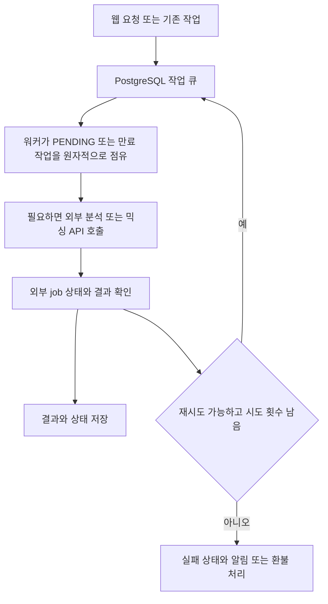

로컬에서는 PostgreSQL을 먼저 띄우고 migration과 Prisma Client 생성을 끝낸 뒤 `pnpm dev`를 실행하세요. `pnpm dev`는 웹과 믹싱·보컬 프로필 분석·곡 분석 워커를 함께 시작해요. 운영 단일 인스턴스에서는 `pnpm build` 뒤 `pnpm start`를 실행하세요. `pnpm start`도 같은 네 프로세스를 감독하고, 하나가 실패하면 전체를 종료해 배포 관리자가 재시작할 수 있게 해요.

## 로컬 실행 순서

필요한 런타임은 Node.js `>=22.13.0`, pnpm `11.9.0`, Docker 20 이상, PostgreSQL이에요. 외부 기능까지 사용하려면 Google OAuth, Leemage, 배포된 Modal 분석·믹싱 서비스와 production 오디오 변환용 FFmpeg도 준비하세요. 저장소가 추적하는 실행 진입점은 [`package.json`의 scripts](repo://package.json#L5-L42)에서 확인할 수 있어요.

1. 의존성을 설치하세요.

   ```bash
   pnpm install --frozen-lockfile
   ```

2. 로컬 PostgreSQL을 시작하세요.

   ```bash
   docker compose up -d
   ```

   Compose는 `postgres:16-alpine`을 사용하고 호스트의 기본 포트 `5433`을 컨테이너의 `5432`에 연결해요. `postgres_data` 볼륨으로 데이터를 유지하고, `pg_isready` healthcheck를 5초 간격으로 최대 10회 실행해요.

3. `DATABASE_URL`이 준비된 환경에서 migration을 적용하고 Prisma Client를 생성하세요.

   ```bash
   pnpm run db:migrate:deploy
   pnpm run db:generate
   ```

   Prisma 설정은 `.env.local`을 `.env`보다 먼저 읽고, datasource URL로 `DATABASE_URL`을 요구해요. migration 경로는 `prisma/migrations`예요.

4. 웹과 세 워커를 시작하세요.

   ```bash
   pnpm dev
   ```

   브라우저에서 `http://localhost:3000`을 확인하세요. 웹만 따로 실행해야 하면 저장소에 정의된 `pnpm run dev:web`을 사용하세요. 개별 워커는 아래 명령으로 실행할 수 있어요.

   ```bash
   pnpm run worker:mixing
   pnpm run worker:vocal-profile-analysis
   pnpm run worker:song-analysis
   ```

## 운영 실행과 점검

단일 인스턴스 운영의 기본 순서는 의존성 설치, migration 적용, build, start예요.

```bash
pnpm install --frozen-lockfile
pnpm run db:migrate:deploy
pnpm build
pnpm start
```

`pnpm run db:migrate`는 개발 중 migration을 만들고 적용할 때 사용하고, 배포에는 `pnpm run db:migrate:deploy`를 사용하세요. 상태만 확인하려면 `pnpm run db:status`, 데이터베이스 연결과 seed 관계 그래프를 확인하려면 `pnpm run db:verify`를 실행하세요. `pnpm run verify:feature-config`는 인증·관리자·Leemage 환경 변수가 채워졌는지 검사해요. `--leemage`를 붙이면 임시 파일을 업로드한 뒤 삭제하는 storage smoke test도 실행해요.

새 PostgreSQL에 배포한 뒤에는 `/admin/songs`에서 기존 catalog snapshot을 가져오세요. snapshot에는 분석 결과와 외부 asset metadata가 들어가지만 원본 음원 bytes는 들어가지 않아요.

## 프로세스와 작업 소유권

각 워커 런처는 `SIGINT`와 `SIGTERM`을 받으면 새 polling을 멈추고 lane이 끝나기를 기다려요. 설정된 concurrency만큼 lane을 만들고, 각 lane은 고유한 owner 문자열로 작업을 점유해요. 작업이 없으면 1초 쉬었다가 다시 확인해요.



이 흐름에서 `FOR UPDATE SKIP LOCKED`가 동시 lane의 같은 작업 선택을 피하게 해요. 새 `PENDING` 작업뿐 아니라 처리 중이지만 lease가 없거나 만료된 작업도 다시 점유할 수 있어요. 유효한 lease를 가진 다른 워커의 작업은 점유하지 않아요. 믹싱과 곡 분석은 외부 job ID를 저장해 재시작 후 polling을 이어가고, 보컬 프로필 분석은 단일 동기 analyzer 응답을 기다려요. 자세한 장애 복구 흐름은 [믹싱 작업 복구 가이드](../workflows/mixing-and-recovery.md)에서 이어서 확인하세요.

## 워커 설정값

모든 정수 설정은 공백을 제거해 읽어요. 값이 비어 있거나 없으면 기본값을 사용하고, 정수가 아니거나 범위를 벗어나면 프로세스가 오류를 던져요. 아래 범위는 `src/shared/config/server-env.ts`에 구현된 현재 계약이에요.

### concurrency·lease·poll·재시도

| 환경 변수 | 적용 워커 | 기본값 | 허용 범위 | 의미 |
| --- | --- | ---: | ---: | --- |
| `MIXING_WORKER_CONCURRENCY` | 믹싱 | `1` | `1`–`32` | 동시에 실행할 lane 수 |
| `MIXING_MAX_ATTEMPTS` | 믹싱 | `3` | `1`–`20` | 작업의 최대 시도 횟수 |
| `MIXING_LEASE_SECONDS` | 믹싱 | `120` | `30`–`3,600` | 작업 lease 유지 시간(초) |
| `MIXING_POLL_INTERVAL_MS` | 믹싱 | `5,000` | `100`–`60,000` | 외부 믹싱 job polling 간격(밀리초) |
| `VOCAL_PROFILE_ANALYSIS_WORKER_CONCURRENCY` | 보컬 프로필 분석 | `1` | `1`–`16` | 동시에 실행할 lane 수 |
| `VOCAL_PROFILE_ANALYSIS_MAX_ATTEMPTS` | 보컬 프로필 분석 | `3` | `1`–`10` | 작업의 최대 시도 횟수 |
| `VOCAL_PROFILE_ANALYSIS_LEASE_SECONDS` | 보컬 프로필 분석 | `300` | `180`–`3,600` | 작업 lease 유지 시간(초) |
| `SONG_ANALYSIS_WORKER_CONCURRENCY` | 곡 분석 | `1` | `1`–`8` | 동시에 실행할 lane 수 |
| `SONG_ANALYSIS_LEASE_SECONDS` | 곡 분석 | `300` | `180`–`3,600` | 작업 lease 유지 시간(초) |
| `SONG_ANALYSIS_POLL_INTERVAL_MS` | 곡 분석 | `2,500` | `250`–`30,000` | 외부 분석 job polling 간격(밀리초) |

`SONG_ANALYSIS_MAX_ATTEMPTS` 설정은 현재 추적된 `server-env.ts`에 정의되어 있지 않아요. 곡 분석의 최대 시도 횟수를 환경 변수로 조정할 수 있다고 가정하지 마세요.

### 티켓 설정

| 환경 변수 | 기본값 | 허용 범위 | 의미 |
| --- | ---: | ---: | --- |
| `SIGNUP_VOCAL_ANALYSIS_TICKET_GRANT` | `5` | `0`–`1,000` | 가입 시 보컬 분석 티켓 지급량 |
| `SIGNUP_MIXING_TICKET_GRANT` | `1` | `0`–`1,000` | 가입 시 믹싱 티켓 지급량 |
| `MIXING_TICKET_COST` | `1` | `0`–`1,000` | 믹싱 1건의 티켓 비용 |
| `VOCAL_PROFILE_ANALYSIS_TICKET_COST` | `1` | `0`–`1,000` | 보컬 프로필 분석 1건의 티켓 비용 |

## 외부 분석 설정

곡 분석 워커는 `SONG_ANALYSIS_MODAL_URL`과 `SONG_ANALYSIS_MODAL_API_KEY`를 사용해요. URL의 끝 슬래시는 제거하고, API key가 없으면 `MODAL_API_KEY`를 대체값으로 사용해요. 둘 중 하나라도 없으면 곡 분석 작업을 실행할 수 없어요.

믹싱 워커는 `MODAL_API_URL`과 `MODAL_API_KEY`가 모두 필요해요. URL의 끝 슬래시는 제거하고, 설정이 없으면 변환 API 미설정 오류로 작업을 실패 처리해요. 보컬 프로필 분석 워커의 설정 이름과 기본값은 현재 이 페이지의 추적 범위에서 확인할 수 없으니, 확인되지 않은 환경 변수를 생성 입력으로 사용하지 마세요.

외부 서비스의 인증과 저장소 경계는 [외부 서비스 연동 레퍼런스](../integrations/external-services.md)를 참고하세요. 설정 변경 후에는 [변경 범위 테스트 선택 가이드](../testing/change-validation.md)에서 관련 queue·worker 테스트를 골라 검증하세요.
