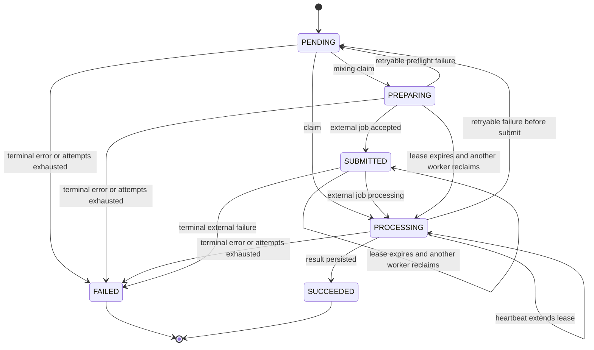

# Durable job 처리와 장애 복구

이 페이지는 `mixing`, `song-analysis`, `vocal-profile-analysis` worker를 운영하거나 변경할 때 확인할 기준이다. 세 worker 모두 PostgreSQL job row를 source of truth로 사용하고, lane마다 고유한 `leaseOwner`를 만든다. 프로세스가 죽어도 `PENDING` 작업과 lease가 만료된 처리 중 작업은 다음 worker가 다시 claim할 수 있다. 유효한 lease가 있는 작업은 다른 lane이 가져가지 않는다.

웹 요청과 worker의 경계, 환경 변수 준비는 [설정·로컬 실행·배포 운영](/openwiki/operations/configuration-and-deployment.md)을 먼저 참고한다.

## 실행 entrypoint와 polling 방식

세 개의 `scripts/*-worker.ts`는 `.env.local`, `.env`를 로드한 뒤 서버 전용 runner를 동적으로 import한다. runner는 `SIGINT`와 `SIGTERM`을 받으면 새 loop를 멈추고, 설정된 concurrency만큼 lane을 병렬 실행한다. claim할 작업이 없으면 1초 쉰다.

| worker | script → runner | 외부 동작 | worker loop의 추가 동작 |
| --- | --- | --- | --- |
| 믹싱 | `scripts/mixing-worker.ts` → `runMixingWorker` | reference·target을 내려받고 `POST /v1/conversions`로 외부 job을 접수한 뒤 `GET /v1/conversions/:id`를 polling한다. 성공하면 audio도 별도로 내려받는다. | 매 회 refund 보정과 media cleanup을 먼저 한 뒤 claim한다. poll 중 매 응답마다 lease를 heartbeat한다. |
| 곡 분석 | `scripts/song-analysis-worker.ts` → `runSongAnalysisWorker` | catalog target을 내려받고 `submitSongAnalysis`로 외부 분석 job을 접수한 뒤 `pollSongAnalysis`로 상태와 결과를 polling한다. | 처리 중 별도 60초 heartbeat timer를 둔다. 외부 job id를 DB에 저장하므로 재시작 후 submit을 반복하지 않는다. |
| 보컬 프로필 분석 | `scripts/vocal-profile-analysis-worker.ts` → `runVocalProfileAnalysisWorker` | reference asset을 내려받아 `analyzeVocalProfileBytes`에 한 번 전달하는 외부 동기 응답 방식이다. 외부 job polling은 없다. | 매 loop refund 보정을 먼저 한다. claim 뒤 별도 heartbeat가 없으므로 긴 분석이 lease보다 길어지지 않도록 운영해야 한다. |

`MIXING_*`, `SONG_ANALYSIS_*`, `VOCAL_PROFILE_ANALYSIS_*` concurrency·lease·poll 설정의 기본값과 허용 범위는 [configuration-and-deployment.md](/openwiki/operations/configuration-and-deployment.md#환경-변수-비용과-worker-제어)와 `src/shared/config/server-env.ts`에 있다. 현재 기본값은 믹싱 `1 lane / 120초 / 5000ms`, 곡 분석 `1 lane / 300초 / 2500ms`, 보컬 분석 `1 lane / 300초`다.

## claim과 lease 불변식

각 `claimNext*Job`은 하나의 SQL statement 안에서 candidate를 고른다. `FOR UPDATE SKIP LOCKED`가 동시 lane의 같은 row 선택을 직렬화하고, 다음 조건을 동시에 확인한다.

- `attempts < maxAttempts`
- `nextAttemptAt <= now`
- 상태가 `PENDING`이거나, 처리 중이며 `leaseExpiresAt`가 없거나 현재 시각보다 과거임
- 곡 분석은 추가로 연결된 `CatalogTargetAsset`이 `READY`임

claim은 `attempts`를 1 증가시키고 `leaseOwner`, `leaseExpiresAt`, `heartbeatAt`, `startedAt`을 기록한다. 믹싱의 `PENDING`은 `PREPARING`으로, 나머지 두 worker의 `PENDING`은 `PROCESSING`으로 바뀐다. heartbeat는 owner를 조건으로 lease를 연장한다. 믹싱은 owner가 바뀌었거나 사라지면 즉시 lease lost 오류를 내고, 곡 분석은 update 대상이 없으면 조용히 무시한다. 보컬 worker는 처리 중 heartbeat를 호출하지 않는다.

따라서 재시작 복구는 “프로세스가 재시작되었다”는 이벤트를 별도로 기록하는 방식이 아니다. 다음 worker가 같은 DB를 보고 `nextAttemptAt`가 도래한 미완료 row를 claim한다. 외부 job id가 이미 저장된 곡 분석과 `modalJobId`가 저장된 믹싱은 기존 외부 job을 polling하는 경로로 들어가 중복 submit을 피한다. 다만 외부 접수 직후 DB 저장 전에 프로세스가 죽으면 외부 요청의 exactly-once는 보장되지 않는다.

이 그림은 세 worker의 공통 durable lifecycle과 믹싱의 세부 상태를 합쳐, retry·lease 만료·terminal 전이를 보여준다.

## worker별 처리와 상태 소유권

### 믹싱: 접수 전과 접수 후를 구분한다

`runMixingWorkerOnce`는 `reconcileRequiredRefunds()`와 `processOneMediaCleanup()`을 실행한 후 job을 claim한다. `processClaimedMixingJob`은 먼저 reference audio와 catalog target을 검증하고, 준비가 끝나면 `SYNTHESIS_PRESET`과 추천 pitch shift를 multipart form으로 만들어 Modal conversion을 접수한다. 응답이 `queued`이고 id가 있어야 `modalJobId`와 `SUBMITTED`를 저장한다.

그 뒤 상태를 계속 조회한다. 외부 상태가 `processing`이면 DB status를 `PROCESSING`으로 바꾸고, 그 밖의 미완료 상태는 `SUBMITTED`로 유지하며 heartbeat 후 설정된 간격만큼 쉰다. `failed`는 terminal `MODAL_JOB_FAILED`다. `succeeded`이면 결과 audio를 내려받아 압축하고 결과 asset을 저장한 뒤, job 성공·lease 해제·성공 알림을 한 transaction으로 확정한다. transaction이 실패하면 방금 만든 result asset을 `discardMediaAsset`으로 폐기한다.

접수 전 실패는 retry 가능한 network/HTTP 오류라면 `PENDING`으로 돌아가고, 접수 후 retry 가능한 오류는 `SUBMITTED`를 유지한다. backoff는 믹싱에서 최대 30초인 `2 ** (attempts - 1)`초다. `408`, `425`, `429`, `5xx`는 일반적으로 retry 가능하지만 submit endpoint는 `429`만 retry 가능하고 network 오류는 retry하지 않는다. 접수 전 terminal 실패는 `refundState = REQUIRED`로 기록한 후 환불하고, 접수 후 실패는 외부 실행이 이미 소비되었으므로 환불하지 않는다.

### 곡 분석: durable external job id를 이어받는다

claim은 `READY` catalog target이 없으면 작업을 선택하지 않는다. 처리 시 target bytes를 내려받고 `submitSongAnalysis`에 `requestId = job.id`와 source video id를 전달한다. submit 성공 후 `externalJobId`를 owner 조건부 update로 저장한다. 저장이 실패하면 중복 접수 위험을 나타내는 lease-lost 오류가 발생한다.

`pollSongAnalysis`가 `PROCESSING`을 반환하면 `SONG_ANALYSIS_POLL_INTERVAL_MS`만큼 기다린다. `FAILED`이면 외부 job id를 지워 다음 재시도가 새 요청을 만들게 하고, analyzer가 표시한 `reasonCode`, detail, retryable을 job에 보존한다. 성공 결과는 `SongAnalysis`를 pipeline contract 기준으로 upsert하고 job과 함께 `SUCCEEDED`로 확정한다. 성공 결과에는 분석 수치와 `cleanupConfirmed`가 저장되며 별도 사용자 media asset을 삭제하지 않는다.

분석기 오류는 명시된 retryable 값과 시도 횟수로 분기한다. retry 시 `PENDING`, 실패 시 `FAILED`이고 backoff는 최대 60초인 `5 * 2 ** (attempts - 1)`초다. 일반 미분류 worker 오류는 retry 가능으로 취급된다. 실패한 분석 revision도 `SongAnalysis`에 `FAILED` 상태와 오류를 남긴다.

### 보컬 프로필 분석: 동기 외부 응답과 idempotent 완료

보컬 worker는 queue row의 `sourceAssetId`가 가리키는 사용자 소유 `REFERENCE` asset을 내려받고, bytes·mime type·file name을 `analyzeVocalProfileBytes`에 전달한다. 분석 함수가 반환한 source bytes의 길이·mime type·SHA-256이 원본과 다르면 `ANALYZER_SOURCE_MISMATCH` terminal 오류다. 외부 분석은 하나의 요청-응답이므로 `externalJobId`나 polling loop가 없다.

처리 전 이미 같은 `recordingId`와 user의 profile이 있으면 job을 성공으로 마킹한다. 처리 중 race로 profile이 먼저 저장되어도 catch에서 다시 찾아 성공으로 마킹한다. 정상 결과는 queued profile persistence와 job 성공, 알림을 transaction으로 확정한다.

retry 가능한 analyzer/client 또는 persistence 오류는 source asset을 유지한 채 `PENDING`으로 돌린다. backoff는 최대 30초인 `2 ** (attempts - 1)`초다. terminal 실패는 job을 `FAILED`로 만들고 `sourceAssetId = NULL`로 분리한 뒤 실패 알림을 만든다. 원래 source asset은 `discardMediaAsset`으로 삭제하고, ticket cost가 있으면 idempotency key를 사용해 환불한다. 환불 실패는 로그로 남지만 job failure 자체는 유지되며 다음 runner loop의 refund reconciliation이 재시도한다.

## terminal failure와 media cleanup

media 삭제는 worker가 직접 모든 삭제를 끝냈다고 가정하지 않는다. 믹싱 worker는 매 iteration `processOneMediaCleanup`을 호출한다. cleanup queue는 `PENDING`·재시도 시각이 된 `FAILED`·5분 이상 갱신되지 않은 `PROCESSING` row를 `SKIP LOCKED`로 claim한다. Leemage 삭제 성공 또는 404면 asset과 cleanup row를 제거한다. 다른 오류는 cleanup row를 exponential delay로 `FAILED`에 남기고 asset을 `DELETE_PENDING`으로 표시한다.

세 worker의 cleanup 정책은 다르다.

| 대상 | 성공 | retryable 실패 | terminal 실패 |
| --- | --- | --- | --- |
| 믹싱 결과 asset | DB 성공 transaction 뒤 job이 `SUCCEEDED`; transaction 실패 시 결과 asset 폐기 | 결과 finalization은 `SUBMITTED`로 재시도하고 asset은 만들지 않음 | 접수 전이면 refund, 접수 후면 환불 없음 |
| 곡 분석 catalog target | 분석 결과와 revision metadata를 DB에 저장 | job만 `PENDING`; catalog asset은 보존 | `SongAnalysis`와 job에 실패 기록 |
| 보컬 queued source asset | profile이 source asset을 재사용 | source asset 보존 | job에서 detach 후 Leemage 삭제를 queue하고 환불 |

## 운영 점검과 집중 테스트

운영자는 다음을 우선 확인한다.

1. 각 worker의 endpoint/key와 concurrency·lease·poll 값이 `server-env.ts` 허용 범위 안인지 확인한다.
2. `PROCESSING`, `PREPARING`, `SUBMITTED`가 lease 만료 없이 오래 남는지 확인한다. 특히 보컬 분석에는 처리 중 heartbeat가 없으므로 lease와 실제 동기 분석 시간의 여유를 둔다.
3. `FAILED` job의 `errorCode`, `retryable`, `attempts`, `refundState`를 함께 확인한다. `refundState = REQUIRED`가 남으면 worker가 다음 loop에서 보정한다.
4. `DELETE_PENDING` asset과 `MediaCleanupJob.FAILED`의 `lastError`, `nextAttemptAt`를 확인한다.

핵심 integration test는 다음 경계를 검증한다.

- `tests/mixing-queue.integration.ts`: 두 worker의 동시 claim은 한 건만 성공하고, 만료 lease가 재점유된다. reference fetch·target fetch·submit·외부 job 실패·finalization 오류를 접수 전/후로 나누어 retry, backoff, 환불 경계, 알림, 결과 asset rollback을 확인한다.
- `tests/song-analysis-queue.integration.ts`: target이 `READY`가 아니면 claim하지 않고, 동시에 claim한 두 번째 worker는 거절된다. 만료 lease 후 두 번째 worker가 이어받아 external job을 polling하고 `READY` revision을 만든다. `503` analyzer 오류는 `PENDING`과 retryable 상태로 남는다.
- `tests/vocal-profile-analysis-queue.integration.ts`: 만료 lease 재점유, source asset 재사용, transient Modal 오류 시 source 보존, terminal 오류 시 source detach·삭제와 ticket 환불을 확인한다.

코드를 변경할 때는 먼저 claim SQL의 선택 조건과 상태 enum을 함께 확인하고, 외부 접수 뒤 DB에 id를 저장하는 경계와 terminal cleanup/refund의 idempotency를 integration test로 고정한다.
