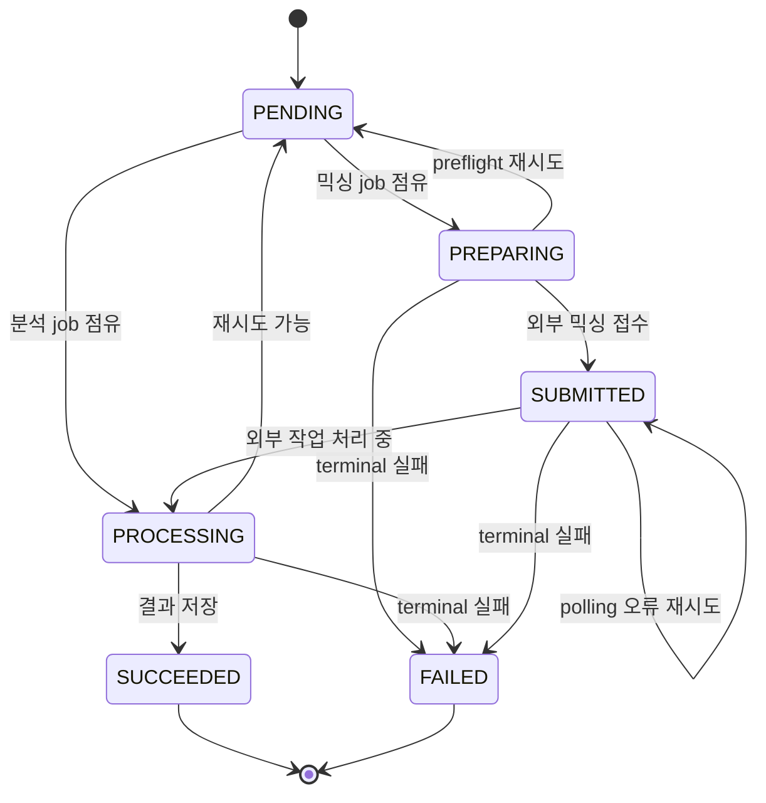
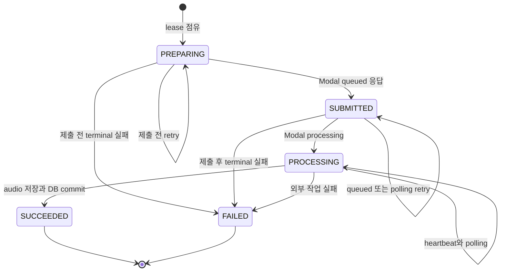
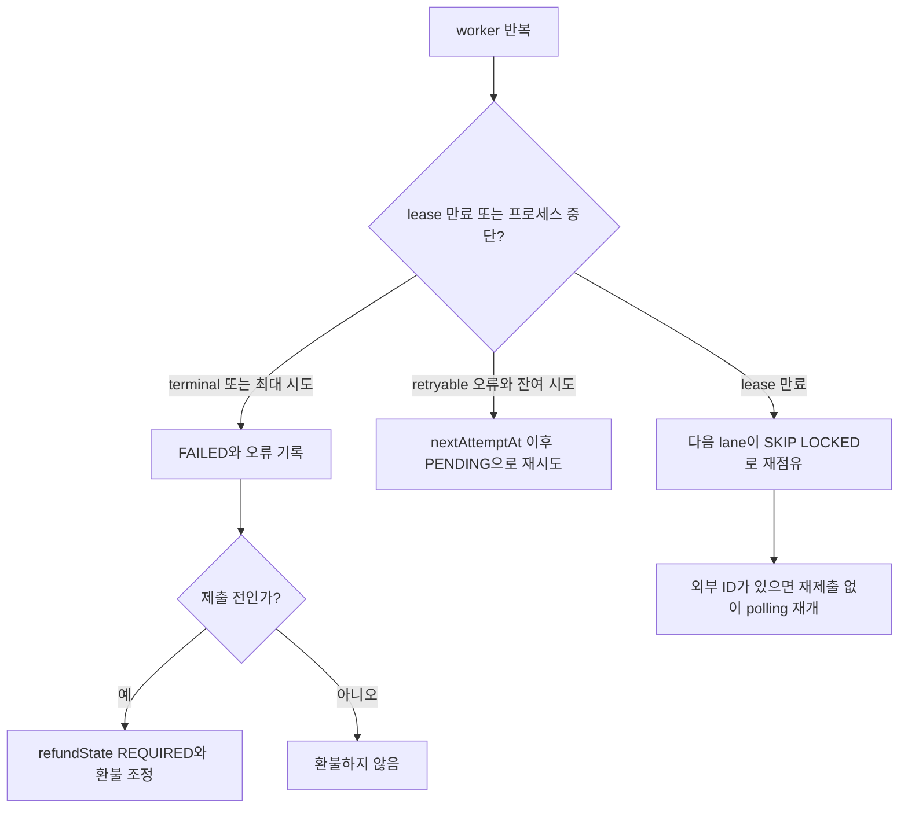

# Background Jobs, Leases, Retries, and Recovery

Copysinger의 background job은 웹 요청과 분리되어 PostgreSQL에 영속화된다. 현재 세 루프는 보컬 프로필 분석, 곡 카탈로그 분석, AI 믹싱이다. 각 루프의 `runner`는 여러 lane을 만들고, lane은 한 번에 하나의 job만 `SKIP LOCKED`로 원자적으로 점유한다. 작업을 처리할 프로세스가 죽어도 완료되지 않은 row의 lease가 만료되면 다른 worker가 다시 점유할 수 있다.

## 공통 큐 규칙과 관찰 필드

세 job 테이블은 다음 제어 필드를 가진다.

| 필드 | 의미 |
| --- | --- |
| `status` | `PENDING`, 처리 중 상태, `SUCCEEDED`, `FAILED` 등 lifecycle 상태. 믹싱은 `PREPARING`, `SUBMITTED`, `PROCESSING`을 구분한다. |
| `attempts` / `maxAttempts` | 점유할 때마다 `attempts`를 1 증가시키며, `attempts < maxAttempts`일 때만 재점유한다. 기본 시도 횟수는 분석·믹싱 모두 3이다. |
| `nextAttemptAt` | 다음 점유가 허용되는 시각. 현재 시각보다 미래면 polling 대상에서 제외된다. |
| `leaseOwner` | lane이 만든 소유자 문자열. 처리 중 update는 이 값으로 소유권을 검증한다. |
| `leaseExpiresAt` | lease 만료 시각. `NULL`이거나 현재 시각보다 과거인 처리 중 job만 stale job으로 회수한다. |
| `heartbeatAt` | 마지막 생존 갱신 시각. 성공/재시도/실패 전환에도 갱신되며, 믹싱 polling 중에는 lease와 함께 갱신된다. |
| `errorCode` / `errorDetail` / `retryable` | 마지막 오류의 분류, 최대 2,000자 상세, 재시도 가능 여부. |
| `startedAt` / `completedAt` | 최초 점유 시각과 terminal 성공·실패 시각. 재시도 시 `completedAt`은 비운다. |

점유 query는 생성 순으로 후보를 정렬하고 `FOR UPDATE SKIP LOCKED LIMIT 1`을 사용한다. 따라서 오래 기다리는 row 때문에 다른 lane이 막히지 않으며, 후보 조건에는 `nextAttemptAt`, 최대 시도 횟수, 상태와 만료 lease가 모두 포함된다. 점유 update는 owner·lease·heartbeat·attempts를 함께 기록한다. 큐의 인덱스는 이 상태/시각 조합을 지원한다.

캡션: 세 durable job의 공통 terminal 흐름과 믹싱의 외부 접수 단계를 나타낸다.

## 세 worker의 실행과 lease

- `scripts/vocal-profile-analysis-worker.ts`, `scripts/song-analysis-worker.ts`, `scripts/mixing-worker.ts`가 각각 runner를 import해 실행한다. runner는 `MIXING_WORKER_CONCURRENCY`(기본 1, 최대 32), `VOCAL_PROFILE_ANALYSIS_WORKER_CONCURRENCY`(기본 1, 최대 16), `SONG_ANALYSIS_WORKER_CONCURRENCY`(기본 1, 최대 8)만큼 lane을 만든다.
- lane owner는 PID, lane 번호/종류, random UUID로 구성된다. `run*WorkerOnce`가 job을 처리하지 못하면 1초 sleep 후 다시 시도한다. `SIGINT`와 `SIGTERM`은 새 반복을 막고 모든 lane이 끝나기를 기다린다.
- 보컬·곡 분석 lease 기본값은 300초(환경 범위 180–3,600초), 믹싱 lease는 120초(30–3,600초)다. 곡 분석과 믹싱은 외부 작업을 기다리는 동안 heartbeat를 사용한다. 곡 분석은 60초 주기 heartbeat timer를 두고, 믹싱은 각 상태 조회 뒤 heartbeat를 실행해 lease를 연장한다.
- 보컬 분석과 곡 분석의 heartbeat update는 해당 owner(곡 분석은 `PROCESSING` 상태도 함께) 조건을 포함한다. 믹싱도 owner 조건을 포함하며 update 결과가 1건이 아니면 lease 상실 오류로 처리한다. 그러므로 lease를 잃은 worker가 결과를 계속 커밋하지 않도록 owner 검증을 유지해야 한다.

## 보컬 프로필 분석

`claimNextVocalProfileAnalysisJob`은 `PENDING` 또는 만료된 `PROCESSING` row를 점유한다. `sourceAssetId`가 가리키는 사용자 소유 `REFERENCE` asset이 `READY`여야 처리 후보가 된다. worker는 asset bytes를 읽어 분석 service에 보내고, 반환된 bytes의 길이·MIME type·SHA-256이 queued source와 같은지 검증한다. 불일치(`ANALYZER_SOURCE_MISMATCH`)는 재시도하지 않는다.

성공 시 분석 결과와 job의 `vocalProfileId`, `SUCCEEDED`, `completedAt`을 transaction으로 저장하고 lease를 비운 뒤 dedupe notification을 만든다. 이미 같은 `recordingId`의 프로필이 있으면 중복 결과를 저장하지 않고 성공으로 마무리한다.

분석 오류는 analyzer가 표시한 `retryable`을 따른다. retryable이고 `attempts < maxAttempts`이면 상태를 `PENDING`으로 되돌리고 lease를 비우며, 지연은 `min(30초, 2^(attempts-1))`이다. 그 밖에는 `FAILED`로 terminal 처리하고 오류를 기록한다. 이때 source asset을 삭제 대기 대상으로 보내고(있다면), 비용이 양수면 `refundState=REQUIRED`로 만든 뒤 환불을 시도한다.

## 곡 카탈로그 분석

`claimNextSongAnalysisJob`은 `PENDING` 또는 만료된 `PROCESSING` row를 점유하되, 해당 `sourceId`에 `READY`인 `CatalogTargetAsset`이 존재해야 한다. 외부 analyzer에 아직 접수하지 않았다면 target asset을 다운로드해 `requestId=job.id`로 제출하고, 반환된 `externalJobId`와 `externalSubmittedAt`을 owner 검증 update로 저장한다. 이미 external ID가 있으면 재제출하지 않고 polling부터 재개한다.

polling 간격 기본값은 2,500ms(250–30,000ms)다. 외부 작업이 `PROCESSING`이면 기다리고, `FAILED`이면 analyzer의 reason code/detail/retryable을 사용한다. 성공 결과는 `SongAnalysis`에 pipeline contract와 분석 수치·metadata를 upsert한 뒤 job을 같은 transaction에서 `SUCCEEDED`로 바꾼다.

오류의 retryable 판정은 analyzer 오류와 target 다운로드 HTTP 상태(429 또는 5xx)를 반영한다. retryable이고 남은 시도가 있으면 `PENDING`, lease 해제, `nextAttemptAt = now + min(60초, 5 × 2^(attempts-1))`로 둔다. terminal이면 `SongAnalysis`도 `FAILED`로 upsert하고 job을 `FAILED`로 기록한다. 일반적인 예외는 retryable로 정규화되므로, 코드 변경 시 외부 오류를 무심코 terminal로 바꾸지 않도록 주의한다.

## AI 믹싱

믹싱 enqueue는 추천 결과의 `catalogRevision`, `scoringVersion`, `recommendedShift`, 참조·target asset ID를 snapshot하고 ticket 사용을 같은 Serializable transaction에서 기록한다. worker의 점유 상태는 `PENDING → PREPARING`이며, 이미 `modalJobId`가 있으면 PREPARING 단계를 건너뛴다.

PREPARING 단계에서 reference와 READY target audio를 각각 최대 60초 timeout으로 가져오고, `SYNTHESIS_PRESET`을 multipart form에 넣는다. `auto_pitch_shift=false`, `pitch_shift=job.recommendedShift`를 명시해 `${MODAL_API_URL}/v1/conversions`에 제출한다. 응답은 `id`가 있고 상태가 `queued`여야 유효하며, 이후 job을 `SUBMITTED`와 `modalJobId`로 저장한다. 상태 조회 timeout은 30초, 결과 audio 조회 timeout은 60초, 최종 압축 실패는 retryable이다.

외부 상태가 `processing`이면 `PROCESSING`, 그 외 대기 상태이면 `SUBMITTED`로 heartbeat하고 `MIXING_POLL_INTERVAL_MS`(기본 5,000ms, 100–60,000ms)만큼 쉰다. `succeeded`이면 결과 audio를 받아 압축하고 Leemage에 저장한다. 결과 asset과 job을 transaction에서 연결해 `SUCCEEDED`로 만들고 성공 notification을 기록한다. 그 transaction이 실패하면 방금 만든 media asset을 폐기한다.

HTTP network 오류와 408·425·429·5xx는 일반적으로 retryable이나, Modal submit은 network 오류를 retryable로 보지 않고 429만 재시도 가능하다. 외부 작업을 이미 제출한 뒤의 retry는 `SUBMITTED`로 남아 저장된 `modalJobId`를 재사용한다. 제출 전 retry는 `PENDING`으로 돌아간다. 두 경우 모두 지연은 `min(30초, 2^(attempts-1))`이다. 재시도 불가이거나 최대 시도에 도달하면 `FAILED`가 되며, 제출 후 실패는 이미 외부 작업이 존재할 수 있으므로 환불하지 않는다. 제출 전 실패는 `refundState=REQUIRED`로 저장하고 ticket cost를 환불한다.

캡션: 믹싱 job에서 외부 `modalJobId`를 보존하며 재시작·재시도를 이어가는 상태 machine이다.

## 환불과 미디어 cleanup

환불은 `TicketLedger.idempotencyKey`로 멱등화된다. 보컬 분석 worker runner는 매 lane 반복마다 오래된 `refundState=REQUIRED` 최대 10건을 먼저 조정한다. 믹싱 worker의 `runMixingWorkerOnce`도 최대 10건의 required 환불과 media cleanup 한 건을 job 점유 전에 처리한다. 따라서 별도의 cron이나 dashboard를 전제로 하지 않으며, worker가 살아 있고 반복하는 동안 보상 작업이 회복된다.

미디어 cleanup은 `MediaCleanupJob`의 `PENDING`/`FAILED` 중 `nextAttemptAt`이 지난 row 또는 5분 이상 갱신되지 않은 `PROCESSING` row를 `SKIP LOCKED`로 한 건 점유한다. asset이 이미 없으면 cleanup row를 삭제한다. Leemage 삭제가 성공하거나 404이면 asset을 DB에서 삭제한다. 그 밖의 실패는 cleanup을 `FAILED`로, asset을 `DELETE_PENDING`으로 만들고 오류를 저장한다. 다음 시각은 `min(2^attempts분, 360분)` 뒤다.

캡션: worker 코드에 근거한 재시작, backoff, terminal failure, 환불 선택 흐름이다.

## 운영 설정과 안전한 변경

핵심 환경 변수는 `*_WORKER_CONCURRENCY`, `*_MAX_ATTEMPTS`, `*_LEASE_SECONDS`, 분석/믹싱 `*_POLL_INTERVAL_MS`다. 값은 `integerEnv`의 범위 검증을 통과해야 하며, lease는 외부 요청 timeout과 polling 구간을 충분히 감싸야 한다. concurrency를 늘려도 DB row lock과 owner lease가 중복 처리를 막지만, 외부 service와 media 저장에 대한 동시 부하는 커진다.

`pnpm dev`와 `pnpm start`는 `concurrently --kill-others-on-fail`로 웹과 세 worker를 함께 감독한다. 한 child가 실패하면 sibling에 `SIGTERM`을 보내 전체 프로세스를 종료하므로, production에서는 외부 배포 관리자가 다시 시작하는 동작을 기대한다. 애플리케이션 내부에 cron, 별도 scheduler, dashboard가 구현되어 있다고 가정하지 않는다.

## 집중해서 볼 테스트

- `tests/mixing-queue.integration.ts`: 믹싱 queue의 점유·외부 작업 진행·성공/실패와 ticket 경계를 검증한다.
- `tests/song-analysis-queue.integration.ts`: target 준비 조건, 외부 분석 job 재개, retry와 결과 persistence를 검증한다.
- `tests/vocal-profile-analysis-queue.integration.ts`: source 검증, 분석 결과 저장, 실패·환불 및 중복 성공 경로를 검증한다.
- `tests/process-scripts.test.ts`: 세 worker와 web command가 함께 supervisor 아래 실행되는지, child 실패 때 sibling 종료가 일어나는지 검증한다.

worker를 바꿀 때는 상태 전환만이 아니라 `leaseOwner` 조건, external job ID 재사용, idempotency key, ticket refund state, media cleanup의 재시도까지 함께 회귀 테스트해야 한다.
