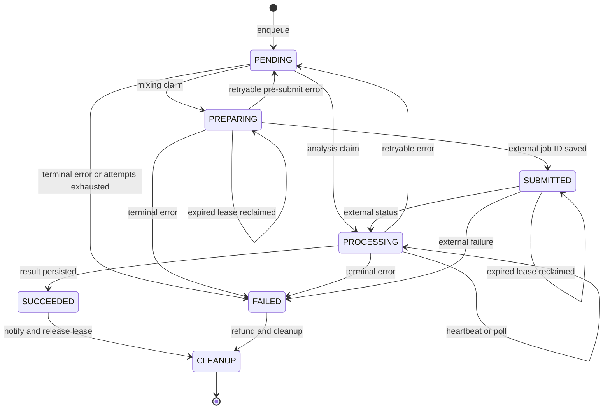

# Durable worker와 작업 lifecycle

이 페이지는 세 background worker를 운영하거나 변경할 때의 기준이다.

- `mixing`: 보컬 reference와 곡 target을 외부 변환 서비스에 제출하고 결과 음원을 저장한다.
- `song-analysis`: 준비된 catalog target을 외부 분석 job으로 제출하고 분석 수치를 `SongAnalysis`에 저장한다.
- `vocal-profile-analysis`: 사용자 reference asset을 외부 동기 분석기에 전달하고 보컬 프로필을 저장한다.

웹 요청은 먼저 queue row와 필요한 ticket debit을 저장한다. worker는 DB row를 source of truth로 삼으므로 프로세스가 죽어도 새 프로세스가 `PENDING` 또는 만료된 lease의 row를 다시 선택한다. 웹 요청과 worker의 경계와 환경 변수는 [설정·로컬 실행·배포 운영](/openwiki/operations/configuration-and-deployment.md)을 함께 참고한다.

## 전체 흐름과 상태 machine

`enqueue`는 idempotency key를 검증하고, source를 확인한 뒤 job row와 ticket debit을 transaction으로 만든다. `claim`은 한 SQL statement에서 잠금과 상태 갱신을 함께 수행한다. worker가 외부 job ID를 저장한 뒤에는 재시작해도 submit 대신 polling을 재개한다.

그림은 queue row의 durable 상태와 lease 만료 후 재점유를 보여준다. `CANCELED`는 worker의 자동 전이 상태가 아니라 믹싱 DB/API가 노출하는 terminal 상태다.

## enqueue와 atomic claim

### enqueue가 보장하는 것

`enqueueMixingJob`은 추천 결과가 최신인지, `SongAnalysis`와 target asset이 `READY`인지, 사용자 profile이 맞는지 확인한다. 그 뒤 `MixingJob`을 만들고 비용이 있으면 `AI_MIXING` ticket을 차감한다. transaction isolation은 `Serializable`이며 동일 사용자의 `idempotencyKey` 재요청은 기존 row를 반환한다. 다른 입력에 같은 key를 쓰면 `IDEMPOTENCY_CONFLICT`다. 보컬 분석 enqueue도 upload를 먼저 `REFERENCE` asset으로 보존하고, job과 `VOCAL_ANALYSIS` debit을 같은 transaction에 기록한다. 사용자별 active 분석은 하나로 제한된다.

### claim과 lease 불변식

각 `claimNext*Job`은 다음 조건을 한 SQL statement에서 확인한다.

- `attempts < maxAttempts`
- `nextAttemptAt <= now`
- `PENDING`이거나, 처리 중 상태이고 `leaseExpiresAt`가 없거나 현재 시각보다 과거일 것
- 곡 분석은 연결된 `CatalogTargetAsset`도 `READY`일 것

`FOR UPDATE SKIP LOCKED`가 동시 lane이 같은 row를 선택하지 않게 한다. claim은 `attempts`를 증가시키고 `leaseOwner`, `leaseExpiresAt`, `heartbeatAt`, `startedAt`을 기록한다. 믹싱의 `PENDING`은 `PREPARING`, 곡 분석과 보컬 분석의 `PENDING`은 `PROCESSING`이 된다. 유효한 lease는 다른 worker가 가져가지 않으며, 만료된 lease만 재점유할 수 있다.

heartbeat는 owner를 조건으로 lease를 연장한다. 믹싱은 polling 응답마다 owner를 확인하며 lease를 잃으면 오류로 중단한다. 곡 분석은 60초 간격의 별도 heartbeat timer를 사용한다. 보컬 분석은 동기 외부 호출 중 heartbeat가 없으므로 lease보다 긴 분석 시간을 허용하도록 설정해야 한다.

## worker별 외부 처리와 terminal 결과

### 믹싱: `PREPARING`과 `SUBMITTED`의 경계

`runMixingWorkerOnce`는 claim 전에 미처리 refund와 media cleanup을 보정한다. `processClaimedMixingJob`은 reference·target을 내려받고 `SYNTHESIS_PRESET`과 추천 pitch shift를 multipart로 구성해 `POST /v1/conversions`에 제출한다. 응답이 `queued`이고 ID가 있을 때만 `modalJobId`를 저장하고 DB 상태를 `SUBMITTED`로 만든다.

이후 `GET /v1/conversions/:id`를 polling한다. 외부 상태가 `processing`이면 DB를 `PROCESSING`으로 바꾸고, 아직 끝나지 않았으면 `SUBMITTED`를 유지한다. `failed`는 `MODAL_JOB_FAILED` terminal failure다. `succeeded`이면 `/audio` 결과를 내려받아 압축하고 결과 asset을 만든다. job을 `SUCCEEDED`로 바꾸고 결과 ID와 성공 알림을 transaction으로 확정한다. 이 transaction이 실패하면 방금 만든 결과 asset을 폐기한다.

접수 전 retryable 오류는 `PENDING`, 접수 후 retryable 오류는 외부 ID를 보존한 `SUBMITTED`로 돌아간다. 믹싱 backoff는 `min(30, 2 ** (attempts - 1))`초다. 일반 fetch는 `408`, `425`, `429`, `5xx`를 retry 대상으로 보지만 submit endpoint는 `429`만 retry하며 network 오류는 retry하지 않는다. terminal failure에서는 접수 전만 `refundState = REQUIRED`로 만들고 ticket을 환불한다. 접수 후에는 외부 실행이 이미 소비됐으므로 환불하지 않는다.

### 곡 분석: 외부 job ID를 durable하게 이어받기

claim은 `READY` target이 없으면 row를 선택하지 않는다. worker는 target bytes를 `submitSongAnalysis`에 넘기고 `requestId = job.id`를 사용한다. submit이 성공하면 `externalJobId`를 owner 조건부 update로 저장한다. 저장이 실패하면 lease-lost 오류로 처리해 submit 후 ID를 잃은 상태를 숨기지 않는다.

`pollSongAnalysis`가 `PROCESSING`이면 설정된 interval 후 다시 조회한다. `FAILED`이면 기존 external ID를 지우고 analyzer의 `reasonCode`, detail, retryable을 job과 실패한 `SongAnalysis`에 남긴다. retry 시 `PENDING`, terminal 시 `FAILED`가 된다. backoff는 `min(60, 5 * 2 ** (attempts - 1))`초다. 성공 결과와 pipeline contract 기반 `SongAnalysis` upsert, job의 `SUCCEEDED` 전환은 한 transaction으로 처리한다. catalog target은 별도 사용자 asset처럼 삭제하지 않는다.

### 보컬 프로필 분석: 동기 응답과 idempotent 완료

worker는 queue row가 가리키는 사용자 소유 `REFERENCE` asset을 확인하고 bytes, MIME type, file name을 `analyzeVocalProfileBytes`에 한 번 전달한다. 이 경로에는 외부 job ID와 polling loop가 없다. analyzer가 반환한 source bytes의 길이·MIME type·SHA-256이 원본과 다르면 `ANALYZER_SOURCE_MISMATCH`로 terminal 처리한다.

같은 `recordingId`와 user의 profile이 이미 있으면 job을 성공으로 마킹한다. persistence와 job 성공, 성공 알림은 transaction으로 묶인다. retryable analyzer/client 또는 persistence 오류는 source asset을 유지한 채 `PENDING`으로 돌리며 backoff는 `min(30, 2 ** (attempts - 1))`초다. terminal failure에서는 job을 `FAILED`로 만들고 `sourceAssetId = NULL`로 분리한 뒤 실패 알림을 만든다. source asset은 `discardMediaAsset`으로 삭제하고 비용이 있으면 idempotency key로 환불한다. 환불 호출이 실패해도 job failure는 유지되고 다음 runner loop의 reconciliation이 `REQUIRED`를 재시도한다.

## 화면 상태와 DB/API 상태를 구분하기

DB enum은 믹싱에서 `PENDING`, `PREPARING`, `SUBMITTED`, `PROCESSING`, `SUCCEEDED`, `FAILED`, `CANCELED`를 사용한다. 곡 분석과 보컬 분석은 각각 `PENDING`, `PROCESSING`, `SUCCEEDED`, `FAILED`를 사용한다. API history와 public contract는 이를 소문자로 직렬화한다. 따라서 운영 로그·SQL에서는 대문자 상태를, API payload와 화면에서는 소문자 상태를 기준으로 읽어야 한다.

화면은 DB 상태를 그대로 timeline으로 보여주지 않는다. 믹싱 presentation layer는 `pending`을 “대기 중”, `preparing`을 “음원 준비 중”, `submitted`를 “믹싱 대기 중”, `processing`을 “AI 믹싱 중”으로 축약하고 `succeeded`, `failed`, `canceled`를 terminal로 묶는다. 특히 `submitted`는 외부 요청 접수 후 대기 상태이고 `processing`은 외부 처리가 관찰된 상태다. `canceled`는 화면의 terminal 표현이지만 현재 worker lifecycle의 자동 retry 전이는 아니다.

## 환불·알림·cleanup 운영 규칙

terminal failure 알림은 job 상태 전환 transaction 안에서 만든다. 믹싱은 `MIXING_FAILED`, 성공은 `MIXING_SUCCEEDED`; 보컬 분석은 `VOCAL_PROFILE_FAILED`, 성공은 `VOCAL_PROFILE_SUCCEEDED`다. notification에는 job을 가리키는 `sourceId`와 dedupe key가 있어 재시도나 재시작이 같은 알림을 중복 생성하지 않게 한다. 공통 notification service도 durable 저장, deduplication, owner scope를 integration test로 검증한다.

믹싱 worker는 매 loop `processOneMediaCleanup`도 실행한다. cleanup row는 `PENDING`, 재시도 시각이 된 `FAILED`, 5분 이상 갱신되지 않은 `PROCESSING`을 `SKIP LOCKED`로 claim한다. 외부 media 삭제가 성공하거나 404면 asset과 cleanup row를 제거하고, 다른 오류면 exponential delay를 기록하며 asset을 `DELETE_PENDING`으로 남긴다. 결과 asset은 DB 성공 transaction이 끝나기 전에 독립적으로 만들어지므로 transaction 실패 시 즉시 폐기해야 한다.

## 재시작 복구와 운영 점검

재시작 이벤트를 별도로 기록하지 않는다. 다음 worker가 같은 DB에서 `nextAttemptAt`가 도래한 `PENDING` row 또는 만료 lease row를 claim한다. 곡 분석의 `externalJobId`와 믹싱의 `modalJobId`가 있으면 이미 접수된 외부 job을 polling한다. 다만 외부 submit 직후 ID를 DB에 저장하기 전에 프로세스가 죽는 창에서는 exactly-once submit을 보장하지 않는다.

운영자는 다음을 확인한다.

1. endpoint와 key, concurrency·lease·poll 설정이 `src/shared/config/server-env.ts`의 허용 범위에 있는지 확인한다.
2. `PREPARING`, `PROCESSING`, `SUBMITTED`가 lease 만료 없이 오래 남는지 확인한다. 특히 보컬 분석은 동기 처리 시간과 lease를 비교한다.
3. `FAILED`의 `errorCode`, `retryable`, `attempts`, `refundState`를 함께 확인한다. `refundState = REQUIRED`는 다음 reconciliation 대상이다.
4. `DELETE_PENDING` asset과 cleanup row의 `lastError`, `nextAttemptAt`를 확인한다.

## 집중 테스트

- `tests/mixing-queue.integration.ts`: 동시 claim에서 한 worker만 성공하는지, 만료 lease가 재점유되는지, 접수 전·후 오류의 retry/backoff·환불 경계·알림·결과 asset rollback을 검증한다.
- `tests/song-analysis-queue.integration.ts`: `READY`가 아닌 target을 claim하지 않는지, lease 복구 후 external job polling과 `READY` revision 저장, `503`의 retryable `PENDING` 전환을 검증한다.
- `tests/vocal-profile-analysis-queue.integration.ts`: lease 재점유, profile 중복 시 idempotent 완료, transient 오류의 source 보존, terminal 오류의 source detach·삭제·ticket 환불·알림을 검증한다.
- `tests/notification-service.integration.ts`: 알림의 durable 저장, deduplication, pagination, owner scope를 독립적으로 검증한다.

상태 enum이나 claim SQL을 바꿀 때는 public presentation/API 직렬화, 외부 ID 저장 경계, refund idempotency, notification dedupe, media cleanup까지 함께 고정하는 integration test를 수정한다.
