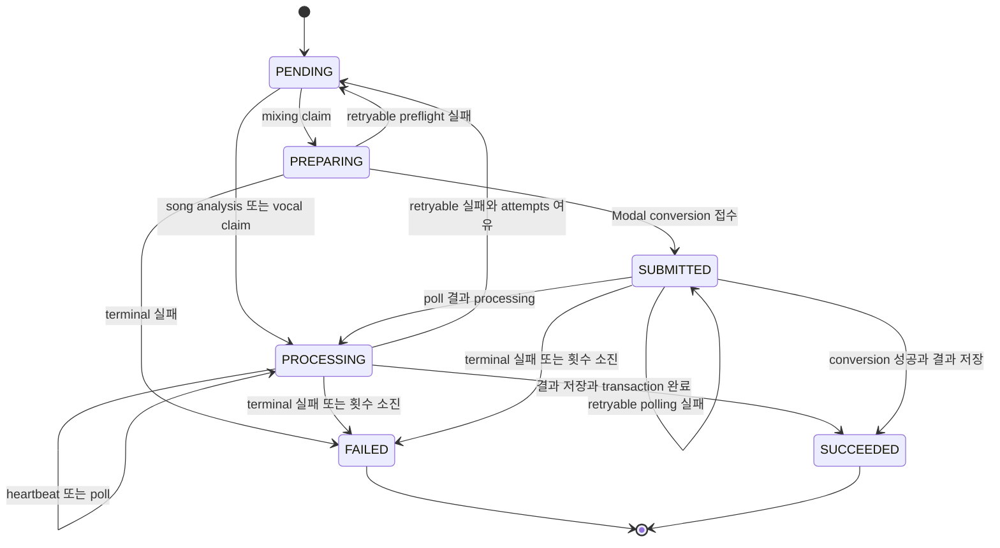
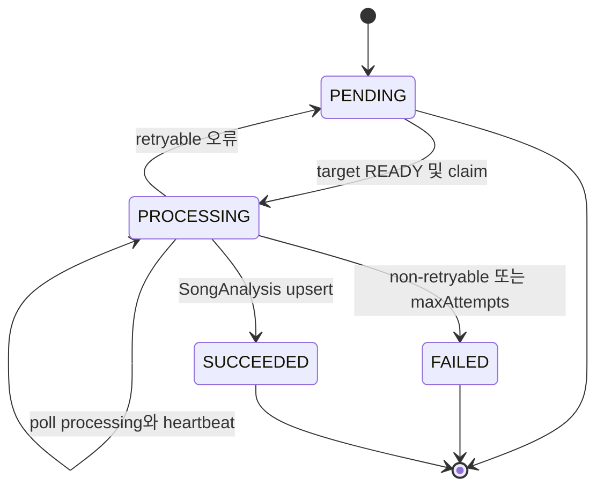
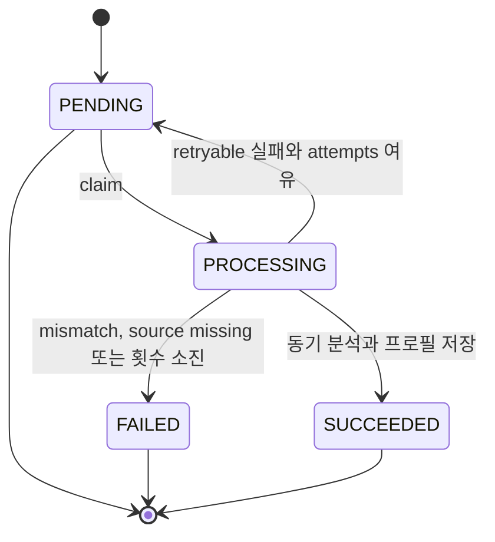
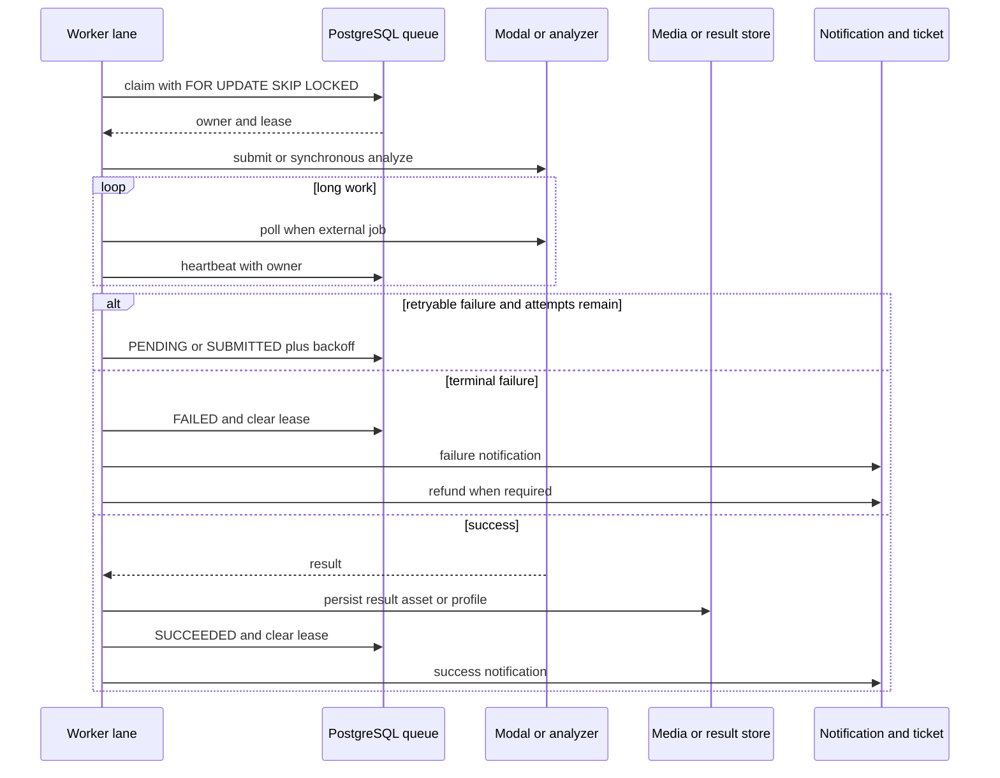

# Durable workers, leases, retries, and recovery

이 시스템에는 PostgreSQL 행을 작업의 내구성 있는 큐로 사용하는 세 큐가 있습니다.

- `SongAnalysisJob`: 카탈로그 target asset이 `READY`가 된 곡의 분석을 외부 Modal 분석기에 제출하고 결과를 polling합니다.
- `MixingJob`: 레퍼런스와 카탈로그 target을 외부 변환 서비스에 제출하고 결과 음원을 저장합니다.
- `VocalProfileAnalysisJob`: 업로드된 레퍼런스 asset을 읽어 애플리케이션이 Modal 기반 분석을 동기 호출하고 프로필을 저장합니다. 별도의 로컬 analyzer API 런타임은 없습니다.

각 작업에는 `attempts`, `maxAttempts`, `nextAttemptAt`, 오류 정보, lease 소유자와 만료 시각이 저장됩니다. 따라서 프로세스가 죽거나 네트워크 호출 중단으로 lease가 만료되면 새 lane이 같은 행을 다시 가져갈 수 있습니다. 작업별 idempotency key와 완료 시의 upsert/기존 결과 확인은 재실행이 이미 저장된 결과를 중복 생성하지 않도록 하는 경계입니다.

## Claim과 lease의 공통 불변식

세 worker의 claim은 하나의 SQL 문에서 candidate를 고릅니다. candidate 선택은 `FOR UPDATE SKIP LOCKED`를 사용하므로 다른 lane이 잠근 행을 기다리지 않고 건너뛰며, 생성 시각 순으로 한 번에 하나만 선택합니다. `attempts < maxAttempts`이고 `nextAttemptAt <= now`인 행만 대상입니다. `PENDING` 행 또는 `PROCESSING`/`PREPARING`/`SUBMITTED` 상태이면서 `leaseExpiresAt`가 없거나 현재 시각보다 과거인 행만 reclaim됩니다. 즉 활성 lease가 있는 작업은 claim 대상에서 제외됩니다.

claim은 owner, `leaseExpiresAt`, `heartbeatAt`, `startedAt`(최초 실행 시), attempts를 함께 갱신합니다. mixing은 `PENDING`을 `PREPARING`으로 바꾸고, 나머지 두 큐는 `PROCESSING`으로 바꿉니다. 처리 중 갱신은 owner 조건을 포함해야 합니다. song analysis는 `PROCESSING` 및 owner인 경우에만 heartbeat하고, mixing은 owner가 일치하지 않으면 lease 상실 오류를 냅니다. vocal profile은 명시적인 주기 heartbeat 없이 짧은 처리 경계를 사용하지만 claim 행에는 같은 lease 필드가 있습니다. 만료된 lease의 reclaim은 이전 프로세스가 다시 완료를 쓰는 것을 자동으로 막는 fencing token은 아니므로, 변경 시에는 모든 외부 제출 후 DB 갱신에 owner 조건을 유지해야 합니다.

그림은 세 큐에 공통인 대기·처리·재시도·종료 구조와 mixing의 외부 제출 단계를 합쳐 표현한 것입니다.

## 큐별 실행과 lifecycle

### Song analysis: 외부 제출 후 polling

`claimNextSongAnalysisJob`은 연결된 `CatalogTargetAsset` 중 `READY`가 존재하는 작업만 claim합니다. worker는 target을 다운로드한 뒤 `submitSongAnalysis`에 작업 ID를 request ID로 넘기고, 반환된 `externalJobId`와 제출 시각을 owner 확인과 함께 저장합니다. 이미 `externalJobId`가 있으면 재제출하지 않고 바로 `pollSongAnalysis`를 호출합니다. `PROCESSING`이면 설정된 간격만큼 기다리며, 이 동안 별도 60초 heartbeat timer가 lease를 갱신합니다. 외부 `FAILED`는 외부 reason code와 retryable 판정을 반영하고 external ID를 비워 재시도 시 새 제출을 하게 합니다. 성공하면 분석 값을 `SongAnalysis`에 upsert하고 job을 `SUCCEEDED`로 같은 transaction에서 완료합니다.

Song analysis의 외부 제출·poll·결과 upsert lifecycle을 보여줍니다.

### Mixing: 제출 전과 제출 후를 구분

`MixingJob`은 먼저 레퍼런스와 `READY` target을 내려받아 multipart payload를 만들고 `/v1/conversions`에 제출합니다. 응답이 `queued`와 ID를 함께 주어야 `SUBMITTED`로 기록됩니다. `modalJobId`가 이미 있으면 이 준비·제출 단계를 건너뛰어 외부 작업을 중복 제출하지 않습니다. 이후 `/v1/conversions/:id`를 polling하며 외부 상태에 따라 `SUBMITTED` 또는 `PROCESSING`으로 heartbeat/lease를 갱신하고, 성공 시 audio를 받아 압축한 뒤 `storeMixingResult`로 asset을 저장합니다. DB 완료 transaction이 실패하면 방금 만든 result asset을 `discardMediaAsset`으로 폐기합니다.

HTTP 408, 425, 429, 5xx 및 네트워크 오류는 일반적으로 retryable이지만, conversion 제출은 네트워크 오류를 재시도하지 않고 429만 retryable로 취급합니다. 설정 누락, 잘못된 외부 응답, 빈 audio, target 미준비와 외부 job `failed`는 terminal 오류입니다. 제출 전 retry는 `PENDING`, 제출 후 retry는 `SUBMITTED`로 돌아가며 `nextAttemptAt`과 lease를 초기화합니다.

### Vocal profile: 외부 job이 없는 동기 분석

이 큐는 claim 후 source asset을 가져와 `analyzeVocalProfileBytes`를 한 번 호출합니다. 이 facade는 multipart 요청을 구성해 Modal adapter를 호출하며, 별도의 `externalJobId` 저장이나 polling loop가 없습니다. 반환된 source bytes의 길이·MIME type·SHA-256이 queued upload와 다르면 `ANALYZER_SOURCE_MISMATCH`로 즉시 terminal 처리합니다. 같은 recording/user의 프로필이 이미 있으면 분석을 다시 하지 않고 성공으로 표시합니다.

성공은 프로필 저장과 job 상태 변경, 성공 알림을 transaction으로 묶습니다. terminal 실패는 source asset을 `null`로 만들고, 외부에 보관된 원본 asset을 정리 대상으로 넘기며, 비용이 있으면 환불합니다. retryable 실패는 `PENDING`으로 되돌리고 lease를 해제합니다.

Vocal profile 분석은 외부 작업을 제출해 polling하지 않고 한 처리 호출 안에서 완료되는 lifecycle입니다.

## heartbeat, 재시도, terminal 처리

실패 정규화는 analyzer가 제공한 `reasonCode`, 상세, retryable 플래그를 보존하고, 예상 밖 예외는 큐별 worker 오류로 기록합니다. retryable이고 `attempts < maxAttempts`이면 lease를 해제하고 `PENDING`으로 돌립니다. mixing과 vocal profile의 backoff는 `min(30초, 2^(attempts-1))`, song analysis는 `min(60초, 5 × 2^(attempts-1))`입니다. `nextAttemptAt`이 지나기 전에는 다시 claim되지 않습니다. 최대 시도 횟수에 도달하거나 non-retryable이면 `FAILED`, 오류 코드·상세(최대 2,000자), 완료 시각을 기록하고 lease를 지웁니다.

claim부터 heartbeat, 재시도, 성공·terminal 처리를 잇는 대표 제어 순서입니다.

## 환불, 알림, cleanup 복구

- Mixing은 변환 서비스에 제출되기 전 최종 실패만 `refundState = REQUIRED`가 됩니다. 제출 후 실패는 외부 작업이 접수되었으므로 `NONE`이며 환불하지 않습니다. `ensureMixingRefund`는 `AI_MIXING` usage refund를 `mixing:refund:<jobId>` idempotency key로 적용한 뒤 `REFUNDED`로 표시합니다.
- Vocal profile은 terminal 실패 시 ticket cost가 양수이면 `REQUIRED`로 만들고 `VOCAL_ANALYSIS` refund를 적용합니다. 비용이 0이면 바로 `REFUNDED`로 표시하며, 환불 오류가 작업 실패 자체를 가리지 않도록 로그에 남깁니다. 환불 함수는 `REQUIRED`만 처리하고, runner가 오래된 `REQUIRED` 작업을 매 lane 반복마다 최대 10개씩 reconcile합니다. mixing은 매 worker iteration 시작 시 최대 10개를 reconcile합니다.
- 성공·terminal 실패 알림은 상태 변경 transaction 안에서 생성되고 dedupe key를 사용합니다. mixing은 `MIXING_SUCCEEDED`/`MIXING_FAILED`, vocal profile은 `VOCAL_PROFILE_SUCCEEDED`/`VOCAL_PROFILE_FAILED`를 보냅니다. song analysis worker에는 notification이나 ticket refund 로직이 없습니다.
- mixing 결과 transaction 이전에 만들어진 asset은 transaction 실패 시 폐기합니다. mixing worker는 매 iteration에 `processOneMediaCleanup`도 실행합니다. cleanup queue는 `PENDING`/`FAILED`이고 `nextAttemptAt`이 지난 행, 또는 5분 이상 갱신되지 않은 `PROCESSING` 행을 `FOR UPDATE SKIP LOCKED`로 하나 claim합니다. 외부 파일 삭제와 DB asset 삭제가 성공하면 완료되며, 외부 404도 이미 삭제된 것으로 보고 asset을 삭제합니다. 그 밖의 오류는 cleanup job을 `FAILED`로 하고 asset을 `DELETE_PENDING`으로 남기며 backoff는 `min(2^attempts 분, 360분)`입니다.

## 프로세스 supervision과 설정

각 `scripts/*-worker.ts` entrypoint는 `.env.local`, `.env`를 읽은 뒤 해당 runner를 import해 실행합니다. runner는 설정된 concurrency만큼 lane을 만들고 각 lane에 PID·lane 번호·random UUID 기반 owner를 부여합니다. claim할 일이 없으면 1초 쉬고 반복합니다. `SIGINT`와 `SIGTERM`은 새 claim loop를 멈추게 하고 모든 lane이 끝날 때까지 기다립니다.

`dev`와 `start` 명령은 `concurrently --kill-others-on-fail`로 web, mixing, vocal-profile-analysis, song-analysis를 함께 감독합니다. 한 child가 실패하면 supervisor가 sibling에 `SIGTERM`을 보내므로 일부 worker만 살아 있는 상태를 피합니다. 운영 시 concurrency를 늘리더라도 DB의 row lock과 active lease exclusion이 중복 claim을 막지만, 외부 provider rate limit과 lease 길이가 충분한지 함께 조정해야 합니다.

주요 기본값은 다음과 같습니다.

| 영역 | 환경 변수 | 기본값 | 허용 범위 |
|---|---|---:|---:|
| mixing | `MIXING_WORKER_CONCURRENCY` | 1 | 1–32 |
| mixing | `MIXING_MAX_ATTEMPTS` | 3 | 1–20 |
| mixing | `MIXING_LEASE_SECONDS` | 120초 | 30–3,600초 |
| mixing | `MIXING_POLL_INTERVAL_MS` | 5,000ms | 100–60,000ms |
| song analysis | `SONG_ANALYSIS_WORKER_CONCURRENCY` | 1 | 1–8 |
| song analysis | `SONG_ANALYSIS_LEASE_SECONDS` | 300초 | 180–3,600초 |
| song analysis | `SONG_ANALYSIS_POLL_INTERVAL_MS` | 2,500ms | 250–30,000ms |
| vocal profile | `VOCAL_PROFILE_ANALYSIS_WORKER_CONCURRENCY` | 1 | 1–16 |
| vocal profile | `VOCAL_PROFILE_ANALYSIS_LEASE_SECONDS` | 300초 | 180–3,600초 |

song analysis의 endpoint는 `SONG_ANALYSIS_MODAL_URL`, API key는 `SONG_ANALYSIS_MODAL_API_KEY`이며 후자가 없으면 `MODAL_API_KEY`를 fallback으로 사용합니다. mixing은 `MODAL_API_URL`과 `MODAL_API_KEY`가 모두 필요합니다. worker를 변경할 때는 timeout, poll interval, lease가 장시간 외부 호출과 충돌하지 않는지 확인해야 합니다.

## 운영상 확인할 테스트

`tests/mixing-queue.integration.ts`, `tests/song-analysis-queue.integration.ts`, `tests/vocal-profile-analysis-queue.integration.ts`는 각각 claim 경쟁, lease 만료 reclaim, 성공·실패·retry 경계를 실제 DB 큐에 대해 검증하는 핵심 회귀 테스트입니다. 특히 mixing에서는 제출 전/후 실패와 환불 차이를, song analysis에서는 외부 ID 보존·polling을, vocal profile에서는 동기 분석과 source mismatch·환불을 확인해야 합니다. `tests/process-scripts.test.ts`는 로컬 analyzer API가 없고 Modal facade를 사용한다는 전제, 세 worker를 `dev`/`start`에 포함하는지, child 실패 시 `concurrently`가 sibling을 종료하는지를 검증합니다.
