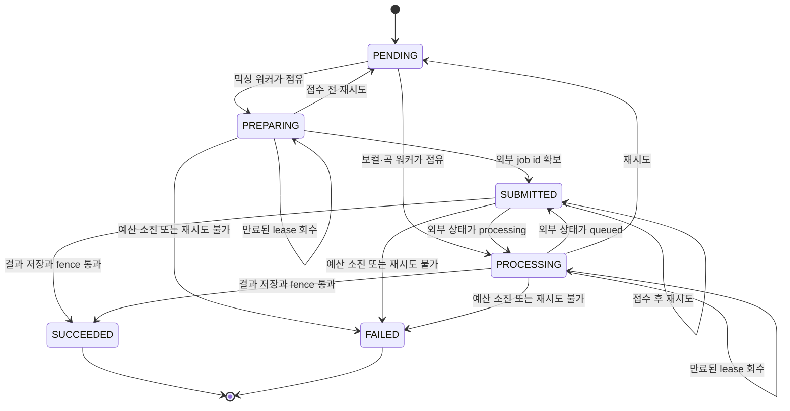

# Job 큐와 lease 복구 계약

작업 행 자체가 큐예요. `MixingJob`, `VocalProfileAnalysisJob`, `SongAnalysisJob` 행 중 후보 조건을 만족하는 하나를 워커가 `FOR UPDATE SKIP LOCKED`로 점유(claim)하고, 처리하는 동안 lease를 갱신해요. 종료 상태를 확정하기 직전에는 `fenceJob`으로 내 소유와 deadline이 아직 유효한지 다시 확인하고, 확인에 실패하면 종료 상태를 쓰지 않은 채 그 반복을 끝내요. 이 페이지는 세 워커가 공유하는 그 규칙을 조회할 때 쓰는 문서예요. 컬럼의 의미는 [데이터 모델과 수명 주기 상태](../architecture/data-model.md)가, 값을 바꾸는 환경 변수는 [환경 변수와 런타임 한도](configuration.md)가 소유해요. 각 작업의 업무 절차는 [AI 믹싱 작업 흐름](../workflows/ai-mixing.md), [보컬 프로필 분석 흐름](../workflows/vocal-profile-analysis.md), [곡 카탈로그 등록과 공개](../workflows/song-catalog-lifecycle.md)에 있어요.



세 작업 테이블이 공유하는 상태 전이와 만료된 lease 회수 경로예요. `PREPARING`과 `SUBMITTED`는 `MixingJob`에만 있는 상태라, 보컬·곡 작업은 점유와 동시에 `PROCESSING`으로 들어가요.

## 점유 쿼리 규칙

세 워커의 점유 함수는 같은 모양이에요. CTE로 후보 한 행을 고르면서 `ORDER BY "createdAt" ASC`와 `FOR UPDATE SKIP LOCKED LIMIT 1`을 걸고, 같은 문장에서 그 행을 `UPDATE ... RETURNING`으로 갱신해요. 후보 선택과 소유권 기록이 한 문장 안에서 끝나므로, 동시에 도는 다른 워커는 잠긴 행을 건너뛰고 다음 후보를 봐요([mixing/worker.ts](repo://src/_app/background-jobs/mixing/worker.ts#L97-L136), [vocal-profile-analysis/worker.ts](repo://src/_app/background-jobs/vocal-profile-analysis/worker.ts#L47-L83), [song-analysis/worker.ts](repo://src/_app/background-jobs/song-analysis/worker.ts#L33-L64)).

| 항목 | `MixingJob` | `VocalProfileAnalysisJob` | `SongAnalysisJob` |
| --- | --- | --- | --- |
| 시간 조건 | `nextAttemptAt <= now` | `nextAttemptAt <= now` | `nextAttemptAt <= now` |
| 후보 상태 | `PENDING`, 또는 `PREPARING`·`SUBMITTED`·`PROCESSING`이면서 `leaseExpiresAt`이 없거나 만료 | `PENDING`, 또는 `PROCESSING`이면서 `leaseExpiresAt`이 없거나 만료 | `PENDING`, 또는 `PROCESSING`이면서 `leaseExpiresAt`이 없거나 만료 |
| 추가 후보 조건 | 없어요 | 없어요 | `attempts >= maxAttempts`이거나 `deadlineAt`이 지났거나 `READY`인 `CatalogTargetAsset`이 있어요 |
| 점유 후 상태 | `PENDING`이면 `PREPARING`, 그 밖에는 유지 | `PROCESSING` | `PROCESSING` |
| lease 기록 | `leaseOwner`, `leaseExpiresAt = now + lease초`, `heartbeatAt = now` | 같아요 | 같아요 |
| `attempts` | 1 증가 | 1 증가 | 1 증가 |
| `deadlineAt` | `COALESCE(deadlineAt, COALESCE(startedAt, now) + 75분)` | 같은 식에 `+ 15분` | 같은 식에 `+ 75분` |
| 오류 필드 | `errorCode`·`errorDetail`·`retryable`을 `NULL`로 비워요 | 유지해요 | 유지해요 |

`deadlineAt`은 처음 점유될 때 한 번만 채워지고 이후 점유에서는 그대로 유지돼요. 그래서 재시도가 반복돼도 작업 전체의 예산 창은 늘어나지 않아요.

곡 분석만 후보 조건에 "시도 소진 또는 deadline 초과"를 넣어요. 그래서 이미 예산을 다 쓴 작업도 다시 점유돼서 외부 호출 없이 `FAILED`로 확정될 수 있어요. 믹싱과 보컬 분석은 그런 작업을 다시 점유하지 않아요.

곡 분석은 후보 조건에 `READY`인 `CatalogTargetAsset`의 존재도 요구해요. 원곡 음원이 아직 준비되지 않은 작업은 점유되지 않고 `PENDING`으로 남아 있다가, 자산이 준비되면 점유 대상이 돼요. 곡 카탈로그의 준비 조건은 [곡 카탈로그 등록과 공개](../workflows/song-catalog-lifecycle.md)가 설명해요.

점유 함수는 후보를 특정 작업 id 하나로 좁히는 선택 인자를 받아요. 운영 절차가 쓰는 값은 아니고, 변경 범위 테스트가 특정 행의 복구 경로를 직접 재현할 때 써요([tests/worker-recovery.integration.ts](repo://tests/worker-recovery.integration.ts#L112-L134)).

## lease 갱신과 deadline

점유에 성공하면 워커는 `startJobLease`로 lease 객체를 만들어요. 이 객체가 heartbeat 갱신, deadline 타이머, 그리고 모든 외부 호출에 전파되는 `AbortSignal`을 함께 관리해요([src/shared/lib/runtime/lease.ts](repo://src/shared/lib/runtime/lease.ts#L38-L97)).

| 항목 | 규칙 |
| --- | --- |
| lease 길이 | `MIXING_LEASE_SECONDS` 기본 120초, 보컬·곡은 300초 |
| 갱신 주기 | `min(30초, lease초 / 3)` — 세 작업 모두 기본값에서 30초 |
| 갱신 내용 | `heartbeatAt = clock_timestamp()`, `leaseExpiresAt = clock_timestamp() + lease초` |
| 갱신 성공 조건 | `leaseOwner` 일치, `leaseExpiresAt > clock_timestamp()`, `status`가 진행 상태 집합에 포함 — 1행이 아니면 `LeaseLostError` |
| deadline 타이머 | `deadlineAt`이 지나면 `JobDeadlineError`로 controller를 중단해요. 행에 `deadlineAt`이 없으면 `now + 75분`을 가정해요 |
| 중단 전파 | `lease.fetch(...)`로 감싼 fetch와 `lease.check()`가 중단 이유를 그대로 던져요 |

lease 객체를 만들기 전에 `startJobLease`는 `fenceJob`을 `allowDeadline = true`로 한 번 실행해요. 그래서 만료된 lease를 들고 들어온 워커는 heartbeat을 시작하기도 전에 `LeaseLostError`로 멈춰요.

갱신은 `setInterval`로 예약되지만 이전 갱신이 끝난 뒤에만 다음 갱신이 실행돼요. 갱신이 실패하면 그 시점에 controller가 `LeaseLostError`로 중단되고, 진행 중이던 외부 호출도 같이 끊겨요. `stop()`은 인터벌과 타이머를 지우고 마지막 갱신을 기다려요.

믹싱 워커에는 lease 객체와 별개로 폴링 루프가 쓰는 자체 heartbeat 함수도 있어요. 이 함수는 lease를 연장하면서 외부 상태에 맞춰 `status`를 `SUBMITTED`나 `PROCESSING`으로 함께 바꾸고, 갱신 행이 1개가 아니면 `Mixing job lease was lost.` 오류를 던져요([mixing/worker.ts](repo://src/_app/background-jobs/mixing/worker.ts#L138-L154)).

## fenceJob과 두 가지 중단 오류

`fenceJob`은 "지금 이 행을 확정해도 되는가"를 한 문장으로 다시 물어요. 트랜잭션 안에서 `SELECT id ... FOR UPDATE`를 실행하고, 다음 조건이 모두 맞아 1행이 나올 때만 통과해요([src/shared/lib/runtime/lease.ts](repo://src/shared/lib/runtime/lease.ts#L22-L36)).

- `leaseOwner`가 내 owner 문자열과 같아요.
- `leaseExpiresAt > clock_timestamp()`예요.
- `status`가 `PENDING`·`PREPARING`·`SUBMITTED`·`PROCESSING` 중 하나예요.
- `allowDeadline`이 `false`이면 `deadlineAt`이 없거나 아직 지나지 않았어요.

`SELECT ... FOR UPDATE`가 붙으므로 확정과 같은 트랜잭션에서 하는 쓰기는 다른 워커의 확정 시도와 직렬화돼요. 조건이 맞지 않아 1행이 아니면 `fenceJob`은 `LeaseLostError`(메시지 `JOB_LEASE_LOST`)를 던져요.

| 확정 지점 | `allowDeadline` | 의미 |
| --- | --- | --- |
| 접수 시도 표시 | `false` | deadline이 지난 작업은 외부 접수를 시작하지 않아요([mixing/worker.ts](repo://src/_app/background-jobs/mixing/worker.ts#L371-L377), [song-analysis/worker.ts](repo://src/_app/background-jobs/song-analysis/worker.ts#L171-L177)) |
| 성공 확정 | `false` | 결과 저장과 함께 deadline까지 살아 있어야 해요([mixing/worker.ts](repo://src/_app/background-jobs/mixing/worker.ts#L507-L535), [vocal-profile-analysis/worker.ts](repo://src/_app/background-jobs/vocal-profile-analysis/worker.ts#L101-L137), [song-analysis/worker.ts](repo://src/_app/background-jobs/song-analysis/worker.ts#L223-L313)) |
| 실패 확정 | `true` | 예산이 끝난 작업도 `FAILED`로 마감할 수 있어요([mixing/worker.ts](repo://src/_app/background-jobs/mixing/worker.ts#L251-L276), [vocal-profile-analysis/worker.ts](repo://src/_app/background-jobs/vocal-profile-analysis/worker.ts#L200-L215), [song-analysis/worker.ts](repo://src/_app/background-jobs/song-analysis/worker.ts#L78-L112)) |
| 이미 저장된 보컬 프로필 복구 | `true` | 이전 워커가 프로필을 저장한 뒤 죽었다면 deadline이 지나도 `SUCCEEDED`로 맞춰요([vocal-profile-analysis/worker.ts](repo://src/_app/background-jobs/vocal-profile-analysis/worker.ts#L94-L102)) |

`JobDeadlineError`(메시지 `JOB_DEADLINE_EXCEEDED`)는 예산 초과를 뜻해요. 발생 지점은 세 가지예요. deadline 타이머가 controller를 중단할 때, `lease.check()`를 불렀을 때 `Date.now() >= deadline`일 때, 그리고 워커가 처리를 시작하기 전에 확인하는 예산 검사예요. 예산 검사는 `attempts > maxAttempts`를 보고, 믹싱과 곡 분석은 외부 job id를 받지 못한 채 접수를 시도한 지 300초가 넘은 경우도 포함해요([mixing/worker.ts](repo://src/_app/background-jobs/mixing/worker.ts#L312-L318), [song-analysis/worker.ts](repo://src/_app/background-jobs/song-analysis/worker.ts#L141-L146), [vocal-profile-analysis/worker.ts](repo://src/_app/background-jobs/vocal-profile-analysis/worker.ts#L264-L265)).

두 오류의 처리 방향은 반대예요. `LeaseLostError`는 소유권을 잃었다는 뜻이므로 실패 확정 자체를 시도하지 않아요. 세 워커 모두 `error instanceof LeaseLostError` 또는 `lease.signal.reason instanceof LeaseLostError`이면 실패 확정을 건너뛰고 조용히 반복을 끝내요([mixing/worker.ts](repo://src/_app/background-jobs/mixing/worker.ts#L545-L560), [vocal-profile-analysis/worker.ts](repo://src/_app/background-jobs/vocal-profile-analysis/worker.ts#L324-L341), [song-analysis/worker.ts](repo://src/_app/background-jobs/song-analysis/worker.ts#L314-L324)). 내 lease가 만료된 사이 다른 워커가 그 행을 가져갔을 수 있으므로, 남의 작업에 `FAILED`를 덮어쓰지 않으려는 규칙이에요. 반대로 `JobDeadlineError`는 내 lease가 아직 유효한 채 예산만 끝난 상태이므로 `FAILED` 확정으로 이어가요.

재시도로 풀어줄 때는 fenceJob 대신 같은 조건을 `WHERE` 절에 넣은 조건부 `UPDATE`를 써요. `leaseOwner`와 `leaseExpiresAt > clock_timestamp()` 조건이 붙어 있어서, 그 사이 lease를 잃은 워커의 갱신은 0행이 되고 상태가 바뀌지 않아요([mixing/worker.ts](repo://src/_app/background-jobs/mixing/worker.ts#L216-L247), [vocal-profile-analysis/worker.ts](repo://src/_app/background-jobs/vocal-profile-analysis/worker.ts#L184-L196)).

## 재시도 정책

재시도는 워커가 실패를 분류한 뒤 `attempts < maxAttempts`일 때만 열려요. 백오프는 `nextAttemptAt`에 미래 시각을 써서 표현하고, 그 시각이 지나야 점유 후보가 다시 돼요.

| 작업 | 기본 `maxAttempts` | backoff | 재시도 조건 | 복귀 상태 |
| --- | --- | --- | --- | --- |
| 믹싱 | `MIXING_MAX_ATTEMPTS` 기본 3 | `min(30초, 2^(attempts-1))` — 1·2·4초, 상한 30초 | `JobDeadlineError`가 아니고, 오류가 retryable이거나 접수 흔적만 있고 외부 job id가 없으며, `attempts < maxAttempts` | 접수 전이면 `PENDING`, 접수 후면 `SUBMITTED` |
| 보컬 프로필 분석 | `VOCAL_PROFILE_ANALYSIS_MAX_ATTEMPTS` 기본 3 | `min(30초, 2^(attempts-1))` — 1·2·4초, 상한 30초 | `JobDeadlineError`가 아니고 오류가 retryable이고 `attempts < maxAttempts` | `PENDING` |
| 곡 분석 | 스키마 기본 3(전용 환경 변수 없음) | `min(60초, 5 * 2^(attempts-1))` — 5·10·20초, 상한 60초 | `JobDeadlineError`가 아니고 오류가 retryable이고 `attempts < maxAttempts` | `PENDING`(접수 후에도) |

`JobDeadlineError`는 어느 작업에서도 재시도되지 않아요. 다만 실패를 어떻게 분류해 `errorCode`·`retryable`로 남기는지는 작업마다 달라요. 저장된 실패를 읽을 때는 아래 표를 쓰세요.

| 작업 | `JobDeadlineError`일 때 `errorCode` | 그때 `retryable` | 다른 오류일 때 `errorCode`·`retryable` |
| --- | --- | --- | --- |
| 믹싱 | `JOB_DEADLINE_EXCEEDED` | `false` | `MixingStageError`면 그 오류의 `code`·`retryable`이고, 그 밖에는 접수 흔적이 있으면 `MODAL_JOB_FAILED`, 없으면 `MIXING_PREFLIGHT_FAILED`에 `false`예요 |
| 보컬 프로필 분석 | `JOB_DEADLINE_EXCEEDED` | `false` | `AnalyzerClientError`·`VocalProfilePersistenceError`면 그 오류의 `reasonCode`·`retryable`이고, `"ANALYZER_SOURCE_MISMATCH"` 메시지면 `ANALYZER_SOURCE_MISMATCH`에 `false`, 그 밖에는 `ANALYSIS_WORKER_FAILED`에 `true`예요 |
| 곡 분석 | `SONG_ANALYSIS_WORKER_FAILED` | `true` | `SongAnalyzerError`면 그 오류의 `reasonCode`·`retryable`이고, 그 밖에도 `SONG_ANALYSIS_WORKER_FAILED`에 `true`예요 |

곡 분석은 `JobDeadlineError`를 `SongAnalyzerError`로 분류하지 않아서, 예산 초과가 `retryable: true`로 기록되는 유일한 경우예요. 세 워커 모두 재시도 여부는 그 자리에서 던져진 오류와 `attempts`로 정하고 행의 `retryable`을 다시 읽지 않으니, 저장된 `retryable`만 보고 재시도 가능 여부를 판단하지 마세요([mixing/worker.ts](repo://src/_app/background-jobs/mixing/worker.ts#L174-L185), [vocal-profile-analysis/worker.ts](repo://src/_app/background-jobs/vocal-profile-analysis/worker.ts#L27-L45), [song-analysis/worker.ts](repo://src/_app/background-jobs/song-analysis/worker.ts#L66-L77)).

믹싱에서 "접수 흔적을 확인하지 못한" 경우는 외부 제출을 시도했다는 표시는 있는데 외부 job id가 없는 상태예요. 이때는 오류 자체가 retryable이 아니어도 재시도 대상이 돼요. 접수 전이면 `PENDING`, 접수 후면 `SUBMITTED`로 되돌리고 lease를 비워요. 접수를 시도했는데 job id도 없고 재시도도 못 하면 `errorCode`는 `MODAL_SUBMISSION_UNCONFIRMED`로 남아요([mixing/worker.ts](repo://src/_app/background-jobs/mixing/worker.ts#L209-L276)). 접수 확실성 규칙의 배경은 [AI 믹싱 작업 흐름](../workflows/ai-mixing.md)이 설명해요.

곡 분석에서 `FAILED`로 끝난 작업을 운영자가 다시 열 때는 관리자 재시도가 시도 횟수와 접수 흔적을 함께 초기화해요. `status`를 `PENDING`, `attempts`를 `0`으로 되돌리고 `externalRequestId`를 새로 발급하며 `submissionState`를 `NOT_SUBMITTED`, `deadlineAt`·`submissionStartedAt`·`externalJobId`를 `NULL`로 지워요. 이 트랜잭션도 `SONG` 큐의 advisory lock과 용량 검사를 먼저 통과해야 해요([admin-service.ts](repo://src/features/manage-song-catalog/api/admin-service.ts#L197-L227)).

## 종료 상태 확정과 알림

`SUCCEEDED`나 `FAILED`를 쓰는 트랜잭션에는 같은 문장 안에서 알림 생성도 들어가요. 믹싱은 성공·실패 확정에서, 보컬 프로필 분석도 성공·실패 확정에서 알림을 함께 만들고, 곡 분석 확정에는 사용자 알림이 붙지 않아요. 그래서 상태만 바뀌고 알림이 빠지거나 알림만 남고 상태가 그대로인 커밋이 생길 수 없어요([mixing/worker.ts](repo://src/_app/background-jobs/mixing/worker.ts#L277-L288), [mixing/worker.ts](repo://src/_app/background-jobs/mixing/worker.ts#L507-L535), [vocal-profile-analysis/worker.ts](repo://src/_app/background-jobs/vocal-profile-analysis/worker.ts#L122-L133), [vocal-profile-analysis/worker.ts](repo://src/_app/background-jobs/vocal-profile-analysis/worker.ts#L217-L228), [song-analysis/worker.ts](repo://src/_app/background-jobs/song-analysis/worker.ts#L224-L313)).

각 확정이 만드는 알림의 `type`과 `dedupeKey`, 문구, 그리고 `createNotification`이 같은 키의 재실행을 처리하는 방식은 [알림과 중복 방지](../concepts/notifications.md)가 소유해요. 이 페이지는 알림 생성이 종료 확정 트랜잭션 안에 있다는 결합만 다뤄요.

보컬 분석은 실패 확정 트랜잭션에서 `sourceAssetId`를 비우고 그 자산의 삭제를 예약해요. 믹싱은 결과 자산을 저장한 뒤 확정 트랜잭션이 실패하면 그 자산을 폐기하고 오류를 다시 던져요([mixing/worker.ts](repo://src/_app/background-jobs/mixing/worker.ts#L499-L539), [vocal-profile-analysis/worker.ts](repo://src/_app/background-jobs/vocal-profile-analysis/worker.ts#L200-L216)).

티켓을 쓴 작업이 실패 확정되면 `refundState`가 `REQUIRED`가 되고, `REFUNDED`로 바꾸는 환불은 확정 트랜잭션 밖에서 고정된 idempotency key로 실행돼요. 믹싱은 `mixing:refund:{jobId}`, 보컬 분석은 `vocal-analysis-refund:{jobId}`예요. 그래서 확정과 환불 사이에서 프로세스가 죽어도 `refundState: "REQUIRED"` 행이 남아 다음 반복에서 다시 처리돼요([mixing/worker.ts](repo://src/_app/background-jobs/mixing/worker.ts#L156-L172), [mixing/worker.ts](repo://src/_app/background-jobs/mixing/worker.ts#L563-L571), [vocal-profile-analysis/worker.ts](repo://src/_app/background-jobs/vocal-profile-analysis/worker.ts#L139-L168)). 한 가지 차이가 있어요. 믹싱은 접수 흔적이 있을 때 `refundState`를 `NONE`으로 두어 환불을 보류하지만, 보컬 분석은 접수 개념이 없어 `ticketCost > 0`이면 환불 대상으로 표시해요. 원장 규칙 자체는 [티켓 원장과 멱등성](../concepts/ticket-ledger.md)이 소유해요.

## 종료 이후 외부 작업 정리

외부 서비스에 제출한 작업은 그 서비스에도 정리해야 해요. 그래서 접수를 관찰한 시점과 종료로 마감한 시점에 `ExternalJobReconciliation` 행을 upsert하고, 믹싱 워커가 매 반복마다 `reconcileExternalJobs`를 실행해요([mixing/reconciliation.ts](repo://src/_app/background-jobs/mixing/reconciliation.ts#L5-L64)).

| 단계 | 동작 |
| --- | --- |
| 대상 선정 | `status = 'PENDING'`이면서 참조한 작업이 더 이상 진행 중이 아닌 행을 `createdAt` 오름차순 최대 20건 |
| 순서 보장 | 상태 필터를 `LIMIT` 앞에 적용해, 오래 걸리는 작업이 종료된 행의 정리를 굶기지 않아요 |
| 재확인 | 조회한 작업 상태가 `FAILED`·`SUCCEEDED`·`CANCELED`가 아니면 건너뛰어요 |
| 취소 호출 | `DELETE {URL}/v1/conversions/{externalJobId}` 또는 `/v1/jobs/{externalJobId}`에 `X-API-Key`를 붙이고 15초 타임아웃을 걸어요 |
| 성공 | `404`·`410`도 정리 성공으로 보고 `status = 'CLEANED'` |
| 실패 | `status = 'UNRESOLVED'`, `resolution = 'AUTO_CLEANUP_FAILED_REQUIRES_OPERATOR'` |
| 외부 job id 없음 | 취소를 시도하지 않고 바로 `UNRESOLVED` |

정리 대상 선정 쿼리는 테이블 두 개만 검사해요. `MixingJob`과 `SongAnalysisJob`이 참조 대상이고, 보컬 프로필 분석은 외부 서비스에 job을 남기지 않으니 이 테이블에 행을 만들지 않아요.

`UNRESOLVED` 행은 운영자가 확인해야 하는 대상이에요. 해소 명령과 요구 인자는 [복구 스크립트 운영 절차](recovery-runbook.md)에 있어요.

## 워커 프로세스 supervisor

세 러너는 같은 supervisor 구조를 써요. `SIGINT`와 `SIGTERM`을 받으면 `stopping` 플래그만 세우고, 진행 중인 반복이 끝난 뒤 루프를 빠져나가요. 마지막에는 시그널 리스너를 제거하고 `prisma.$disconnect()`를 실행해요([mixing/runner.ts](repo://src/_app/background-jobs/mixing/runner.ts#L11-L49), [vocal-profile-analysis/runner.ts](repo://src/_app/background-jobs/vocal-profile-analysis/runner.ts#L11-L50), [song-analysis/runner.ts](repo://src/_app/background-jobs/song-analysis/runner.ts#L11-L45)).

| 항목 | 규칙 |
| --- | --- |
| 레인 수 | `MIXING_WORKER_CONCURRENCY`, `VOCAL_PROFILE_ANALYSIS_WORKER_CONCURRENCY`, `SONG_ANALYSIS_WORKER_CONCURRENCY` 모두 기본값 1 |
| 레인 식별자 | 보컬·곡 레인은 `{pid}:{작업군}:{레인 번호}:{UUID}`이고, 믹싱 레인은 작업군 없이 `{pid}:{레인 번호}:{UUID}`예요. 어느 쪽이든 같은 프로세스의 레인끼리 owner 문자열이 겹치지 않아요 |
| 빈 큐 | 점유 결과가 없으면 1초 대기 |
| 반복 예외 | `min(30초, 1000 * 2^(min(errors-1, 5)))` 지수 backoff로 대기하고 `worker_iteration_failed` 이벤트를 로그에 남겨요 |
| 성공 시 | `errors`를 0으로 되돌려 backoff를 초기화해요 |

레인마다 owner 문자열이 달라서, 같은 프로세스의 두 레인이 같은 작업을 동시에 점유할 수 없어요.

믹싱 러너의 한 반복은 작업 점유 전에 환불 재처리, 외부 작업 정리, 미디어 정리 하나를 순서대로 실행해요([mixing/worker.ts](repo://src/_app/background-jobs/mixing/worker.ts#L573-L581)). 보컬 러너는 반복마다 `reconcileRequiredVocalProfileAnalysisRefunds(10)`을 먼저 실행해요. 그래서 정리 작업은 큐가 비어 있어도 계속 진행돼요.

## 큐 용량과 접수 직렬화

큐 한도는 워커가 아니라 작업을 접수하는 트랜잭션 안에서 검사해요. 접수 함수는 먼저 `pg_advisory_xact_lock`으로 큐 종류별 transaction lock을 잡고, 그다음 행 수를 세요. 이 순서라서 동시에 들어온 접수가 같은 시점의 개수를 보고 중복 생성하는 일이 없어요([src/shared/lib/admission/queue.ts](repo://src/shared/lib/admission/queue.ts#L7-L23)).

```sql
SELECT pg_advisory_xact_lock(hashtextextended('copy-singer:admission:MIXING', 0));
```

| 큐 | 전역 한도 | 사용자별 한도 | 진행 중으로 세는 상태 |
| --- | --- | --- | --- |
| `VOCAL` | `VOCAL_QUEUE_CAPACITY` 기본 20 | `VOCAL_USER_QUEUE_CAPACITY` 기본 1 | `PENDING`, `PROCESSING` |
| `MIXING` | `MIXING_QUEUE_CAPACITY` 기본 20 | `MIXING_USER_QUEUE_CAPACITY` 기본 3 | `PENDING`, `PREPARING`, `SUBMITTED`, `PROCESSING` |
| `SONG` | `SONG_QUEUE_CAPACITY` 기본 50 | `SONG_USER_QUEUE_CAPACITY` 기본 3 | `PENDING`, `PROCESSING` |

사용자 한도를 먼저 보고, 그다음 전역 한도를 봐요. 사용자 한도 초과는 `USER_QUEUE_CAPACITY` 429(기본 `Retry-After: 10`), 전역 한도 초과는 `QUEUE_CAPACITY` 503(`Retry-After: 30`)이에요. 두 경우 모두 `AdmissionError`를 던지고, handler가 `admissionResponse`로 바꾸면 `error` 객체와 최상위 `reasonCode`·`retryable`이 함께 담기고 `Cache-Control: no-store`가 붙어요([src/shared/lib/admission/limiter.ts](repo://src/shared/lib/admission/limiter.ts#L70-L79)). 값의 허용 범위는 [환경 변수와 런타임 한도](configuration.md)에 있어요.

`SONG` 접수만 소유자 수를 항상 `FALSE`로 세요. 그래서 `SONG_USER_QUEUE_CAPACITY` 값과 무관하게 사용자별 한도가 걸리지 않고 전역 한도만 적용돼요.

advisory lock은 큐 종류별로 다르므로 `VOCAL` 접수와 `MIXING` 접수는 서로 기다리지 않아요. 큐 종류가 같으면 접수와 관리자 재시도가 같은 lock을 공유해요([admin-service.ts](repo://src/features/manage-song-catalog/api/admin-service.ts#L199-L204)). 믹싱과 보컬 분석 접수는 `Serializable` 격리 수준으로 실행하고, 스냅샷·쓰기 충돌이면 최대 3회까지 다시 시도해요([mixing-queue.ts](repo://src/features/create-mixing/api/mixing-queue.ts#L40-L44), [mixing-queue.ts](repo://src/features/create-mixing/api/mixing-queue.ts#L147-L150), [analysis-queue.ts](repo://src/features/analyze-vocal-profile/api/analysis-queue.ts#L133-L137), [analysis-queue.ts](repo://src/features/analyze-vocal-profile/api/analysis-queue.ts#L173-L174), [analysis-queue.ts](repo://src/features/analyze-vocal-profile/api/analysis-queue.ts#L177-L179)).

## 이 계약을 확인하는 테스트

점유·복구 규칙을 바꾸면 아래 테스트가 먼저 깨져요. 모두 `pnpm run test:readiness`가 `--test-concurrency=1`로 함께 실행해요([package.json](repo://package.json#L70)).

| 확인 대상 | 파일과 관찰 내용 |
| --- | --- |
| 만료된 lease 회수와 확정 | [tests/worker-recovery.integration.ts](repo://tests/worker-recovery.integration.ts#L112-L134) — 세 테이블에서 만료된 lease를 재점유하고, 이전 owner의 `fenceJob`은 `LEASE_LOST`로 거부하며, 예산이 끝난 작업은 `FAILED`로 수렴해 다시 점유되지 않아요 |
| 외부 정리 순서 | [tests/worker-recovery.integration.ts](repo://tests/worker-recovery.integration.ts#L136-L172) — 진행 중인 작업 20건보다 고아 `PENDING` 행이 먼저 `UNRESOLVED`로 처리돼요 |
| 저장된 프로필 복구와 heartbeat | [tests/worker-recovery.integration.ts](repo://tests/worker-recovery.integration.ts#L184-L230) — deadline이 지난 작업이 `SUCCEEDED`로 복구되고, owner가 바뀌면 `lease.signal`이 중단돼요 |
| 접수 직렬화 | [tests/admission.integration.ts](repo://tests/admission.integration.ts#L7-L39) — `VOCAL_QUEUE_CAPACITY=2`에서 동시 접수 8건 중 정확히 2건만 생성되고, 실패는 모두 `AdmissionError`이며 티켓 원장은 0건이에요 |
| deadline 전파와 설정 검증 | [tests/runtime-timeouts.test.ts](repo://tests/runtime-timeouts.test.ts#L7-L42) — `withDeadline`과 `boundedFetch`가 응답 본문까지 중단하고, 범위 밖 정수 설정은 예외가 돼요 |

이 표는 어떤 계약이 어디에서 검증되는지 알려줘요. 바꾼 범위에 어떤 검사를 어떤 순서로 돌릴지 고르는 안내와 부하 상황의 backpressure 확인 방법은 [변경 검증 경로](../testing/verification.md)에 있어요.

## 다음에 볼 문서

- 작업 행의 컬럼 의미와 상태 enum 전체는 [데이터 모델과 수명 주기 상태](../architecture/data-model.md)를 보세요.
- `UNRESOLVED` 정리 대상과 실패 작업의 운영자 해소 명령은 [복구 스크립트 운영 절차](recovery-runbook.md)에 있어요.
- 큐 한도와 lease·시도 횟수 값을 바꾸는 환경 변수는 [환경 변수와 런타임 한도](configuration.md)에 모여 있어요.
- 확정 트랜잭션이 만드는 알림의 종류·`dedupeKey`·읽기 경로는 [알림과 중복 방지](../concepts/notifications.md)를 보세요.
- 변경 범위에 맞는 검증 명령 선택은 [변경 검증 경로](../testing/verification.md)를 보세요.
