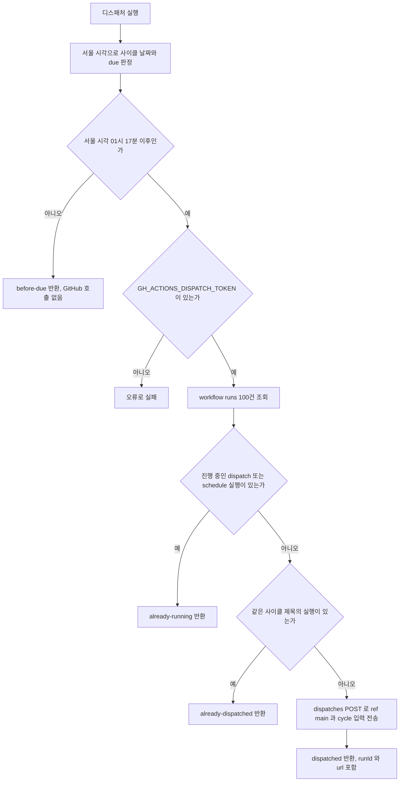

`openwiki/**` 문서를 고쳐야 할 때가 있어도 생성 페이지 자체는 손으로 고치지 않아요. 근거가 되는 source나 curated docs를 고친 뒤 동기화 명령을 다시 돌리는 것이 이 저장소의 규칙이에요([README.md](repo://README.md#L277-L284), [docs/README.md](repo://docs/README.md#L23-L37)). 아래에서 그 경계, 생성 입력에서 빠지는 경로, 실행 시점을 정하는 디스패처의 판정 규칙, 그리고 워크플로가 완료 결과만 준비된 리뷰 PR로 올리는 조건을 차례로 확인하세요.

## 정본은 docs, 파생은 openwiki

`openwiki/`는 tracked 코드·스키마·설정·테스트에서 파생한 온보딩 evidence이고 정본이 아니에요. 어떤 질문에 어떤 문서를 기준으로 삼을지는 저장소가 정해 두었어요([docs/README.md](repo://docs/README.md#L27-L33), [README.md](repo://README.md#L265-L273)).

| 알아야 할 정보 | 기준 | `openwiki/`의 역할 |
| --- | --- | --- |
| 장기 제품 요구사항 | `docs/prd/` | 요구사항 위치와 관련 코드 탐색 보조 |
| 현재 변경 범위·설계·태스크·결정 | 활성 Feature SDD의 `spec.md`, `plan.md`, `tasks.md`, `decisions.md` | Feature 이력과 구현 위치 탐색 보조 |
| 프로젝트 전체 설명과 정책 | 사람이 관리하는 curated docs | 관련 설명을 연결하되 대체하지 않음 |
| 실행 가능한 런타임 사실 | tracked 코드·스키마·설정 | 구조와 흐름 요약, 원본 검증 경로 제공 |

`docs/features/`는 생성 입력에서 제외되어 있어서 이 페이지도 Feature 문서의 내용 자체는 확인하지 못했어요. 그래서 결정의 이유를 찾을 때는 `git log`·`git blame`으로 `F###`를 찾아 해당 Feature의 `decisions.md`로 이동하고, OpenWiki에는 현재 구조 설명만 둬요([README.md](repo://README.md#L286-L293)).

로컬에서 문서를 갱신하고 결과를 확인하는 방법은 두 명령뿐이에요. `<feature-ref>`와 `--component` 값은 실행하는 사람이 채워야 하는 입력이에요([README.md](repo://README.md#L277-L283)).

```bash
npx lee-spec-kit knowledge sync <feature-ref> --component <component> --json

# 생성 결과를 브라우저에서 읽기 전용으로 확인
openwiki visualize ./openwiki
```

설명이 잘못됐으면 source 또는 curated docs를 고친 뒤 다시 동기화하고, 생성된 `openwiki/**` 페이지는 직접 수정하지 않아요([README.md](repo://README.md#L284)). 활성 Feature workflow에서는 태스크 checkpoint 이후 Feature review 전에 이 동기화와 전용 커밋이 필수로 요구돼요([docs/README.md](repo://docs/README.md#L35)).

CI에서 도는 생성은 이 로컬 명령과 다른 경로예요. 워크플로가 Node.js 22 환경에서 `openwiki@0.5.2`와 `lee-spec-kit@0.9.19`를 전역 설치하고, 설치된 기술 문서 작성 skill을 OpenWiki config 디렉터리로 복사한 뒤 자체 생성 명령을 돌려요([.github/workflows/lee-spec-kit-knowledge.yml](repo://.github/workflows/lee-spec-kit-knowledge.yml#L35-L71)). 이전 체크포인트 브랜치가 있으면 그 `openwiki/` 디렉터리를 그대로 되살려 `--update` 입력으로 쓰고, 복원 도중 덮어써질 수 있는 `openwiki/INSTRUCTIONS.md`만 복원 뒤 다시 채워 넣어요([.github/workflows/lee-spec-kit-knowledge.yml](repo://.github/workflows/lee-spec-kit-knowledge.yml#L44-L55)).

## 생성 입력에서 빠지는 경로

생성 범위는 [.openwikiignore](repo://.openwikiignore#L1-L25)가 정해요. 아래 표는 그 파일이 제외하는 항목을 묶은 것이고, 값을 옮겨 적지 않기 위해 패턴만 정리했어요.

| 제외 항목 | 무엇을 막는가 |
| --- | --- |
| `.lee-spec-kit/openwiki-run.json` | 실행 중 상태 파일이 생성 입력에 섞이는 것 |
| `.env`, `.env.*` | 환경 변수 값 |
| `**/*.pem`, `**/*.key`, `**/*.p12`, `**/*.pfx`, `**/id_rsa`, `**/id_ed25519` | 키·인증서 파일 |
| `**/.aws/`, `**/.ssh/`, `**/credentials/`, `**/.credentials/`, `**/credentials*.json`, `**/secrets/`, `**/.secrets/`, `**/service-account*.json` | 자격 증명 디렉터리와 파일 |
| `docs/features/` | Feature SDD 문서 전체 |
| `/AGENTS.md`, `/CLAUDE.md` | Knowledge source로 쓰지 않는 에이전트 지침 파일 |

두 블록으로 나뉘어 있어요. `docs/features/`까지가 첫 번째 블록(`openwiki-ignore`)이고, `/AGENTS.md`와 `/CLAUDE.md`는 두 번째 블록(`knowledge-source-ignore`)에 들어 있어요. 그래서 이 페이지는 `docs/features/` 내용을 근거로 삼지 않고, `AGENTS.md`·`CLAUDE.md`는 워크플로의 출력 표면 검사에서만 관리 블록 단위로 다뤄요.

생성에 쓰인 설정은 tracked 파일인 [.lee-spec-kit/openwiki-sync.json](repo://.lee-spec-kit/openwiki-sync.json#L1-L21)에 남아 있어요.

| 필드 | 값 또는 역할 |
| --- | --- |
| `schemaVersion` | `3` |
| `triggerFeatureRef`, `triggerComponent` | 이 동기화를 유발한 Feature 참조와 컴포넌트 |
| `language` | `ko` |
| `sourceHead`, `baseHead`, `baseRef` | 기준 revision과 `refs/heads/main` |
| `sourceFingerprint`, `outputHash` | 입력 지문과 출력 해시 |
| `openwikiVersion`, `okfVersion` | `0.5.2`, `0.2` |
| `verifiedAt` | 검증 시각 |
| `writingPolicy` | 적용된 기술 문서 작성 adapter와 skill 식별자·해시 |

## 디스패처가 실행 시점과 중복을 판정해요

워크플로는 스스로 돌지 않아요. Coolify가 스케줄하는 작은 Node 컨테이너가 GitHub Actions API로 실행을 요청하고, 그 코드가 [dispatch.mjs](repo://ops/knowledge-dispatcher/dispatch.mjs#L1-L97)예요. 컨테이너 이미지는 `node:22-alpine`에 이 파일 하나를 복사하고 8080 포트를 노출해요([Dockerfile](repo://ops/knowledge-dispatcher/Dockerfile#L1-L6)). 스케줄링 주체가 Coolify라는 책임 구분은 워크플로 헤더에도 적혀 있고([.github/workflows/lee-spec-kit-knowledge.yml](repo://.github/workflows/lee-spec-kit-knowledge.yml#L1-L3)), 디렉터리 책임 구분은 [시스템 지도와 경계](../architecture/system-map.md)가 소유하니 여기서는 판정 규칙만 다뤄요.

사이클 날짜와 실행 시점은 서울 시간대(`Asia/Seoul`)로 계산해요. 사이클은 `YYYY-MM-DD` 형식이고, 그 날 01시 17분 이후부터 그 사이클이 due로 바뀌어요([dispatch.mjs](repo://ops/knowledge-dispatcher/dispatch.mjs#L10-L28)).



서울 시간 기준 사이클 판정과 디스패치 분기를 정리한 흐름이에요.

분기마다 돌려주는 값이 달라서, 호출자는 GitHub을 실제로 호출했는지 구분할 수 있어요.

| 결과 | 조건 | 돌려주는 값 |
| --- | --- | --- |
| `before-due` | 서울 시각이 그 사이클의 01시 17분 이전 | `cycle`만 있고 GitHub 호출은 없어요 |
| `already-running` | 최근 100개 실행 중 `workflow_dispatch` 또는 `schedule` 이벤트의 `status`가 `completed`가 아닌 실행이 있어요 | `cycle` |
| `already-dispatched` | 실행 제목이 `OpenWiki Knowledge <cycle>`인 실행이 있어요 | `cycle` |
| `dispatched` | 위 조건에 모두 걸리지 않아 `POST .../dispatches`까지 진행했어요 | `cycle`, `runId`, `url` |

`already-dispatched`가 보는 실행 제목은 워크플로의 `run-name` 규칙과 맞물려요. 워크플로는 실행 이름을 `OpenWiki Knowledge` 뒤에 `cycle` 입력이나 이벤트 이름을 붙여 만들고([.github/workflows/lee-spec-kit-knowledge.yml](repo://.github/workflows/lee-spec-kit-knowledge.yml#L4-L15)), 디스패처는 같은 형식의 제목을 찾아 같은 사이클을 두 번 요청하지 않아요([dispatch.mjs](repo://ops/knowledge-dispatcher/dispatch.mjs#L66-L68)).

실패는 조용히 넘어가지 않아요. 토큰 환경 변수 `GH_ACTIONS_DISPATCH_TOKEN`이 없으면 그 자리에서 오류를 던지고, GitHub 응답이 실패하면 메서드와 요청 경로, HTTP 상태, 응답 본문의 `message` 일부를 담은 오류를 던져요. 요청 자체에는 15초 타임아웃이 걸려 있어요([dispatch.mjs](repo://ops/knowledge-dispatcher/dispatch.mjs#L33-L56)). 실행 목록 응답이 배열이 아니거나([dispatch.mjs](repo://ops/knowledge-dispatcher/dispatch.mjs#L57-L58)), 디스패치 응답에 `workflow_run_id`나 `html_url`이 없으면([dispatch.mjs](repo://ops/knowledge-dispatcher/dispatch.mjs#L74-L77)) 그 자리에서 오류를 던져 0이 아닌 종료 코드로 드러나요. 토큰 값은 이 문서를 포함해 어디에도 옮겨 적지 않아요.

컨테이너는 인자 없이 시작하면 디스패치를 시도하지 않고 0.0.0.0의 8080 포트에서 `ok`를 돌려주는 응답 서버만 띄워요. `--dispatch` 인자를 주면 그때 디스패치를 실행하고, 실패하면 `Knowledge dispatch failed: ...` 메시지를 표준 오류로 내보내며 종료 코드를 1로 세워요([dispatch.mjs](repo://ops/knowledge-dispatcher/dispatch.mjs#L80-L97)). 그래서 상태 확인과 실제 실행이 같은 이미지에서 분리돼요.

이 동작은 [tests/knowledge-dispatcher.test.mjs](repo://tests/knowledge-dispatcher.test.mjs#L8-L78)가 고정해요. 01시 17분 경계, `ref: "main"`과 `inputs.cycle`을 담은 요청 한 번, 같은 사이클·진행 중 실행일 때의 중복 차단, HTTP 503일 때의 가시적 실패를 각각 확인해요. 이 파일을 실행하는 script는 `package.json`의 script 목록에 없어서, 이번 생성 입력에서는 어떤 명령으로 묶여 도는지 확인하지 못했어요.

## 워크플로가 체크포인트를 만들고 PR을 준비 상태로 바꿔요

워크플로 [.github/workflows/lee-spec-kit-knowledge.yml](repo://.github/workflows/lee-spec-kit-knowledge.yml#L1-L27)은 트리거에 따라 하는 일이 달라요.

| 트리거 | 입력 | 실행되는 작업 |
| --- | --- | --- |
| `workflow_dispatch` | `cycle`은 선택 입력이에요. 값이 없으면 실행 이름에 이벤트 이름이 들어가요 | `knowledge` 작업만 실행해요 |
| `pull_request` (`main` 대상) | 없음 | `verify-knowledge-pr` 작업이 Knowledge 브랜치 PR인지 판정해요 |

동시성 그룹은 `openwiki-knowledge-main`이고 `cancel-in-progress`가 꺼져 있어서, 진행 중인 Knowledge 실행을 새 실행이 끊지 않아요([.github/workflows/lee-spec-kit-knowledge.yml](repo://.github/workflows/lee-spec-kit-knowledge.yml#L19-L27)).

`knowledge` 작업은 `KNOWLEDGE_BRANCH`를 `lee-spec-kit/knowledge-main`으로 두고, 그 브랜치가 원격에 있으면 먼저 복원한 뒤 생성을 시작해요. 생성 자체는 `--update` 모드로 이전 결과를 입력 삼아 이어가고, 완료된 페이지는 별도 커밋 `docs: refresh OpenWiki Knowledge`로 그 브랜치에 보존돼요([.github/workflows/lee-spec-kit-knowledge.yml](repo://.github/workflows/lee-spec-kit-knowledge.yml#L26-L55), [.github/workflows/lee-spec-kit-knowledge.yml](repo://.github/workflows/lee-spec-kit-knowledge.yml#L317-L333)).

| 단계 | 확인하는 것 | 어긋날 때 |
| --- | --- | --- |
| 생성 | `openwiki code --update --print --language ko`를 openai-compatible provider와 `deepseek/deepseek-v4.1-flash` 모델로 실행해요 | 이 단계는 `continue-on-error`라 실패가 바로 작업을 끝내지 않고 다음 게이트에서 드러나요 |
| 완료 메타데이터 | `openwiki/.last-update.json`의 `status`가 `complete`이고 `gitHead`가 그 실행의 source revision과 같은지, `openwiki/.run.json`이 없는지를 봐요 | `complete=false` 경고를 남기고 결과를 초안으로 둬요 |
| 실행 컨텍스트 제거 | 게시 전에 `openwiki/.run.json`이 남아 있는지 | 그 파일을 삭제해 초안에 실행 중 컨텍스트가 남지 않게 해요([.github/workflows/lee-spec-kit-knowledge.yml](repo://.github/workflows/lee-spec-kit-knowledge.yml#L89-L92)) |
| 출력 표면 | 허용 경로 밖 변경 여부 | 허용 목록 밖 파일을 나열하고 작업을 실패시켜요([.github/workflows/lee-spec-kit-knowledge.yml](repo://.github/workflows/lee-spec-kit-knowledge.yml#L93-L124)) |
| source 전진 | 실행 중 `main`이 앞으로 갔는지 | `current=false` 경고를 남기고 초안으로 유지해요([.github/workflows/lee-spec-kit-knowledge.yml](repo://.github/workflows/lee-spec-kit-knowledge.yml#L125-L135)) |

허용 목록은 `openwiki` 자체와 `openwiki/**`, 그리고 `AGENTS.md`·`CLAUDE.md`의 관리 블록이에요. 두 에이전트 파일은 `OPENWIKI:START`와 `OPENWIKI:END` 사이를 걷어낸 뒤 비교하므로, 관리 블록 밖 문장을 OpenWiki가 바꾸면 그때는 위반으로 잡혀요([.github/workflows/lee-spec-kit-knowledge.yml](repo://.github/workflows/lee-spec-kit-knowledge.yml#L93-L124)).

완료 판정에 쓰이는 두 파일의 역할은 이래요.

| 파일 | 읽는 시점 | 워크플로가 하는 일 |
| --- | --- | --- |
| `openwiki/.last-update.json` | 완료 메타데이터 검사와 PR 안전 검사 | `status`가 `complete`이고 `gitHead`가 그 실행의 source revision과 같아야 완료로 인정해요. PR 쪽에서는 `gitHead`를 PR base revision과 비교해요 |
| `openwiki/.run.json` | 같은 두 검사 | 파일이 있으면 완료로 보지 않아요. 게시 전에 삭제해 초안 체크포인트에 실행 중 컨텍스트가 남지 않게 해요 |

그 밖에 준비된 PR이 되려면 게시 직전 `main`이 아직 같은 revision이어야 해요. 이 세 조건이 모두 맞을 때만 워크플로가 healthy로 판단해요([.github/workflows/lee-spec-kit-knowledge.yml](repo://.github/workflows/lee-spec-kit-knowledge.yml#L202-L203), [.github/workflows/lee-spec-kit-knowledge.yml](repo://.github/workflows/lee-spec-kit-knowledge.yml#L337-L345)).

| 조건 | PR 제목 | PR 상태 | 이후 동작 |
| --- | --- | --- | --- |
| 생성 성공 + 완료 메타데이터 통과 + 게시 시점에도 `main`이 같은 revision | `docs: refresh OpenWiki Knowledge` | 준비된 리뷰 PR로 전환 | `gh pr merge --auto --squash --match-head-commit`로 auto-merge를 걸어요([.github/workflows/lee-spec-kit-knowledge.yml](repo://.github/workflows/lee-spec-kit-knowledge.yml#L397-L403)) |
| 그 밖의 경우(미완료이거나 실행 중 source가 전진함) | `docs: checkpoint incomplete OpenWiki Knowledge` | 초안으로 유지 | auto-merge를 걸지 않고, 마지막 단계가 종료 코드 1로 실패를 알려줘요([.github/workflows/lee-spec-kit-knowledge.yml](repo://.github/workflows/lee-spec-kit-knowledge.yml#L342-L345), [.github/workflows/lee-spec-kit-knowledge.yml](repo://.github/workflows/lee-spec-kit-knowledge.yml#L404-L408)) |
| 게시 도중 GitHub API 호출이 실패 | 이전 제목 유지 | 이전 상태로 복원 | 브랜치를 이전 커밋으로 되돌리고, 원래 준비 상태였던 PR은 다시 준비 상태로 만들어요([.github/workflows/lee-spec-kit-knowledge.yml](repo://.github/workflows/lee-spec-kit-knowledge.yml#L258-L279)) |

완료했지만 게시할 source·문서 변경이 없고 기존 PR도 없다고 증명되면 워크플로는 PR을 만들지 않고 `changed=false`로 끝나요([.github/workflows/lee-spec-kit-knowledge.yml](repo://.github/workflows/lee-spec-kit-knowledge.yml#L306-L315)). 반대로 관리 브랜치에 `main` 대비 남은 변경이 없는데 기존 PR이 있으면 그 PR을 닫고, 남은 변경이 있고 PR이 없으면 초안 PR을 새로 만들어요([.github/workflows/lee-spec-kit-knowledge.yml](repo://.github/workflows/lee-spec-kit-knowledge.yml#L347-L366)). 이미 준비된 PR이 있으면 브랜치를 갱신하기 전에 그 PR을 다시 초안으로 돌려 auto-merge 경합을 먼저 닫아요([.github/workflows/lee-spec-kit-knowledge.yml](repo://.github/workflows/lee-spec-kit-knowledge.yml#L281-L304)). 게시 도중 오류가 나면 이전 Knowledge 브랜치와 PR 상태를 되돌리고 실패 코드로 끝내요([.github/workflows/lee-spec-kit-knowledge.yml](repo://.github/workflows/lee-spec-kit-knowledge.yml#L258-L279)).

## 관리 브랜치 PR만 다시 검사해요

`pull_request` 트리거는 다른 PR을 막지 않아요. Knowledge 전용 검사는 head 브랜치가 `lee-spec-kit/knowledge-main`일 때만 돌고, 그 외 PR은 안내 문구만 남기고 통과해요([.github/workflows/lee-spec-kit-knowledge.yml](repo://.github/workflows/lee-spec-kit-knowledge.yml#L409-L421)).

관리 브랜치 PR에 대해서는 세 가지를 다시 확인해요. PR head가 같은 저장소에 있어야 하고, PR base revision이 head의 조상이어야 하며, 변경 경로가 `openwiki/**`와 관리 블록 안의 `AGENTS.md`·`CLAUDE.md`를 벗어나면 안 돼요. 마지막으로 PR이 담은 `openwiki/.last-update.json`의 `gitHead`가 PR base revision과 같아야 하고, 실행 컨텍스트 파일이 남아 있으면 PR을 완료로 보지 않고 실패시켜요([.github/workflows/lee-spec-kit-knowledge.yml](repo://.github/workflows/lee-spec-kit-knowledge.yml#L428-L471)).

문서 자체를 바꾸려는 변경이라면 어느 검사를 돌릴지 [변경 검증 경로](../testing/verification.md)에서 고르고, 저장소 전체 구조에서 이 자동화가 놓인 위치는 [시스템 지도와 경계](../architecture/system-map.md), 파생 문서를 처음 읽는 순서는 [코드베이스 시작 지도](../quickstart.md)에서 이어가세요.
