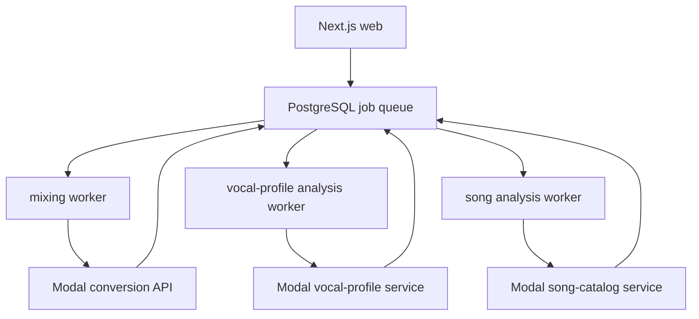

# 로컬 설정, 구성, 배포 및 검증

이 문서는 Copysinger를 로컬에서 개발하고, 단일 인스턴스 production으로 실행하며, PostgreSQL과 외부 Modal 분석 서비스를 검증하는 절차를 구분해 설명한다. 저장소가 실제로 제공하는 명령과 추론 가능한 전제만 사용한다. 환경 변수의 의미와 선택 조건은 `.env.example`을 기준으로 한다.

## 책임 경계와 실행 흐름

웹 애플리케이션은 작업을 PostgreSQL에 접수하고, 세 worker가 각각 mixing, vocal-profile analysis, song analysis 작업을 처리한다. 보컬 프로필·곡 분석은 로컬 Python analyzer를 실행하지 않고 Modal adapter를 통해 배포된 Modal service를 사용한다. `pnpm dev`와 `pnpm start`는 `concurrently --kill-others-on-fail`로 웹과 세 worker를 함께 감독한다.


이 흐름은 웹 요청, PostgreSQL 작업 큐, 세 worker와 외부 Modal 서비스의 운영 경계를 보여준다.

`start`는 `next start`를 웹 프로세스로 사용하므로 production에서는 먼저 `pnpm build`가 필요하다. supervisor의 한 child가 실패하면 형제 프로세스에도 `SIGTERM`을 보내므로, 일부 worker만 남은 불완전한 인스턴스를 정상 상태로 간주하지 않는다.

## 공통 사전 조건과 구성

- Node.js `>=22.13.0`
- `pnpm@11.9.0`
- Docker 20 이상 및 PostgreSQL 접근성
- Google OAuth web client
- Leemage project와 API key
- 배포된 Modal 분석·믹싱 서비스
- production 결과 오디오 변환에 필요한 FFmpeg

의존성을 고정 lockfile에 맞춰 설치하고, 로컬 환경 파일을 만든다.

```bash
pnpm install --frozen-lockfile
cp .env.example .env.local
```

Prisma CLI는 `.env.local`을 먼저, `.env`를 다음으로 읽고 `DATABASE_URL`을 datasource URL로 사용한다. worker와 검증 script도 같은 순서로 환경 파일을 로드한다. 따라서 명령을 실행하는 프로세스가 접근할 `DATABASE_URL`과 각 외부 서비스의 server-side 자격 증명을 해당 환경에 넣어야 한다.

구성의 최소 자동 점검은 다음과 같다. 이 검사는 `BETTER_AUTH_SECRET`, `BETTER_AUTH_URL`, `GOOGLE_CLIENT_ID`, `GOOGLE_CLIENT_SECRET`, `ADMIN_EMAILS`, `LEEMAGE_API_KEY`, `LEEMAGE_PROJECT_ID`가 비어 있지 않은지 확인한다.

```bash
pnpm run verify:feature-config
```

Leemage 연결까지 smoke test하려면 `--leemage`를 추가한다. 임시 text 파일을 업로드한 뒤 `finally`에서 삭제하므로, 설정된 Leemage project에 실제 쓰기·삭제 권한이 필요하다.

```bash
pnpm run verify:feature-config --leemage
```

worker별 외부 설정은 다음과 같다. 보컬 분석은 `VOCAL_PROFILE_MODAL_URL`과 `VOCAL_PROFILE_MODAL_API_KEY`를 우선하고, API key가 없으면 `MODAL_API_KEY`를 fallback으로 사용한다. 곡 분석은 `SONG_ANALYSIS_MODAL_URL`과 `SONG_ANALYSIS_MODAL_API_KEY`를 우선하고, 동일하게 `MODAL_API_KEY`를 fallback으로 사용한다. mixing은 `MODAL_API_URL`과 `MODAL_API_KEY`가 모두 있어야 하며, 누락 시 `MODAL_NOT_CONFIGURED`로 작업을 실패시킨다.

정수형 worker·티켓 설정은 빈 값이면 코드의 기본값을 사용하지만, 값이 있으면 안전한 정수이고 허용 범위 안이어야 한다. 예를 들어 mixing은 concurrency 1–32, max attempts 1–20, lease 30–3,600초, poll interval 100–60,000ms 범위를 검사한다. vocal-profile analysis와 song analysis에도 각각 concurrency, attempts 또는 lease/poll interval에 대한 동일한 범위 검사가 있으므로 운영 값 변경 시 process 시작 시점의 validation failure를 고려한다.

## 로컬 개발

로컬 PostgreSQL은 compose의 `postgres:16-alpine` 서비스로 실행된다. 기본 컨테이너 포트 5432는 호스트의 `POSTGRES_PORT`로 매핑되며, 기본 호스트 포트는 5433이다. 기본 database/user/password 값은 compose의 fallback 값이며, named volume `postgres_data`에 데이터가 보존된다.

```bash
docker compose up -d
pnpm run db:migrate:deploy
pnpm run db:generate
pnpm dev
```

`pnpm dev`가 시작하는 프로세스는 다음 네 개다.

- `dev:web` → `next dev`
- `worker:mixing` → `scripts/mixing-worker.ts`
- `worker:vocal-profile-analysis` → `scripts/vocal-profile-analysis-worker.ts`
- `worker:song-analysis` → `scripts/song-analysis-worker.ts`

확인은 `http://localhost:3000`에서 한다. large audio Server Action의 body size limit은 `next.config.ts`에서 `300mb`로 설정되어 있으므로, 큰 오디오 업로드를 다루는 로컬·production 빌드의 설정 경계로 기억한다.

새 migration을 개발 중인 경우에는 적용 전용 명령과 구별해 다음을 사용한다.

```bash
pnpm run db:migrate
pnpm run db:generate
```

`db:migrate`는 `prisma migrate dev`, `db:migrate:deploy`는 기존 migration 적용, `db:generate`는 `prisma generate`, `db:status`는 migration 상태 확인, `db:seed`는 Prisma seed 실행이다.

## 단일 인스턴스 production

단일 인스턴스 배포 순서는 의존성 설치, migration 적용, production build, 동시 실행이다.

```bash
pnpm install --frozen-lockfile
pnpm run db:migrate:deploy
pnpm build
pnpm start
```

`pnpm start`는 `next start`와 세 worker를 같은 supervisor 아래 실행한다. 이 저장소의 기본 명령은 별도 web/worker scheduler나 Storybook process를 production에 추가하지 않는다. Storybook 도구는 devDependencies에만 있고 `build`, `start`, `start:web`에는 포함되지 않는다. 따라서 Storybook은 운영 런타임의 의존성·기동 단계가 아니다.

기존 PostgreSQL이 아닌 새 데이터베이스에 production을 올릴 때는 migration 적용 뒤 관리자 화면에서 기존 카탈로그 snapshot을 가져온다. snapshot에는 분석 결과와 외부 asset metadata가 있지만 원본 음원 bytes는 포함되지 않으므로, import 후 원본 asset이 필요한 운영 흐름도 별도로 확인한다.

## Modal 배포 책임

Modal 배포는 Next.js/worker 기동과 별개의 책임이다. 각 service 디렉터리의 local requirements를 사용해 배포한다.

```bash
pnpm run modal:vocal-profile:deploy
pnpm run modal:song-catalog:deploy
```

두 명령은 각각 `services/vocal-profile-modal/requirements-local.txt`와 `services/song-catalog-analyzer/requirements-local.txt`를 `uv`로 준비한 뒤 해당 `modal_app.py`를 `modal deploy`한다. worker가 참조하는 URL과 API key가 새 배포의 endpoint·인증 설정과 일치해야 한다.

기존 mixing Modal API를 이 문서의 배포 명령으로 재배포한다고 가정하지 않는다. package script가 제공하는 Modal deploy hook은 vocal-profile과 song-catalog 두 분석 service에 한정되며, mixing worker는 `MODAL_API_URL`/`MODAL_API_KEY`로 외부 conversion API를 소비한다.

## 데이터베이스 migration 및 검증

Prisma 설정의 schema는 `prisma/schema.prisma`, migration 경로는 `prisma/migrations`다. production이나 이미 존재하는 데이터베이스에는 다음 적용 명령을 사용한다.

```bash
pnpm run db:status
pnpm run db:migrate:deploy
pnpm run db:generate
```

관계 graph와 catalog 상태는 서로 다른 검증이다.

```bash
# seeded user profile과 song profile 관계 graph 확인
pnpm run db:verify

# catalog가 비어 있지 않고 invalid 항목이 없는지 확인
pnpm run catalog:db:verify
```

`db:verify`는 `USER` vocal profile에 `USER_TEST` recording이 연결되어 있고, song에도 vocal profile이 연결되어 있는지 검사한다. 둘 중 하나라도 없으면 비정상 종료한다. `catalog:db:verify`는 catalog 검증 결과를 JSON으로 출력하고 `total === 0`이거나 `invalid.length > 0`이면 exit code 1을 설정한다. 따라서 migration 성공만으로 애플리케이션 데이터가 ready라고 판단하지 말고, 필요한 seed/import 뒤 두 검증 결과를 확인한다.

Prisma client 생성은 migration 적용과 별개이므로 둘 다 필요한 실행에서는 `db:migrate:deploy` 다음 `db:generate`를 명시적으로 실행한다. 새 개발 데이터가 필요할 때만 다음을 추가한다.

```bash
pnpm run db:seed
```

## 배포 후 focused verification

전체 production build와 회귀 suite는 다음으로 실행한다.

```bash
pnpm test
```

이 명령은 먼저 `pnpm run build`를 실행한 후 domain/unit, PostgreSQL integration, API contract, architecture boundary와 Storybook interaction 검사를 이어간다. 운영 구성 자체를 빠르게 확인할 때는 다음 정적 검사도 유용하다.

```bash
pnpm run check
pnpm run db:validate
pnpm run test:process-scripts
```

`test:process-scripts`는 세 worker가 기본 `dev`/`start` 명령에 포함되고, `concurrently`가 child failure 시 sibling을 종료하는지 확인한다. 또한 vocal analysis에 로컬 analyzer runtime이 생기지 않고 Modal 경계를 유지하는지 검사한다. `storybook-production-boundary` 검사는 Storybook이 production dependency나 production start/build 경로로 새어 나오지 않는지, Storybook source가 server-only/Prisma 모듈을 import하지 않는지 확인한다.

실패 대응의 기준은 간단하다. 구성 검증이 실패하면 누락·공백인 환경 변수를 먼저 고치고, migration/status가 실패하면 DB 연결과 migration 상태를 확인한다. catalog verification이 실패하면 catalog snapshot/import와 invalid 항목을 점검한다. 한 web/worker child가 종료되면 supervisor가 전체를 종료하므로, 인스턴스를 부분 복구하지 말고 원인을 수정한 뒤 전체 start를 다시 수행한다.
