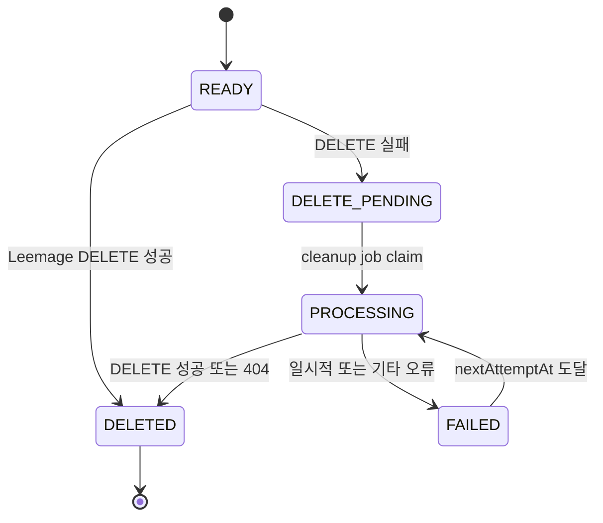

# 미디어 저장·프록시·정리 수명주기

이 페이지는 **파일 bytes의 저장소**와 **그 파일을 소유하고 가리키는 PostgreSQL metadata**를 구분해서 미디어를 추적하는 방법을 설명한다. 애플리케이션은 Leemage가 돌려준 `externalProjectId`, `externalFileId`, `externalUrl`과 파일 메타데이터를 DB에 저장하고, private audio를 재생할 때는 DB의 소유권을 먼저 확인한 뒤 서버가 Leemage URL을 프록시한다.

사용자 오디오의 생성·재생 전제는 [/openwiki/workflows/vocal-analysis.md](/openwiki/workflows/vocal-analysis.md)에서, mixing job의 결과 연결은 [/openwiki/workflows/recommendation-and-mixing.md](/openwiki/workflows/recommendation-and-mixing.md)에서 이어서 확인할 수 있다.

## 두 저장 경계를 분리해 이해하기

- **Leemage**: presign → presigned `PUT` → confirm 순서로 실제 외부 파일 bytes를 보관한다. API 호출에는 Bearer API key가 필요하지만 presigned object 업로드에는 그 Authorization 헤더를 붙이지 않는다.
- **PostgreSQL**: `MediaAsset` 또는 `CatalogTargetAsset`이 외부 파일의 포인터와 `fileName`, `mimeType`, `sizeBytes`, 상태, 오류를 소유한다. DB row가 삭제되어도 외부 파일 삭제가 자동으로 보장되는 것은 아니므로, 애플리케이션이 외부 삭제와 DB 상태 전이를 함께 수행한다.

`MediaAsset`은 `userId`와 `kind`(`REFERENCE`, `SYNTHESIS_REFERENCE`, `MIX_RESULT`)를 가진다. `Recording.mediaAssetId`는 사용자 reference를, `VocalProfile.synthesisReferenceAssetId`는 synthesis reference를 연결한다. mixing result 역시 `MediaAsset`으로 저장되며 mixing job이 이를 참조한다. 스키마의 `onDelete: Restrict`/`SetNull` 설정은 미디어를 가리키는 도메인 row를 무심코 지우지 않도록 하는 DB 경계다. [미디어 및 도메인 관계 스키마](repo://prisma/schema.prisma#L67-L85)와 [MediaAsset 관계](repo://prisma/schema.prisma#L413-L440)를 함께 본다.

카탈로그 target은 사용자별 `MediaAsset`과 별도의 `CatalogTargetAsset`이다. 이 row는 `Song.targetAssetId` 및 선택적으로 `SongSource`에 연결되고 `sourceVideoId`, `sourceId`, `sha256`를 보관한다. 따라서 “현재 활성 source에 대응하는 READY target”인지 검증할 수 있다. [카탈로그 target 스키마](repo://prisma/schema.prisma#L442-L467)

## 업로드 진입점과 포인터 생성

`storeAnalyzerReferenceBytes`와 `storeAnalyzerSynthesisReferenceBytes`는 각각 입력 bytes를 `REFERENCE` 또는 `SYNTHESIS_REFERENCE`로 업로드한다. `storeMixingResult`는 파일명을 `copy-singer-{mixingJobId}.{extension}`으로 정해 `MIX_RESULT`를 만든다. 세 경로 모두 먼저 Leemage upload가 성공해야 `MediaAsset` row를 `READY`로 생성하므로, 성공한 외부 파일과 metadata pointer가 함께 생기는 것이 정상 경로다. [사용자·mix 결과 저장 서비스](repo://src/shared/media/media-service.ts#L13-L37)

Leemage client의 `uploadFile`은 다음 계약을 구현한다.

1. 프로젝트 files endpoint에 presign을 요청하면서 파일명, content type, byte 수를 보낸다.
2. 응답의 `presignedUrl`, `objectName`, `fileId`를 검증하고 presigned URL에 bytes를 `PUT`한다.
3. files confirm endpoint에 `fileId`, object 이름과 동일한 파일 메타데이터를 보내고, 확정된 `id`와 `url`을 반환한다.
4. API endpoint의 429와 5xx, 네트워크 예외는 최대 3회 재시도한다. `Retry-After`가 있으면 최대 5초, 없으면 지수 backoff를 사용한다. presigned `PUT` 자체는 이 API 재시도 루프와 별도다.

API key와 project ID는 `LEEMAGE_API_KEY`, `LEEMAGE_PROJECT_ID`에서 읽고 base URL은 `LEEMAGE_BASE_URL` 또는 코드의 기본 URL을 사용한다. 이 페이지에는 실제 비밀 값을 기록하지 않는다. [Leemage client 계약과 재시도](repo://src/shared/media/client.ts#L31-L43) [presign·PUT·confirm 구현](repo://src/shared/media/client.ts#L63-L164)

### 카탈로그 target의 안전한 import

`importCatalogTargetAsset`은 카탈로그 position에서 `READY`인 active `SongSource`를 조회한 뒤 staging 파일을 source video ID와 매칭한다. 지원 확장자는 `wav`, `mp3`, `m4a`, `aac`, `webm`, `flac`이고 업로드 크기는 49,000,000 bytes 이하여야 한다. WAV는 RIFF header도 확인한다. bytes의 SHA-256을 계산해 같은 source와 같은 digest의 기존 `READY` asset이면 업로드를 건너뛴다.

새 파일은 Leemage에 업로드한 뒤 하나의 DB transaction에서 `CatalogTargetAsset`을 만들고 `Song.targetAssetId`를 새 asset으로 바꾼다. transaction이 실패하면 방금 올린 외부 파일을 best-effort로 삭제한다. 기존 asset은 새 asset 연결 뒤에 정리한다. [카탈로그 import 및 idempotency](repo://src/entities/recommendation/lib/song-catalog/target-assets.ts#L186-L287) [동일 파일 skip 검증 테스트](repo://tests/catalog-target-assets.integration.ts#L10-L92)

## private audio 재생은 서버 인증 뒤 프록시한다

브라우저가 Leemage `externalUrl`을 직접 받지 않는 것이 핵심 경계다. 두 vocal-profile audio route는 먼저 `requireApiSession`을 호출하고, 요청 사용자의 ID와 profile ID로 reference를 조회한다. 조회 함수는 profile이 `sourceType: USER`인지, asset의 `userId`가 session user와 같은지, kind가 올바른지, status가 `READY`인지 모두 확인한다. 실패하면 404를 반환한다.

그 뒤 `proxyPrivateAudio`가 서버에서 외부 URL을 fetch한다. 요청의 `Range`를 upstream에 전달해 부분 재생을 지원하고, `Content-Type`, 길이·범위·range 지원 헤더만 복사한다. 저장소 응답에 포함된 임의 헤더나 URL은 전달하지 않는다. 응답에는 안전한 파일명, `Cache-Control: private, no-store`를 설정한다. upstream이 성공 또는 206이 아니면 body를 노출하지 않고 route는 502를 반환한다. [사용자 소유권 조회](repo://src/entities/vocal-profile/api/history.ts#L103-L136) [인증된 audio route](repo://src/_app/api-routes/vocal-profiles/vocal-profile-audio-route.ts#L5-L27) [Range 프록시 구현](repo://src/shared/media/audio-proxy.ts#L3-L27) [private URL 비노출 테스트](repo://tests/private-audio-proxy.test.ts#L6-L46)

```mermaid
sequenceDiagram
    participant Browser
    participant Route as Audio route
    participant DB as PostgreSQL
    participant Store as Leemage object
    Browser->>Route: GET audio with session and optional Range
    Route->>DB: verify user, profile, kind, READY
    DB-->>Route: externalUrl and MIME metadata
    Route->>Store: server-side fetch with Range
    Store-->>Route: audio response
    Route-->>Browser: filtered headers and stream
```

이 그림은 private audio가 session/DB authorization을 통과한 뒤에만 서버 프록시를 통해 전달되는 요청 순서를 보여준다.

## 삭제 상태와 실패 복구

### 사용자 `MediaAsset`의 삭제

`deleteOrScheduleMediaAsset`은 DB row가 없으면 이미 삭제된 것으로 간주한다. row가 있으면 Leemage `DELETE`가 성공한 뒤에만 `MediaAsset.status`를 `DELETED`, `deletedAt`을 현재 시각으로 바꾸고 오류를 지운다. 호출자가 실제 row까지 버려야 하는 경우 `discardMediaAsset`이 그 성공 결과 후 `deleteMany`를 실행한다. 즉 DB metadata를 먼저 지워 외부 파일을 잃어버리는 순서를 택하지 않는다. [즉시 삭제와 pending 전환](repo://src/shared/media/media-service.ts#L72-L101)

Leemage 삭제가 실패하면 row를 보존하고 `DELETE_PENDING`으로 바꾸며 `lastError`를 기록한다. 같은 transaction에서 `MediaCleanupJob`을 `PENDING`으로 만들어 재시도 대상을 남긴다. 따라서 실패는 사용자 media의 소유권 pointer를 즉시 없애는 대신 정리 가능한 상태로 남긴다.

`processOneMediaCleanup`은 한 번에 하나의 job을 `FOR UPDATE SKIP LOCKED`로 claim한다. 현재 시각 이전의 `PENDING`/`FAILED` job과 5분 이상 멈춘 `PROCESSING` job을 후보로 삼고, claim 때 `attempts`를 증가시킨다. asset이 이미 없으면 cleanup job만 제거한다. DELETE가 성공하면 asset을 삭제하고, Leemage가 404를 반환해도 외부 파일이 이미 없는 상태로 해석해 asset을 삭제한다. 그 밖의 오류는 job을 `FAILED`로, asset을 `DELETE_PENDING`으로 유지하고 다음 시각을 2분부터 최대 360분까지 지연한다. [cleanup claim·재시도·404 처리](repo://src/shared/media/cleanup.ts#L6-L54)

mixing worker의 한 번 실행은 refund reconciliation 뒤에 media cleanup을 먼저 한 건 처리한다. 따라서 별도 cleanup daemon이 아니라 worker 실행 주기가 pending deletion의 복구 진입점이다. [worker 실행 순서](repo://src/_app/background-jobs/mixing/worker.ts#L454-L470) [실패 후 pending 보존 테스트](repo://tests/leemage-media.integration.ts#L85-L141) [성공 retry 후 asset 제거 테스트](repo://tests/leemage-media.integration.ts#L143-L195)

이 상태도는 사용자 `MediaAsset`과 cleanup job이 외부 삭제 결과에 따라 이동하는 현재 상태 전이를 요약한다.

### 카탈로그 target은 참조 중이면 보존한다

카탈로그 import가 새 target으로 `Song.targetAssetId`를 교체할 때 기존 asset을 바로 지우지 않는다. `cleanupSupersededAsset`은 먼저 `MixingJob`의 `targetAssetId` 참조 수를 센다. 참조가 하나라도 있으면 외부 파일과 DB row를 그대로 보존한다. 참조가 없을 때만 Leemage DELETE 성공 후 `CatalogTargetAsset` row를 삭제한다.

삭제 중 Leemage 오류가 나면 catalog asset row를 보존하고 `DELETE_PENDING`과 잘린 `lastError`를 기록한다. 다만 사용자 `MediaCleanupJob`을 생성하는 공통 경로는 아니므로, catalog target의 pending row는 이 함수가 자동으로 같은 retry worker에 등록한다고 가정하면 안 된다. 이 구분은 카탈로그 target을 안전하게 교체하거나 별도 운영 정리 경로를 추가할 때 중요하다. [참조 보존과 superseded cleanup](repo://src/entities/recommendation/lib/song-catalog/target-assets.ts#L160-L184)

## 운영·변경 체크리스트

- Leemage 연동을 켤 때 `LEEMAGE_API_KEY`와 `LEEMAGE_PROJECT_ID`를 설정한다. 누락되면 client가 media storage 오류를 내며 실행을 시작하지 않는다. 실제 값은 환경 관리 시스템에만 둔다.
- 외부 파일을 재생·삭제하기 전에 DB의 `userId`, kind, status와 관계 pointer를 검증한다. `externalUrl`만으로 접근 허용 여부를 판단하지 않는다.
- 업로드 후 DB transaction이 실패할 수 있으므로 새 외부 file의 best-effort DELETE를 유지한다. 삭제 실패를 조용히 무시하면 orphan bytes가 생긴다.
- cleanup worker를 운영할 때 `FAILED` job의 `nextAttemptAt`, `attempts`, `lastError`를 관찰한다. `PROCESSING` stale 기준은 5분이다.
- catalog target을 교체할 때 mixing job 참조를 확인하지 않고 외부 파일을 삭제하지 않는다. 현재 구현은 참조 중인 asset을 보존하지만, catalog `DELETE_PENDING`의 재시도 운영은 사용자 `MediaCleanupJob`과 별도라는 점을 명시적으로 다룬다.

Leemage API의 형식·HTTP 재시도 동작은 [focused client test](repo://tests/leemage-client.test.ts#L6-L72)로, 사용자 asset 생성 시 owner와 external metadata가 저장되는지는 [media integration test](repo://tests/leemage-media.integration.ts#L7-L83)로 확인할 수 있다. 관련 durable worker 운영 모델은 [/openwiki/architecture/durable-workers.md](/openwiki/architecture/durable-workers.md), 환경 변수의 전체 운영 규칙은 [/openwiki/operations/runtime-configuration.md](/openwiki/operations/runtime-configuration.md)를 참고한다.
