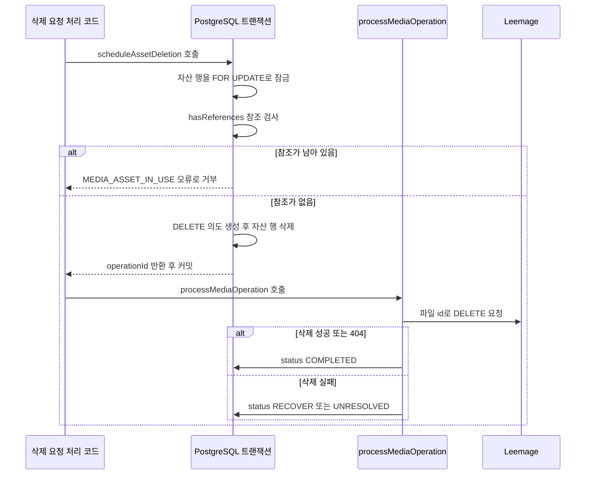
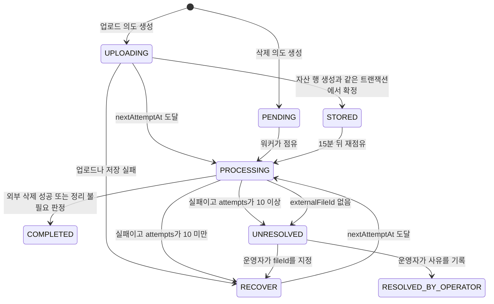

# 미디어 저장과 정리 의도

오디오 bytes는 Leemage에 있고, "누구 것이고 어디에 붙어 있는가"는 PostgreSQL에 있어요. 두 저장소는 한 트랜잭션으로 묶을 수 없어서, 이 코드는 외부 호출을 하기 전에 할 일을 행으로 먼저 커밋해요. 그 행이 `MediaOperation`이고, 업로드와 삭제 모두 이 규칙을 따라요. 그래서 외부 호출이 실패하거나 프로세스가 죽어도 "아직 지워야 할 파일"이라는 기록이 남고, 재시도가 가능해요. 상태 전이와 lease 규칙은 이 페이지가 소유하고, 복구 명령은 [복구 스크립트 운영 절차](recovery-runbook.md)가 맡아요.

## bytes와 진실을 나눠 둬요

Leemage는 파일 자체와 그 파일의 외부 식별자(`externalProjectId`, `externalFileId`, `externalUrl`)를 갖고, PostgreSQL은 소유권(`userId`), 다른 행과의 FK(Foreign Key) 관계, 상태, 파일 이름·MIME(Multipurpose Internet Mail Extensions) 타입·크기, 그리고 곡 원곡 자산의 `sha256`까지 가져요([prisma/schema.prisma](repo://prisma/schema.prisma#L417-L471), [src/shared/media/media-service.ts](repo://src/shared/media/media-service.ts#L13-L37)). 외부 저장소를 직접 조회하지 않고도 "이 자산을 참조하는 행이 있는가"를 DB 안에서 판정할 수 있는 게 이 분리의 핵심 이점이에요.

자산을 나타내는 행은 두 종류이고, 만들어지는 경로와 참조 방식이 달라요.

| 자산 행 | 만드는 kind / 필드 | 소유 | 참조하는 곳 |
| --- | --- | --- | --- |
| `MediaAsset` | `REFERENCE` — 분석에 올린 원본 음성 | `User.userId` | `Recording.mediaAssetId`(unique) |
| `MediaAsset` | `SYNTHESIS_REFERENCE` — 스마트 합성 레퍼런스 | `User.userId` | `VocalProfile.synthesisReferenceAssetId`(unique) |
| `MediaAsset` | `MIX_RESULT` — 믹싱 결과 음원 | `User.userId` | `MixingJob.resultAssetId` |
| `CatalogTargetAsset` | 곡 원곡 타깃, `sha256`·`sourceVideoId` 보유 | `SongSource.sourceId`(선택) | `Song.targetAssetId`, `MixingJob.targetAssetId` |

두 테이블 모두 `@@unique([externalProjectId, externalFileId])`를 걸어 같은 외부 파일을 두 행으로 등록하지 못하게 막아요([prisma/schema.prisma](repo://prisma/schema.prisma#L441-L443), [prisma/schema.prisma](repo://prisma/schema.prisma#L467-L470)). `CatalogTargetAsset`에는 사용자 소유 컬럼이 없고 `sha256`이 있어서, 같은 출처·같은 내용의 원곡을 다시 올리면 업로드를 건너뛰고 기존 행을 재사용해요([src/features/manage-song-catalog/api/target-assets.ts](repo://src/features/manage-song-catalog/api/target-assets.ts#L35-L65)).

## 업로드: 의도를 먼저 남기고 자산 행을 마지막에 확정해요

업로드는 "의도 → 외부 I/O → 도메인 확정" 순서로 진행해요([src/shared/media/operations.ts](repo://src/shared/media/operations.ts#L6-L61)).

1. `MediaOperation`을 `operation = "UPLOAD"`, `status = "UPLOADING"`으로 만들고 `externalProjectId`에 현재 프로젝트를 적어 둬요. 이때 `nextAttemptAt`은 15분 뒤로 잡아요.
2. client가 presign 응답을 검증한 뒤 `onAllocated`를 호출하고, 그 콜백이 응답의 `fileId`와 `objectName`을 같은 의도 행에 기록해요. presigned `PUT`이 실패해도 "이 파일 id를 지워야 한다"는 사실이 남는 지점이에요.
3. 업로드와 confirm이 끝나면 자산 행 생성과 `status = "STORED"`, `assetId` 기록을 한 트랜잭션에서 확정해요. 그래서 `STORED` 의도는 항상 자산 행을 가리켜요.
4. 어느 단계에서든 실패하면 `status = "RECOVER"`, `lastError = "UPLOAD_OR_PERSIST_FAILED"`, `nextAttemptAt = now`로 표시하고 원래 오류를 그대로 다시 던져요. 호출자는 자기가 아는 오류 코드로 변환해 사용자에게 알려요([src/entities/vocal-profile/api/persistence.ts](repo://src/entities/vocal-profile/api/persistence.ts#L41-L58)).

`UPLOADING` 상태로 남은 의도는 정리 대상이에요. `externalFileId`가 기록돼 있으면 그 파일 id로 삭제를 시도하고, 없으면 외부 호출 없이 `UNRESOLVED`와 `lastError = "PROVIDER_IDENTITY_UNKNOWN"`으로 넘겨요([src/shared/media/operations.ts](repo://src/shared/media/operations.ts#L128-L137), [tests/media-recovery.integration.ts](repo://tests/media-recovery.integration.ts#L57-L73)).

`STORED`도 다시 점유돼요. 업로드 의도를 만들 때 잡은 15분이 지나면 워커가 이 의도를 후보로 집어 참조 검사를 해요. 자산이 어느 도메인 행에도 붙지 않았으면 자산 행 삭제와 별도의 `DELETE` 의도 생성을 같은 트랜잭션에서 예약하고 업로드 의도를 `COMPLETED`, `resolution = "CLEANUP_SCHEDULED"`로 끝내요. 참조가 붙어 있으면 아무것도 지우지 않고 `COMPLETED`, `resolution = "DOMAIN_LINKED"`로 끝내요([src/shared/media/operations.ts](repo://src/shared/media/operations.ts#L138-L159)). 업로드와 도메인 행 생성 사이에서 프로세스가 죽어도 고아 bytes가 남지 않는 이유가 이 15분 창이에요.

업로드되는 bytes는 호출자가 정해요. Leemage에 올라가는 파일 이름은 자산 종류별 규칙을 따라 만들어지고, 믹싱 결과는 올리기 전에 FFmpeg으로 AAC(Advanced Audio Coding) 44.1kHz 스테레오로 다시 인코딩해요([src/shared/media/media-service.ts](repo://src/shared/media/media-service.ts#L6-L11), [src/shared/media/media-service.ts](repo://src/shared/media/media-service.ts#L87-L100), [src/shared/lib/audio/compress-mixing-result.ts](repo://src/shared/lib/audio/compress-mixing-result.ts#L55-L90)). 그래서 DB의 `sizeBytes`는 원본 응답 크기가 아니라 실제로 올린 bytes의 길이예요.

## 삭제: 참조 검사와 의도 확정을 한 트랜잭션에서 해요

삭제는 순서가 반대예요. 도메인 행을 지우는 트랜잭션 안에서 "이 파일을 지워야 한다"까지 확정하고, 커밋한 뒤에야 외부 삭제를 실행해요([src/shared/media/operations.ts](repo://src/shared/media/operations.ts#L86-L112), [src/shared/media/cleanup.ts](repo://src/shared/media/cleanup.ts#L34-L37)). 의도 생성과 자산 행 삭제가 같은 트랜잭션이라, 그 트랜잭션이 커밋 전에 죽으면 자산 행도 의도도 남지 않고 외부 삭제도 나가지 않아요([tests/media-recovery.integration.ts](repo://tests/media-recovery.integration.ts#L94-L102)).

요청 처리는 커밋이 끝난 뒤에야 외부 삭제를 시도해요.

외부 파일 삭제는 자기가 어떤 파일인지 스스로 알고 있어요. `DELETE` 의도에는 자산 행에서 읽은 `externalProjectId`와 `externalFileId`를 복사해 넣어서, 자산 행이 사라진 뒤에도 환경 변수 값과 무관하게 대상을 특정할 수 있어요([src/shared/media/operations.ts](repo://src/shared/media/operations.ts#L100-L108)).

참조가 하나라도 남아 있으면 `hasReferences`가 `true`를 돌려주고 `scheduleAssetDeletion`이 `Error("MEDIA_ASSET_IN_USE")`를 던져요. 그래서 트랜잭션 전체가 롤백되고 자산 행은 그대로 남아요([src/shared/media/operations.ts](repo://src/shared/media/operations.ts#L87-L179)). 어떤 참조를 보는지는 자산 종류마다 달라요.

| 자산 종류 | 삭제를 막는 참조 |
| --- | --- |
| `MEDIA` | `Recording.mediaAssetId`, `VocalProfile.synthesisReferenceAssetId`, `MixingJob.referenceAssetId`·`resultAssetId`, `VocalProfileAnalysisJob.sourceAssetId` |
| `CATALOG` | 자산이 가리키는 출처의 `PENDING`·`PROCESSING` `SongAnalysisJob`, `Song.targetAssetId`, `MixingJob.targetAssetId` |

호출자는 이 거부를 사용자 오류로 바꿔요. 보컬 프로필 삭제는 연결된 믹싱 작업이 있으면 미리 막고, 자산 정리 중 `MEDIA_ASSET_IN_USE`가 나면 "아직 사용 중"이라는 결과로 처리해요([src/_app/api-routes/vocal-profiles/vocal-profile-detail-route.ts](repo://src/_app/api-routes/vocal-profiles/vocal-profile-detail-route.ts#L62-L106), [src/features/manage-song-catalog/api/target-assets.ts](repo://src/features/manage-song-catalog/api/target-assets.ts#L68-L81)).

## 외부 삭제가 실패해도 DB 삭제는 되돌리지 않아요

삭제의 실패 모드는 "행은 지워졌는데 파일은 남음"이에요. `deleteOrScheduleMediaAsset`은 트랜잭션으로 의도를 확정한 뒤 곧바로 외부 삭제를 시도하고, 그 결과를 `{ deleted: status === "COMPLETED" }`로 돌려줘요([src/shared/media/media-service.ts](repo://src/shared/media/media-service.ts#L75-L81)). Leemage가 실패하면 자산 행은 이미 없는 상태에서 `RECOVER` 의도만 남고, 반환값은 `deleted: false`예요([tests/leemage-media.integration.ts](repo://tests/leemage-media.integration.ts#L124-L129)).

요청 경로는 이 남은 의도를 사용자에게 알려요. 보컬 프로필 삭제는 남은 의도가 있으면 `mediaCleanupPending: true`와 202를, 모두 끝났으면 200을 돌려주고, 믹싱 작업 삭제도 같은 값을 응답에 담아요([src/_app/api-routes/vocal-profiles/vocal-profile-detail-route.ts](repo://src/_app/api-routes/vocal-profiles/vocal-profile-detail-route.ts#L98-L106), [src/entities/mixing-job/api/deletion.ts](repo://src/entities/mixing-job/api/deletion.ts#L41-L48)). 워커가 다음 반복에서 이 의도를 마저 처리해요.

## MediaOperation 상태와 lease 규칙

`MediaOperation`은 `User`나 자산 행에 FK를 걸지 않고 `userId`·`assetId`를 문자열로만 참조해요. 그래서 원인이 된 도메인 행을 지워도 의도가 살아남아요([prisma/schema.prisma](repo://prisma/schema.prisma#L629-L651)).

| status | 의미 | 다음 상태 |
| --- | --- | --- |
| `PENDING` | 기본값. 삭제 의도는 이 값으로 만들어져요 | 조건을 채우면 `PROCESSING` |
| `UPLOADING` | 업로드를 시작한 업로드 의도 | 성공 시 `STORED`, 실패 시 `RECOVER` |
| `STORED` | 자산 행과 함께 확정된 업로드 의도. `assetId`와 15분 뒤 `nextAttemptAt`을 가져요 | 참조 검사 후 `COMPLETED` |
| `PROCESSING` | lease를 잡고 외부 호출을 하는 중 | `COMPLETED`·`RECOVER`·`UNRESOLVED` |
| `RECOVER` | 실패했고 재시도 예정. `nextAttemptAt`을 지나야 다시 점유돼요 | `PROCESSING` |
| `COMPLETED` | 삭제 완료, 또는 정리할 필요가 없다고 판정 | 종료 상태예요 |
| `UNRESOLVED` | 자동 재시도로 풀 수 없음. `attempts`가 10 이상이거나 `externalFileId`가 없어요 | 운영자 해소 |
| `RESOLVED_BY_OPERATOR` | 운영자가 사유를 기록해 닫음 | 종료 상태예요 |

점유는 후보 행 하나를 `FOR UPDATE SKIP LOCKED`로 잡는 쿼리로 하고, `status = "PROCESSING"`, `leaseOwner`, `leaseExpiresAt = now + 180초`를 함께 써요. lease가 끝난 `PROCESSING` 행은 다른 워커가 다시 집을 수 있고, 점유할 때마다 `attempts`가 1 증가해요([src/shared/media/operations.ts](repo://src/shared/media/operations.ts#L114-L128)). 그래서 같은 워커가 두 번 처리해도 외부 삭제는 같은 파일 id에 대해 반복될 뿐이에요.

실패 뒤 재시도 간격은 `min(2 ** attempts, 360)`분이고, 실패 시점에 `attempts >= 10`이면 `RECOVER` 대신 `UNRESOLVED`로 넘어가요([src/shared/media/operations.ts](repo://src/shared/media/operations.ts#L166-L177)). `UNRESOLVED`는 자동으로 풀리지 않으니 운영자가 봐야 해요. `pnpm run media:reconcile`은 인자 없이 실행하면 `UNRESOLVED` 의도를 최대 100건 나열하고, `--id`와 `--operator`, `--reason`을 주면 `RESOLVED_BY_OPERATOR`로 기록해요. `--file-id`를 함께 주면 그 id를 채우고 `operation = "DELETE"`, `attempts = 0`으로 되돌려 재시도를 예약해요. 두 경우 모두 `--apply`가 있어야 실제로 바뀌어요([scripts/reconcile-media.ts](repo://scripts/reconcile-media.ts#L5-L53)). 명령별 사용법은 [복구 스크립트 운영 절차](recovery-runbook.md)에 있어요.

## 남은 의도를 처리하는 주체

`processOneMediaCleanup`은 워커가 부르는 진입점이에요. `MediaCleanupJob` 후보가 있으면 그 행을 점유해 `scheduleAssetDeletion`으로 `MediaOperation`으로 옮기고, 후보가 없으면 `processMediaOperation`을 인자 없이 불러 아무 `MediaOperation`이나 한 건 처리해요([src/shared/media/cleanup.ts](repo://src/shared/media/cleanup.ts#L6-L48)). 믹싱 워커는 반복마다 이 함수를 한 번 호출하므로, 큐가 비어 있어도 정리는 계속 진행돼요([src/_app/background-jobs/mixing/worker.ts](repo://src/_app/background-jobs/mixing/worker.ts#L573-L581)).

`MediaCleanupJob`은 이전 구조의 흔적이에요. 현재 소스에서 이 테이블에 새 행을 만드는 코드는 찾지 못했고, 남아 있는 행을 점유해 `MediaOperation`으로 옮기는 경로만 있어요. 자산 행이 이미 없으면 정리 행을 지우고 끝내고, 옮기다 실패하면 `status = "FAILED"`, `lastError = "MEDIA_ASSET_IN_USE_OR_DB_UNAVAILABLE"`, 1분 뒤 `nextAttemptAt`을 기록해요([src/shared/media/cleanup.ts](repo://src/shared/media/cleanup.ts#L6-L48)). 옮기기가 성공하면 자산 행이 사라지면서 `onDelete: Cascade`로 정리 행도 함께 사라져요([prisma/schema.prisma](repo://prisma/schema.prisma#L473-L485)).

모든 정리가 워커를 기다리지는 않아요. 삭제를 요청한 경로는 커밋 직후 `processMediaOperation(operationId)`을 직접 불러 그 자리에서 시도하고, 실패분만 워커에 남겨요. 워커 트랜잭션 안에서 끝나는 경로는 `scheduleAssetDeletion`만 호출하고 외부 삭제는 다음 반복으로 넘겨요([src/_app/background-jobs/vocal-profile-analysis/worker.ts](repo://src/_app/background-jobs/vocal-profile-analysis/worker.ts#L200-L216)). 업로드 뒤 도메인 저장에 실패한 호출자는 `discardMediaAsset`으로 방금 만든 자산을 되돌려요([src/features/analyze-vocal-profile/api/analysis-queue.ts](repo://src/features/analyze-vocal-profile/api/analysis-queue.ts#L175-L194), [src/_app/background-jobs/mixing/worker.ts](repo://src/_app/background-jobs/mixing/worker.ts#L536-L539)).

## 비공개 오디오는 서버가 중계해요

브라우저에는 Leemage URL을 주지 않아요. `proxyPrivateAudio`가 `externalUrl`을 서버에서 읽어 bytes를 중계하고, 요청의 `Range` 헤더를 그대로 위로 넘겨요([src/shared/media/audio-proxy.ts](repo://src/shared/media/audio-proxy.ts#L3-L30)). 응답 헤더는 화이트리스트 방식이라 저장소가 붙인 다른 헤더는 클라이언트로 새지 않아요.

| 규칙 | 값 |
| --- | --- |
| 전달 헤더 | `Content-Type`, `Content-Length`, `Content-Range`, `Accept-Ranges`만 복사해요 |
| `Content-Type` 대체 | 업스트림에 없으면 DB의 `mimeType`을 써요 |
| `Content-Disposition` | `inline`에 파일명을 붙이고, `[^a-zA-Z0-9._-]` 문자는 `-`로 바꿔요 |
| `Cache-Control` | 항상 `private, no-store`예요 |
| 업스트림 실패 | `ok`도 `206`도 아니면 `null`을 돌려주고, 호출 라우트가 502 JSON으로 바꿔요 |
| 중단 | 요청 신호와 60초 타임아웃을 함께 걸어 클라이언트가 끊으면 업스트림도 끊겨요 |

이 계약은 변경 범위 테스트로 고정돼 있어요. [tests/private-audio-proxy.test.ts](repo://tests/private-audio-proxy.test.ts#L6-L46)가 `Range` 전달, `private, no-store`, 저장소 헤더 미노출, 업스트림 실패 시 `null`, 클라이언트 연결 종료 전파를 확인해요.

믹싱 결과 다운로드 경로는 이 헬퍼 대신 같은 헤더를 직접 설정해요. 대신 세션 사용자와 작업 소유자가 같은지, 작업이 `SUCCEEDED`이고 자산이 `READY`인지를 먼저 검사한 뒤에만 `externalUrl`을 읽어요([src/_app/api-routes/mixing-jobs/mixing-job-audio-route.ts](repo://src/_app/api-routes/mixing-jobs/mixing-job-audio-route.ts#L5-L38)). 오디오 경로 전체 목록은 [HTTP API 표면](../architecture/http-api-surface.md)이 정리해요.

## Leemage 설정과 호출 계약

Leemage 설정은 호출 시점에 환경 변수에서 읽어요. `LEEMAGE_API_KEY`와 `LEEMAGE_PROJECT_ID`는 필수라 비어 있으면 `LeemageError`를 던지고 업로드를 시작하지 않으며, `LEEMAGE_BASE_URL`은 기본값 `https://leemage.leey00nsu.com/api/v1`을 쓰고 끝의 `/`를 잘라내요([src/shared/media/client.ts](repo://src/shared/media/client.ts#L34-L46)). 키 값 자체는 어디에도 기록하지 않으니, 필요한 변수 이름과 기본값은 [환경 변수와 런타임 한도](configuration.md)에서 확인하세요.

업로드는 presign, presigned `PUT`, confirm 세 호출로 끝나고, confirm이 돌려준 파일 id가 presign의 `fileId`와 다르면 `Media confirmation identity mismatch.` 오류로 끊어요. 삭제는 `DELETE /projects/{projectId}/files/{fileId}` 한 번이고, 404는 이미 지워진 파일로 보고 성공 처리해요([src/shared/media/client.ts](repo://src/shared/media/client.ts#L118-L204)).

| 호출 제약 | 값 |
| --- | --- |
| 재시도 횟수 | POST는 1회, 그 밖의 메서드는 최대 3회예요 |
| 재시도 조건 | `429` 또는 `5xx`만 재시도하고, `Retry-After`를 최대 5초까지 반영해요 |
| 재시도 간격 | `Retry-After`가 없으면 `200 * 2 ** attempt`ms, 상한 2초예요 |
| 메타데이터 타임아웃 | presign·confirm 등에 `HTTP_METADATA_TIMEOUT_MS`(기본 15초)를 걸어요 |
| 파일 업로드 타임아웃 | presigned `PUT`에 `HTTP_FILE_TIMEOUT_MS`(기본 120초)를 걸어요 |
| 업로드 전체 데드라인 | `uploadFile` 전체에 `MEDIA_UPLOAD_TIMEOUT_MS`(기본 180초)를 걸어요 |
| 요청 캐시 | 모든 호출을 `cache: "no-store"`로 보내요 |

presign 실패는 재시도하지 않아요. 제공자에 idempotency 계약이 없어서 같은 파일이 두 번 등록될 수 있기 때문이고, [tests/leemage-client.test.ts](repo://tests/leemage-client.test.ts#L74-L85)의 단위 테스트가 호출이 한 번인지 확인해요.

## 실패 창과 변경 범위 테스트

정합성 규칙이 깨지는 지점은 대부분 DB 커밋과 외부 호출 사이의 창이에요. [tests/media-recovery.integration.ts](repo://tests/media-recovery.integration.ts#L7-L117)가 그 창을 직접 재현해요. 업로드 뒤 저장이 실패하면 기록된 파일 id로 삭제가 나가고, presign 응답을 잃은 의도는 `UNRESOLVED`로 남아 삭제가 나가지 않으며, 참조가 붙은 자산은 `MEDIA_ASSET_IN_USE`로 거부되고, 의도를 만든 트랜잭션이 커밋 전에 죽으면 자산 행과 의도가 모두 남지 않아요.

미디어 관련 변경의 실행 명령은 다음과 같아요([package.json](repo://package.json#L53-L70)).

| 명령 | 대상 |
| --- | --- |
| `pnpm run test:media` | Leemage client 계약과 저장 통합 테스트([tests/leemage-media.integration.ts](repo://tests/leemage-media.integration.ts#L7-L143)) |
| `pnpm run test:readiness` | 업로드·삭제 실패 창 회귀([tests/media-recovery.integration.ts](repo://tests/media-recovery.integration.ts#L7-L117)) |
| `pnpm run test:vocal-profile-history` | 프록시 헤더 계약([tests/private-audio-proxy.test.ts](repo://tests/private-audio-proxy.test.ts#L6-L46)) |

`tests/leemage-media.integration.ts`는 `DATABASE_URL`이 없으면 건너뛰고, Leemage 대신 stub `fetch`를 꽂아 실제 네트워크를 타지 않아요.

## 다음에 볼 문서

- 자산 행과 참조 관계의 전체 그림은 [데이터 모델과 수명 주기 상태](../architecture/data-model.md)에 있어요.
- 업로드와 삭제를 일으키는 작업 절차는 [AI 믹싱 작업 흐름](../workflows/ai-mixing.md)과 [보컬 프로필 분석 흐름](../workflows/vocal-profile-analysis.md)이 설명해요.
- 남은 의도를 실제로 해소하는 명령은 [복구 스크립트 운영 절차](recovery-runbook.md)에서 확인하세요.
