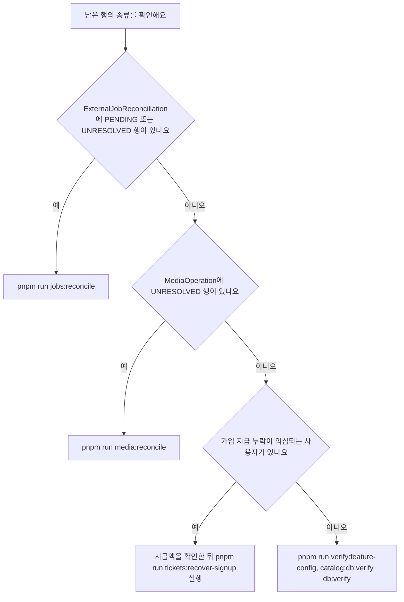

# 복구 스크립트 운영 절차

자동 반복이 끝내 풀지 못한 행은 운영자가 명령으로 해소해요. 남는 대상은 세 가지예요. 접수가 확인되지 않은 외부 제출은 `ExternalJobReconciliation`의 `PENDING`·`UNRESOLVED` 행으로, 미정리 미디어 파일은 `MediaOperation`의 `UNRESOLVED` 행으로, 가입 지급 누락은 `SIGNUP_GRANT` 원장 행이 없는 사용자로 남아요. 설정·시드 데이터·공개 카탈로그의 이상은 검증 명령이 알려줘요.

세 복구 명령은 모두 "먼저 보기, 그다음 확정하기" 순서를 따라요.

1. `pnpm run jobs:reconcile`이나 `pnpm run media:reconcile`을 인자 없이 실행하면 대상 행과 id가 JSON으로 나와요. `tickets:recover-signup`에는 이 조회 모드가 없어요.
2. 같은 명령에 대상을 지정하는 인자(`--id`, 또는 가입 복구의 `--user`·`--kind`·`--amount`)와 확인 근거를 붙여 실행하세요. `--apply`가 없으니 스크립트가 예정한 결과만 보이고 DB는 그대로예요.
3. 외부 서비스·화면·기록에서 실제 상태(제출 접수 여부, 외부 파일 id, 지급해야 할 장 수)를 먼저 확인하고, 그 판단이 2단계에서 본 계획과 같은지 대조하세요.
4. 판단이 맞으면 같은 인자에 `--apply`만 더해 실행하세요. 이때 처음으로 값이 바뀌어요.



남은 행의 종류에 따라 실행할 명령을 고르는 흐름이에요.

## 복구 명령과 실행하는 스크립트

| 명령 | 실행하는 스크립트 | 확인·복구 대상 | dotenv로 읽는 환경 파일 |
| --- | --- | --- | --- |
| `pnpm run jobs:reconcile` | [scripts/reconcile-external-job.ts](repo://scripts/reconcile-external-job.ts#L5-L85) | `ExternalJobReconciliation`의 `PENDING`·`UNRESOLVED` 행과 접수 미확인 작업 | `.env.local`, `.env` |
| `pnpm run media:reconcile` | [scripts/reconcile-media.ts](repo://scripts/reconcile-media.ts#L5-L53) | `MediaOperation`의 `UNRESOLVED` 행 | `.env.local`, `.env` |
| `pnpm run tickets:recover-signup` | [scripts/recover-signup-grant.ts](repo://scripts/recover-signup-grant.ts#L16-L35) | `SIGNUP_GRANT` 행이 없는 사용자의 가입 지급 | `.env.local`, `.env` |
| `pnpm run db:verify` | [scripts/verify-database.ts](repo://scripts/verify-database.ts#L4-L20) | 시드된 관계 그래프 | 없어요. 셸 환경의 `DATABASE_URL`을 써요 |
| `pnpm run catalog:db:verify` | [scripts/verify-database-song-catalog.ts](repo://scripts/verify-database-song-catalog.ts#L5-L13) | 공개 카탈로그의 준비 상태 | `.env.local`, `.env` |
| `pnpm run verify:feature-config` | [scripts/verify-feature-config.ts](repo://scripts/verify-feature-config.ts#L5-L21) | 필수 환경 변수, `--leemage`를 붙이면 저장소 스모크 테스트 | `.env.local`, `.env` |

값이 어디에서 왔는지 확인해야 할 때는 아래 표로 명령과 읽는 순서를 대조하세요.

| 명령 | dotenv로 읽는 순서 | 근거 |
| --- | --- | --- |
| `pnpm run jobs:reconcile` | `.env.local`, `.env` | [scripts/reconcile-external-job.ts](repo://scripts/reconcile-external-job.ts#L1-L4) |
| `pnpm run media:reconcile` | `.env.local`, `.env` | [scripts/reconcile-media.ts](repo://scripts/reconcile-media.ts#L1-L4) |
| `pnpm run tickets:recover-signup` | `.env.local`, `.env` | [scripts/recover-signup-grant.ts](repo://scripts/recover-signup-grant.ts#L1-L4) |
| `pnpm run catalog:db:verify` | `.env.local`, `.env` | [scripts/verify-database-song-catalog.ts](repo://scripts/verify-database-song-catalog.ts#L1-L3) |
| `pnpm run verify:feature-config` | `.env.local`, `.env` | [scripts/verify-feature-config.ts](repo://scripts/verify-feature-config.ts#L1-L3) |

그래서 `.env.local`에 적어 둔 `DATABASE_URL`과 외부 서비스 자격 증명이 스크립트의 `process.env`에 들어와요. 실제 값은 이 문서에 적지 않아요. `db:verify`만 예외예요. [scripts/verify-database.ts](repo://scripts/verify-database.ts#L4-L7)는 dotenv를 부르지 않고 `process.env.DATABASE_URL`을 그대로 읽은 뒤, 값이 없으면 `DATABASE_URL is required to verify the database.`로 멈춰요. 그래서 이 명령은 셸에 값이 이미 있을 때만 쓸 수 있어요.

`jobs:reconcile`과 `media:reconcile`은 워커가 같은 데이터베이스를 쓰는 동안에도 안전하게 실행할 수 있어요. 두 스크립트 모두 상태를 조건에 넣은 조건부 쓰기를 하기 때문에, 그 사이 워커나 다른 운영자가 먼저 처리했으면 `NOOP`이나 충돌 오류로 끝나요. 실행 전에 대상 `DATABASE_URL`이 맞는지 확인하세요. 값을 바꾸는 환경 변수의 이름과 기본값은 [환경 변수와 런타임 한도](configuration.md)가 소유하고, 이 페이지는 값 자체를 다루지 않아요.

복구 명령과 DB 검증 명령은 Prisma 클라이언트로 DB에 붙어요. 그 클라이언트는 `src/shared/db/generated/prisma/`에 생성되고, 이 경로는 `.gitignore`가 제외하는 대상이라 추적되지 않아요([.gitignore](repo://.gitignore#L46-L47)). 그래서 새로 받은 작업 디렉터리에서는 `pnpm run db:generate`를 먼저 실행하세요.

## 모든 명령에 공통인 실행 규칙

| 규칙 | 내용 |
| --- | --- |
| 조회와 처리의 구분 | `jobs:reconcile`과 `media:reconcile`은 인자 없이 실행하면 대상 행을 JSON으로 출력하고 아무것도 바꾸지 않아요. `--id`를 주면 그 행 하나를 처리해요. `tickets:recover-signup`에는 조회 모드가 없어서 인자를 다 주지 않으면 `Required:` 오류로 멈춰요 |
| dry-run | `--apply`가 없으면 복구 스크립트 셋 중 어느 것도 DB를 바꾸지 않아요 |
| 근거 기록 | `jobs:reconcile`과 `media:reconcile`은 `--operator`와 `--reason`을 `resolution` 값에 `{operator}: {reason}` 형식으로 남겨요. 가입 복구는 `SignupGrantIntent`가 아직 없을 때 그 행에 `operator`·`reason`을 넣고, 원장 사유를 `가입 지급 복구 ({operator}): {reason}`로 써요. 값이 비어 있으면 세 명령 모두 거부돼요 |
| 실패 표시 | 오류가 나면 메시지를 표준 오류로 출력하고 종료 코드를 `1`로 세워요. 검증 스크립트도 같은 방식이에요([scripts/verify-database-song-catalog.ts](repo://scripts/verify-database-song-catalog.ts#L9-L11)) |
| 남은 작업의 주체 | 믹싱 워커는 매 반복에서 환불 재처리, 외부 작업 정리, 미디어 정리를 차례로 실행해요. 이 자동 경로가 처리하지 못한 `UNRESOLVED` 행이 운영자 몫이에요([mixing/worker.ts](repo://src/_app/background-jobs/mixing/worker.ts#L573-L581)) |

자동 정리 쿼리는 `status = 'PENDING'`인 행만 대상으로 삼고, 미디어 점유도 `PENDING`·`RECOVER`·`UPLOADING`·`STORED`와 lease가 만료된 `PROCESSING`만 후보로 봐요. 그래서 `UNRESOLVED` 행은 아무리 오래 두어도 자동으로 풀리지 않아요([mixing/reconciliation.ts](repo://src/_app/background-jobs/mixing/reconciliation.ts#L7-L24), [src/shared/media/operations.ts](repo://src/shared/media/operations.ts#L117-L127)). 왜 이 행들이 생기는지의 상태 기계는 [Job 큐와 lease 복구 계약](job-processing.md)과 [미디어 저장과 정리 의도](media-storage.md)가 설명해요.

이 스크립트들이 기대는 복구 경로는 `pnpm run test:readiness`에 포함된 통합 테스트가 고정해요([package.json](repo://package.json#L70)). 그중 [tests/worker-recovery.integration.ts](repo://tests/worker-recovery.integration.ts#L112-L134)는 만료된 lease를 가진 작업을 다시 점유한 뒤 옛 owner의 확정 시도가 `LEASE_LOST`로 막히고 작업이 `FAILED`로 수렴해 다시는 점유되지 않는 흐름을 확인해요. [tests/media-recovery.integration.ts](repo://tests/media-recovery.integration.ts#L57-L108)는 신원 미확인 삭제 의도가 `UNRESOLVED`로 남고 외부 삭제가 일어나지 않는지와, 사용 중 자산 삭제가 `MEDIA_ASSET_IN_USE`로 거부되는지를 확인해요. [tests/signup-recovery.integration.ts](repo://tests/signup-recovery.integration.ts#L47-L96)는 dry run이 `WOULD_GRANT`와 예상 잔액만 돌려주고 `SignupGrantIntent`는 만들지 않는지, `apply: true` 두 번이 `GRANTED` 하나와 `NOOP` 하나로 수렴하는지, 기록된 금액과 다른 요청이 충돌 오류로 거부되는지를 확인해요. 이 명령이 함께 실행하는 나머지 파일과 복구 후 돌릴 검사 선택은 [변경 검증 경로](../testing/verification.md)가 정리해요.

## 접수가 확인되지 않은 외부 제출 해소하기

인자 없이 실행하면 `status`가 `PENDING`이거나 `UNRESOLVED`인 `ExternalJobReconciliation` 행을 `createdAt` 오름차순으로 최대 100건, 행 전체를 JSON으로 출력해요. 그래서 `reason`과 `resolution`, `externalJobId`를 함께 볼 수 있어요. 자동 정리가 실패해 넘긴 행은 `resolution`이 `AUTO_CLEANUP_FAILED_REQUIRES_OPERATOR`이고, 접수는 했지만 외부 job id를 확인하지 못해 환불이 보류된 작업은 `reason`이 `SUBMISSION_UNKNOWN_REFUND_HELD`예요([mixing/reconciliation.ts](repo://src/_app/background-jobs/mixing/reconciliation.ts#L58-L63), [mixing/worker.ts](repo://src/_app/background-jobs/mixing/worker.ts#L251-L263)).

단건 처리는 `--id`와 함께 세 인자가 필요해요. 하나라도 빠지거나 `--outcome`이 허용값이 아니면 `Required: --outcome submitted|not-submitted|cleaned --operator NAME --reason VERIFIED_EVIDENCE` 오류로 멈춰요([scripts/reconcile-external-job.ts](repo://scripts/reconcile-external-job.ts#L26-L35)). 어떤 결과로 닫을지는 운영자가 외부 서비스에서 직접 확인한 내용으로 정하세요.

| 인자 | 값 |
| --- | --- |
| `--id` | 처리할 `ExternalJobReconciliation` 행의 id예요 |
| `--outcome` | `submitted`, `not-submitted`, `cleaned` 중 하나예요 |
| `--operator` | 확인한 사람 이름이에요 |
| `--reason` | 확인 근거를 적어요. `resolution`에 남아요 |
| `--apply` | 없으면 `{"action":"DRY_RUN", ...}`만 출력해요 |

```bash
# 남은 접수 미확인 항목 조회
pnpm run jobs:reconcile

# 단건 확인. --apply가 없으니 DB는 그대로예요
pnpm run jobs:reconcile --id <RECONCILIATION_ID> --outcome not-submitted --operator <NAME> --reason '<EVIDENCE>'

# 확인한 결과로 실제 반영
pnpm run jobs:reconcile --id <RECONCILIATION_ID> --outcome not-submitted --operator <NAME> --reason '<EVIDENCE>' --apply
```

`--apply`를 붙였을 때 실제로 바뀌는 값은 `--outcome`마다 달라요.

| `--outcome` | 레코드에 남는 값 | 작업과 티켓에 하는 일 |
| --- | --- | --- |
| `submitted` | `status = RESOLVED_submitted` | 환불하지 않아요. 작업의 `errorCode`가 `MODAL_SUBMISSION_UNCONFIRMED`이면 `MODAL_SUBMISSION_REVIEWED`로 바꿔요 |
| `not-submitted` | `status = RESOLVED_not-submitted` | `mixing:refund:{jobId}` 키로 `ticketCost`만큼 `USAGE_REFUND`를 넣고, 작업을 `refundState = REFUNDED`, `submissionState = NOT_SUBMITTED`, `errorCode = MODAL_NOT_SUBMITTED_CONFIRMED`로 바꿔요 |
| `cleaned` | `status = RESOLVED_cleaned` | `submitted`와 같은 `errorCode` 정리만 해요 |

세 경우 모두 `resolution`에 `{operator}: {reason}`을 적어요([scripts/reconcile-external-job.ts](repo://scripts/reconcile-external-job.ts#L79-L83)). 환불은 `MIXING` 작업 행이 있을 때만 일어나고, `--outcome`이 `not-submitted`일 때 dry-run이 돌려주는 `refund` 값은 그 작업의 `ticketCost`예요. 작업 행이 없으면 `refund`는 0이에요. 환불 키가 워커 자동 환불과 같은 문자열이라 두 경로가 겹쳐도 원장 행은 하나만 생겨요([티켓 원장과 멱등성](../concepts/ticket-ledger.md), [mixing/worker.ts](repo://src/_app/background-jobs/mixing/worker.ts#L156-L172)).

다음 조건에 걸리면 트랜잭션이 거부하고 아무것도 바꾸지 않아요. 스크립트는 이미 닫힌 행을 먼저 확인하고, 그다음 작업 상태를 봐요.

- 이미 `RESOLVED_*`인 행은 같은 `--outcome`이면 `NOOP`, 다른 `--outcome`이면 `Conflicting prior resolution` 오류예요. 그래서 같은 판단을 두 번 실행해도 안전해요.
- 작업 상태가 `FAILED`·`SUCCEEDED`·`CANCELED`가 아니면 `Active jobs cannot be reconciled.`로 거부해요. 진행 중인 작업은 끝난 뒤에 처리하세요.
- `MIXING` 레코드를 `not-submitted`로 닫으려면 작업 행이 있고 `status`가 `FAILED`이고 `modalJobId`가 없고 `submissionState`가 `SUBMITTED`가 아니어야 해요. 접수 흔적이 확인된 작업을 미접수로 처리하려 하면 `Missing/confirmed job cannot be treated as not submitted.`로 거부해요.

한 가지 차이를 기억하세요. 이 스크립트는 `MIXING` 레코드만 작업 상태를 조회해요. `SONG`이나 `SONG:{externalRequestId}` 레코드는 작업 상태를 확인하지 않고 레코드만 닫히므로, 곡 분석 작업이 진행 중일 때는 실행하지 마세요([scripts/reconcile-external-job.ts](repo://scripts/reconcile-external-job.ts#L44-L52)).

`RESOLVED_*`로 닫은 행은 자동 정리 대상에서 빠져요. 그래서 `submitted`나 `cleaned`로 닫는 순간 남은 외부 자원 정리 책임이 운영자에게 넘어와요. 자동 정리의 취소 호출 규칙은 [Job 큐와 lease 복구 계약](job-processing.md)에 있어요.

## 미정리 미디어 의도 해소하기

인자 없이 실행하면 `status`가 `UNRESOLVED`인 `MediaOperation`만 `createdAt` 오름차순으로 최대 100건 조회해요. 출력하는 필드는 아래 여섯 개예요.

| 출력 필드 | 보는 이유 |
| --- | --- |
| `id` | 단건 처리할 때 `--id`에 넣어요 |
| `operation` | `UPLOAD`인지 `DELETE`인지 봐요 |
| `externalProjectId` | 외부 프로젝트를 특정해요 |
| `externalFileId` | 이 값이 비어 있으면 삭제 대상을 알 수 없어요 |
| `lastError` | 왜 정리하지 못했는지 남아 있어요 |
| `createdAt` | 오래된 행부터 확인해요 |

외부 파일 id를 알 수 있는지부터 확인하세요. 파일 id가 없는 행은 `lastError`가 `PROVIDER_IDENTITY_UNKNOWN`이에요([scripts/reconcile-media.ts](repo://scripts/reconcile-media.ts#L16-L33)).

단건 처리는 `--id`와 `--operator`, `--reason`을 요구하고, 대상이 `UNRESOLVED`가 아니면 `Only unresolved operations can be reconciled.`로 거부해요. 상태가 `UNRESOLVED`인 행만 다룰 수 있다는 조건은 워커가 점유하지 않는 행만 운영자가 풀 수 있다는 뜻이에요([src/shared/media/operations.ts](repo://src/shared/media/operations.ts#L117-L127)). 실제로 바뀌는 값은 `--file-id`를 주는지에 따라 갈려요.

| 인자 | 스크립트가 보고하는 `action` | `--apply`가 바꾸는 값 |
| --- | --- | --- |
| `--file-id` 없음 | `RECORD_OPERATOR_RESOLUTION` | `status = RESOLVED_BY_OPERATOR`, `resolution = {operator}: {reason}` |
| `--file-id FILE_ID` 있음 | `SCHEDULE_KNOWN_IDENTITY_DELETE` | `externalFileId = FILE_ID`, `operation = DELETE`, `status = RECOVER`, `nextAttemptAt = now`, `attempts = 0`에 `resolution`까지 |

```bash
# 남은 UNRESOLVED 의도 조회
pnpm run media:reconcile

# 외부 파일 id를 확인한 경우: 재시도를 예약해요
pnpm run media:reconcile --id <MEDIA_OPERATION_ID> --operator <NAME> --reason '<EVIDENCE>' --file-id <FILE_ID> --apply

# 지울 필요가 없다고 확인한 경우: 사유만 남기고 닫아요
pnpm run media:reconcile --id <MEDIA_OPERATION_ID> --operator <NAME> --reason '<EVIDENCE>' --apply
```

`--file-id`를 주면 삭제를 직접 실행하지 않고 다시 시도 가능한 상태로 되돌려요. 미디어 정리 코드는 `operation`이 `UPLOAD`이고 `assetId`가 있을 때만 업로드 자산 정리 분기를 타고, 그 밖에는 `externalFileId`로 외부 삭제를 호출해요. 그래서 `operation`을 `DELETE`로 바꾸면 그 파일 id를 지우는 경로로 들어가요([src/shared/media/operations.ts](repo://src/shared/media/operations.ts#L138-L165)).

`--file-id` 없이 `RESOLVED_BY_OPERATOR`로 닫으면 자동 삭제는 다시 시도되지 않아요. 외부에 남은 파일을 지울 필요가 없다고 확인한 경우에만 이 결과를 쓰세요.

갱신은 `status = UNRESOLVED` 조건을 다시 걸고 실행돼요. 그 사이 워커나 다른 운영자가 먼저 처리해서 갱신 행 수가 1이 아니면 `Reconciliation conflict.` 오류로 끝나요([scripts/reconcile-media.ts](repo://scripts/reconcile-media.ts#L40-L52)). `--apply` 없이 실행하면 `{id, action, apply}`만 출력하고 상태는 그대로예요.

## 가입 지급 누락 복구하기

가입 지급 복구에는 조회 모드가 없어요. 운영자가 지급할 금액을 직접 확인해서 명시해야 하고, 아래 다섯 인자가 모두 있어야 실행돼요.

| 인자 | 값 |
| --- | --- |
| `--user` | 지급 대상 `User`의 id예요 |
| `--kind` | `VOCAL_ANALYSIS` 또는 `AI_MIXING`이에요 |
| `--amount` | 지급할 장 수예요 |
| `--operator` | 확인한 사람 이름이에요 |
| `--reason` | 확인 근거를 적어요 |

하나라도 빠지면 `Required: --user ID --kind VOCAL_ANALYSIS|AI_MIXING --amount N --operator NAME --reason TEXT [--apply]` 오류로 멈추고, `--kind`가 두 값이 아니면 `Invalid ticket kind.`로 멈춰요([scripts/recover-signup-grant.ts](repo://scripts/recover-signup-grant.ts#L17-L22)).

`recoverSignupGrant`는 트랜잭션을 열기 전에 인자를 한 번 더 검증해요. `--kind`가 `VOCAL_ANALYSIS`·`AI_MIXING` 중 하나이고 `--amount`가 안전한 정수이면서 `0` 이상 `1,000,000` 이하가 아니면 `An explicit valid ticket kind and amount (0..1000000) are required.`로, `userId`·`operator`·`reason`이 비어 있으면 `user, operator and reason are required.`로 거부해요([src/entities/ticket/api/ticket-service.ts](repo://src/entities/ticket/api/ticket-service.ts#L189-L198)).

검증을 통과하면 트랜잭션 안에서 대상 `User` 행을 `SELECT ... FOR UPDATE`로 잠그고, 행이 정확히 하나가 아니면 `Signup user does not exist.`로 실패해요([lockSignupUser](repo://src/entities/ticket/api/ticket-service.ts#L140-L143)). 잠금 덕분에 정상 가입 지급과 복구가 동시에 들어와도 한쪽씩 차례로 진행해요.

```bash
# 금액과 결과만 먼저 확인해요
pnpm run tickets:recover-signup --user <USER_ID> --kind VOCAL_ANALYSIS --amount <AMOUNT> --operator <NAME> --reason '<EVIDENCE>'

# 확인한 금액으로 실제 지급
pnpm run tickets:recover-signup --user <USER_ID> --kind VOCAL_ANALYSIS --amount <AMOUNT> --operator <NAME> --reason '<EVIDENCE>' --apply
```

잠금 뒤에는 그 `(userId, kind)`의 `SignupGrantIntent`와 기존 `SIGNUP_GRANT` 원장 행을 읽어 금액을 대조해요. 기록된 intent 금액이나 기존 원장 금액이 `--amount`와 다르면 `Signup amount conflicts with the recorded intent or ledger.`로 실패하고 아무 값도 바뀌지 않아요. 설정 변경으로 달라진 금액을 임의로 지급할 수 없다는 뜻이니, 먼저 실제 지급액을 확인해 그 값을 `--amount`에 넣으세요([src/entities/ticket/api/ticket-service.ts](repo://src/entities/ticket/api/ticket-service.ts#L202-L205), [tests/signup-recovery.integration.ts](repo://tests/signup-recovery.integration.ts#L84-L96)).

금액 대조를 통과하면 세 가지 결과 중 하나를 돌려줘요([src/entities/ticket/api/ticket-service.ts](repo://src/entities/ticket/api/ticket-service.ts#L206-L252)).

| 결과 | 조건 | 바뀌는 것과 돌려주는 값 |
| --- | --- | --- |
| `NOOP` | 같은 `kind`의 `SIGNUP_GRANT` 원장 행이 이미 있어요. `--apply`가 없어도 이 결과예요 | 아무것도 바뀌지 않아요. 기존 행의 `ledgerId`와 현재 잔액을 `balanceBefore`·`balanceAfter`로 돌려줘요 |
| `WOULD_GRANT` | 원장 행이 없고 `--apply`를 주지 않았어요 | 아무것도 바뀌지 않아요. `SignupGrantIntent`도 만들지 않아요. `balanceBefore`는 현재 잔액, `balanceAfter`는 `balanceBefore + amount`예요 |
| `GRANTED` | 원장 행이 없고 `--apply`를 줬어요 | `SignupGrantIntent`가 아직 없으면 `operator`·`reason`과 함께 만들고, `가입 지급 복구 ({operator}): {reason}` 사유로 원장 행을 추가해요. 새 행의 `ledgerId`와 지급 전 잔액, 지급 후 잔액을 돌려줘요 |

`GRANTED`가 쓰는 멱등 키는 정상 가입 지급과 같은 `signup:ai-mixing:{userId}`, `signup:vocal-analysis:{userId}`예요([signupKey](repo://src/entities/ticket/api/ticket-service.ts#L136-L138)). 그래서 복구가 두 번 겹쳐 실행돼도 원장 행은 하나만 생기고 두 번째 호출은 `NOOP`이 돼요([tests/signup-recovery.integration.ts](repo://tests/signup-recovery.integration.ts#L54-L85)). 지급 자체는 정상 가입 경로와 같은 `applyTicketChangeInTransaction`을 거치므로 잔액과 `balanceAfter`가 어긋난 상태로 커밋되지 않아요. 원장 규칙 전체는 [티켓 원장과 멱등성](../concepts/ticket-ledger.md)이 소유해요.

`--amount 0`도 검증을 통과해서 `amount`가 0인 `SIGNUP_GRANT` 원장 행을 만들어요. 금액 검증이 `0`을 허용하고, 지급 경로도 0을 막지 않기 때문이에요([src/entities/ticket/api/ticket-service.ts](repo://src/entities/ticket/api/ticket-service.ts#L189-L205), [src/entities/ticket/api/ticket-service.ts](repo://src/entities/ticket/api/ticket-service.ts#L230-L242)). 한 번 0으로 기록되면 그 뒤에는 같은 금액도 `NOOP`이 되고 다른 금액은 금액 충돌로 거부되니, 확인된 지급액이 0장이 아닌 한 0을 넣지 마세요.

## 실행 전에 설정과 준비 상태 검증하기

| 명령 | 확인하는 것 | 실패 신호 |
| --- | --- | --- |
| `pnpm run db:verify` | 시드된 관계 그래프예요. `USER` 보컬 프로필의 `recording.kind`가 `USER_TEST`인지, 곡에 보컬 프로필이 붙었는지 봐요 | `Seeded user profile relation graph is incomplete.` 또는 `Seeded song profile relation graph is incomplete.`([scripts/verify-database.ts](repo://scripts/verify-database.ts#L10-L19)) |
| `pnpm run catalog:db:verify` | `TJ_2607_CATALOG_SLUG` 카탈로그의 공개 행이 모두 준비 조건을 만족하는지 봐요 | `status`가 `invalid`로 출력되고 종료 코드가 1이에요. 공개 행이 0건이어도 실패예요 |
| `pnpm run verify:feature-config` | 필수 환경 변수의 존재만 봐요. 값은 출력하지 않아요 | `Missing feature environment variables: ...`로 없는 이름만 나열하고 종료 코드가 1이에요 |

`catalog:db:verify`의 출력은 `catalogSlug`, `total`, `ready`, `invalid`를 담은 JSON이에요. `invalid` 배열의 각 항목은 `songId`, `position`, `reasons`를 갖고, `reasons`에는 준비 조건 코드나 `INVALID_POSITION`, `PUBLISHED_ROW_NOT_READY`가 들어가요([src/entities/song-catalog/api/catalog-snapshot.ts](repo://src/entities/song-catalog/api/catalog-snapshot.ts#L45-L78)). 각 코드의 의미와 준비 판정 규칙은 [곡 카탈로그 등록과 공개](../workflows/song-catalog-lifecycle.md)가 설명해요.

`verify:feature-config`는 환경 변수 존재 검사만 하고 끝나지 않아요. `--leemage` 인자를 주면 Leemage 클라이언트로 텍스트 파일을 올렸다가 같은 파일을 지우는 스모크 테스트까지 실행하고, `LEEMAGE_` 변수가 비어 있으면 `Configure Leemage variables before running the storage smoke test.` 오류로 멈춰요([scripts/verify-feature-config.ts](repo://scripts/verify-feature-config.ts#L23-L26)). `package.json`의 `verify:feature-config` 스크립트는 `--leemage`를 넘기지 않으므로, 스모크 테스트를 하려면 아래 명령을 쓰세요([package.json](repo://package.json#L22)).

```bash
node --conditions react-server --import tsx scripts/verify-feature-config.ts --leemage
```

스모크 테스트는 임시 파일을 올린 뒤 `finally`에서 같은 파일을 지워요. 그래서 업로드는 확인되지만 파일이 남지 않아요([scripts/verify-feature-config.ts](repo://scripts/verify-feature-config.ts#L34-L39)).

## 다음에 볼 문서

- 작업 상태·lease·종료 확정 규칙은 [Job 큐와 lease 복구 계약](job-processing.md)에 있어요.
- `UNRESOLVED`로 넘어가는 업로드·삭제 경로는 [미디어 저장과 정리 의도](media-storage.md)가 설명해요.
- 복구 후 회귀를 확인할 테스트 명령은 [변경 검증 경로](../testing/verification.md)에서 고르세요.
- 지급액과 큐 한도 같은 값의 기본값과 허용 범위는 [환경 변수와 런타임 한도](configuration.md)에 모여 있어요.
