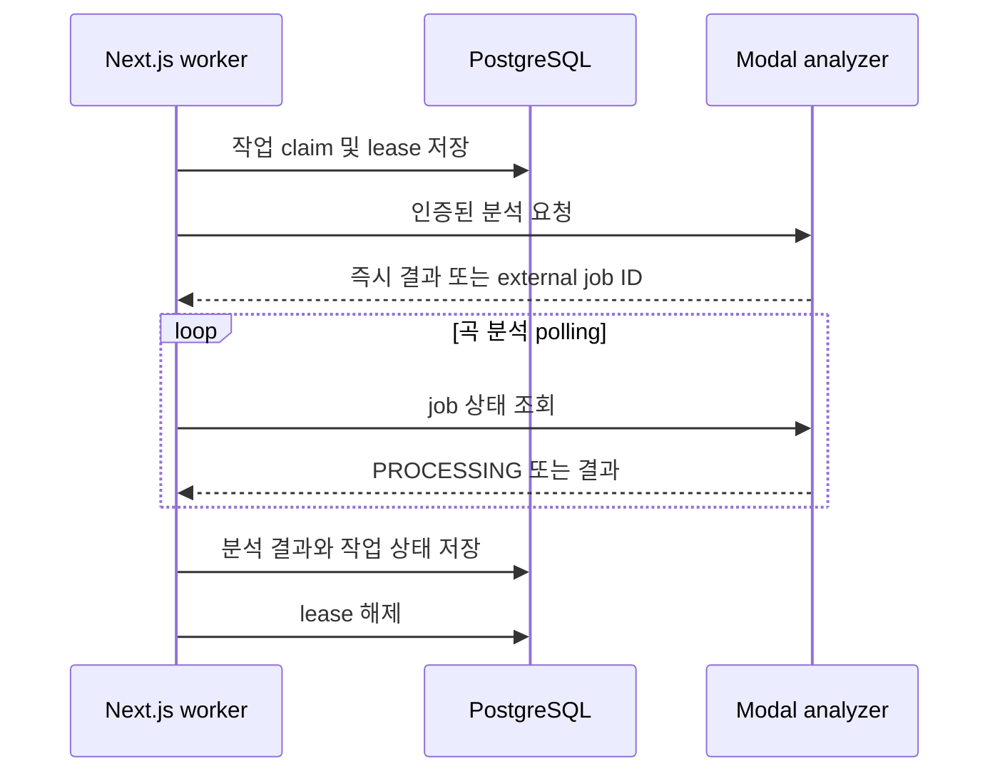

# 실행·설정·배포와 운영 복구

이 페이지는 Copysinger를 **실제로 시작하고 검증하는 순서**를 설명한다. 웹 앱은 작업을 PostgreSQL에 기록하고, `pnpm dev` 또는 `pnpm start`가 시작한 worker가 작업을 lease로 점유한다. 따라서 웹 프로세스만 올라와도 분석·믹싱이 자동으로 끝나는 것은 아니다. 시스템 구성과 작업 수명주기는 [/openwiki/architecture/durable-workers.md](/openwiki/architecture/durable-workers.md)를 함께 참고한다.

## 실행 전 확인

코드가 요구하는 기본 실행 환경은 다음과 같다.

- Node.js `>=22.13.0`
- pnpm `11.9.0`
- PostgreSQL과 Docker
- 인증을 사용할 경우 Better Auth, Google OAuth, 관리자 이메일 설정
- 사용자 파일 저장을 위한 Leemage project와 API key
- 보컬 프로필·곡 카탈로그 분석을 위한 배포된 Modal service
- production에서 결과 오디오를 변환할 FFmpeg

Prisma client와 seed는 `DATABASE_URL`을 반드시 요구한다. Prisma CLI는 `.env.local`을 먼저 읽고 `.env`를 fallback으로 읽는다. [Prisma 설정](repo://prisma.config.ts#L4-L14)과 [Prisma client 생성](repo://src/shared/db/prisma.ts#L10-L21)을 기준으로 연결 문자열을 준비한다. 저장소에 secret 값을 커밋하지 말고, 변수의 역할만 배포 환경에 등록한다.

## 로컬 PostgreSQL과 애플리케이션 시작

`docker compose up -d`는 `postgres:16-alpine`을 시작하고 named volume `postgres_data`에 데이터를 보존한다. 기본 컨테이너 포트 `5432`는 호스트의 `POSTGRES_PORT`로 매핑되며, 기본 호스트 포트는 `5433`이다. `POSTGRES_DB`, `POSTGRES_USER`, `POSTGRES_PASSWORD`를 지정하지 않으면 compose의 개발 기본값을 사용한다. healthcheck는 `pg_isready`를 5초 간격으로 최대 10회 확인한다. [Compose 정의](repo://docker-compose.yml#L2-L20)

권장 순서는 다음과 같다.

```bash
pnpm install --frozen-lockfile
cp .env.example .env.local
docker compose up -d
pnpm run db:migrate:deploy
pnpm run db:generate
pnpm dev
```

`pnpm dev`는 `concurrently --kill-others-on-fail`로 다음 네 프로세스를 함께 실행한다.

- `next dev` 웹 서버
- `worker:mixing`
- `worker:vocal-profile-analysis`
- `worker:song-analysis`

따라서 네 프로세스 중 하나가 실패하면 나머지도 종료된다. 웹은 기본적으로 `http://localhost:3000`에서 확인한다. 로컬 PostgreSQL만 중지하려면 `docker compose down`을 사용한다. volume을 지우는 명령은 이 프로젝트의 package script로 정의되어 있지 않으므로 데이터가 필요하면 named volume을 보존한다. [실행 script](repo://package.json#L9-L21)

## Prisma 스키마와 seed 운영

`prisma.config.ts`는 schema를 `prisma/schema.prisma`, migration을 `prisma/migrations`, seed command를 `tsx prisma/seed.ts`로 지정한다.

| 목적 | 명령 | 운영 의미 |
| --- | --- | --- |
| 스키마 유효성 검사 | `pnpm run db:validate` | Prisma schema가 유효한지 확인 |
| 개발 migration 생성·적용 | `pnpm run db:migrate` | 로컬 스키마 변경을 migration으로 만들고 적용 |
| 배포 migration 적용 | `pnpm run db:migrate:deploy` | 커밋된 migration을 대상 DB에 적용 |
| client 생성 | `pnpm run db:generate` | Prisma generated client 갱신 |
| fixture seed | `pnpm run db:seed` | idempotent fixture를 upsert |
| migration 상태 | `pnpm run db:status` | 적용 상태 확인 |
| 기본 관계 검증 | `pnpm run db:verify` | seed된 사용자 profile과 song 관계 확인 |
| 카탈로그 검증 | `pnpm run catalog:db:verify` | 카탈로그가 비어 있거나 유효하지 않으면 실패 |

seed는 `USER_TEST` recording과 `SONG_SOURCE` recording, 각각의 fixture `VocalProfile`, `READY` 상태의 `Example Song`을 고정 UUID로 upsert한다. `DATABASE_URL`이 없으면 즉시 실패한다. 기존 row의 대부분은 덮어쓰지 않으므로 개발 데이터가 있으면 seed가 전체 DB를 초기화하지 않는다는 점을 유의한다. [seed 구현](repo://prisma/seed.ts#L18-L30) [seed 데이터와 upsert](repo://prisma/seed.ts#L32-L125)

새 PostgreSQL을 production에 붙인 뒤에는 다음 순서로 확인한다.

1. `pnpm run db:migrate:deploy`
2. 필요하면 `pnpm run db:generate`
3. 카탈로그 snapshot을 관리자 화면 `/admin/songs`에서 가져온다.
4. `pnpm run db:verify`와 `pnpm run catalog:db:verify`를 실행한다.

카탈로그 검증 결과는 항목이 0개이거나 `invalid` 항목이 있으면 exit code 1을 설정한다. [카탈로그 검증 script](repo://scripts/verify-database-song-catalog.ts#L3-L14)

## Modal 분석기 배포

두 분석기는 각각 독립된 Modal app이다. 배포 전 Modal 인증과 코드가 참조하는 Modal Secret `soulx-api-secret`을 준비해야 한다. 두 FastAPI 앱 모두 `SOULX_API_KEY`가 없으면 health와 API 요청을 503으로 거부하고, 키가 다르면 401을 반환한다. 키의 실제 값은 문서나 저장소에 기록하지 않는다. [보컬 분석 API 인증과 배포 설정](repo://services/vocal-profile-modal/modal_app.py#L45-L61) [곡 분석 API 인증](repo://services/song-catalog-analyzer/modal_app.py#L34-L68)

```bash
pnpm run modal:vocal-profile:deploy
pnpm run modal:song-catalog:deploy
```

보컬 프로필 분석기는 CPU 2개·4096 MiB, timeout 120초, 최대 10 container, container당 동시 입력 1개로 동작하며 유휴 scaledown window는 60초이다. 업로드는 25 MB를 넘을 수 없다. 분석 중 임시 작업 디렉터리를 사용하고 응답 전에 정리한다. [보컬 분석기 리소스와 제한](repo://services/vocal-profile-modal/modal_app.py#L21-L30) [업로드·정리 흐름](repo://services/vocal-profile-modal/modal_app.py#L232-L304)

곡 카탈로그 분석기는 CPU 8개·16,384 MB, timeout 3,600초, 최대 4개 container를 사용한다. 파일 크기 상한은 100 MB이고 허용 확장자는 `.m4a`, `.mp3`, `.mp4`, `.wav`, `.webm`이다. 작업은 Modal `Dict`에 `requestId`와 external job ID를 연결하므로 같은 request를 재전송하면 기존 job을 재사용한다. 분석은 FFmpeg 변환, `htdemucs` CPU 분리, librosa chroma 기반 key 추정, pYIN 분석 순서로 진행하며 임시 디렉터리가 남으면 실패한다. [곡 분석 제한과 job index](repo://services/song-catalog-analyzer/modal_app.py#L19-L36) [분석 pipeline](repo://services/song-catalog-analyzer/modal_app.py#L149-L228) [job 제출과 polling API](repo://services/song-catalog-analyzer/modal_app.py#L247-L309)



이 그림은 보컬 분석의 동기 응답과 곡 분석의 external job polling을 공통 worker 수명주기 안에서 비교한다.

## production start

단일 인스턴스 production 배포는 build 뒤 `pnpm start`를 실행한다.

```bash
pnpm install --frozen-lockfile
pnpm run db:migrate:deploy
pnpm build
pnpm start
```

`pnpm start`는 `next start`와 동일한 세 worker를 `concurrently --kill-others-on-fail`로 감독한다. 한 프로세스가 실패하면 전체가 종료되므로 배포 플랫폼이 인스턴스를 재시작하도록 구성한다. 다중 인스턴스에서는 모든 인스턴스가 같은 PostgreSQL을 보도록 해야 하며, `FOR UPDATE SKIP LOCKED` claim과 lease가 중복 점유를 막는 현재 설계를 유지해야 한다. [production script](repo://package.json#L17-L21) [믹싱 작업 claim](repo://src/_app/background-jobs/mixing/worker.ts#L92-L130)

## 환경변수와 허용 범위

`integerEnv`는 공백을 제거하고 값이 없으면 fallback을 사용한다. 정수가 아니거나 범위를 벗어나면 프로세스가 해당 설정을 읽는 시점에 예외를 낸다. 티켓 값은 0~1,000, concurrency와 lease·polling 값은 아래 코드 기본값과 범위를 따른다. [환경변수 파서](repo://src/shared/config/server-env.ts#L3-L12)

| 변수 | 기본값 | 허용 범위 | 역할 |
| --- | ---: | ---: | --- |
| `SIGNUP_VOCAL_ANALYSIS_TICKET_GRANT` | 5 | 0–1,000 | 가입 시 보컬 분석 ticket 지급량 |
| `SIGNUP_MIXING_TICKET_GRANT` | 1 | 0–1,000 | 가입 시 믹싱 ticket 지급량 |
| `MIXING_TICKET_COST` | 1 | 0–1,000 | 믹싱 1건 비용 |
| `VOCAL_PROFILE_ANALYSIS_TICKET_COST` | 1 | 0–1,000 | 보컬 분석 비용 |
| `MIXING_WORKER_CONCURRENCY` | 1 | 1–32 | 믹싱 worker 동시 작업 수 |
| `MIXING_MAX_ATTEMPTS` | 3 | 1–20 | 믹싱 최대 시도 수 |
| `MIXING_LEASE_SECONDS` | 120초 | 30–3,600초 | 믹싱 lease 유효 시간 |
| `MIXING_POLL_INTERVAL_MS` | 5,000ms | 100–60,000ms | 믹싱 external job polling 간격 |
| `VOCAL_PROFILE_ANALYSIS_WORKER_CONCURRENCY` | 1 | 1–16 | 보컬 분석 worker 동시 작업 수 |
| `VOCAL_PROFILE_ANALYSIS_MAX_ATTEMPTS` | 3 | 1–10 | 보컬 분석 최대 시도 수 |
| `VOCAL_PROFILE_ANALYSIS_LEASE_SECONDS` | 300초 | 180–3,600초 | 보컬 분석 lease 유효 시간 |
| `SONG_ANALYSIS_WORKER_CONCURRENCY` | 1 | 1–8 | 곡 분석 worker 동시 작업 수 |
| `SONG_ANALYSIS_LEASE_SECONDS` | 300초 | 180–3,600초 | 곡 분석 lease 유효 시간 |
| `SONG_ANALYSIS_POLL_INTERVAL_MS` | 2,500ms | 250–30,000ms | Modal 곡 분석 polling 간격 |

외부 연동 변수의 역할은 다음과 같다. `DATABASE_URL`은 PostgreSQL 연결 문자열이다. `MODAL_API_URL`·`MODAL_API_KEY`는 믹싱 API, `VOCAL_PROFILE_MODAL_URL`과 `VOCAL_PROFILE_MODAL_API_KEY`는 보컬 분석 API, `SONG_ANALYSIS_MODAL_URL`과 `SONG_ANALYSIS_MODAL_API_KEY`는 곡 분석 API에 사용된다. 분석 API key는 전용 변수보다 공통 `MODAL_API_KEY` fallback을 지원한다. `BETTER_AUTH_SECRET`, `BETTER_AUTH_URL`, `GOOGLE_CLIENT_ID`, `GOOGLE_CLIENT_SECRET`, `ADMIN_EMAILS`, `LEEMAGE_API_KEY`, `LEEMAGE_PROJECT_ID`는 `pnpm run verify:feature-config`가 공백·누락을 검사하는 필수 feature 변수다. [feature 설정 검증](repo://scripts/verify-feature-config.ts#L5-L21) [Modal endpoint 설정](repo://src/shared/config/server-env.ts#L66-L74)

`pnpm run verify:feature-config -- --leemage`를 실행하면 필수 변수 검사 후 Leemage에 임시 text file을 업로드하고 삭제하는 storage smoke test도 수행한다. 업로드가 끝나도 `finally`에서 smoke file을 삭제하므로 운영 검증 후 잔여 파일을 만들지 않는다. [Leemage smoke test](repo://scripts/verify-feature-config.ts#L23-L39)

## concurrency·lease 조정과 복구

worker는 새 `PENDING` 작업 또는 lease가 없거나 만료된 처리 중 작업만 원자적으로 claim한다. `FOR UPDATE SKIP LOCKED`가 다른 worker가 잠근 후보를 건너뛰고, claim 시 시도 횟수·owner·lease 만료 시각·heartbeat를 기록한다. 유효한 lease를 가진 작업은 다른 worker가 가져가지 않는다. song analysis worker는 READY 상태의 `CatalogTargetAsset`이 있어야 claim한다. [곡 분석 claim 전제](repo://src/_app/background-jobs/song-analysis/worker.ts#L30-L60)

lease는 작업의 예상 외부 호출 시간보다 길게 설정하되, 장애 시 재시작 대기 시간을 불필요하게 늘리지 않도록 조정한다. concurrency를 올리면 Modal·Leemage·PostgreSQL 부하도 함께 증가한다. lease를 너무 짧게 설정하면 정상 작업이 만료되어 중복 실행될 수 있다. song analysis heartbeat는 60초마다 lease를 갱신하고, lease owner가 일치하지 않으면 후속 저장을 막는다. [곡 분석 heartbeat와 외부 job 재개](repo://src/_app/background-jobs/song-analysis/worker.ts#L63-L75) [external job 저장과 polling](repo://src/_app/background-jobs/song-analysis/worker.ts#L149-L199)

실패 복구는 다음 불변식을 따른다.

- 일시적 실패는 `nextAttemptAt` 이후 `PENDING`으로 되돌아가며, retryable이고 `maxAttempts` 미만일 때만 재시도한다.
- 최대 시도에 도달하거나 재시도 불가능한 오류면 `FAILED`로 남기고 오류 코드와 상세를 저장한다.
- song analysis는 Modal external job ID를 PostgreSQL에 저장하므로 worker 재시작 후 새 job을 만들지 않고 polling을 이어간다.
- 믹싱은 외부 변환 서비스 접수 전에 실패하면 ticket refund를 idempotency key로 한 번만 적용한다. [믹싱 환불 불변식](repo://src/_app/background-jobs/mixing/worker.ts#L146-L159)
- 작업이 멈춘 것처럼 보이면 먼저 DB의 상태, `leaseExpiresAt`, `leaseOwner`, `attempts`, `nextAttemptAt`, 오류 코드를 확인한다. 유효한 lease가 남아 있을 때 수동으로 재실행하지 않는다.

## 운영 검증 체크리스트

1. `pnpm run db:status`로 migration 상태를 확인한다.
2. `pnpm run db:verify`로 기본 관계 graph를 확인한다.
3. `pnpm run catalog:db:verify`로 공개 카탈로그의 유효성을 확인한다.
4. `pnpm run verify:feature-config`로 인증·관리자·Leemage 설정의 누락을 찾는다.
5. 저장소 연동까지 확인할 때만 `pnpm run verify:feature-config -- --leemage`를 실행한다.
6. Modal의 `/health`를 인증된 요청으로 확인한다. 보컬 분석기는 analyzer version·compute·autoscaling을, 곡 분석기는 pipeline·compute를 반환한다. [보컬 health 응답](repo://services/vocal-profile-modal/modal_app.py#L122-L143) [곡 health 응답](repo://services/song-catalog-analyzer/modal_app.py#L238-L244)
7. 변경 후에는 `pnpm run check`를 실행한다. 전체 회귀가 필요하면 `pnpm test`를 실행한다. 두 명령은 package script에 정의된 정적 검사·typecheck·architecture check와 production build·테스트 묶음을 사용한다. [검증 script](repo://package.json#L23-L39)

변수 누락은 검증 script에서 exit code 1을 만들고, runtime secret 누락은 해당 client나 Modal API가 명시적인 설정 오류 또는 503으로 실패하게 한다. 값 자체를 로그·문서·snapshot에 남기지 않는 것을 운영 원칙으로 삼는다.
