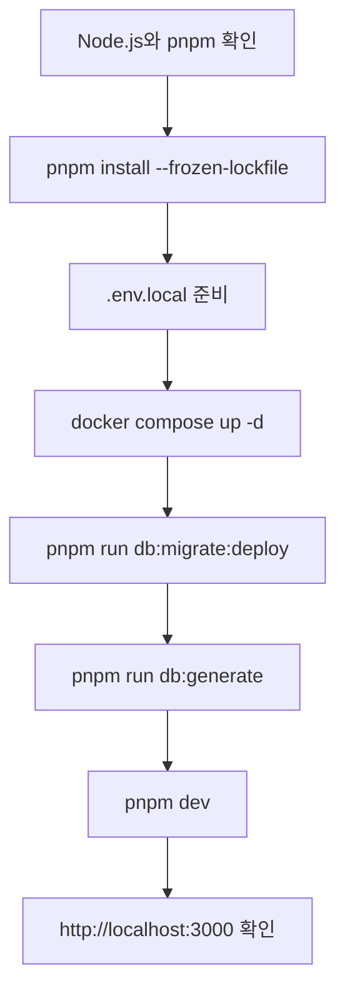

# 빠른 시작과 탐색 경로

이 페이지의 목표는 로컬에서 Copysinger를 띄우고 다음에 읽을 문서를 바로 고르는 것이다. **Node.js와 pnpm을 확인한 뒤 의존성·환경 설정을 준비하고, PostgreSQL을 시작하고, migration과 Prisma Client를 준비한 다음 `pnpm dev`를 실행한다.** 앱은 `http://localhost:3000`에서 확인한다.

## 1. 실행 전 전제 확인

다음 도구와 외부 서비스가 필요하다.

- Node.js `>=22.13.0`
- pnpm `11.9.0`
- Docker 20 이상
- Google OAuth web client
- Leemage project와 API key
- 배포된 Modal 분석·믹싱 서비스
- production 결과 오디오 변환이 필요할 때 FFmpeg

버전과 package script는 `package.json`에 정의되어 있다. 서버 credential은 공개 문서나 browser 코드에 넣지 않는다. 저장소의 Quick Start는 `.env.example`을 `.env.local`로 복사하도록 안내하므로, 실제 환경 변수는 해당 예시와 운영 문서의 조건에 맞춰 별도로 준비한다.

## 2. PostgreSQL과 애플리케이션 초기화

저장소가 제공하는 Compose 설정은 `postgres:16-alpine`을 실행한다. 호스트 포트는 `POSTGRES_PORT`이며 기본값은 `5433`, 컨테이너 포트는 `5432`다. Compose의 개발 기본값은 데이터베이스 `copy_singer`, 사용자 `copy_singer`, 비밀번호 `copy_singer_dev`다. 애플리케이션이 사용하는 `DATABASE_URL`이 이 PostgreSQL을 가리키는지 먼저 확인한다.

명령은 다음 순서를 지킨다.

```bash
pnpm install --frozen-lockfile
cp .env.example .env.local
docker compose up -d
pnpm run db:migrate:deploy
pnpm run db:generate
pnpm dev
```

`docker compose up -d`가 PostgreSQL을 백그라운드에서 시작하고 healthcheck를 수행한다. `pnpm run db:migrate:deploy`가 migration을 적용한 뒤 `pnpm run db:generate`가 `src/shared/db/generated/prisma`에 Prisma Client를 생성한다. 이미 초기화된 데이터베이스에서도 migration 적용과 client 생성은 실행 가능한 확인 단계다.



이 그림은 로컬 초기화 명령의 의존 순서를 보여준다.

### 실행 확인 지점

- 브라우저에서 `http://localhost:3000`이 열리는지 확인한다.
- `pnpm dev`는 `dev:web`, `worker:mixing`, `worker:vocal-profile-analysis`, `worker:song-analysis`를 함께 시작한다.
- 데이터 모델과 상태 enum은 `prisma/schema.prisma`가 기준이다. 예를 들어 녹음은 `PENDING`, `READY`, `FAILED`, `DELETED` 상태를 사용하고, 곡 분석 작업은 `PENDING`, `PROCESSING`, `SUCCEEDED`, `FAILED` 수명주기를 가진다.
- 외부 분석 서비스가 준비되지 않으면 웹 프로세스가 떠도 분석 작업이 성공하지 않을 수 있다. worker는 PostgreSQL에 저장된 durable job을 처리하므로 작업 흐름을 점검할 때 웹 로그만 보지 않는다.

## 3. 화면과 작업별 진입점

| 하려는 일 | 먼저 열 경로 | 이어서 읽을 문서 |
| --- | --- | --- |
| 공개 서비스와 로그인 확인 | `/`, `/login` | [인증·소유권·관리자 접근 제어](concepts/access-control.md) |
| 녹음·업로드 후 보컬 분석 | `/profile` | [보컬 프로필 분석 워크플로](workflows/vocal-profile-analysis.md), [보컬 분석과 추천 도메인](concepts/vocal-analysis-and-recommendations.md) |
| 추천 결과와 키 적합도 이해 | `/recommendations/[id]` | [곡 카탈로그와 추천 대상 수명주기](concepts/catalog-and-recommendations.md), [보컬 분석과 추천 도메인](concepts/vocal-analysis-and-recommendations.md) |
| 추천곡 선택 후 AI 믹싱 | 추천 결과 화면 | [추천에서 AI 믹싱 결과까지](workflows/recommendation-to-mixing.md) |
| 라이브러리·계정·티켓 확인 | `/library`, `/account`, `/notifications` | [계정·티켓·알림 흐름](workflows/account-and-tickets.md) |
| 관리자 카탈로그 운영 | `/admin`, `/admin/songs`, `/admin/custom-mixing` | [관리자 카탈로그 운영 워크플로](workflows/catalog-management.md) |

`/recommendations` 단독 화면은 없으며, 보컬 프로필 상세에서 추천을 시작한 뒤 프로필 ID가 포함된 `/recommendations/[id]`로 이동한다. 사용자 audio와 최종 결과 bytes는 Leemage에 저장하고, PostgreSQL에는 소유권과 파일 metadata를 보관한다.

## 4. 구조를 파악한 뒤 변경하기

처음 코드를 찾을 때는 [시스템 지도와 런타임 경계](architecture/system-map.md)를 먼저 읽는다. 이 서비스는 Next.js App Router adapter, FSD 계층, PostgreSQL, Leemage, Modal 및 SoulX-Singer 경계로 나뉜다. root `app/`은 route convention과 FSD public API 재노출을 맡고, 실제 조합과 server capability는 `src/_app/` 및 하위 계층에 있다. `src/_app/layout/index.server.ts`는 `ProductLayout`, `productMetadata`, `RootLayout`, `generateMetadata`를 server entrypoint로 재노출한다. root layout은 `lang="ko"`, `QueryProvider`, `TooltipProvider`, `Toaster`를 애플리케이션 경계에 배치한다.

변경 목적에 따라 다음 경로를 선택한다.

- 데이터 관계·상태·영속성: [도메인 데이터 모델과 영속성](architecture/data-model.md)
- FSD layer와 browser-safe·model·server public API: [모듈 경계와 서버 역량](architecture/module-boundaries.md)
- Google·Leemage·Modal 계약: [Google·Leemage·Modal 통합 계약](integrations/external-services.md)
- 환경 변수, 배포, migration, worker 운영: [설정·로컬 실행·배포 운영](operations/configuration-and-deployment.md)
- job claim, lease, retry, 재시작 복구: [Durable job 처리와 장애 복구](operations/job-processing.md)

## 5. 변경 후 검증

빠른 정적 확인은 다음 명령으로 시작한다.

```bash
pnpm run check
pnpm run db:validate
```

`pnpm run check`는 Biome, ESLint, TypeScript 검사와 FSD architecture 검사를 실행한다. 데이터베이스 schema를 바꿨다면 `pnpm run db:validate`와 migration 상태를 함께 확인한다. 전체 회귀 검증은 build, domain/unit, PostgreSQL integration, API contract, FSD boundary 및 Storybook 검사를 포함하므로 다음 명령을 사용한다.

```bash
pnpm test
```

변경 영역에 맞춘 좁은 진입점은 [검증 전략과 변경 안전망](testing/test-strategy.md)에서 고른다. worker나 큐를 바꿨다면 job processing과 해당 integration suite를, 추천·믹싱·인증·media를 바꿨다면 각 도메인 suite를 함께 실행한다.

## 다음 읽기 순서

1. 전체 요청·비동기 경계가 필요하면 [시스템 지도와 런타임 경계](architecture/system-map.md)를 읽는다.
2. 기능을 수정하려면 해당 [도메인](concepts/catalog-and-recommendations.md)과 [워크플로](workflows/recommendation-to-mixing.md)를 선택한다.
3. 환경 변수와 배포 또는 장애 복구가 목적이면 [운영 문서](operations/configuration-and-deployment.md)와 [job 처리 문서](operations/job-processing.md)로 이동한다.
4. 마지막으로 변경 유형에 맞는 [테스트 전략](testing/test-strategy.md)에서 검증 명령을 고른다.

이 페이지의 명령과 경로는 현재 `README.md`, `package.json`, `docker-compose.yml`, `prisma/schema.prisma`, `src/_app/layout/index.server.ts` 및 route 구조를 기준으로 한다. 외부 credential의 실제 값은 기록하지 않는다.
