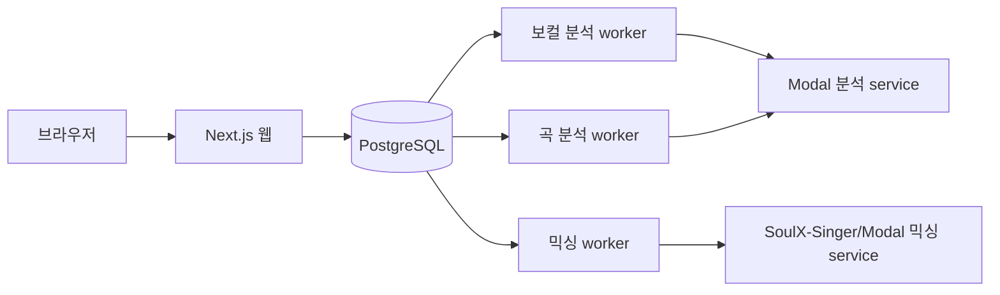

# 빠른 시작과 작업 경로

이 페이지는 저장소를 처음 실행하는 개발자가 **웹·PostgreSQL·세 background worker가 함께 동작하는지 확인한 뒤**, 변경할 영역의 정본 문서로 이동하도록 돕는다. 브라우저 요청은 Next.js가 받고, 분석·믹싱 작업은 PostgreSQL에 기록하며, 별도 worker가 처리한다. [README의 실행 요구사항과 로컬 절차](repo://README.md#L149-L184)를 기준으로 시작한다.

## 로컬 실행

### 필요한 도구와 설정

- Node.js `22.13.0` 이상
- `pnpm 11.9.0`
- Docker 20 이상
- 실제 인증·미디어·분석 기능에 필요한 Google OAuth web client, Leemage project/API key, 배포된 Modal 분석·믹싱 service, FFmpeg

비밀값이나 ignored 환경 파일의 값은 문서와 명령에 복사하지 않는다. 애플리케이션은 `DATABASE_URL`을 필수로 읽고, 외부 service 설정은 환경변수로 읽는다. 값의 필수 여부와 허용 범위는 [서버 환경 설정](repo://src/shared/config/server-env.ts#L3-L74), Prisma 연결은 [Prisma client 설정](repo://src/shared/db/prisma.ts#L8-L16)에서 확인한다.

### 권장 실행 순서

저장소 루트에서 실행한다.

```bash
pnpm install --frozen-lockfile
docker compose up -d
pnpm run db:migrate:deploy
pnpm run db:generate
pnpm dev
```

`docker compose up -d`는 `postgres:16-alpine`을 시작하고 기본적으로 호스트 `5433`을 컨테이너의 PostgreSQL `5432`에 연결한다. `POSTGRES_DB`, `POSTGRES_USER`, `POSTGRES_PASSWORD`, `POSTGRES_PORT`는 환경변수로 덮어쓸 수 있으므로 `DATABASE_URL`이 같은 데이터베이스를 가리키는지 확인한다. Compose는 `pg_isready` healthcheck를 사용한다. [Compose 정의](repo://docker-compose.yml#L2-L20)에 포트, volume, healthcheck가 있다.

`db:migrate:deploy`는 migration을 적용하고 `db:generate`는 Prisma client를 만든다. 스키마를 변경하는 개발 작업에는 `pnpm run db:migrate`, migration 상태에는 `pnpm run db:status`, 연결·관계 확인에는 `pnpm run db:verify`를 사용한다. seed 데이터가 필요할 때만 `pnpm run db:seed`를 실행한다. 명령의 정본은 [package.json scripts](repo://package.json#L9-L44)다.

### 실행 확인 지점

- 웹: <http://localhost:3000>
- 공개 랜딩: `/`
- 녹음·업로드와 보컬 분석: `/profile`
- 추천 결과: `/recommendations/[id]` (`/recommendations` 단독 화면은 없다)
- 보컬 프로필·믹싱 결과: `/library`
- 계정·티켓 원장: `/account`
- 관리자와 곡 카탈로그: `/admin`, `/admin/songs`
- 관리자 커스텀 믹싱: `/admin/custom-mixing`

`pnpm dev`는 `concurrently --kill-others-on-fail`로 웹과 다음 세 worker를 함께 실행한다. 따라서 한 프로세스가 실패하면 나머지도 종료된다.

| 프로세스 | 실행 명령 | 책임 |
| --- | --- | --- |
| 웹 | `pnpm run dev:web` | Next.js App Router와 Route Handler 제공 |
| 믹싱 worker | `pnpm run worker:mixing` | SoulX-Singer/Modal 믹싱 job 처리 |
| 보컬 분석 worker | `pnpm run worker:vocal-profile-analysis` | 사용자 녹음의 보컬 프로필 분석 처리 |
| 곡 분석 worker | `pnpm run worker:song-analysis` | 관리자 카탈로그 곡 분석 처리 |

`pnpm start`도 `start:web`과 같은 세 worker를 감독한다. 이 묶음은 단일 인스턴스에서 하나의 실패를 전체 재시작 신호로 전달하는 운영 전제다. 실제 명령 묶음은 [package.json의 dev/start scripts](repo://package.json#L9-L21)에서 확인한다.



웹은 작업을 PostgreSQL에 접수하고 즉시 응답한다. worker는 새 `PENDING` 작업 또는 lease가 없거나 만료된 처리 중 작업을 원자적으로 점유한다. 유효한 lease를 가진 다른 worker의 작업은 점유하지 않는다. 따라서 worker 재시작 뒤 만료 작업을 다시 처리할 수 있지만, 같은 작업을 동시에 처리하도록 만드는 구성은 피해야 한다. claim·lease·외부 job ID·재시도 semantics는 [durable worker 아키텍처](/openwiki/architecture/durable-workers.md)에서 확인한다.

## 작업 질문별 정본 문서

아래 표에서 질문에 가장 가까운 행을 먼저 읽는다. 이 페이지는 실행 진입점이고, 각 문서가 해당 영역의 소유권·상태·변경 경계를 설명한다.

| 작업 질문 | 먼저 읽을 정본 | 여기서 확인할 것 |
| --- | --- | --- |
| 사용자가 녹음하고 분석·추천·믹싱 결과를 확인하는 흐름은 어디에 있는가? | [사용자 기능: 도메인 데이터 모델](/openwiki/concepts/domain-data-model.md) | `Recording`, `VocalProfile`, `Song`, job와 결과의 영속 관계 |
| 관리자가 곡과 YouTube 출처를 등록·분석·게시하려면 무엇을 지켜야 하는가? | [카탈로그 수집·분석·게시 운영](/openwiki/operations/catalog-ingestion-and-publishing.md) | PostgreSQL 큐, 분석 결과, target asset, 검증·게시 순서 |
| Google OAuth, 관리자 접근, 사용자 소유권, signup grant와 티켓 차감은 어떻게 이어지는가? | [인증·데이터 소유권·티켓과 알림](/openwiki/concepts/identity-ownership-and-entitlements.md) | 세션 경계, 소유권 검사, 티켓 원장과 작업 실패 시 비용 의미 |
| reference와 결과 audio는 어디에 저장되고 언제 정리되는가? | [미디어 저장·프록시·정리 수명주기](/openwiki/operations/media-lifecycle.md) | Leemage 파일과 PostgreSQL metadata, private audio proxy, cleanup 복구 |

구조 경계를 바꾸는 작업은 [시스템 경계와 요청 표면](/openwiki/architecture/system-boundaries.md), worker의 점유·lease를 바꾸는 작업은 [durable worker 아키텍처](/openwiki/architecture/durable-workers.md)를 함께 읽는다. 외부 API 인증과 파일 경계를 바꿀 때는 [외부 service 연동 문서](/openwiki/integrations/external-services.md)를 참고한다.

## 변경 후 확인

빠른 정적 검사는 다음과 같다.

```bash
pnpm run check
pnpm run db:validate
```

기능을 바꿀 때는 전체 `pnpm test`보다 먼저 관련 검사를 고른다. 인증·소유권은 `pnpm run test:auth:db`, 티켓은 `pnpm run test:tickets`, 미디어는 `pnpm run test:media`, 카탈로그는 `pnpm run test:catalog-targets`와 `pnpm run test:song-analysis-queue`, worker 큐는 `pnpm run test:vocal-profile-analysis-queue`와 `pnpm run test:mixing:db`가 초점이다. 명령과 전체 회귀 구성은 [package.json 테스트 scripts](repo://package.json#L23-L67)에서 확인한다.

전체 회귀 묶음은 `pnpm test`다. 이 명령은 production build, 도메인·DB integration, API contract, FSD boundary, Storybook interaction까지 실행하므로 PostgreSQL과 외부 service가 필요한 검사의 전제조건을 먼저 확인한다.

## 문제 발생 시 확인 순서

1. PostgreSQL 컨테이너 상태와 Compose 노출 포트가 `DATABASE_URL`과 일치하는지 확인한다.
2. `pnpm run db:status`로 migration 상태를 확인하고 필요하면 `pnpm run db:migrate:deploy`를 다시 실행한다.
3. `pnpm run db:verify`로 데이터베이스 연결과 관계를 확인한다. `DATABASE_URL`이 없으면 이 검사는 실패한다.
4. 외부 API를 사용하는 시나리오라면 service URL과 key가 설정되었는지 확인한다. worker가 `.env.local`, `.env`를 읽더라도 비밀값을 로그나 문서에 남기지 않는다.
5. 한 worker만 재현하려면 웹을 중지하고 표의 해당 `pnpm run worker:*` 명령을 실행한다. lease 만료·재시도·외부 job ID 복구는 [durable worker 아키텍처](/openwiki/architecture/durable-workers.md)의 failure semantics를 따른다.

실행이 정상화된 뒤에는 작업 질문별 정본으로 이동한다. 사용자 기능의 데이터 관계는 [도메인 데이터 모델](/openwiki/concepts/domain-data-model.md), 운영 수명주기는 [미디어 수명주기](/openwiki/operations/media-lifecycle.md), 접근·과금은 [인증·소유권·entitlement](/openwiki/concepts/identity-ownership-and-entitlements.md)에서 계속 확인한다.
