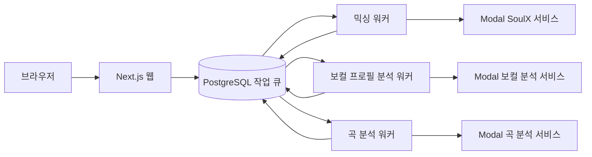

`pnpm dev`까지 실행하면 Copysinger의 Next.js 웹과 믹싱·보컬 프로필 분석·곡 분석 워커가 함께 시작돼요. 먼저 로컬 데이터베이스를 준비하고, 브라우저에서 `http://localhost:3000`을 확인하세요. 그다음 바꾸려는 영역에 맞춰 시스템 경계, 런타임 설정, 워크플로, 테스트 문서를 순서대로 읽으면 안전한 첫 변경 경로를 잡을 수 있어요.

## 로컬에서 동작하는 상태 만들기

저장소가 요구하는 기본 도구는 Node.js `>=22.13.0`, pnpm `11.9.0`, Docker 20 이상이에요. 외부 분석·인증·미디어 기능을 실제로 사용하려면 Google OAuth, Leemage, 배포된 Modal 서비스와 필요한 환경 설정도 준비해야 해요. 이 페이지에서는 비밀값을 복사하지 않아요.

`.env.example`을 복사하는 명령은 README에 있지만, 현재 추적 파일 메타데이터에서는 `.env.example`을 확인할 수 없어요. 따라서 그 파일의 실제 제공 여부와 환경 변수 목록은 이 생성 입력에서 확정할 수 없어요. 파일이 제공되는 작업 트리에서만 다음 명령을 실행하고, 값은 각 개발 환경의 비밀 관리 방식으로 채우세요.

```bash
pnpm install --frozen-lockfile
cp .env.example .env.local
docker compose up -d
pnpm run db:migrate:deploy
pnpm run db:generate
pnpm dev
```

`docker compose up -d`는 `postgres:16-alpine`을 실행하고 호스트의 `5433` 포트를 컨테이너의 `5432` 포트에 연결해요. `postgres_data` 볼륨은 데이터베이스 데이터를 유지하고, Compose healthcheck는 `pg_isready`를 사용해요. `DATABASE_URL`이 로컬 PostgreSQL을 가리키는지 확인한 뒤 migration과 Prisma Client 생성을 실행하세요.

실행이 끝나면 `http://localhost:3000`을 열어 웹이 응답하는지 확인하세요. `pnpm dev`는 `concurrently --kill-others-on-fail`로 네 프로세스를 감독해요. 웹이나 워커 하나가 실패하면 나머지도 종료되므로, 터미널의 해당 프로세스 로그를 먼저 확인하세요.

## 웹 요청과 워커의 경계 이해하기

웹은 오래 걸리는 분석·믹싱을 직접 기다리지 않고 PostgreSQL 작업 큐에 접수해요. 워커는 큐에서 작업을 점유하고, 필요한 외부 분석 또는 믹싱 서비스를 호출한 뒤 상태와 결과를 데이터베이스에 저장해요.



세 워커의 추적 가능한 시작점은 [`package.json`의 worker scripts](repo://package.json#L9-L23)예요. 각 스크립트는 `.env.local`을 `.env`보다 먼저 읽고, 대응하는 `run...Worker()` 런처를 호출해요. [믹싱 워커 엔트리포인트](repo://scripts/mixing-worker.ts#L3-L7), [곡 분석 워커 엔트리포인트](repo://scripts/song-analysis-worker.ts#L3-L6), [보컬 프로필 분석 워커 엔트리포인트](repo://scripts/vocal-profile-analysis-worker.ts#L3-L8)에서 이 연결을 직접 따라가세요.

워커 런처는 설정된 동시성만큼 lane을 만들고 각 lane에 고유한 소유자 문자열을 부여해요. 처리할 작업이 없으면 1초 쉬며 다시 확인하고, `SIGINT`나 `SIGTERM`을 받으면 새 polling을 멈춰요. 실제 lease, 재시도, 외부 job polling 규칙은 실행 명령과 분리된 운영 계약이므로 [로컬·운영 실행과 워커 설정 레퍼런스](operations/configuration-and-runtime.md)를 먼저 참고하세요.

세 워커의 외부 호출 방식은 같지 않아요. 믹싱과 곡 분석은 외부 job ID를 저장하고 상태를 polling하지만, 보컬 프로필 분석은 하나의 동기 analyzer 응답을 기다려요. 이 차이를 무시하고 워커를 수정하면 재시작과 실패 처리가 달라질 수 있으니, 도메인 변경 전에 해당 워크플로를 읽으세요.

## 첫 변경을 위한 문서 읽기 순서

변경 목적을 먼저 정하고 아래 순서로 이동하세요. 각 문서는 현재 코드와 테스트를 함께 확인할 때 사용할 목적별 안내서예요.

1. **호출 위치와 public API 경계가 궁금하면** [Next.js와 Feature-Sliced 시스템 경계 이해하기](architecture/system-boundaries.md)를 읽으세요. `app/` route adapter에서 `src/_app/`과 FSD 레이어로 들어가는 경계를 먼저 확인하세요.
2. **환경 변수, migration, 워커 수명 주기를 확인하려면** [로컬·운영 실행과 워커 설정 레퍼런스](operations/configuration-and-runtime.md)를 읽으세요. 동시성·lease·poll 간격의 현재 계약과 로컬/운영 명령을 여기서 확인하세요.
3. **보컬 업로드와 분석을 바꾸려면** [보컬 업로드에서 분석 결과와 프로필 저장까지](workflows/vocal-analysis.md)를 읽으세요. 큐 접수부터 외부 분석, 저장, 실패·환불 경계를 따라가세요.
4. **믹싱 접수나 복구를 바꾸려면** [티켓 접수부터 AI 믹싱 완료·복구까지](workflows/mixing-and-recovery.md)를 읽으세요. lease, 외부 job polling, 재시도와 결과 저장의 순서를 확인하세요.
5. **곡 카탈로그나 추천을 바꾸려면** [곡 카탈로그 분석과 보컬 기반 추천](workflows/recommendations-and-catalog.md)을 읽으세요. 분석 결과가 공개 카탈로그와 추천 결과로 이어지는 경계를 확인하세요.
6. **인증·미디어·Modal 호출을 바꾸려면** [Google OAuth·Leemage·Modal 연동 계약](integrations/external-services.md)을 읽으세요. 입력, 인증 설정, 결과와 실패 계약을 확인하세요.
7. **변경 후 검증 방법을 고르려면** [변경 범위별 테스트와 아키텍처 검증 선택하기](testing/change-validation.md)를 읽으세요. 변경 범위 테스트를 먼저 고르고 필요한 전체 검증을 추가하세요.

## 변경 후 확인할 명령

작은 변경은 관련된 변경 범위 테스트부터 실행하세요. 전체 회귀와 production build까지 확인하려면 다음 명령을 사용하세요.

```bash
pnpm test
pnpm run check
```

`pnpm test`는 build와 도메인·통합·API·경계·Storybook 검증을 포함해요. `pnpm run check`는 Biome, lint, TypeScript, FSD architecture 검사를 실행해요. 변경 범위별 명령과 실패 시 분기 기준은 [변경 범위별 테스트와 아키텍처 검증 선택하기](testing/change-validation.md)에서 확인하세요.

## 다음 탐색 지점

실행만 확인했다면 [Next.js와 Feature-Sliced 시스템 경계 이해하기](architecture/system-boundaries.md)에서 실제 코드의 첫 호출 경계를 추적하세요. 워커 설정을 조정하거나 로컬 장애를 조사할 때는 [로컬·운영 실행과 워커 설정 레퍼런스](operations/configuration-and-runtime.md)로 돌아오세요.
