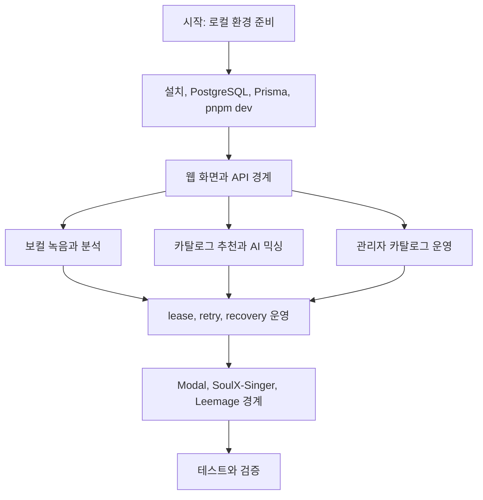

# Copysinger Quickstart

## 이 페이지를 읽는 법

Copysinger는 브라우저 요청을 즉시 처리하는 화면 앱이면서, 무거운 오디오 분석·변환은 PostgreSQL에 접수한 durable job을 별도 Node worker가 처리하는 서비스다. 이 문서는 폴더 목록이 아니라 **다음에 읽거나 실행할 곳을 결정하는 지도**다. 먼저 로컬 실행을 완료한 다음, 바꾸려는 책임에 맞춰 아래 관련 문서로 이동한다.



이 그림은 로컬 설정에서 런타임 표면, 비동기 작업, 외부 통합, 검증으로 이어지는 탐색 순서를 보여준다.

## 1. 로컬에서 실행하기

### 사전 요구사항

- Node.js `22.13.0` 이상
- `pnpm 11.9.0`
- Docker 20 이상과 PostgreSQL
- Google OAuth web client
- Leemage project와 API key
- 배포된 Modal 분석·믹싱 서비스
- production 결과 오디오 변환이 필요하면 FFmpeg

설정 키와 선택 조건은 `.env.example`을 기준으로 확인한다. `.env.local`이나 무시되는 환경 파일의 값은 문서에 복사하지 않는다.

### 재현 가능한 Quick Start

```bash
pnpm install --frozen-lockfile
cp .env.example .env.local
docker compose up -d
pnpm run db:migrate:deploy
pnpm run db:generate
pnpm dev
```

`pnpm dev`는 `next dev`와 함께 mixing, vocal-profile-analysis, song-analysis worker를 `concurrently --kill-others-on-fail`로 시작한다. 기본 웹 주소는 [http://localhost:3000](http://localhost:3000)이다. Compose는 `postgres:16-alpine`을 사용하고 기본적으로 호스트 `5433`을 컨테이너 PostgreSQL `5432`에 연결하며, `postgres_data` 볼륨과 readiness healthcheck를 제공한다. 포트나 DB 기본값을 바꿔야 할 때는 Compose와 애플리케이션 설정의 환경 변수를 함께 맞춘다.

DB 스키마 변경을 개발 중 만들 때는 `pnpm run db:migrate`, 상태 확인은 `pnpm run db:status`, 모델 검증은 `pnpm run db:validate`, 생성 client 갱신은 `pnpm run db:generate`를 사용한다. 기존 migration을 적용하는 초기화·배포 경로는 `pnpm run db:migrate:deploy`다.

## 2. 변경하려는 기능의 진입점 선택

| 목적 | 우선 읽을 문서 | 실제 시작 표면 |
| --- | --- | --- |
| 전체 요청 경계, FSD 의존 방향, DB와 worker 관계 | [System Architecture and Runtime Boundaries](architecture/system-map.md) | `app/`, `src/_app/`, `src/_pages/` |
| 인증, Google OAuth, 소유권, 관리자 권한 | [Authentication, Authorization, and Data Ownership](operations/auth-and-ownership.md) | `app/api/auth/`, 제품·관리자 page/API handler |
| 녹음·업로드에서 보컬 프로필 결과까지 | [Vocal Profile Capture and Analysis](workflows/vocal-analysis.md) | `/profile`, `/api/vocal-profiles`, `/api/vocal-profile-analysis-jobs` |
| 공개 카탈로그, 분석 revision, publish/archive | [Song Catalog Ingestion, Analysis, and Publishing](workflows/catalog-publishing.md) | `/admin/songs`, `app/api/admin/` |
| 프로필 기반 곡·키 추천과 믹싱 접수 | [Recommendation to AI Mixing](workflows/recommendation-and-mixing.md) | `/recommendations`, `/api/recommendations`, `/api/mixing-jobs` |
| Modal·SoulX-Singer HTTP 계약과 모델 처리 | [Modal Analysis and SoulX-Singer Contracts](integrations/modal-processing.md) | `services/`, worker adapter와 API route |
| Leemage bytes, metadata, private proxy, 삭제 | [Media Storage, Proxying, and Cleanup](integrations/media-storage.md) | `src/shared/media/`, media API/proxy |
| claim, lease, heartbeat, polling, retry, refund, cleanup | [Background Jobs, Leases, Retries, and Recovery](operations/job-processing.md) | `scripts/*-worker.ts`, `src/_app/background-jobs/` |
| 로컬·production 설정과 배포 절차 | [Local Setup, Configuration, Deployment, and Verification](operations/local-and-production.md) | `package.json` scripts, Docker, Modal deploy |
| 변경 전후 테스트 범위와 실행 명령 | [Testing and Change-Safety Matrix](testing/verification-strategy.md) | `tests/`, package scripts |

Root `app` 파일은 Next.js route convention과 public API를 연결하는 얇은 adapter다. 실제 페이지 조합·API handler·worker runner를 수정할 때는 대응하는 `src/_app`, `src/_pages`, `src/features`, `src/entities`, `src/shared` public API를 먼저 찾고, adapter에 업무 로직을 넣지 않는다.

## 3. 런타임을 빠르게 이해하기

브라우저는 화면 요청과 작업 접수/상태 조회를 Next.js App Router에 보낸다. API는 인증·입력 검증 후 PostgreSQL에 job과 metadata를 저장하고 빠르게 응답한다. worker는 DB에서 작업을 원자적으로 claim하고 lease를 갱신하면서 Leemage 입력을 읽고 Modal 분석 또는 SoulX-Singer 변환을 호출한다. 완료 결과의 bytes는 Leemage에, 상태·소유권·파일 metadata·알림은 PostgreSQL에 남긴다. 따라서 외부 작업 ID, lease, 재시도 가능성, asset 상태를 함께 보지 않고 단일 route만 바꾸면 복구·중복 처리 규칙을 깨뜨릴 수 있다.

핵심 제품 표면은 `/` 공개 랜딩, `/profile` 보컬 녹음·업로드·분석, `/library` 프로필과 믹싱 결과, `/account` 계정·티켓 원장, `/admin` 운영, `/admin/songs` 카탈로그, `/admin/custom-mixing` 관리자 커스텀 믹싱이다. 사용자가 선택한 곡의 AI 믹싱은 티켓을 사용하고, 분석·믹싱 성공·실패는 알림과 이력으로 노출된다.

## 4. 운영·통합 경계에서 확인할 것

- 세 worker는 `scripts/mixing-worker.ts`, `scripts/vocal-profile-analysis-worker.ts`, `scripts/song-analysis-worker.ts`에서 `.env.local`, `.env`를 읽고 각각의 server runner를 시작한다. worker가 죽으면 `pnpm dev`/`pnpm start`의 `--kill-others-on-fail` 감독 정책에 따라 전체 프로세스가 종료된다.
- PostgreSQL은 runtime source of truth다. 분석·믹싱은 재시작을 고려한 durable queue이며, worker의 claim·lease·heartbeat·polling과 실패 시 backoff/refund 규칙은 [job processing 문서](operations/job-processing.md)에서 확인한다.
- 분석 서비스를 배포하거나 계약을 바꿀 때는 다음 추적 명령을 사용한다.

```bash
pnpm run modal:vocal-profile:deploy
pnpm run modal:song-catalog:deploy
```

  Modal API key와 URL 같은 secret은 server-side 설정으로만 유지하고 이 페이지나 커밋에 값을 기록하지 않는다.

## 5. Production 전환

```bash
pnpm install --frozen-lockfile
pnpm run db:migrate:deploy
pnpm build
pnpm start
```

`pnpm start`도 웹과 세 worker를 함께 감독한다. 단일 인스턴스가 아닌 배포, 환경 변수 의미, Modal hook, process supervision과 새 PostgreSQL의 catalog snapshot 복원은 [Local Setup, Configuration, Deployment, and Verification](operations/local-and-production.md)을 정본으로 삼는다.

## 6. 변경 후 검증

빠른 정적 검사는 다음 순서로 실행한다.

```bash
pnpm run check
pnpm run db:validate
```

개별 경계가 바뀌면 `pnpm run lint`, `pnpm run typecheck`, `pnpm run check:architecture`를 분리해 확인하고, 전체 회귀는 `pnpm test`를 사용한다. UI/Storybook 작업은 다음을 추가한다.

```bash
pnpm storybook
pnpm run test:storybook --run
```

작업 유형별로는 보컬 queue/adapter, recommendation/key-fit, auth ownership, media, tickets, mixing DB/UI, admin 통합 테스트가 각각의 위험을 보호한다. 정확한 테스트 파일과 package script 매핑은 [Testing and Change-Safety Matrix](testing/verification-strategy.md)에서 찾는다.
