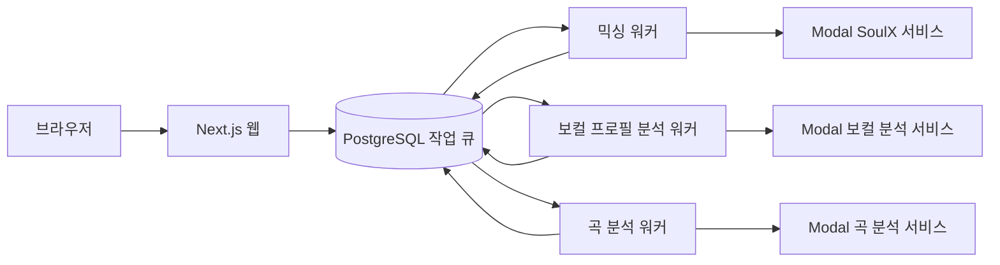

로컬에서 `pnpm dev`를 실행하면 Next.js 웹 앱, PostgreSQL 작업 큐를 사용하는 믹싱·보컬 프로필 분석·곡 분석 워커가 함께 시작돼요. 먼저 `http://localhost:3000`이 열리는지 확인한 뒤, 바꾸려는 책임에 맞는 문서로 이동하세요. 이 페이지는 **로컬에서 안전하게 실행한 뒤 어떤 시스템 문서를 읽어야 하나요?**라는 질문에 답하는 튜토리얼이에요.

## 시작 전에 준비할 것

다음 도구와 외부 서비스 설정을 준비하세요.

- Node.js `>=22.13.0`
- pnpm `11.9.0`
- Docker 20 이상
- Google OAuth web client
- Leemage project와 API key
- 배포된 Modal 분석·믹싱 서비스
- production 결과 오디오 변환에 필요한 FFmpeg

로컬 데이터베이스는 Compose가 제공하므로 별도 PostgreSQL 서버를 준비할 필요는 없어요. 인증·미디어·외부 분석 기능을 실제로 사용하려면 위 외부 서비스 설정이 필요해요. 비밀값은 이 페이지나 저장소에 적지 말고 개발 환경의 비밀 관리 방식으로 채우세요.

README는 `.env.example`을 `.env.local`로 복사하는 절차를 안내하지만, 현재 확인 가능한 추적 파일 목록에서는 `.env.example`의 제공 여부를 확정할 수 없어요. 작업 트리에 파일이 있을 때만 다음 명령을 실행하고, 없다면 팀의 환경 변수 제공 경로를 확인하세요.

## PostgreSQL과 웹 앱 시작하기

저장소 루트에서 아래 순서를 그대로 실행하세요.

```bash
pnpm install --frozen-lockfile
cp .env.example .env.local
docker compose up -d
pnpm run db:migrate:deploy
pnpm run db:generate
pnpm dev
```

`docker compose up -d`는 `postgres:16-alpine`을 시작하고 기본적으로 호스트 `5433`을 컨테이너 `5432`에 연결해요. `POSTGRES_DB`, `POSTGRES_USER`, `POSTGRES_PASSWORD`, `POSTGRES_PORT`로 기본값을 바꿀 수 있고, `postgres_data` 볼륨에 데이터를 유지해요. Compose healthcheck는 `pg_isready`를 사용해요. `DATABASE_URL`이 이 PostgreSQL을 가리키는지 확인한 뒤 migration과 Prisma Client 생성을 실행하세요. [Compose의 현재 PostgreSQL 설정](repo://docker-compose.yml#L1-L20)에서 포트와 healthcheck를 확인할 수 있어요.

`pnpm dev`는 `concurrently --kill-others-on-fail`로 웹 프로세스와 세 워커를 함께 감독해요. 웹이나 워커 하나가 실패하면 나머지 프로세스도 종료되므로, 실패한 프로세스의 첫 로그부터 확인하세요. 브라우저에서 `http://localhost:3000`이 열리면 첫 체크포인트를 통과한 거예요.

## 세 워커가 작업을 이어가는 방식

웹 앱은 오래 걸리는 분석·믹싱을 요청 안에서 기다리지 않고 PostgreSQL 작업 큐에 접수해요. 워커가 작업을 점유하고 외부 분석·믹싱 서비스를 호출한 뒤 상태와 결과를 데이터베이스에 저장해요.



*이 흐름은 웹 요청, PostgreSQL 큐, 세 워커와 각 외부 분석·믹싱 경계를 보여줘요.*

`package.json`의 `worker:mixing`, `worker:vocal-profile-analysis`, `worker:song-analysis`가 각각 `scripts/`의 런처를 호출해요. 각 런처는 `.env.local`을 `.env`보다 먼저 읽고 대응하는 `run...Worker()`를 실행해요. [웹·워커를 함께 시작하는 현재 script](repo://package.json#L9-L23)에서 실제 명령을 확인하세요.

각 워커 런처는 설정된 concurrency만큼 lane을 만들고 lane마다 고유한 소유자 문자열을 사용해요. 처리할 작업이 없으면 1초 쉬었다가 다시 polling해요. `SIGINT`·`SIGTERM`을 받으면 새 polling을 멈추고 Prisma 연결을 닫아요. 반복 처리에서 오류가 나면 최대 30초까지 지수형 대기 후 재시도해요. 보컬 프로필 분석 워커는 각 반복에서 필요한 환불 조정도 먼저 실행해요. [세 워커의 현재 수명 주기](repo://src/_app/background-jobs/mixing/runner.ts#L11-L49)와 곡 분석·보컬 분석 runner를 비교해 보세요.

외부 호출의 수명 주기는 워커마다 달라요. 믹싱과 곡 분석은 외부 job ID를 저장하고 완료까지 polling하지만, 보컬 프로필 분석은 동기 analyzer 응답을 기다려요. lease, 재시도, polling 간격과 장애 복구를 바꿀 때는 [환경 변수와 영속 워커 운영 기준](operations/configuration-and-runtime.md)을 먼저 읽으세요.

## 변경 목적별 다음 문서

실행 확인 뒤에는 아래에서 한 가지 목적을 골라 이동하세요.

1. **웹 요청의 호출 위치와 계층 경계를 찾으려면** [웹 요청·DB·워커·외부 처리의 시스템 경계 이해하기](architecture/system-boundaries.md)를 읽으세요. `app/` adapter에서 `src/_app/`과 FSD 레이어로 들어가는 경계를 먼저 확인하세요.
2. **모델과 상태의 소유권을 이해하려면** [보컬·카탈로그·작업·티켓·미디어 데이터 모델](concepts/domain-data-model.md)을 읽으세요. 바꾸려는 데이터의 관계와 수명 주기를 확인하세요.
3. **환경 변수, migration, 워커 운영을 확인하려면** [환경 변수와 영속 워커 운영 기준](operations/configuration-and-runtime.md)을 읽으세요. concurrency, lease, polling 간격과 운영 스크립트를 확인하세요.
4. **보컬 업로드와 분석을 바꾸려면** [녹음에서 보컬 프로필과 분석 결과까지](workflows/vocal-analysis.md)를 읽으세요. 큐 접수, 외부 분석, 결과 저장과 실패 경계를 따라가세요.
5. **믹싱 접수나 복구를 바꾸려면** [AI 믹싱 요청·외부 작업·복구 흐름](workflows/mixing-and-recovery.md)을 읽으세요. 티켓, lease, 외부 job, 재시도 순서를 확인하세요.
6. **카탈로그나 추천을 바꾸려면** [카탈로그 분석에서 곡·키 추천까지](workflows/recommendations-and-catalog.md)을 읽으세요. 분석 revision과 공개 상태가 추천으로 이어지는 경계를 확인하세요.
7. **인증·미디어·Modal 호출을 바꾸려면** [Better Auth·Leemage·Modal 외부 서비스 계약](integrations/external-services.md)을 읽으세요. 입력, 설정, 결과와 실패 계약을 확인하세요.
8. **변경 후 검증을 고르려면** [변경 범위에 맞는 테스트와 readiness 검증](testing/change-validation.md)을 읽으세요. 변경 범위 테스트부터 고르고 필요한 전체 검증을 추가하세요.

## 변경 후 검증하기

작은 변경은 관련된 변경 범위 테스트부터 실행하세요. 전체 build와 회귀 검증이 필요하면 아래 명령을 실행하세요.

```bash
pnpm test
pnpm run check
```

현재 `pnpm test`는 `pnpm run build`, UI·도메인·통합·API·아키텍처·Storybook 검증, `pnpm run test:readiness`를 포함한 여러 검증 script를 차례로 실행해요. `pnpm run check`는 Biome, ESLint, TypeScript, FSD architecture 검사를 실행해요. [현재 test·check script](repo://package.json#L23-L34)와 readiness 범위는 [변경 범위에 맞는 테스트와 readiness 검증](testing/change-validation.md)에서 확인하세요.

검증이 실패하면 먼저 실패한 script 이름과 로그를 확인하세요. 데이터베이스나 외부 서비스가 필요한 검증은 로컬 설정과 준비 상태를 갖춘 뒤 다시 실행하세요.
