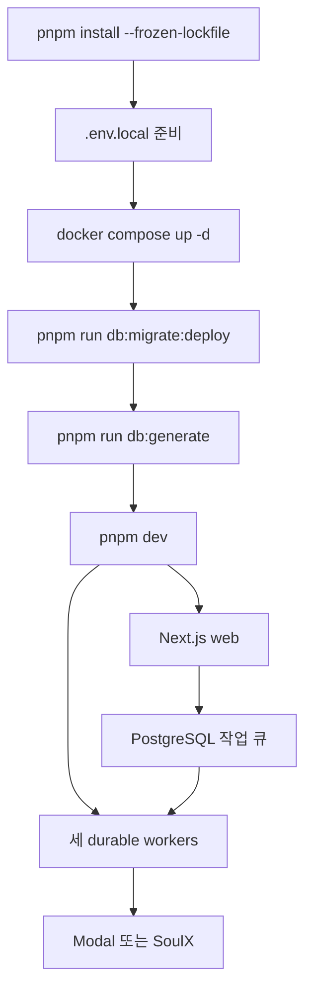

# Copysinger 빠른 시작과 변경 라우팅

Copysinger는 한 소절의 목소리를 분석해 맞는 노래와 키를 추천하고 AI 믹싱까지 제공하는 Next.js 애플리케이션이다. 웹 요청은 PostgreSQL에 작업을 접수하고, 세 개의 durable worker가 보컬 프로필 분석·곡 카탈로그 분석·AI 믹싱을 처리한다. 오디오 bytes는 Leemage에, 상태·소유권·작업 metadata는 PostgreSQL에 둔다. 전체 런타임 경계는 [시스템 지도와 런타임 경계](architecture/system-map.md)를 먼저 읽는다.

## 1. 로컬에서 시작하기

필수 버전은 `package.json`에 정의된 Node.js `>=22.13.0`, pnpm `11.9.0`이다. 비밀값을 문서나 저장소에 복사하지 말고, `.env.example`의 변수명을 기준으로 로컬 파일을 만든다.

```bash
pnpm install --frozen-lockfile
cp .env.example .env.local
docker compose up -d
pnpm run db:migrate:deploy
pnpm run db:generate
pnpm dev
```

`docker compose up -d`는 `postgres:16-alpine`을 호스트 기본 port `5433`에 노출하고 `postgres_data` volume에 데이터를 보존한다. compose의 healthcheck가 PostgreSQL 준비 상태를 확인한다. 데이터베이스와 환경 변수의 의미, migration·seed·Modal 준비는 [Configuration, local operation, and deployment](operations/configuration-and-deployment.md)에서 확인한다.

`pnpm dev`는 `next dev`, mixing worker, vocal-profile-analysis worker, song-analysis worker를 `concurrently --kill-others-on-fail`로 함께 시작한다. 브라우저에서 [http://localhost:3000](http://localhost:3000)을 연다. 개별 프로세스가 필요하면 `pnpm run dev:web`, `pnpm run worker:mixing`, `pnpm run worker:vocal-profile-analysis`, `pnpm run worker:song-analysis`를 사용한다.



이 그림은 로컬 초기화에서 웹 요청과 background worker가 외부 처리 서비스로 이어지는 기본 경로를 보여준다.

### 시작 후 확인

- 공개 화면은 `/`, 녹음·업로드는 `/profile`, 프로필 기반 추천 결과는 `/recommendations/[id]`에서 확인한다. `/recommendations` 단독 화면은 없다.
- 사용자 라이브러리는 `/library`, 계정·티켓은 `/account`, 관리자 운영은 `/admin`, 곡 관리는 `/admin/songs`다.
- 새 데이터베이스에 fixture가 필요할 때만 migration 뒤 `pnpm run db:seed`를 실행하고 `pnpm run db:verify`로 확인한다. 카탈로그는 `pnpm run catalog:db:verify`로 별도 검증한다.
- Modal endpoint를 개발 환경에서 사용할 경우 추적된 배포 명령은 다음과 같다.

```bash
pnpm run modal:vocal-profile:deploy
pnpm run modal:song-catalog:deploy
```

## 2. 변경 전 공통 원칙

1. 현재 코드의 실제 동작을 기준으로 한다. OpenWiki는 온보딩용 evidence이며 제품 요구사항은 `docs/prd/`, 진행 중인 변경은 활성 Feature의 `spec.md`·`plan.md`·`tasks.md`·`decisions.md`가 기준이다.
2. root `app/`은 Next.js route convention과 FSD public API re-export를 담당한다. 실제 조립과 server orchestration은 `src/_app/` 및 `src/_pages/`에 있다.
3. 의존 방향은 `_app → _pages → widgets → features → entities → shared`다. slice 내부 파일을 직접 import하지 말고 대상 slice의 root public API를 사용한다. `index.ts`는 browser-safe API, `index.model.ts`는 runtime-neutral contract, `index.server.ts`는 DB·secret·server capability 경계다.
4. 브라우저에 Modal, SoulX, Leemage credential을 노출하지 않는다. 사용자 소유권과 관리자 권한은 server에서 검증한다.

루트 layout은 `app/layout.tsx`에서 server entrypoint를 re-export하고, 실제 `RootLayout`이 한국어 문서 언어·전역 CSS·font·`QueryProvider`·tooltip·toast를 조립한다. `QueryProvider`는 서버에서는 query client를 새로 만들고 브라우저에서는 singleton을 재사용한다. query 기본값은 30초 `staleTime`, 창 focus 시 refetch 안 함, reconnect 시 refetch, mutation retry 안 함이며 query retry와 exponential delay는 shared API 정책에 위임한다.

## 3. 작업 라우팅 맵

| 바꾸려는 것 | 먼저 읽을 페이지 | 실제로 찾아갈 경계 |
| --- | --- | --- |
| 전체 런타임, request-to-job 흐름, 저장소·외부 서비스 경계 | [시스템 지도](architecture/system-map.md) | `app/`, `src/_app/`, `src/shared/`, `scripts/*-worker.ts` |
| FSD 의존 방향, public API, route adapter, boundary 위반 | [FSD boundaries](architecture/fsd-boundaries.md) | `src/`, `app/`, `steiger.config.ts`, architecture tests |
| Recording, VocalProfile, Song, revision, job, asset 같은 DB 모델·상태·cardinality | [도메인 데이터 모델](concepts/domain-data-model.md) | `prisma/schema.prisma`, migration, entity/server API |
| Google OAuth, session, 소유권, 관리자, 가입 지급·티켓·알림 | [Identity, ownership, tickets, and notifications](concepts/ownership-tickets-and-notifications.md) | auth config, server authorization, ticket ledger, notifications |
| 녹음·분석·보컬 프로필 생성과 polling·환불 | [보컬 프로필 분석](workflows/vocal-profile-analysis.md) | profile feature, analysis queue, vocal worker, Modal analyzer |
| 추천 ranking, key-fit, synthesis reference, AI mixing | [추천·레퍼런스·믹싱](workflows/recommendation-and-mixing.md) | recommendation feature, mixing queue/worker, history/result |
| 관리자 곡 등록, source/target, 분석 revision, publication, snapshot | [곡 카탈로그 publishing](workflows/song-catalog-publishing.md) | admin song APIs, song-analysis queue, catalog state |
| Leemage upload/download/proxy, protected audio, 삭제 정리 | [Leemage media](integrations/leemage-media.md) | media client, `MediaAsset`, `CatalogTargetAsset`, cleanup job |
| Modal HTTP/auth/payload, SoulX submit·poll·result·cleanup 계약 | [Modal and SoulX](integrations/modal-and-soulx.md) | `services/`, server adapters, worker runners |
| 환경 변수, PostgreSQL, migration/seed, Modal deploy, production startup | [Configuration and deployment](operations/configuration-and-deployment.md) | `.env.example`, `docker-compose.yml`, `package.json`, Prisma config |
| lease, claim, retry/backoff, heartbeat, worker 복구 | [Job processing](operations/job-processing.md) | `scripts/*-worker.ts`, background job runners, PostgreSQL transaction |
| 어떤 테스트를 어디서 실행할지, API/UI/DB/경계 계약 | [Testing strategy](testing/test-strategy-and-boundaries.md) | `tests/`, service tests, package scripts |

위 맵은 현재 계획된 `architecture`, `concepts`, `integrations`, `operations`, `testing`, `workflows` 계층을 모두 반영한다. 새 페이지나 계층을 추가하면 이 표의 라우팅을 같은 변경에서 갱신한다.

## 4. 검증 명령

작은 변경도 먼저 범위가 좁은 테스트를 실행하고, 통합 변경은 해당 domain script와 정적 검사를 추가한다. 저장소에 정의된 대표 명령은 다음과 같다.

```bash
pnpm run lint
pnpm run typecheck
pnpm run check:architecture
pnpm run db:validate
pnpm run test:voice-scan
pnpm run test:vocal-profile-analysis-queue
pnpm run test:song-analysis-queue
pnpm run test:recommendation
pnpm run test:media
pnpm run test:mixing:db
pnpm run test:mixing:ui
pnpm run test:storybook --run
pnpm run check
pnpm test
```

`pnpm run check`는 Biome, lint, typecheck, architecture 검사를 실행한다. `pnpm test`는 production build와 domain/unit, PostgreSQL integration, API contract, queue·media·auth·ticket·mixing, FSD boundary, Storybook 검사를 묶은 넓은 회귀 진입점이다. DB나 외부 서비스 계약을 바꿨다면 해당 통합·contract 테스트를 함께 확인하고, FSD import를 바꿨다면 `pnpm run check:architecture`를 반드시 실행한다.

## 참고 기준

- 프로젝트 목적·버전·시작 절차·화면·구조: [`README.md`](../README.md)
- 실행 script와 정확한 test entrypoint: [`package.json`](../package.json)
- 로컬 PostgreSQL container의 port, volume, healthcheck: [`docker-compose.yml`](../docker-compose.yml)
- App Router adapter: [`app/layout.tsx`](../app/layout.tsx)
- 전역 runtime/provider 조립: [`src/_app/layout/root-layout.tsx`](../src/_app/layout/root-layout.tsx)
- client/server QueryClient lifecycle: [`src/_app/providers/query-provider.tsx`](../src/_app/providers/query-provider.tsx)
