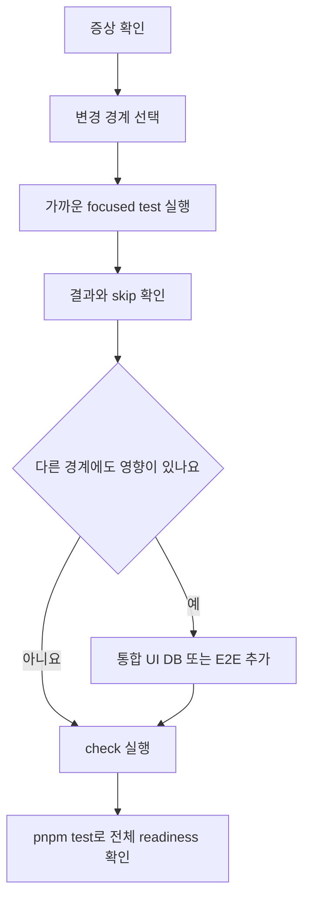

변경한 경계에 맞는 명령을 먼저 실행하고, 마지막에 정적 검사와 전체 테스트로 readiness를 확인하세요. 가장 가까운 focused test가 통과해도 DB 연결, 워커 수명 주기, 브라우저 계약까지 바뀌었다면 해당 경계를 추가해야 해요. 전체 흐름은 [`package.json`](repo://package.json#L23-L70)에 정의된 script만 사용하세요.

## 증상에서 관찰 가능한 결과까지 따라가세요

다음 순서로 테스트를 고르세요.

1. **증상을 적으세요.** 요청 계약 오류인지, 큐가 멈추는지, UI 상태가 어긋나는지, 배포 준비가 깨지는지 구분하세요.
2. **변경 경계를 좁히세요.** 입력·출력 계약, 서버 상태, DB 스키마, 워커·외부 어댑터, UI·스토리, 모듈 import 중 무엇이 달라졌는지 확인하세요.
3. **관찰할 결과를 정하세요.** 반환 payload와 재시도 횟수, DB 상태와 잔액, 렌더링, import 위반, timeout·lease recovery 같은 결과를 확인하세요.
4. **가장 가까운 script를 실행하세요.** 통과만 확인하지 말고 필요한 환경에서 실제 테스트가 실행됐는지 로그의 skip도 확인하세요.
5. **영향이 이어지는 경계를 추가하세요.** 계약 변경이 UI 캐시에 영향을 주거나 스키마 변경이 큐 상태를 바꾸면 한 단계 넓은 테스트도 실행하세요.



*변경 경계에서 관찰 결과를 거쳐 전체 readiness로 넓히는 선택 흐름이에요.*

## 변경 범위별 시작 명령

| 변경한 범위 | 먼저 실행할 명령 | 확인할 결과 |
| --- | --- | --- |
| API 입력·출력, Zod 스키마, query 상태 | `pnpm run test:query` | API 계약, 클라이언트·서버 query, MSW 응답과 재시도 |
| 보컬 분석 어댑터 | `pnpm run test:vocal-profile-analyzer` | 어댑터 입력·출력 변환 |
| 보컬 분석 큐·저장 | `pnpm run test:vocal-profile-analysis-queue` | DB 작업 상태, 시도 횟수, 재시도·환불 |
| 믹싱 큐·워커·lease | `pnpm run test:mixing:db` | enqueue·claim·lease recovery와 환불의 저장 결과 |
| UI 컴포넌트·페이지 | 기능별 UI script, 예: `pnpm run test:mixing:ui` | 상태별 표시와 사용자 상호작용 |
| Storybook 스토리 | `pnpm run test:storybook --run` | headless Chromium 렌더링 |
| 레이어 import와 App route | `pnpm run check:architecture` | Steiger와 실행 가능한 FSD 경계 fixture |
| Prisma schema·migration | `pnpm run db:validate`, 필요하면 `pnpm run db:status` | 스키마 유효성과 migration 적용 상태 |
| timeout·abort·워커 recovery·admission | `pnpm run test:readiness` | deadline, 회복, 동시성·입장 제어와 계약 fixture |

`test:query`는 `tests/client-server-state-query.test.ts`, `tests/api-contracts.test.ts`, `tests/msw-query.test.ts`와 서버 요청 관련 테스트를 실행해요. MSW 테스트는 처리되지 않은 요청을 오류로 만들고 handler를 테스트 뒤 초기화하므로, 외부 네트워크 대신 응답 handler와 fixture를 유지하세요.

큐와 워커 변경에는 DB 통합 테스트를 선택하세요. `tests/mixing-queue.integration.ts`는 `DATABASE_URL`이 없으면 `DATABASE_URL is not configured` 사유로 skip해요. 연결된 경우 실제 DB에 enqueue, 두 워커의 claim 경쟁, 만료 lease recovery, 재시도와 ticket refund 결과를 기록해요. `globalThis.fetch`는 테스트별 `fetchImpl`로 대체해 Modal·오브젝트 저장소 응답과 네트워크 실패를 재현하고 원래 구현을 복원해요. 따라서 이 테스트의 통과는 실제 외부 서비스 호출 성공을 뜻하지 않아요. [`믹싱 큐 fixture 구현`](repo://tests/mixing-queue.integration.ts#L193-L339)을 확인하세요.

DB 통합 테스트가 skip되면 명령 성공만으로 DB 경계를 검증했다고 해석하지 마세요. `DATABASE_URL`을 설정한 뒤 같은 script를 다시 실행하고, migration 변경이면 먼저 `pnpm run db:validate`와 필요 시 `pnpm run db:migrate` 또는 `pnpm run db:migrate:deploy`의 목적을 구분하세요.

## UI·Storybook·아키텍처 경계 확인하기

UI 표시만 바꿨다면 기능별 `tsx --test` script를 실행하세요. 믹싱 UI는 `pnpm run test:mixing:ui`, 보컬 프로필 표현은 `pnpm run test:vocal-profile-presentation`, 공통 링크 버튼은 `pnpm run test:base-ui`예요. API 계약이나 캐시 상태도 바꿨다면 `test:query`를 함께 실행하세요.

Storybook 변경에는 `pnpm run test:storybook --run`을 사용하세요. `vitest.config.ts`는 Storybook 프로젝트를 Playwright Chromium headless 인스턴스로 실행해요. Storybook 경계 테스트는 스토리가 서버 전용 모듈이나 Prisma·DB 모듈을 import하지 않는지와 Storybook이 애플리케이션 production script에 섞이지 않는지를 확인해요. 이 검증은 production build에 Storybook이 포함됐다는 뜻이 아니에요.

레이어 import나 `app` route를 바꿨다면 `pnpm run check:architecture`를 실행하세요. 이 script는 `steiger ./src`와 `pnpm run test:architecture-boundaries`를 이어서 실행해요. fixture는 교차 slice segment import, 서버 모듈의 직접·전이적 도달, App route의 구현 코드와 내부 segment import를 위반으로 판정하고 현재 그래프도 검사해요. 경계를 우회하는 예외를 추가하기보다 public API와 얇은 route adapter를 유지하세요. 판정 근거는 [`FSD 경계 fixture`](repo://tests/fsd-architecture-boundaries.test.ts#L154-L220)에 있어요.

## readiness와 E2E를 구분해서 실행하기

`pnpm run test:readiness`는 `--test-concurrency=1`로 runtime timeout, DB·가입 복구, media 복구, 워커 복구, admission 및 race 통합 테스트를 순서대로 실행한 뒤 `tests/modal-submission-contract.py`도 실행해요. timeout 변경은 `tests/runtime-timeouts.test.ts`에서 deadline 취소, 부모 abort 전달, header 뒤 body hang 방지, 잘못된 resource budget 거부를 확인하세요. lease와 여러 작업 수명 주기를 바꿨다면 `tests/worker-recovery.integration.ts`도 포함되는 이 script를 실행하세요. 이 통합 테스트도 DB가 필요하므로 skip 여부를 확인하세요.

실제 브라우저부터 PostgreSQL, 워커, 로컬 외부 서비스 fixture까지 이어지는 계약을 확인해야 할 때만 E2E를 추가하세요.

```bash
pnpm install --frozen-lockfile
pnpm exec playwright install chromium
pnpm run test:e2e
```

Docker, ffmpeg, Chromium과 Node 22 이상이 필요해요. E2E runner가 임시 PostgreSQL 컨테이너와 별도 DB, 로컬 provider, production Next server를 만들고 앱 API는 Playwright route로 대체하지 않아요. 외부 fetch는 localhost fixture로 제한해요. 실패하면 `artifacts/e2e/`의 로그·screenshot·trace를 보고 `pnpm exec playwright show-trace artifacts/e2e/candidate/test-results/TEST_DIRECTORY/trace.zip`으로 확인하세요. 기준 revision과 비교해야 하면 `pnpm run test:e2e:compare b333d64`처럼 실행하세요. E2E 통과는 고정한 계약의 회귀가 없다는 뜻이지 전체 서비스의 100% 동등성을 증명하지 않아요. 자세한 전제는 [`브라우저 E2E 실행 계약`](repo://tests/e2e/TESTING.md#L3-L30)과 [`격리 환경 준비 흐름`](repo://tests/e2e/run.mjs#L97-L246)을 확인하세요.

## 마지막에 전체 검증을 실행하세요

변경 경계 테스트가 통과한 뒤 다음 두 명령을 실행하세요.

```bash
pnpm run check
pnpm test
```

`pnpm run check`는 Biome, ESLint, TypeScript와 아키텍처 검사를 실행해요. `pnpm test`는 `build`를 먼저 실행한 뒤 여러 기능별 테스트, DB 통합 테스트, `test:architecture-boundaries`, `test:storybook --run`, `test:readiness`를 순서대로 실행해요. `pnpm test`에서 DB 테스트가 skip되면 readiness 결론을 DB까지 확장할 수 없으니 `DATABASE_URL`을 설정하고 필요한 focused script를 다시 실행하세요.

다음 변경의 시스템 소유권과 경계는 [시스템 경계 이해하기](../architecture/system-boundaries.md), 환경 조건은 [구성과 런타임 설정](../operations/configuration-and-runtime.md)에서 이어서 확인하세요.
