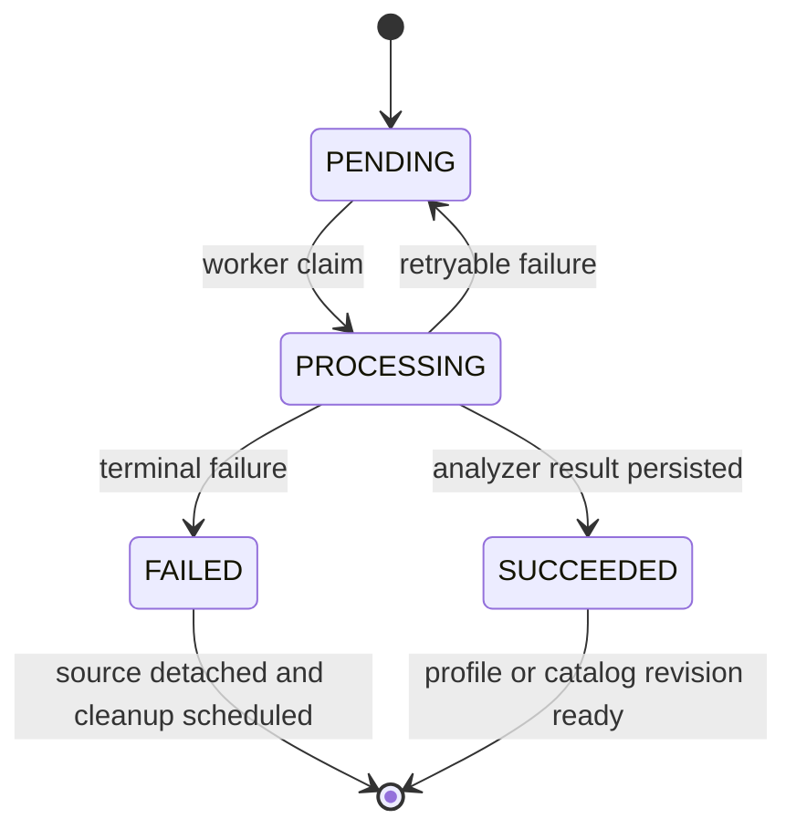

# 테스트 전략과 아키텍처 안전망

이 저장소의 테스트는 단순한 함수 검증보다 **경계의 보호**에 초점을 둔다. Zod 계약은 서버 응답·요청의 형태와 입력 한계를 고정하고, 통합 테스트는 Prisma에 기록되는 소유권·티켓·lease·재시도·미디어 정리를 검증한다. UI 테스트는 상태 표시와 사용자 상호작용을, Storybook 브라우저 테스트는 실제 컴포넌트 렌더링과 브라우저 안전성을, FSD 테스트는 모듈 의존 방향을 보호한다.

## 실행 계층과 정확한 명령

### 전체 게이트

```bash
pnpm test
```

`test`는 먼저 `pnpm run build`를 성공시킨 뒤 브랜드 자산, vocal-profile 관련 Node 테스트, 음성 스캔·분석·persistence·queue, UI, 추천·인증·미디어·티켓·mixing·admin·query, FSD 경계, Storybook 테스트를 순서대로 실행한다. 따라서 전체 회귀의 기준은 “테스트 파일만 실행”이 아니라 **Next 빌드에 성공한 후의 전체 체인**이다. 현재 스크립트에는 데이터베이스가 필요한 통합 테스트도 포함되며, 해당 테스트들은 `DATABASE_URL`이 없으면 스스로 skip한다.

### 집중 실행

변경 영역에 맞춰 다음 package script를 사용한다. 아래 명령은 `package.json`에 실제로 정의된 문자열이다.

| 보호 영역 | 정확한 명령 | 보호하는 것 |
|---|---|---|
| 브라우저 음성 입력·녹음 상태 | `pnpm run test:voice-scan` | voice-scan 상태, recorder, 오디오 준비·긴 파일 업로드·effect cleanup |
| vocal-profile 분석 어댑터 | `pnpm run test:vocal-profile-analyzer` | 분석 결과를 도메인 모델로 변환하는 Modal 어댑터 |
| vocal-profile persistence | `pnpm run test:vocal-profile-persistence` | 분석 결과 저장과 durable recording/profile 관계 |
| vocal-profile 큐 | `pnpm run test:vocal-profile-analysis-queue` | admission, idempotency, 소유자 조회, ticket debit, lease, 재시도·실패 정리 |
| song 분석 큐 | `pnpm run test:song-analysis-queue` | Modal 어댑터, lease/retry, READY catalog revision, admin 경로 |
| mixing persistence/큐 | `pnpm run test:mixing:db` | enqueue·claim·lease recovery와 환불 경계 |
| mixing UI | `pnpm run test:mixing:ui` | history/status/detail 표시와 상태별 UI |
| 추천 기능 | `pnpm run test:recommendation` | ranking, presentation/synthesis, UI와 song detail |
| 추천 DB | `pnpm run test:recommendation:db` | recommendation run persistence |
| 인증 소유권 | `pnpm run test:auth:db` | auth ownership과 개발 auth bypass 통합 동작 |
| 외부 미디어 | `pnpm run test:media` | Leemage client와 media 통합 경계 |
| 티켓 | `pnpm run test:tickets` | ticket ledger UI와 DB ledger |
| API·React Query·업로드 | `pnpm run test:query` | client/server query, API contracts, MSW, conversion stream, multipart 경계 |
| UI 기본기 | `pnpm run test:base-ui` | Base UI link/button 계약 |
| vocal-profile 표시/이력 | `pnpm run test:vocal-profile-presentation`, `pnpm run test:vocal-profile-history` | presentation/results/history UI와 private audio proxy/history 통합 |
| Storybook | `pnpm run test:storybook --run` | Vitest Storybook 프로젝트의 headless Chromium 실행 |
| 프로세스·Storybook 운영 경계 | `pnpm run test:process-scripts` | worker supervisor와 Storybook production 분리 |
| FSD 경계 | `pnpm run test:architecture-boundaries` | public API, client/server graph, root `app` thin adapter 규칙 |

그 밖에도 `pnpm run test:brand-icons`, `pnpm run test:catalog-targets`, `pnpm run test:key-fit`, `pnpm run test:admin`, `pnpm run test:auth-navigation`이 각각 자산/SEO, catalog target asset, key-fit 점수, admin UI·운영, 인증 navigation을 대상으로 한다. `test:process-scripts`는 `tests/process-scripts.test.ts`와 `tests/storybook-production-boundary.test.ts`를 함께 실행하고, `test:query`는 계약·MSW와 서버 통합 테스트를 함께 실행한다. `pnpm run check`는 테스트 대체 명령이 아니라 Biome·lint·typecheck·Steiger 및 architecture test를 묶은 정적 검사 게이트다.

## 계약과 외부 경계

`tests/api-contracts.test.ts`는 entity/feature의 production Zod schema를 직접 사용한다. ticket wallet의 kind와 음수가 아닌 balance, onboarding의 완료 여부와 서버 소유 balance, UUID·idempotency key·pagination·ticket bounds, mixing history URL 정규화, notification의 내부 링크·페이지 한계·read envelope, 삭제의 terminal envelope, 허용 오디오 MIME/최대 크기, vocal analysis와 recommendation의 대표 legacy payload를 검증한다. 즉 이 테스트는 API route의 구현 세부가 아니라 클라이언트와 서버가 공유하는 **입출력 계약과 보안성 있는 입력 경계**를 보호한다.

`tests/msw-query.test.ts`는 `onUnhandledRequest: "error"`로 외부 요청 누락을 실패시키며, MSW 응답을 production schema로 파싱한다. 403은 재시도하지 않고, 503은 두 번 재시도해 세 번째 시도에서 회복하며, 잘못된 성공 payload는 contract error로 한 번만 실패한다. polling fixture는 active에서 terminal로 가고 terminal 뒤 polling을 멈추며, mutation은 소유한 cache key만 갱신한다. 이는 UI query 정책·계약 오류·외부 API 모킹을 함께 검증하는 집중 테스트다.

오디오/Modal 경계도 별도로 고정된다. `services/song-catalog-analyzer/test_modal_app.py`는 request/source identity, 빈 파일·payload 크기, allowlisted suffix, major/minor key 추정의 confidence와 CPU spawn/poll/idempotency 구현 흔적을 확인한다. `services/vocal-profile-modal/test_transport.py`는 artifact의 bytes·크기·hash round-trip, analyzer/smart-reference payload, reference unavailable envelope, 변조 artifact 거부를 검증한다. `services/soulx-singer-svc/tests/test_mix_balance.py`는 `vocal-balance-v2`, vocal -2 dB, accompaniment 0 dB와 full-scale 초과 때만 attenuation하는 peak protection을 고정한다. 이 Python 테스트들에 대해 `package.json`의 별도 실행 script는 확인되지 않으므로, `pnpm test`가 자동으로 실행한다고 가정하지 않는다.

## 큐·persistence·소유권 테스트

큐 테스트는 데이터베이스 상태 전이를 핵심 안전망으로 삼는다.



이 다이어그램은 vocal-profile 및 song-analysis 통합 테스트에서 확인하는 대표 job lifecycle을 요약한다.

- `tests/vocal-profile-analysis-queue.integration.ts`는 같은 idempotency key의 enqueue가 같은 job과 한 번의 presign만 만들고, 다른 요청은 `ANALYSIS_BUSY`가 되며, job read/list가 user owner 범위로 제한되는지 확인한다. 빈 analysis-ticket wallet이면 media 저장 전 거부하고, 기존 profile 수가 있어도 남은 ticket이 있으면 admission한다. 동시 요청은 DB의 one-active-per-user 경계로 하나만 통과한다.
- 같은 파일은 한 worker가 잡은 lease를 다른 worker가 즉시 빼앗지 못하게 하며, 만료 뒤에는 다른 worker가 재획득하고 attempts가 증가하는지 검증한다. 성공 시 durable source asset을 재사용해 profile과 reference media를 저장하고 notification의 type/sourceId/href를 남긴다. 일시적 Modal 오류는 source를 삭제하지 않고 `PENDING` 및 retryable 상태로 되돌리며, terminal 오류는 queued source를 분리·삭제하는 경계를 검사한다.
- `tests/song-analysis-queue.integration.ts`는 song analysis lease의 배타성·회복성과 READY revision persistence, retryable analyzer failure의 PENDING 복귀를 보호한다. `tests/mixing-queue.integration.ts`는 mixing enqueue, claim, lease recovery, refund 경계를 한 통합 흐름으로 검증한다.
- `tests/vocal-profile-persistence.integration.ts`, `tests/vocal-profile-history.integration.ts`, `tests/recommendation-persistence.integration.ts`는 각각 profile/history/recommendation의 DB 저장과 읽기 수명을 검증한다. `tests/auth-ownership.integration.ts`와 `tests/dev-auth-bypass.integration.ts`는 사용자의 소유권 및 개발 인증 예외가 섞이지 않는지 확인한다. 이 테스트들은 모두 환경·DB에 의존할 수 있으므로 테스트 이름만 보고 순수 unit test로 분류하지 않는다.

## UI와 Storybook

`.test.tsx` 집중 테스트들은 서버 큐를 재실행하지 않고 UI 상태 계약을 검증한다. 예를 들어 vocal-profile results/history, mixing history/status/detail, recommendation UI/song detail, admin UI, account/ticket UI는 loading·success·실패·상태별 표현, 사용자 action, cache/presentation 경계를 대상으로 한다. `test:voice-scan`은 음성 입력 lifecycle과 cleanup을, `test:base-ui`는 공통 link/button의 접근 가능한 동작을 대상으로 한다. 따라서 UI 테스트가 실제 Modal·DB coverage를 제공한다고 해석하지 말고, 그 경계는 해당 integration/adapter 테스트로 확인한다.

Vitest 설정은 Storybook을 별도 `storybook` project로 만들고, `@storybook/addon-vitest`와 Playwright Chromium을 headless로 사용한다. 실행 script는 `pnpm run test:storybook --run`이다. `tests/storybook-production-boundary.test.ts`는 Storybook 도구가 production dependency가 아니며 `build`, `start`, `start:web`에 Storybook이 섞이지 않는지, MSW worker가 `.storybook/public`에만 있고 root `public`에는 없는지, stories가 `server-only`, Next server headers, `.server`, DB, Prisma를 import하지 않는지 검사한다. 이는 Storybook을 실제 운영 런타임이나 서버 통합 테스트로 오인하지 않게 하는 architecture/운영 안전망이다.

## FSD와 프로세스 안전망

`tests/fsd-architecture-boundaries.test.ts`는 실제 `app`, `src`, `scripts` 소스를 TypeScript AST로 수집해 세 규칙을 검사한다.

1. 다른 slice의 `api/model/ui/lib/config` 내부 segment를 직접 import하지 않고 slice public API를 사용한다.
2. `"use client"`에서 runtime으로 `server-only`, `next/headers`, `next/server`, shared DB에 도달하지 않는다. type-only import는 예외다.
3. root `app` 파일은 `_app`/`_pages` public API를 export하는 thin adapter와 문서화된 정적 Next route config만 가진다.

fixture는 cross-slice internal import, 직접·transitive server import, type-only 예외, app 구현 누출을 각각 실패시키고, 마지막 실제 source-tree 검사에서 위반이 없음을 확인한다. 그러므로 새 feature를 추가하거나 route를 옮길 때는 기능 테스트만 통과시키지 말고 `pnpm run test:architecture-boundaries`와 `pnpm run check:architecture`를 함께 실행한다.

개발·시작 프로세스는 `pnpm run dev`와 `pnpm run start`가 `concurrently --kill-others-on-fail`로 web, mixing, vocal-profile analysis, song-analysis worker를 함께 감독하는 구조다. `tests/process-scripts.test.ts`는 이 명령과 worker entrypoint를 실제 script 값으로 확인하고, 한 child가 실패하면 sibling에 SIGTERM이 전달되는지 subprocess로 검증한다. 이는 queue worker가 조용히 고립되거나 웹 프로세스만 살아남는 실패를 방지하는 운영 안전망이다.

## 변경 시 선택 규칙

- schema, URL, MIME, idempotency, pagination을 바꾸면 `pnpm run test:query`와 관련 contract 테스트를 먼저 실행한다.
- admission/debit/refund, ownership, persistence, worker 상태를 바꾸면 해당 `:db` 또는 `:queue` 통합 script를 실행하고 `DATABASE_URL`이 실제 검증을 활성화하는지 확인한다.
- Modal/Leemage/파일 transport를 바꾸면 analyzer adapter·media·transport의 focused test를 함께 실행한다.
- UI 상태나 story를 바꾸면 해당 UI script와 `pnpm run test:storybook --run`을 실행한다.
- layer import, client/server directive, route adapter를 바꾸면 `pnpm run test:architecture-boundaries`를 실행한 뒤 최종적으로 `pnpm test`를 사용한다.

이 매핑은 “모든 테스트가 모든 동작을 보장한다”는 주장을 하지 않는다. 특히 Python 서비스 테스트와 DB 통합 테스트는 package script 및 환경의 실제 연결 여부를 확인한 뒤 별도로 실행해야 하며, 최종 릴리스 판단은 빌드가 선행되는 `pnpm test`와 변경에 대응하는 집중 테스트를 함께 본다.
