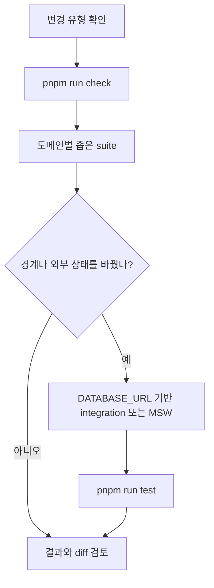

# 검증 전략과 변경 안전망

이 페이지는 코드를 바꾼 뒤 **어떤 진입점부터 실행할지** 결정하는 기준이다. 먼저 `pnpm run check`로 형식·lint·타입·아키텍처를 확인하고, 변경한 경계에 맞는 좁은 suite를 실행한 다음, 통합 변경이면 `pnpm run test`로 전체 순서를 확인한다. 전체 `test`는 먼저 `pnpm run build`를 실행하므로, 빌드가 깨진 상태에서는 뒤의 테스트가 시작되지 않는다.

관련 구조는 [모듈 경계](/openwiki/architecture/module-boundaries.md), 실행 환경과 환경 변수는 [설정과 배포](/openwiki/operations/configuration-and-deployment.md), 로컬 시작은 [빠른 시작](/openwiki/quickstart.md)을 참조한다.

## 검증 진입점 한눈에 보기

| 변경 유형 | 우선 실행할 명령 | 대표적으로 확인하는 것 |
| --- | --- | --- |
| 일반 TypeScript/React 로직 | `pnpm run check` 후 해당 `tsx --test` suite | 형식, lint, 타입과 함수·상태 규칙 |
| Zod schema, API payload, 오류 처리 | `pnpm run test:query` | 응답 envelope, 입력 정규화, 재시도 가능성 |
| DB 모델·소유권·티켓·카탈로그 | `pnpm run test:auth:db`, `pnpm run test:mixing:db`, `pnpm run test:vocal-profile-persistence`, `pnpm run test:catalog-targets` | 실제 PostgreSQL에서 격리, idempotency, 영속 상태와 정합성 |
| React Query·브라우저 UI | `pnpm run test:query` 또는 도메인 UI script | query key, polling, cache invalidation, 화면 표현 |
| worker/adaptor와 외부 job lifecycle | `pnpm run test:vocal-profile-analysis-queue`, `pnpm run test:mixing:db`, `pnpm run test:song-analysis-queue` | enqueue·claim·lease·재시도·terminal state·환불 |
| FSD import, client/server 경계, `app/` adapter | `pnpm run check:architecture` | public API 사용, server-only 유입 차단, 얇은 route adapter |
| Storybook story와 browser 상호작용 | `pnpm run test:storybook --run` | Chromium 기반 story 실행, browser-safe import와 UI 계약 |
| 배포 산출물·정적 자산 | `pnpm run build`, `pnpm run test:process-scripts`, `pnpm run test:brand-icons` | Next build, production script 경계, 자산 존재와 metadata |

`package.json`의 현재 scripts가 suite 구성을 정의한다. 따라서 임의로 “Vitest 전체”를 표준 명령으로 간주하지 말고, `test:storybook`처럼 script가 명시한 project와 각 도메인 script를 사용한다.

## 표준 실행 순서

작은 변경은 좁은 검증에서 시작하고, 경계를 넘는 변경은 정적 검사와 통합 검증을 더한다.

이 흐름은 변경 유형에 따른 권장 순서를 보여준다.

### 빠른 정적 안전망

`pnpm run check`는 `check:biome`, `lint`, `typecheck`, `check:architecture`를 차례로 실행한다. `check:architecture`는 `steiger ./src`와 `test:architecture-boundaries`를 함께 실행한다. 빌드만 확인하려면 `pnpm run build`, DB schema만 확인하려면 `pnpm run db:validate`를 사용한다.

전체 회귀 명령인 `pnpm run test`는 build와 자산·UI·worker·DB suite, query, architecture, Storybook을 모두 연결한다. 이 명령은 외부 서비스가 실제로 정상인지 확인하는 health check가 아니라 현재 저장소의 회귀 순서를 실행하는 gate다.

## 테스트 계층과 보장 범위

### Unit 및 계약 검증: 값과 wire format의 불변식

`tests/api-contracts.test.ts`는 production Zod schema를 직접 parse한다. ticket wallet은 종류와 음수가 아닌 정수 balance를 분리하고, owned request는 UUID·idempotency key·pagination·ticket 범위를 검증한다. notification link는 내부 경로만 허용하며, mixing 삭제 응답은 `status: "deleted"`, `id`, `mediaCleanupPending` envelope을 유지한다. 오디오 입력은 허용 MIME과 `MAX_PROFILE_ANALYSIS_AUDIO_BYTES`를 검사하지만 파일 바이트의 실제 내용까지 읽지는 않는다.

이 계층은 schema가 허용·거부하는 payload와 필드 제거/정규화를 보장한다. 실제 route가 인증을 적용하는지, DB transaction이 commit되는지, 외부 API가 그 payload를 받아 처리하는지는 보장하지 않는다.

명령은 `pnpm run test:query`에 포함된 `tsx --test tests/client-server-state-query.test.ts tests/api-contracts.test.ts tests/msw-query.test.ts`에서 확인한다. 순수 UI/도메인 단위 suite는 `package.json`의 `test:*` scripts처럼 `tsx --test`로 개별 실행한다.

### API contract와 MSW: transport 오류의 제어 흐름

`tests/client-server-state-query.test.ts`는 `requestJson`이 성공 응답을 Zod로 검증하고, malformed success를 재시도하지 않는 `ApiError(kind: "contract")`로 바꾸는지 확인한다. 일반 4xx는 HTTP metadata를 보존하고 재시도하지 않으며, 503과 network failure만 retryable로 표시한다. QueryClient 기본값은 `staleTime` 30초, `gcTime` 5분, window focus 재조회 해제, reconnect 재조회, mutation 재시도 해제다. retryable query는 최대 두 번 재시도한다.

`tests/msw-query.test.ts`는 MSW handler를 `onUnhandledRequest: "error"`로 켠 뒤 production schema와 QueryClient를 함께 통과시킨다. 403은 한 번만 요청하고, 503 두 번 뒤 세 번째 요청에서 회복하며, malformed 응답은 한 번만 실패한다. polling fixture는 active 상태에서 terminal 상태로 이동하고, mutation은 자신이 소유한 cache key만 갱신한다.

즉 이 계층은 클라이언트의 오류 분류·재시도·cache 범위와 대표 HTTP contract를 보장한다. MSW는 외부 네트워크, provider rate limit, 실제 인증서·DNS·인증 설정, production latency를 검증하지 않는다.

### Database integration: 소유권과 영속성

DB integration suite는 `.env.local` 또는 `.env`에서 `DATABASE_URL`을 읽는다. 값이 없으면 테스트가 실패했다고 가장하지 않고 `context.skip("DATABASE_URL is not configured")`으로 건너뛴다. 실행 전 PostgreSQL schema와 seed가 필요한 경우 `pnpm run db:validate`, `pnpm run db:migrate:deploy`, `pnpm run db:seed`, `pnpm run db:verify`를 운영 절차에 맞게 사용한다.

- `tests/auth-ownership.integration.ts`는 두 사용자를 만들고 profile·Google account 조회가 소유자에게만 보이는지 확인한다. `finally`에서 생성한 profile, recording, user를 삭제한다.
- `tests/catalog-snapshot.integration.ts`는 catalog snapshot parse/import가 새 catalog를 복원하고, 두 번째 import에서 중복 row를 만들지 않는지 확인한다. source URL과 video ID 불일치, 금지된 metadata, 중복 position을 거부하고 기존 revision을 낮추지 않는다.
- `tests/vocal-profile-analysis-queue.integration.ts`는 동일 idempotency key의 enqueue가 같은 job을 반환하고, 다른 사용자에게 job이 보이지 않으며, active job admission과 ticket 부족 시 media 저장 순서를 검증한다.

이 테스트들은 transaction·unique constraint·owner-scoped query·정리 동작처럼 실제 DB에 의존하는 불변식을 보장한다. 테스트가 사용하는 임시 사용자와 fixture만 검증할 뿐, production 데이터 규모, backup/restore, connection pool 고갈, migration rollout 중 가용성은 보장하지 않는다.

### UI와 worker: 상태·수명·경계

UI 검증은 대개 `tsx --test`로 실행하는 presentation/UI suite와 `test:query`의 React Query 규칙으로 나뉜다. query key에는 페이지·검색어·status가 포함되고, terminal job에서는 polling이 멈추며, 알림 read mutation은 모든 list cache를 invalidate한다. ticket wallet query는 account menu가 열릴 때만 활성화되고 stale data를 즉시 refetch한다. mixing 생성 성공 시 durable detail route로 이동하는 규칙도 같은 suite에서 확인한다.

worker integration의 대표 진입점은 `pnpm run test:mixing:db`다. `tests/mixing-queue.integration.ts`는 enqueue 두 번이 한 job과 한 usage debit으로 수렴하는지, worker claim 경쟁에서 한 소유자만 이기는지, lease 만료 후 recovery worker가 이어받는지를 검증한다. preflight/reference fetch·Modal submit 실패는 retry/refund 경계에 따라 `FAILED`와 환불로 끝나고, 일시적 catalog fetch 실패는 `PENDING`으로 재시도한다. Modal job이 이미 제출된 뒤 finalization이 실패하면 job은 환불 없이 `SUBMITTED`로 남아 재처리할 수 있다.

이 검증은 worker의 상태 전이, attempts, refundState, notification 같은 저장 결과를 확인한다. 실제 Modal·Leemage·object storage의 처리 시간, worker 프로세스 중단 방식, credential 만료, provider의 결과 품질은 mock fetch와 테스트 DB만으로 보장하지 않는다. 외부 운영 조건은 [설정과 배포](/openwiki/operations/configuration-and-deployment.md)의 환경 변수·배포 점검으로 따로 확인한다.

### Architecture boundary: import graph를 실행 전에 차단

`tests/fsd-architecture-boundaries.test.ts`는 `app`, `src`, `scripts`의 TypeScript graph를 AST로 읽는다. 다른 slice가 `api`, `model`, `ui`, `lib`, `config` 내부 segment를 직접 import하면 public API 위반으로 보고 `@/<layer>/<slice>` API를 요구한다. `"use client"`에서 직접 또는 transitive하게 `server-only`, `next/headers`, `next/server`, DB module에 닿는 경로도 실패한다. type-only import는 runtime 경로로 세지 않는다.

또한 root `app/` 파일은 `_app`/`_pages`의 `index.*` public API만 사용해야 하며, 구현 선언을 route에 넣을 수 없다. 허용되는 root 변수는 정적 Next.js route config(`runtime`, `preferredRegion`, `dynamic`, `revalidate` 등)다. fixture 테스트는 위반을 검출하고, 마지막 project-tree 테스트는 실제 source tree가 세 경계를 모두 만족하는지 확인한다.

따라서 이 검사는 실행 시나리오보다 import 방향과 client/server 분리를 보장한다. 동적 문자열 import, 런타임 인프라 설정, FSD 규칙에 아직 표현되지 않은 의미적 결합은 이 AST 검사만으로 발견되지 않을 수 있다.

### Storybook 검증: browser-safe UI와 production 분리

`pnpm run test:storybook --run`은 `vitest.config.ts`의 `storybook` project를 사용한다. Storybook addon이 `.storybook` 설정을 읽고, `@vitest/browser-playwright`의 headless Chromium instance에서 story를 실행한다. `pnpm run build-storybook`은 별도 산출물 build 진입점이다.

`tests/storybook-production-boundary.test.ts`는 Storybook·Vitest·Playwright 패키지가 `devDependencies`에만 있고 `build`, `start`, `start:web` script가 Storybook을 호출하지 않는지 확인한다. MSW worker는 `.storybook/public/mockServiceWorker.js`에만 있어야 하며, production `public/`에는 없어야 한다. story source는 `server-only`, `next/headers`, `index.server`, shared DB, Prisma를 import할 수 없다.

이 계층은 story가 실제 browser에서 로드될 수 있는지와 production bundle에 개발 도구가 섞이지 않는지를 보장한다. provider API, production Next route, 실제 모바일 브라우저 차이, 접근성의 모든 조합까지 보장하지는 않는다.

## 변경 시 선택 규칙

1. schema·query key·polling·error mapping을 바꾸면 `pnpm run test:query`부터 실행한다.
2. UI 컴포넌트만 바꾸면 해당 `test:*:ui` 또는 presentation suite를 실행하고, story를 바꾸면 `pnpm run test:storybook --run`을 추가한다.
3. `src/entities`, DB query, migration, ticket, owner check를 바꾸면 관련 `node --conditions react-server --import tsx --test` integration script를 실행한다. `DATABASE_URL`이 없는 로컬에서는 skip 여부를 결과에서 확인한다.
4. worker claim, retry, lease, refund, 외부 adapter를 바꾸면 해당 queue integration과 `test:query`의 transport fixture를 함께 실행한다.
5. import 위치나 `app/` route adapter를 바꾸면 `pnpm run check:architecture`를 실행한다.
6. package script, build, asset, Storybook 설정을 바꾸면 `pnpm run build`, `pnpm run test:process-scripts`, `pnpm run test:storybook --run` 중 영향을 받는 명령을 선택하고 마지막에 `pnpm run check`를 다시 실행한다.

검증 결과를 해석할 때는 **skip**, **mock 통과**, **실제 DB 통과**, **build 통과**를 같은 의미로 취급하지 않는다. 이 저장소의 안전망은 코드 계약과 저장된 상태의 회귀를 촘촘히 확인하지만, 외부 운영자의 가용성·비밀키·네트워크·데이터 복구 능력까지 대신 증명하지 않는다.
