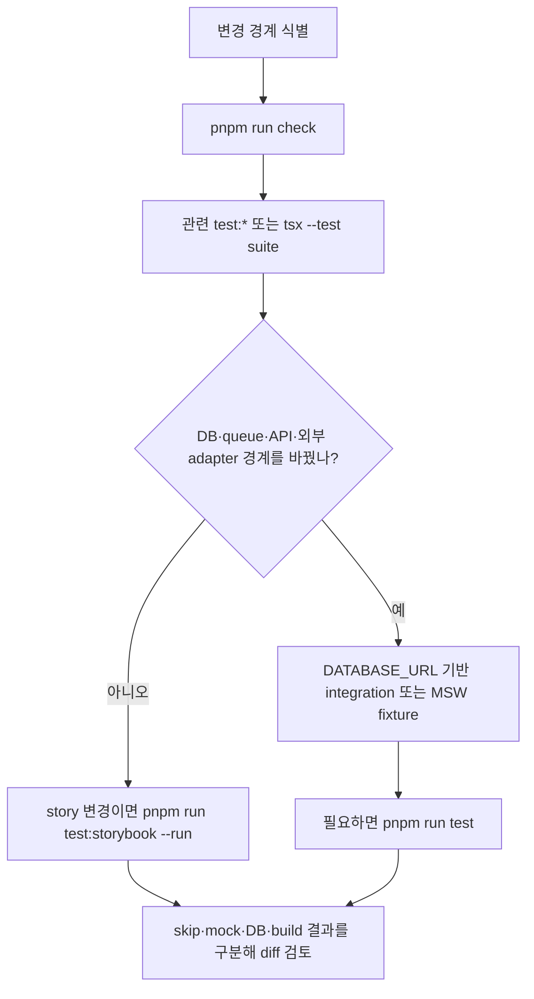

# 검증 전략과 회귀 경계

이 페이지는 변경 후 **무엇을 실행해야 하는가**와 **그 결과가 무엇을 증명하는가**를 구분한다. 저장소의 기본 JavaScript/TypeScript 검사 묶음은 `pnpm run check`이고, 전체 회귀 gate는 `pnpm run test`다. 전체 회귀는 먼저 `pnpm run build`를 실행하므로 빌드가 실패하면 뒤의 suite는 시작되지 않는다.

모듈 방향과 client/server 경계는 [모듈 경계](/openwiki/architecture/module-boundaries.md), 환경 변수와 DB 준비는 [설정과 배포](/openwiki/operations/configuration-and-deployment.md), 로컬 실행은 [빠른 시작](/openwiki/quickstart.md)을 참조한다.

## 검사 묶음과 실행 명령

`package.json`이 현재 suite의 실제 구성과 순서를 정의한다. “Vitest 전체”를 표준 명령으로 가정하지 말고, 아래 script 또는 필요한 개별 명령을 사용한다.

| 목적 | 실행 명령 | 주로 확인하는 경계 |
| --- | --- | --- |
| 포맷·lint·타입·FSD | `pnpm run check` | Biome, ESLint, TypeScript, Steiger와 AST 기반 import 규칙 |
| query·API transport | `pnpm run test:query` | Zod payload, HTTP 오류, retry, QueryClient cache와 MSW fixture |
| 일반 Node unit/UI suite | `tsx --test tests/<file>.test.ts` 또는 해당 `test:*` script | 순수 함수, 상태 전이, presentation과 UI 계약 |
| DB integration | `pnpm run test:auth:db`, `pnpm run test:mixing:db`, `pnpm run test:vocal-profile-persistence`, `pnpm run test:catalog-targets` 등 | PostgreSQL transaction, owner scope, unique/idempotency, 영속 상태 |
| queue·worker | `pnpm run test:vocal-profile-analysis-queue`, `pnpm run test:mixing:db`, `pnpm run test:song-analysis-queue` | enqueue, claim, lease, retry, 환불과 terminal state |
| Storybook browser | `pnpm run test:storybook --run` | Story provider 격리, browser-safe import, interaction/visual story 회귀 |
| production 자산·script | `pnpm run build`, `pnpm run test:process-scripts`, `pnpm run test:brand-icons` | Next 산출물, Storybook production 분리, 아이콘·metadata |
| Python 분석 서비스 | `python -m pytest -q services/vocal-analysis-core/tests` | 분석 품질 gate, segment, pitch 통계, 임시 파일 수명 |
| Python Modal adapter | `python -m unittest services/song-catalog-analyzer/test_modal_app.py` 및 `pytest services/vocal-profile-modal/test_transport.py` | 입력 제한, CPU Modal 호출/멱등성, artifact·envelope wire contract |

`pnpm run test`는 build와 brand icon, vocal-profile unit suite, 도메인별 analyzer·persistence·queue·UI·DB suite, `test:query`, architecture boundary, Storybook을 차례로 연결한다. 이 명령은 실제 외부 provider의 health check가 아니라 저장소가 정의한 회귀 순서다.

## 권장 흐름

작은 변경은 가장 좁은 계약부터 확인한다. DB, queue, route adapter 또는 외부 adapter를 건드렸다면 정적 검사와 해당 integration을 넓혀 실행한다.



이 흐름은 실행 순서의 권장안이다. 테스트를 이미 실행했다는 뜻이 아니다.

### 정적 검사: 실행 전 구조 안전망

`pnpm run check`는 다음을 순서대로 실행한다.

1. `pnpm run check:biome` — 전체 포맷과 Biome 규칙.
2. `pnpm run lint` — `dist`와 `.next`를 제외한 ESLint.
3. `pnpm run typecheck` — `tsc --noEmit`.
4. `pnpm run check:architecture` — `steiger ./src`와 `test:architecture-boundaries`.

`tests/fsd-architecture-boundaries.test.ts`는 `app`, `src`, `scripts`의 TypeScript import graph를 AST로 검사한다. slice의 `api`, `model`, `ui`, `lib`, `config` 내부 segment를 다른 slice가 직접 가져오면 public API 위반으로 판정한다. `"use client"` 경로에서 `server-only`, `next/headers`, `next/server`, DB module로 직접 또는 transitive하게 도달하는 것도 금지한다. type-only import는 runtime 경로로 세지 않는다. root `app/` route는 `_app`·`_pages`의 `index.*` public API를 사용하는 얇은 adapter여야 하며, 허용된 Next route config 외 구현 선언을 둘 수 없다.

이 검사는 import 방향과 client/server 분리를 증명한다. 동적 문자열 import, 런타임 인프라 설정, 아직 규칙으로 표현하지 않은 의미적 결합은 발견하지 못할 수 있다.

## API와 클라이언트 상태 계약

`pnpm run test:query`는 `tests/client-server-state-query.test.ts`, `tests/api-contracts.test.ts`, `tests/msw-query.test.ts`와 서버 조건의 multipart·integration fixture를 묶는다.

- `requestJson`은 성공 응답을 production Zod schema로 parse하고 schema 밖 필드를 노출하지 않는다. malformed success는 `ApiError(kind: "contract")`이며 재시도하지 않는다.
- 일반 4xx는 HTTP status와 오류 code를 보존하고 retry하지 않는다. 503과 network failure만 retryable로 분류하며 query retry는 최대 두 번이다.
- QueryClient 기본값은 `staleTime` 30초, `gcTime` 5분, window focus 재조회 해제, reconnect 재조회, mutation retry 해제다. notification list는 bounded polling과 read mutation 후 list cache 무효화를 사용한다.
- polling은 active job 또는 retryable transport error에서만 계속된다. terminal job에서는 멈춘다. query key에는 페이지·검색어·status 같은 상태 범위가 포함되고 mutation은 자신이 소유한 cache만 갱신한다.

`tests/msw-query.test.ts`는 `onUnhandledRequest: "error"`인 MSW handler와 production schema·QueryClient를 함께 사용한다. 따라서 UI가 예상하지 않은 네트워크 호출을 조기에 드러내며 403 단회 실패, 503 후 회복, malformed 응답의 비재시도, polling terminal 전환을 fixture로 고정한다. MSW는 실제 DNS·TLS·인증서·provider rate limit·production latency를 검증하지 않는다.

## UI와 Storybook

`tsx --test` 기반 UI suite는 presentation 결과와 상태 계산을 검증한다. 예를 들어 recorder/upload, vocal profile, mixing, recommendation, ticket, admin suite는 각각의 `test:*` script로 묶여 있다. UI 변경은 해당 도메인 script를 먼저 실행하고 story를 수정했다면 `pnpm run test:storybook --run`을 추가한다.

Vitest의 유일한 명시적 project는 `storybook`이다. `vitest.config.ts`는 `@storybook/addon-vitest`로 `.storybook` 설정을 읽고 `@vitest/browser-playwright`의 headless Chromium instance에서 story를 실행한다. `build-storybook`은 테스트가 아닌 별도 정적 산출물 build 명령이다. story의 provider와 MSW fixture는 실제 production provider를 호출하지 않는 격리된 browser 실행 환경을 구성한다.

`tests/storybook-production-boundary.test.ts`는 다음 회귀를 막는다.

- Storybook, Vitest, Playwright 도구가 `devDependencies`에만 있고 `build`, `start`, `start:web`가 Storybook을 호출하지 않는다.
- MSW worker는 `.storybook/public/mockServiceWorker.js`에만 존재하며 production `public/`에는 없다.
- story source는 `server-only`, `next/headers`, `next/server`, server index, shared DB, Prisma를 import하지 않는다.

이 계층은 story가 Chromium에서 로드되고 browser-safe한지와 visual/interaction story 계약을 확인한다. 모든 실제 Next route 조합, 모바일 브라우저 차이, 접근성의 모든 조합까지 증명하지는 않는다.

## DB와 queue 통합 fixture

DB suite는 `.env.local` 또는 `.env`의 `DATABASE_URL`을 사용한다. 값이 없으면 일부 suite는 `context.skip("DATABASE_URL is not configured")`으로 건너뛸 수 있으므로 skip을 통과로 해석하지 않는다. 필요한 schema와 seed는 운영 상황에 맞춰 `pnpm run db:validate`, `pnpm run db:migrate:deploy`, `pnpm run db:seed`, `pnpm run db:verify`로 준비한다.

- `tests/auth-ownership.integration.ts`는 두 사용자의 profile·Google account 조회가 owner-scoped인지 검사하고 fixture를 정리한다.
- `tests/catalog-snapshot.integration.ts`는 snapshot import의 복원과 중복 방지를 확인하고, URL/video ID 불일치·금지 metadata·중복 position·revision 하락을 거부한다.
- `tests/vocal-profile-analysis-queue.integration.ts`는 같은 idempotency key가 같은 job으로 수렴하는지, 다른 사용자의 job 격리, active admission과 ticket 차감 순서를 확인한다.
- `tests/mixing-queue.integration.ts`는 중복 enqueue가 한 job·한 usage debit으로 수렴하는지, worker claim 경쟁에서 한 owner만 승리하는지, lease 만료 후 recovery가 이어지는지 검사한다. preflight/reference fetch 또는 Modal submit 실패의 retry/refund, 일시적 catalog fetch 실패의 `PENDING`, finalization 실패 뒤 재처리 가능한 `SUBMITTED` 상태도 다룬다.

이 fixture들은 실제 PostgreSQL의 transaction·unique constraint·owner query와 저장된 상태 전이를 검증한다. production 데이터 규모, migration rollout 중 가용성, backup/restore, connection pool 고갈은 보장하지 않는다. queue fixture도 실제 worker 중단, credential 만료, Modal·Leemage·object storage의 처리 시간과 결과 품질을 대신 증명하지 않는다.

## Python 서비스 계약

`services/vocal-analysis-core/tests`는 합성 audio fixture로 runtime-neutral 분석 코어를 검증한다. `test_analysis.py`는 segmented guide의 melody/glissando 통계, 무음·짧은 입력·clipping quality gate, unsegmented voiced range, bounded pitch track과 unvoiced gap을 확인한다. `test_analysis_service.py`는 source를 보존하고 intermediate WAV를 제거하는 임시 작업 수명, smart-reference descriptor, parameterized MIME 정규화를 고정한다. README가 안내하는 설치와 실행 진입점은 다음과 같다.

```bash
python -m pip install -r services/vocal-analysis-core/requirements-dev.txt
python -m pytest -q services/vocal-analysis-core/tests
```

`services/song-catalog-analyzer/test_modal_app.py`는 request ID·source video ID·오디오 크기와 suffix allowlist를 거부하는 입력 계약을 검사한다. 동시에 CPU spawn/poll, request idempotency index, `chroma_cqt`, pinned dependency와 `vocal_analysis_core` adapter 사용을 source-level로 확인한다. `services/vocal-profile-modal/test_transport.py`는 artifact의 filename·MIME·size·SHA-256 round trip, `modal-analysis-envelope-v1`, optional synthesis reference와 cleanup flag, tampered artifact 거부를 검사한다.

Python test는 `package.json`의 `pnpm run test`에 포함되어 있지 않다. Python 의존성을 준비한 뒤 해당 파일에는 `unittest`, transport에는 `pytest` invocation을 사용한다. 이 테스트들은 Modal/HTTP provider를 실제 호출하지 않는 서비스 계약 fixture이므로 배포 인증, 실제 provider 가용성, 네트워크와 비용 조건은 별도 운영 점검 대상이다.

## 변경별 선택 규칙

1. Zod schema, API envelope, 오류 code, query key, polling 또는 retry를 바꾸면 `pnpm run test:query`를 실행한다.
2. React 상태·presentation·UI만 바꾸면 해당 `test:*` UI suite를 실행하고 story의 provider나 interaction을 바꾸면 `pnpm run test:storybook --run`을 추가한다.
3. FSD import, `app/` route adapter, client/server 경계를 바꾸면 `pnpm run check:architecture`를 실행한다.
4. entity query, migration, ticket, owner check 또는 persistence를 바꾸면 관련 `node --conditions react-server --import tsx --test` integration script를 실행한다. `DATABASE_URL` 부재로 skip되었는지 결과를 확인한다.
5. worker claim, retry, lease, refund 또는 외부 adapter를 바꾸면 관련 queue integration과 transport/MSW fixture를 함께 선택한다.
6. 분석 코어·Modal transport를 바꾸면 Python `pytest` suite와 영향받는 `test:vocal-profile-analyzer` 또는 queue suite를 함께 확인한다.
7. package script, build, asset, Storybook 설정을 바꾸면 `pnpm run build`, `pnpm run test:process-scripts`, `pnpm run test:storybook --run` 중 영향을 받는 명령을 선택하고 마지막에 `pnpm run check`를 다시 실행한다.

결과를 보고할 때 **skip**, **mock/MSW 통과**, **실제 DB 통과**, **build 통과**를 같은 의미로 취급하지 않는다. 이 저장소의 회귀 경계는 코드 계약과 저장된 상태를 촘촘히 검사하지만 외부 운영자의 가용성·비밀키·네트워크·복구 능력까지 대신 증명하지 않는다.
