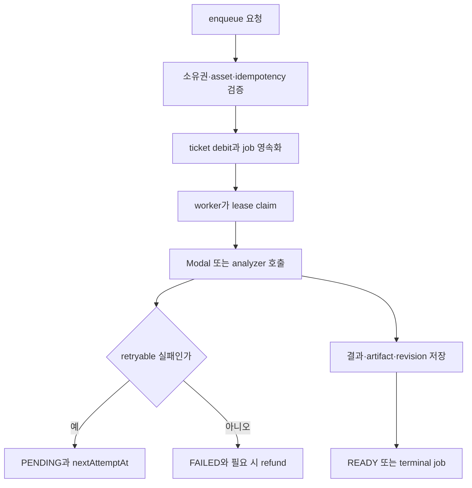

# 테스트 및 변경 안전성 매트릭스

이 페이지의 기준은 “테스트가 있다”가 아니라 **어떤 회귀 불변식을 실제로 지키는가**이다. `package.json`에 선언된 명령만 실행 명령으로 기록했으며, 통합 테스트는 소스에서 확인되는 데이터베이스·외부 어댑터 의존성을 따로 표시한다.

## 실행 지형

| 계층 | 대표 명령 | 실행기와 전제 | 보호하는 위험 |
|---|---|---|---|
| 전체 게이트 | `pnpm test` | 먼저 `pnpm run build`를 수행하고 여러 하위 명령을 연쇄 실행 | 빌드, 계약·UI·DB·큐·경계·Storybook을 한 번에 확인. 어느 단계에서든 실패하면 전체가 실패한다. |
| 순수 로직/계약 | `pnpm run test:key-fit`, `pnpm run test:recommendation`, `pnpm run test:query` | Node `--test` 또는 `tsx --test`; 대표 테스트는 로컬 fixture와 가짜 `fetch`만 사용 | 점수 계산, 정렬 결정성, Zod 응답 계약, 오류·재시도·캐시 정책의 회귀 |
| 프로세스/구성 | `pnpm run test:process-scripts` | 로컬 파일을 읽고 `concurrently` 자식 프로세스를 실제 실행 | 개발·시작 프로세스의 worker 구성과 한 자식 실패 시 형제 종료 |
| 데이터베이스 통합 | `pnpm run test:auth:db`, `pnpm run test:mixing:db`, `pnpm run test:vocal-profile-persistence`, `pnpm run test:vocal-profile-analysis-queue`, `pnpm run test:song-analysis-queue`, `pnpm run test:recommendation:db` | `DATABASE_URL`이 없으면 해당 테스트가 skip. Prisma/PostgreSQL 상태와 테스트 fixture 정리가 필요 | 소유권, 영속 상태 전이, ticket 원장·idempotency·lease·refund, 추천 persistence |
| 외부 어댑터 통합 | `pnpm run test:media`, 큐 관련 명령 | DB와 함께 Leemage/Modal 경계를 `fetch` stub 또는 테스트 URL로 검증. 실제 서비스 호출을 주장하지 않음 | presign/upload/confirm/delete 메타데이터와 분석기 요청 envelope, 외부 오류의 재시도·정리 |
| UI/Storybook | `pnpm run test:mixing:ui`, `pnpm run test:vocal-profile-presentation`, `pnpm run test:storybook --run` | 마지막 명령은 Vitest Storybook project, headless Playwright Chromium | 표시 상태·history/detail·접근성/시각 fixture. 브라우저 테스트는 `vitest.config.ts`의 Storybook project에서만 확인 |
| 구조 경계 | `pnpm run test:architecture-boundaries`, 또는 `pnpm run check:architecture` | `tsx --test`; 후자는 `steiger ./src`도 함께 실행 | FSD public API, client→server 전이, 얇은 root `app` adapter 규칙 |

`pnpm run test:query`는 `client-server-state-query.test.ts`와 `api-contracts.test.ts`를 순수한 요청·상태 정책 검증으로 실행한 뒤, 추가로 conversion/admin/multipart 통합 파일도 실행한다. 따라서 이 명령 전체를 “DB 불필요”라고 해석하면 안 되며, 개별 테스트의 skip/환경 조건을 확인해야 한다.

## 변경 위험별 매트릭스

| 변경 대상 | 먼저 실행할 명령 | 확인해야 할 불변식 | 아직 보장하지 않는 것 |
|---|---|---|---|
| API schema, 상태 envelope, URL query | `pnpm run test:query` | Zod가 알 수 없는 필드를 버리고 malformed 성공 응답을 `INVALID_API_RESPONSE` 계약 오류로 만들며, 일반 4xx는 재시도하지 않는다. UUID·idempotency·페이지·ticket 범위와 내부 notification link도 검증한다. | 실제 Next route와 배포 네트워크의 모든 응답 조합 |
| QueryClient/polling/mutation | `pnpm run test:query` | 기본 `staleTime` 30초, `gcTime` 5분, focus refetch off/reconnect on, mutation retry off; 활성 vocal job만 polling하고 terminal/404는 멈춘다. 읽음 mutation은 list cache를 invalidate한다. | 실제 브라우저 focus·네트워크 타이밍 전체 |
| key-fit 점수/분석기 profile | `pnpm run test:key-fit` | `key-fit-v3`가 안정된 버전이며 profile 순서·범위·tessitura를 검증한다. overlap은 대칭이고, key shift burden은 점수를 높일 수 없으며, confidence는 fit score와 독립적인 진단값이다. | 실제 Modal 분석 품질과 카탈로그 원천 데이터 |
| 추천 순위/표시 | `pnpm run test:recommendation` | 빈/중복 카탈로그는 `CATALOG_NOT_READY`; 전체 후보의 순위·tie-break·shift penalty가 결정적이고 입력을 mutate하지 않는다. 이유와 signed shift의 한국어 표시도 함께 검사한다. | PostgreSQL에 저장된 실제 catalog revision의 완전성(그 부분은 `test:recommendation:db`) |
| 사용자·프로필·인증 연결 | `pnpm run test:auth:db` | `DATABASE_URL`이 있을 때 두 사용자의 fixture를 만들고 profile과 Google account summary가 소유자별로 격리되는지 확인한다. | 인증 공급자의 실제 OAuth 왕복 |
| 믹싱 enqueue/worker | `pnpm run test:mixing:db` | reference가 없으면 job/debit 없이 실패한다. 같은 idempotency 요청은 하나의 job과 한 번의 debit을 만들고, 동시 claim은 한 worker만 성공한다. lease 만료는 회수 가능하며 preflight/외부 실패는 durable `FAILED`와 환불 상태를 남긴다. | 실제 Modal/Leemage 서비스의 처리 결과(테스트는 `fetch`를 stub) |
| vocal/song analysis queue | `pnpm run test:vocal-profile-analysis-queue`, `pnpm run test:song-analysis-queue` | job claim은 배타적이고 lease recovery가 가능하다. 분석기 retryable 실패는 `PENDING`으로 돌아가고, 성공은 분석 결과를 `READY` revision으로 저장하며 cleanup 확인을 보존한다. | 실제 분석 모델의 정확도·처리시간 |
| Leemage media lifecycle | `pnpm run test:media` | analyzer reference와 synthesis reference가 user-owned `MediaAsset`의 종류·외부 file id·URL·크기를 보존한다. 삭제 실패는 재시도 가능한 cleanup record를 남긴다. | 실제 object storage의 권한·가용성 |
| FSD import 또는 route 구조 | `pnpm run check:architecture` | cross-slice 내부 segment import는 public API 위반으로 잡고, 직접·전이적 client→server import는 잡되 type-only import는 무시한다. root `app`은 `_app`/`_pages` public API를 re-export하는 얇은 adapter여야 한다. | 런타임 동작 및 타입 시스템 전체 |
| worker/dev/start 스크립트 | `pnpm run test:process-scripts` | `dev`/`start`가 web, mixing, vocal-profile-analysis, song-analysis worker를 `concurrently --kill-others-on-fail`로 감독하며, 한 자식 실패 시 형제를 SIGTERM한다. | 운영 환경의 init/systemd/container supervisor |
| UI 표현/Storybook fixture | `pnpm run test:mixing:ui`, `pnpm run test:vocal-profile-presentation`, `pnpm run test:storybook --run` | 상태별 history/detail 및 vocal 결과 presentation의 표시 회귀와 Storybook Chromium 렌더 경계를 확인한다. | 실사용자의 모든 viewport·브라우저·실제 API 데이터 |

## 핵심 흐름: durable queue 검증

이 그림은 `mixing-queue.integration.ts`, `song-analysis-queue.integration.ts`, `vocal-profile-analysis-queue.integration.ts`에서 실제로 시험하는 enqueue→claim→외부 경계→retry/success 흐름을 요약한다. 테스트가 외부 서비스를 직접 호출한다는 뜻은 아니다.

## 안전한 변경 순서

1. **계약부터**: request/response schema, 상태 enum, 오류 code를 바꾸면 `pnpm run test:query`와 `pnpm run test:key-fit`를 먼저 돌려 소비자 정책과 domain 계산을 고정한다.
2. **경계 확인**: import나 `app` route를 옮기면 `pnpm run check:architecture`를 실행한다. `steiger.config.ts`에는 생성 Prisma 경로와 의도적으로 허용한 경계 예외가 있으므로, 새 예외를 추가해 실패를 숨기지 않는다.
3. **영속 큐 변경**: claim, retry, attempt, ticket, media cleanup을 바꾸면 `DATABASE_URL`을 준비하고 해당 DB 명령을 실행한다. 테스트들은 fixture를 만들고 `finally`에서 삭제하지만 공유 DB를 무조건 깨끗하다고 가정하지 않는다.
4. **외부 adapter 변경**: URL·header·payload·artifact 저장을 바꾸면 `test:media`와 관련 queue 통합 테스트를 함께 실행한다. stub이 확인하는 요청 method, `X-API-Key`, idempotency 및 상태 code를 유지한다.
5. **화면 변경**: presentation/UI 명령 후 `pnpm run test:storybook --run`을 실행한다. Storybook project는 headless Chromium으로 구동되므로 로컬 순수 테스트와 동일한 증거가 아니다.
6. **최종 게이트**: 영향 범위를 통과한 뒤 `pnpm test`를 사용한다. 이 명령은 build와 다수 하위 suite를 포함하므로, DB/브라우저 환경이 없는 환경에서는 해당 skip 또는 실패 원인을 별도로 기록한다.

## 해석상의 주의

- `auth-ownership.integration.ts`, `mixing-queue.integration.ts`, `leemage-media.integration.ts`처럼 `DATABASE_URL`을 검사하는 파일은 데이터베이스 통합 테스트다. 환경 변수가 없을 때의 skip은 성공적인 영속성 검증이 아니다.
- Modal, Leemage, object storage는 테스트에서 URL과 `globalThis.fetch`를 대체한다. 따라서 계약·상태 전이는 검증하지만 외부 시스템의 실제 가용성이나 분석 품질 coverage를 주장하지 않는다.
- `vitest.config.ts`는 Storybook project를 별도로 만들고 Playwright Chromium을 headless로 활성화한다. 일반 `node:test` suite가 브라우저 UI를 대신하지 않는다.
- `process-scripts.test.ts`는 package script 문자열과 supervisor의 실제 종료 신호를 검사한다. 이것은 worker 내부의 업무 성공을 검증하는 테스트가 아니다.
