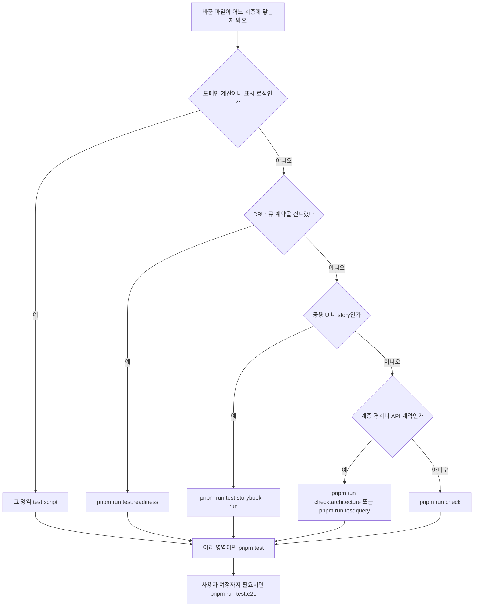

바꾼 파일이 어느 계층에 닿는지 정한 뒤 아래 표에서 그 줄의 명령만 먼저 돌리면 돼요. 검사 명령은 [package.json](repo://package.json#L9-L73)에 정의된 script 중에서만 고르세요.

## 바꾼 범위에 먼저 돌릴 명령

| 바꾼 범위 | 먼저 돌릴 명령 | 이어서 확인할 것 |
| --- | --- | --- |
| 도메인 계산·표시 로직(`src/entities`, `src/features`의 model·lib) | 그 영역 script(`pnpm run test:key-fit`, `pnpm run test:recommendation`, `pnpm run test:mixing:ui`, `pnpm run test:vocal-profile-presentation` 등) | 어떤 파일이 그 script에 묶였는지는 [package.json](repo://package.json#L46-L69)에 있고, 새 로직을 둘 layer는 [시스템 지도와 경계](../architecture/system-map.md)가 정해요 |
| PostgreSQL 스키마·migration·조회 | `pnpm run db:validate` 뒤 그 영역 통합 script(`pnpm run test:mixing:db`, `pnpm run test:tickets`, `pnpm run test:media`) | 대부분의 `*.integration.ts` 파일은 `DATABASE_URL`이 없으면 `DATABASE_URL is not configured`로 스스로 건너뛰어요([tests/mixing-queue.integration.ts](repo://tests/mixing-queue.integration.ts#L7-L11)) |
| 큐 접수·lease·복구·정리 실패 창 | `pnpm run test:readiness` | 각 파일이 고정하는 계약은 [Job 큐와 lease 복구 계약](../operations/job-processing.md)과 [복구 스크립트 운영 절차](../operations/recovery-runbook.md)가 소유해요 |
| HTTP 계약·브라우저 쿼리·재시도 판단 | `pnpm run test:query` | 서버 Route Handler 응답 자체는 이 명령이 확인하지 않아요. 쿼리 키·폴링·재시도 판단은 [브라우저 상태와 API 오류 계약](../architecture/client-data-flow.md)에 있어요 |
| 공용 UI·story·접근성 | `pnpm run test:storybook --run` | story 작성 규칙은 [공용 UI와 Storybook 경계](../architecture/shared-ui-and-storybook.md)에 있어요 |
| story의 server import, Storybook 도구 의존성 | `pnpm run test:process-scripts` | 같은 경계 규칙을 [공용 UI와 Storybook 경계](../architecture/shared-ui-and-storybook.md)가 설명해요 |
| FSD(Feature-Sliced Design) 계층 경계·slice public API | `pnpm run check:architecture` | 계층 의존 방향은 [시스템 지도와 경계](../architecture/system-map.md)를 보세요 |
| 관리자 API·커스텀 믹싱 | `pnpm run test:admin`, `pnpm run test:query` | 관리자 경계는 [관리자 콘솔과 커스텀 믹싱](../operations/admin-console.md)에 있어요 |
| 로그인부터 재생·삭제까지의 사용자 여정 | `pnpm run test:e2e` | 이전 revision과 비교하려면 `pnpm run test:e2e:compare <revision>`을 써요 |
| 여러 영역을 함께 건드림, 커밋 직전 | `pnpm test` | production build부터 readiness까지 순차 실행해요 |
| 정적 품질만 확인 | `pnpm run check` | Biome, ESLint, typecheck와 `check:architecture`를 함께 돌려요. 도메인·통합·브라우저 테스트는 여기에 없어요 |

실행 전에 두 가지를 준비하세요. PostgreSQL 통합 검사는 `DATABASE_URL`이 필요하고, E2E(end-to-end) 검사는 macOS 또는 Linux에서 Node.js 22 이상, 프로젝트 pnpm 버전, 실행 중인 Docker, ffmpeg, Chromium이 필요해요([tests/e2e/TESTING.md](repo://tests/e2e/TESTING.md#L5-L7)). 커밋할 때는 [.husky/pre-commit](repo://.husky/pre-commit#L1-L1)이 `pnpm run check:staged`를 대신 실행하지만, 그 훅은 포맷과 lint만 보니 표의 검사는 커밋 전에 직접 돌리세요.

`pnpm test`는 `pnpm run build`가 통과해야 다음 단계로 넘어가는 `&&` 사슬이에요. `pnpm run test:brand-icons` 뒤에 보컬·추천·믹싱·관리자·query script들이 이어지고, 마지막은 `pnpm run test:architecture-boundaries` → `pnpm run test:storybook --run` → `pnpm run test:readiness` 순서예요([package.json](repo://package.json#L23-L23)). 이 사슬에는 `steiger ./src`가 없으니 steiger 규칙까지 확인하려면 `pnpm run check:architecture`를 따로 돌리세요. 브라우저 E2E는 여기 포함되지 않으니 `pnpm run test:e2e`를 따로 돌려야 해요([package.json](repo://package.json#L24-L24)).

변경 범위에서 시작해 커밋 직전 전체 회귀와 브라우저 여정으로 이어지는 선택 흐름이에요.

## 검사 계층이 증명하는 것과 증명하지 않는 것

| 계층 | 실행 명령 | 확인하는 것 | 이 계층이 증명하지 않는 것 |
| --- | --- | --- | --- |
| 도메인 단위 테스트 | 해당 `pnpm run test:*` script | 외부 의존 없이 계산·표시 계약을 고정해요([tests/key-fit-scoring.test.ts](repo://tests/key-fit-scoring.test.ts#L1-L14)) | DB 저장, HTTP 래퍼, 브라우저 렌더, 외부 서비스 응답 |
| PostgreSQL 통합 테스트 | `pnpm run test:readiness`, `pnpm run test:mixing:db`, `pnpm run test:tickets`, `pnpm run test:media` 등 | 실제 PostgreSQL에서 트랜잭션·상태 전이·실패 창을 확인해요([tests/mixing-queue.integration.ts](repo://tests/mixing-queue.integration.ts#L7-L11)) | `DATABASE_URL`이 없으면 각 파일이 `DATABASE_URL is not configured`로 스스로 건너뛰므로, 초록불이 DB 동작을 확인했다는 뜻이 아니에요. 브라우저·워커 프로세스·외부 서비스 응답도 아니에요 |
| MSW(Mock Service Worker) fixture 기반 API 계약·쿼리 테스트 | `pnpm run test:query` | 클라이언트 Zod 스키마, 오류 분류, 재시도·폴링 판단을 fixture로 확인해요([tests/api-contracts.test.ts](repo://tests/api-contracts.test.ts#L34-L52), [tests/msw-query.test.ts](repo://tests/msw-query.test.ts#L37-L69)) | MSW 부분은 fixture를 돌려주므로 실제 Route Handler 응답 형식과 네트워크 실패는 확인하지 않아요. 등록하지 않은 요청은 `onUnhandledRequest: "error"`로 즉시 실패해요([tests/msw-query.test.ts](repo://tests/msw-query.test.ts#L33-L33)) |
| Storybook 브라우저 검사 | `pnpm run test:storybook --run` | headless chromium에서 story의 `play` assertion과 접근성 검사를 돌려요([vitest.config.ts](repo://vitest.config.ts#L38-L54)) | 서버 데이터·인증·DB 경로는 확인하지 않아요. story가 등록한 MSW 응답만 봐요 |
| Playwright E2E | `pnpm run test:e2e` | 실제 Chromium → Next.js production server → 제품 API → PostgreSQL → 워커를 지나는 사용자 계약을 확인해요([tests/e2e/TESTING.md](repo://tests/e2e/TESTING.md#L19-L26)) | 실제 Google 로그인, 실제 Modal GPU·Leemage 장애, 여러 브라우저·기기, 네트워크 품질, 실제 부하, 관리자 카탈로그 편집·커스텀 믹싱, 모든 파일 형식([tests/e2e/TESTING.md](repo://tests/e2e/TESTING.md#L28-L30)) |
| k6 부하 harness | `package.json` script에 없어요. k6 런타임에서 [scripts/load/readiness.k6.js](repo://scripts/load/readiness.k6.js)를 직접 실행해요 | 격리된 localhost 대상에 200 또는 명시적 429·503만 통과로 세고, check 성공률 99%와 p95 지연 2000ms 미만을 threshold로 둬요([scripts/load/readiness.k6.js](repo://scripts/load/readiness.k6.js#L16-L58)) | 기능 정확성과 데이터 정합성. `pnpm test`의 단계 목록([package.json](repo://package.json#L23-L23))과 E2E workflow([.github/workflows/e2e.yml](repo://.github/workflows/e2e.yml#L14-L24)) 어느 쪽에도 묶여 있지 않아요 |

증명하지 않는 범위를 문장으로 가장 분명하게 적어 둔 곳은 E2E 문서예요. 같은 fixture와 같은 assertion으로 baseline과 candidate를 실행했을 때 "두 실행의 모든 assertion이 통과했다는 것은 이 계약의 회귀가 관찰되지 않았다는 뜻이며, 전체 서비스의 100% 동등성을 증명하지 않는다"고 밝혀요([tests/e2e/TESTING.md](repo://tests/e2e/TESTING.md#L28-L28)).

## 명령이 실제로 실행하는 파일

| 명령 | 묶여 있는 파일 |
| --- | --- |
| `pnpm run test:readiness` | `runtime-timeouts.test.ts`, `runtime-db.integration.ts`, `signup-recovery.integration.ts`, `media-recovery.integration.ts`, `worker-recovery.integration.ts`, `admission.test.ts`, `admission.integration.ts`, `profile-deletion-race.integration.ts`, 그리고 마지막 단계의 `modal-submission-contract.py` |
| `pnpm run test:query` | `client-server-state-query.test.ts`, `api-contracts.test.ts`, `msw-query.test.ts`, `conversion-stream-upload.test.ts`, `admin-custom-mixing.integration.ts`, `bounded-multipart.test.ts` |
| `pnpm run check:architecture` | `steiger ./src`와 `fsd-architecture-boundaries.test.ts` |
| `pnpm run test:process-scripts` | `process-scripts.test.ts`, `storybook-production-boundary.test.ts` |
| `pnpm run test:storybook --run` | `vitest --project storybook`가 찾는 story 파일 전체 |
| `pnpm run test:e2e` | `run.mjs`가 세우는 suite, 즉 `journeys.spec.mjs`, `provider.mjs`, `seed.ts`, `playwright.config.mjs`, `deny-external.mjs` |

`pnpm run test:readiness`는 `--test-concurrency=1`로 파일을 하나씩 실행한 뒤 Python 계약 검사를 붙여요([package.json](repo://package.json#L70-L70)). 그래서 PostgreSQL을 공유하는 복구 시나리오가 서로 간섭하지 않아요. `pnpm run check:architecture`는 steiger 검사 뒤 FSD 경계 테스트를 실행하고, 그 테스트는 실제 `src/` 트리에서 public API 위반, client/server 위반, root App adapter 위반이 모두 비어 있는지 확인해요([package.json](repo://package.json#L31-L31), [tests/fsd-architecture-boundaries.test.ts](repo://tests/fsd-architecture-boundaries.test.ts#L381-L386)). steiger 설정에는 소수의 파일별 예외가 있으니, 새 코드를 그 목록에 추가하기 전에 왜 예외인지 먼저 읽으세요([steiger.config.ts](repo://steiger.config.ts#L4-L66)).

`pnpm run test:e2e`는 suite 파일만 돌리는 게 아니에요. runner가 target마다 `prisma migrate deploy`, `prisma generate`, `tests/e2e/seed.ts`, `pnpm run build`를 거친 뒤 Next.js production server와 `mixing`·`vocal-profile-analysis` 워커를 띄우고 나서 Playwright를 실행해요([tests/e2e/run.mjs](repo://tests/e2e/run.mjs#L198-L246), [tests/e2e/run.mjs](repo://tests/e2e/run.mjs#L230-L237)). 그래서 제품 build나 워커 시작 코드가 깨지면 첫 시나리오에 닿기 전에 이미 실패해요.

## 커밋 전과 CI에서 자동으로 도는 검사

커밋 훅이 실행하는 것은 staged 파일 대상 Biome 검사 하나예요. `pnpm run check:staged`는 `biome check --staged --no-errors-on-unmatched`이므로 포맷과 lint만 보고, typecheck나 테스트는 돌리지 않아요([package.json](repo://package.json#L30-L30), [biome.json](repo://biome.json#L9-L22)).

CI 쪽은 범위가 더 좁아요. 이 저장소의 `.github/workflows/`에는 Browser E2E workflow 하나가 있고, `pull_request`와 수동 `workflow_dispatch`에서만 돌아요. 이 workflow는 Node.js 22를 준비하고 `pnpm install --frozen-lockfile`, `pnpm exec playwright install --with-deps chromium`, ffmpeg 설치를 거친 뒤 `pnpm run test:e2e`를 실행하고, 결과를 `artifacts/e2e`에서 7일간 보관해요([.github/workflows/e2e.yml](repo://.github/workflows/e2e.yml#L1-L29)). `pnpm test`와 `pnpm run check`는 이 workflow에 없으니 로컬에서 직접 돌려야 해요.

E2E 설정은 불안정한 테스트를 자동 재시도로 감추지 않아요. Playwright 설정이 `workers: 1`, `retries: 0`, `forbidOnly: true`이고 실패할 때만 trace와 screenshot을 남겨요([tests/e2e/playwright.config.mjs](repo://tests/e2e/playwright.config.mjs#L2-L20)). 실패하면 로그와 trace를 보고 테스트 결함, 기존 앱 결함, 신규 회귀를 구분한 뒤 고치세요([tests/e2e/TESTING.md](repo://tests/e2e/TESTING.md#L40-L40)).

## E2E가 덮지 않는 범위

E2E는 문서에 적힌 만큼만 증명해요. 다음은 이 suite의 검증 대상이 아니에요([tests/e2e/TESTING.md](repo://tests/e2e/TESTING.md#L28-L30)).

- 실제 Google 동의 화면과 콜백, 신규 가입. 로그인은 테스트 전 DB session 행과 서명 cookie를 넣는 방식이에요([tests/e2e/seed.ts](repo://tests/e2e/seed.ts#L41-L50)).
- 실제 Modal GPU와 Leemage 장애, 여러 브라우저·기기, 네트워크 품질, 실제 부하.
- 워커 crash·race·timeout·idempotency. 이 항목은 `pnpm run test:readiness`의 복구 시나리오가 보완해요.
- 관리자 카탈로그 편집과 커스텀 믹싱, 모든 파일 형식, 모바일·다중 브라우저.
- 과부하 때의 429·503 같은 승인된 의도적 변경. 같은 코드끼리 같아야 하는 계약으로 고정하지 않아요.

반대로 동시 요청이나 잔액 경계처럼 실제 HTTP를 거쳐야 확인되는 항목은 E2E에 남아 있어요. 같은 접수 본문을 동시에 재전송하면 한 번만 차감되고 같은 job ID가 돌아오는지, 잔액이 0인 사용자의 접수가 402와 `INSUFFICIENT_TICKETS`로 거절되는지를 확인해요([tests/e2e/journeys.spec.mjs](repo://tests/e2e/journeys.spec.mjs#L170-L207), [tests/e2e/journeys.spec.mjs](repo://tests/e2e/journeys.spec.mjs#L326-L336)). 접수 제한에 걸려 429와 `Retry-After` 1–10초가 나오는 경우는 회귀가 아니라 의도적 정책 차이로 report annotation에 기록하고, 기다린 재전송이 같은 job을 돌려주는지까지 확인해요([tests/e2e/TESTING.md](repo://tests/e2e/TESTING.md#L52-L52)).

## 산출물과 실패 확인

E2E는 실행 로그, 실패 흔적, 결과를 `artifacts/e2e/` 아래 target별 디렉터리(`baseline`, `candidate`)에 나눠 남겨요([tests/e2e/run.mjs](repo://tests/e2e/run.mjs#L20-L21), [tests/e2e/run.mjs](repo://tests/e2e/run.mjs#L145-L157)). 실패 원인을 찾을 때는 아래 표에서 그 실행 단계에 해당하는 줄을 여세요.

| 산출물 | 경로 | 실행 후 여기서 확인하세요 |
| --- | --- | --- |
| 실행 로그 | `artifacts/e2e/<target>/setup.log` | `prisma migrate deploy`, `prisma generate`, `tests/e2e/seed.ts`, `pnpm run build`처럼 첫 시나리오 전에 도는 준비 단계의 실패가 여기에 남아요([tests/e2e/run.mjs](repo://tests/e2e/run.mjs#L192-L207)) |
| 실행 로그 | `artifacts/e2e/<target>/web.log` | Next.js production server가 뜨지 못하면 runner가 이 경로를 오류 메시지에 넣어요([tests/e2e/run.mjs](repo://tests/e2e/run.mjs#L208-L229)) |
| 실행 로그 | `artifacts/e2e/<target>/playwright.log` | Playwright suite 자체의 실패와 스택이 여기에 쌓여요([tests/e2e/run.mjs](repo://tests/e2e/run.mjs#L240-L246)) |
| 실행 로그 | `artifacts/e2e/<target>/vocal-profile-analysis.log`, `mixing.log` | 워커 프로세스의 시작 실패와 처리 중 오류를 워커별로 볼 수 있어요([tests/e2e/run.mjs](repo://tests/e2e/run.mjs#L230-L237)) |
| 실패 screenshot과 trace | `artifacts/e2e/<target>/test-results/` | Playwright의 `outputDir`이 이 경로이고 `trace: "retain-on-failure"`, `screenshot: "only-on-failure"`라서 실패한 시나리오만 남아요. `pnpm exec playwright show-trace artifacts/e2e/candidate/test-results/TEST_DIRECTORY/trace.zip`으로 열어요([tests/e2e/playwright.config.mjs](repo://tests/e2e/playwright.config.mjs#L9-L19), [tests/e2e/TESTING.md](repo://tests/e2e/TESTING.md#L34-L38)) |
| suite 결과 JSON | `artifacts/e2e/<target>/results.json` | Playwright reporter 설정이 이 경로를 정하고 assertion별 결과를 담아요([tests/e2e/playwright.config.mjs](repo://tests/e2e/playwright.config.mjs#L11-L11)) |
| baseline·candidate 비교 요약 | `artifacts/e2e/comparison.json` | target별 `sha`, `passed`, suite 해시, `report` 경로를 모아 두고, `scope`에 "Same browser assertions; not proof of all behavior equivalence"를 함께 적어요([tests/e2e/run.mjs](repo://tests/e2e/run.mjs#L258-L261)) |

runner는 target마다 앞의 로그 네 개를 빈 파일로 새로 만들고 그 뒤 프로세스 출력을 이어 붙여요([tests/e2e/run.mjs](repo://tests/e2e/run.mjs#L153-L157)). 이 디렉터리는 `.gitignore`로 제외돼요([.gitignore](repo://.gitignore#L63-L63)). 로컬에서 만든 fixture 계정의 세션 값이 들어 있으니, 값 자체를 위키나 커밋에 옮기지 마세요.

비교 실행은 E2E suite 파일 다섯 개의 해시를 실행 전후로 다시 계산해서, 도중에 suite가 바뀌면 `E2E suite changed during comparison; restart the run` 오류로 중단해요([tests/e2e/run.mjs](repo://tests/e2e/run.mjs#L25-L33), [tests/e2e/run.mjs](repo://tests/e2e/run.mjs#L150-L152)). 그래서 비교를 돌리는 동안에는 suite 파일을 수정하지 마세요.

## 다음에 볼 문서

- 작업 점유·재시도·복구 규칙 자체는 [Job 큐와 lease 복구 계약](../operations/job-processing.md)이 소유해요.
- 운영 중 실패를 해소하는 명령은 [복구 스크립트 운영 절차](../operations/recovery-runbook.md)에 있어요.
- 검사 대상이 되는 환경 변수와 기본값은 [환경 변수와 런타임 한도](../operations/configuration.md)를 보세요.
- 공용 UI·story 규칙과 개발 전용 경계는 [공용 UI와 Storybook 경계](../architecture/shared-ui-and-storybook.md)에 있어요.
- 어떤 문서를 어떤 순서로 읽을지는 [코드베이스 시작 지도](../quickstart.md)가 안내해요.
