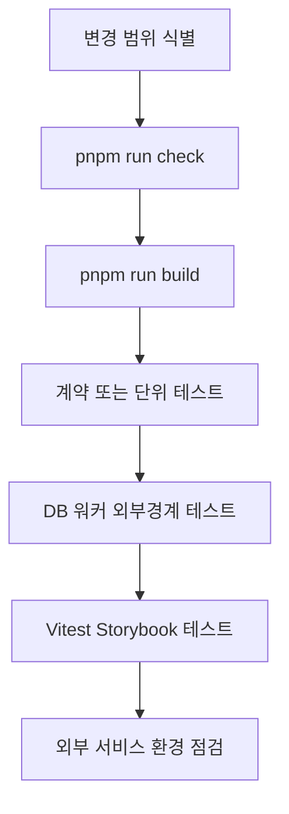
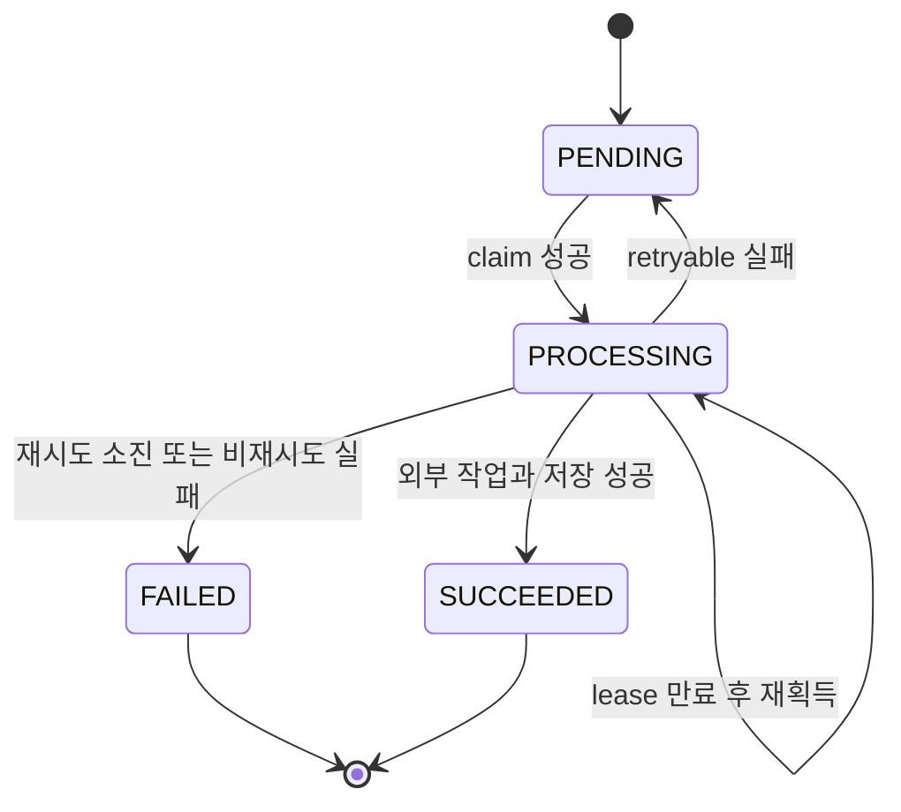

# 테스트와 안전한 변경 검증

변경을 제출하기 전에는 `pnpm run check`와 필요한 기능별 테스트를 함께 실행한다. `check`는 Biome, ESLint, TypeScript, Feature-Sliced Design 경계를 검사하고, `test`는 먼저 Next.js 빌드를 만든 뒤 단위·통합·Storybook 묶음을 실행한다. 데이터베이스 통합 테스트는 `DATABASE_URL`이 없으면 실패하지 않고 건너뛰므로, 통합 경계를 실제로 검증하려면 테스트용 데이터베이스를 별도로 준비해야 한다.

## 검증 흐름

이 흐름은 정적 규칙으로 빠르게 실패를 찾은 뒤, 데이터 계약과 런타임 경계를 좁혀 검증하고, 마지막으로 브라우저 렌더링을 확인하는 순서를 보여준다.

## 기본 명령과 각 명령의 경계

| 명령 | 검증하는 것 | 선택할 때의 기준 |
| --- | --- | --- |
| `pnpm run build` | Next.js 애플리케이션이 배포용으로 컴파일되는지 확인한다. | 라우트, 서버·클라이언트 경계, 환경 변수 사용, 번들에 영향을 주는 변경이면 항상 실행한다. |
| `pnpm run check:biome` | Biome 형식과 정적 규칙을 검사한다. | 모든 소스 변경에 사용한다. 자동 수정은 `pnpm run format:write`로 한다. |
| `pnpm run lint` | ESLint 규칙과 React/Next.js 사용 오류를 검사한다. | 컴포넌트, Hook, 페이지, 접근성 관련 변경에 특히 중요하다. |
| `pnpm run typecheck` | `tsc --noEmit`으로 TypeScript 타입 계약을 검사한다. | API 응답, Zod 스키마, 서버·클라이언트 인터페이스, DB 모델을 바꿀 때 필수다. |
| `pnpm run check:architecture` | `steiger ./src`와 `tests/fsd-architecture-boundaries.test.ts`를 실행한다. | `src`의 레이어·슬라이스 import, public API, server-only 도달 경로를 바꿀 때 사용한다. |
| `pnpm run check` | 위 정적 검사를 `check:biome` → `lint` → `typecheck` → `check:architecture` 순서로 묶는다. | 일반적인 변경의 기본 게이트다. |
| `pnpm run test` | `build` 후 기능별 Node 테스트, DB 테스트, UI 테스트, `test:architecture-boundaries`, `test:storybook --run`을 실행한다. | 릴리스 전 또는 여러 경계가 함께 바뀐 경우의 전체 회귀다. |

`package.json`의 `test`는 한 번에 모든 테스트 파일을 직접 나열하지 않고 기능별 스크립트를 연결한다. 따라서 전체 테스트가 너무 큰 경우에도 같은 연결을 따라 영향받은 묶음만 먼저 실행할 수 있다. 테스트 실행 환경은 Node `>=22.13.0`, 패키지 매니저 `pnpm@11.9.0`이다. [스크립트와 버전 요구사항](repo://package.json#L5-L33)

## 변경 범위별 빠른 선택

1. **스키마·API·Query 키를 바꾼 경우** `pnpm run test:query`를 실행한다. 이 묶음은 `tests/client-server-state-query.test.ts`, `tests/api-contracts.test.ts`, MSW 및 서버 업로드 경계를 포함한다.
2. **기능의 순수 계산·표현·브라우저 상호작용을 바꾼 경우** 해당 `test:*` 묶음을 먼저 실행하고, Storybook story가 영향을 받으면 `pnpm run test:storybook --run`을 추가한다. Storybook 프로젝트는 Playwright Chromium headless 브라우저에서 실행된다. [Vitest Storybook 프로젝트 설정](repo://vitest.config.ts#L38-L52)
3. **인증, 소유권, DB 읽기·쓰기를 바꾼 경우** `pnpm run test:auth:db`와 영향을 받는 기능별 DB 묶음을 실행한다. `tests/auth-ownership.integration.ts`는 두 사용자를 만들고 한 사용자의 vocal profile과 Google 연결 요약이 다른 사용자에게 보이지 않는지 확인한다. [소유권 통합 경계](repo://tests/auth-ownership.integration.ts#L7-L65)
4. **비동기 워커·lease·재시도·티켓을 바꾼 경우** 관련 큐 통합 테스트를 선택한다. mixing은 `pnpm run test:mixing:db`, vocal profile 분석은 `pnpm run test:vocal-profile-analysis-queue`, song analysis는 `pnpm run test:song-analysis-queue`다.
5. **카탈로그 import/export·revision을 바꾼 경우** `tests/catalog-snapshot.integration.ts`를 직접 실행하거나 카탈로그 관련 스크립트를 실행한다.
6. **실행 스크립트·프로세스 감독·배포 경계를 바꾼 경우** `pnpm run test:process-scripts`를 실행한다. 이 테스트는 `dev`와 `start`가 웹 프로세스와 mixing·vocal-profile·song-analysis 워커를 함께 감독하는지, 자식 하나가 실패할 때 `concurrently --kill-others-on-fail`이 형제 프로세스를 종료하는지 확인한다. [프로세스 스크립트 경계](repo://tests/process-scripts.test.ts#L29-L81)

## 계약 테스트: 경계에서 형태를 고정하기

`tests/api-contracts.test.ts`는 Zod 스키마를 실제 대표 payload에 적용해 입력·출력의 형태를 고정한다. 이 테스트가 보장하는 대표 규칙은 다음과 같다.

- ticket wallet은 `VOCAL_ANALYSIS`와 `AI_MIXING` 종류를 구분하고 잔액을 음이 아닌 정수로 제한한다.
- 요청 schema는 UUID, idempotency key, 페이지 번호, 티켓 조정 범위를 검증하며 URL 값은 정규화한다.
- 알림 링크는 내부 경로만 허용하고 페이지 크기와 읽음 응답 envelope을 제한한다.
- mixing 삭제 응답은 `status: "deleted"`, ID, `mediaCleanupPending`을 포함하는 안정적인 terminal envelope을 사용한다.
- vocal analysis 업로드는 허용된 MIME type과 최대 바이트 수를 확인한다. 파일 내용의 실제 오디오 유효성까지 읽어 검사하지는 않는다.

응답 계약을 바꿀 때는 이 테스트만 고치지 말고 서버 producer, `requestJson` 호출자, Query cache 갱신 테스트를 함께 확인한다. `requestJson`은 성공 응답을 Zod로 파싱해 모르는 필드를 제거하고, malformed success는 재시도하지 않는 contract 오류로 만든다. 5xx와 네트워크 오류는 retryable로 표시하지만 일반 4xx는 재시도하지 않는다. [Query·HTTP 계약 회귀](repo://tests/client-server-state-query.test.ts#L40-L121) [API schema 회귀](repo://tests/api-contracts.test.ts#L34-L212)

## DB와 워커 통합 테스트: lifecycle와 복구를 검증하기

DB 통합 테스트는 `.env.local`, `.env`를 읽고 `DATABASE_URL`이 없으면 `context.skip("DATABASE_URL is not configured")`로 종료한다. 테스트는 임시 사용자·작업·asset을 만들고 `finally`에서 지우므로 공유 운영 DB가 아니라 격리된 테스트 DB에서 실행한다.

이 lifecycle은 큐마다 세부 상태와 환불 규칙이 다르므로 공통 구현 계약으로 오해하면 안 된다.

- **Mixing**: `tests/mixing-queue.integration.ts`는 idempotency 동시 enqueue가 같은 job을 반환하고 티켓을 한 번만 차감하는지, 두 worker 중 하나만 claim하는지, lease 만료를 회복하는지 확인한다. reference fetch·catalog target fetch·Modal submit 실패는 단계에 따라 `FAILED` 또는 `PENDING`으로 남고, 재시도 소진 전후의 환불과 `MIXING_FAILED` 알림을 구분한다. [mixing enqueue·claim·복구 회귀](repo://tests/mixing-queue.integration.ts#L7-L40) [실패·재시도·환불 assertions](repo://tests/mixing-queue.integration.ts#L172-L260)
- **Song analysis**: target asset이 준비되기 전에는 claim하지 않고, lease는 단일 worker만 소유하며 만료 후 다른 worker가 재획득한다. analyzer 응답이 성공하면 job은 `SUCCEEDED`, analysis는 `READY` revision으로 저장된다. retryable analyzer 오류는 job을 `PENDING`으로 돌린다. [song analysis lifecycle](repo://tests/song-analysis-queue.integration.ts#L36-L123) [retryable 오류](repo://tests/song-analysis-queue.integration.ts#L125-L177)
- **Vocal profile analysis**: 같은 사용자와 idempotency key의 enqueue는 같은 job과 한 번의 presign을 재사용하고, 다른 요청이 이미 활성 작업을 만들면 `ANALYSIS_BUSY`가 된다. job 조회와 목록은 소유 사용자 범위로 제한된다. [vocal profile enqueue 경계](repo://tests/vocal-profile-analysis-queue.integration.ts#L140-L191)
- **Catalog snapshot**: export 결과에 raw bytes, base64, 임시 경로가 들어가지 않고 allowlist 밖 metadata를 제거·거부한다. import는 새 catalog을 복원하고 반복 실행에 idempotent하며, 기존 revision을 낮추지 않는다. [snapshot import·검증 회귀](repo://tests/catalog-snapshot.integration.ts#L8-L40) [idempotency·revision assertions](repo://tests/catalog-snapshot.integration.ts#L63-L108) [revision 보존](repo://tests/catalog-snapshot.integration.ts#L173-L211)

워커의 큐·lease·상태 소유권을 바꾸는 작업은 실행 중인 `dev` 또는 `start`만으로 확인하지 않는다. durable worker의 claim 및 복구 모델은 [Durable workers](/openwiki/architecture/durable-workers.md), 웹·DB·외부 서비스의 경계는 [System boundaries](/openwiki/architecture/system-boundaries.md)를 함께 읽고 해당 통합 테스트를 실행한다.

## 아키텍처 경계 테스트

`tests/fsd-architecture-boundaries.test.ts`는 `app`, `src`, `scripts`의 TypeScript 소스를 분석한다. 같은 slice 내부의 `api`, `model`, `ui`, `lib`, `config` 세그먼트는 직접 참조할 수 있지만, 다른 slice가 내부 세그먼트를 가져오면 public API를 사용하도록 실패시킨다. 또한 runtime import 경로가 `.server` 모듈, DB 모듈, `server-only`, `next/headers`, `next/server`에 도달하는 client-server 위반도 탐지한다. 이 검사는 파일이 존재하는지만 보는 것이 아니라 TypeScript AST와 runtime/type-only import를 구분한다. [FSD import와 server 경계 검사](repo://tests/fsd-architecture-boundaries.test.ts#L24-L45) [위반 탐색 규칙](repo://tests/fsd-architecture-boundaries.test.ts#L154-L220)

## 테스트가 보장하지 않는 것

이 저장소의 집중 테스트는 외부 호출을 대개 `fetch` fixture로 대체한다. 따라서 아래 사실은 테스트 성공만으로 보장되지 않는다.

- 실제 Modal API의 인증, quota, GPU 실행, 지연, 실제 변환 결과
- 실제 Leemage/object storage의 presign·upload·confirm, URL 만료, 권한과 파일 무결성
- 실제 song analyzer와 catalog target provider의 응답 schema·가용성
- 테스트 DB와 운영 DB의 migration 상태, connection pool, 네트워크 지연
- 실제 브라우저·운영체제의 microphone, audio codec, 파일 크기, Chromium 이외 브라우저 동작
- 외부 서비스의 webhook, rate limit, 장애 복구와 배포 환경의 secret·환경 변수 설정

`tests/process-scripts.test.ts`도 로컬 파일과 문자열, fixture 프로세스의 감독 규칙을 확인할 뿐 실제 Modal·Leemage 분석을 실행하지 않는다. vocal analysis가 로컬 analyzer runtime 없이 Modal adapter를 사용한다는 배선과 `docker-compose.yml`·`.env.example`에 폐기된 local API 설정이 없는지는 확인한다. [외부 분석기 배선 검사](repo://tests/process-scripts.test.ts#L8-L27)

따라서 외부 서비스 adapter, 환경 변수, Docker, DB migration을 바꿀 때는 unit/계약 테스트에 머물지 말고 **mock 통합 테스트 → 실제 test 환경 smoke test → 필요하면 UI/브라우저 확인** 순서로 넓힌다. UI만 바꾼다면 관련 unit과 Storybook을 우선하고, API payload를 바꾼다면 계약·Query·서버 통합을 우선한다. lease·재시도·환불처럼 데이터와 워커가 함께 움직이면 DB 통합 테스트를 생략하지 않는다.

## 실행 전 체크리스트

- `pnpm install` 후 Node와 `pnpm` 버전이 프로젝트 요구사항과 맞는가?
- `pnpm run check`가 모두 통과했는가?
- 변경한 slice에 대응하는 `test:*` 명령을 실행했는가?
- DB 테스트가 skip되지 않았는지, 테스트 DB의 migration과 seed 상태가 맞는지 확인했는가?
- 외부 서비스 변경이면 실제 test 환경의 credentials, URL, MIME·응답 계약을 smoke test했는가?
- 웹·워커를 함께 바꾸었다면 `pnpm run test` 또는 최소한 해당 worker integration과 `pnpm run test:storybook --run`을 실행했는가?

다음 단계로 런타임 프로세스와 lease 복구를 이해하려면 [Durable workers](/openwiki/architecture/durable-workers.md)를, 환경 변수와 외부 endpoint를 확인하려면 [Runtime configuration](/openwiki/operations/runtime-configuration.md)를 읽는다.
