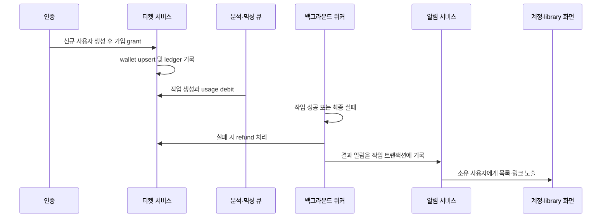

# 계정·티켓·알림 흐름

이 페이지는 로그인한 사용자의 계정 부수효과를 추적할 때 읽는다. 티켓은 `VOCAL_ANALYSIS`와 `AI_MIXING`을 분리해 보관하며, 모든 잔액 변화는 `TicketWallet`과 `TicketLedger`를 하나의 트랜잭션에서 함께 갱신한다. 분석·믹싱 결과는 작업 상태와 연결된 소유 사용자 알림으로 전달된다. 작업의 전체 생성·처리 흐름은 [보컬 프로필 분석](/openwiki/workflows/vocal-profile-analysis.md)과 [추천에서 믹싱까지](/openwiki/workflows/recommendation-to-mixing.md)를 참고한다.

## 전체 흐름

*가입, 작업 비용 차감, 실패 환불, 결과 알림 사이의 현재 런타임 연결을 나타낸다.*

## 가입 grant와 티켓 소유권

Google 기반 Better Auth의 `databaseHooks.user.create.after`가 새 사용자 생성 직후 `ensureSignupTicketGrants(user.id)`를 호출한다. 분석 grant와 믹싱 grant는 각각 환경 설정에서 읽는다. 기본값은 분석 5장(`SIGNUP_VOCAL_ANALYSIS_TICKET_GRANT`), 믹싱 1장(`SIGNUP_MIXING_TICKET_GRANT`)이며 각 값은 0~1000의 안전한 정수여야 한다. 가입 grant의 `reason`은 각각 `회원가입 무료 분석 티켓`, `회원가입 무료 믹싱 티켓`이다.

두 종류는 별도 지갑이다.

- `TicketWallet`의 복합 기본 키는 `(userId, kind)`이고 `balance`는 정수다.
- `TicketLedger`는 `userId`, `kind`, `amount`, `balanceAfter`, `reason`을 남긴다. 양수는 충전, 음수는 차감이다.
- 가입 grant의 idempotency key는 `signup:vocal-analysis:${userId}`와 `signup:ai-mixing:${userId}`다. 따라서 가입 hook 재실행이나 동시 실행이 중복 지급으로 이어지지 않는다. 믹싱 종류는 기존 최초 `SIGNUP_GRANT`를 재사용하는 확인도 한다.

실제 비용은 큐에 작업을 만들 때 고정한다. 기본 비용은 분석과 믹싱 모두 1장(`VOCAL_PROFILE_ANALYSIS_TICKET_COST`, `MIXING_TICKET_COST`)이고, 작업 레코드의 `ticketCost`가 이후 환불 기준이 된다. 환경 변수의 실제 운영값은 배포 설정을 확인해야 하며 문서의 기본값과 다를 수 있다.

## 사용 차감의 원자성·멱등성

분석 큐는 잔액이 비용보다 적으면 작업을 만들기 전에 `InsufficientTicketsError`를 반환한다. 이후 `VocalProfileAnalysisJob` 생성과 `VOCAL_ANALYSIS`의 `USAGE_DEBIT`(음수 `amount`)를 `Serializable` 트랜잭션에서 수행한다. 믹싱 큐도 `MixingJob` 생성과 `AI_MIXING`의 `USAGE_DEBIT`를 같은 방식으로 묶는다. 두 작업 모두 사용자별 idempotency key로 이미 생성된 작업을 되찾고, 직렬화 쓰기 충돌은 최대 3회 시도한다.

모든 일반 변경은 `applyTicketChange`가 담당한다.

1. `idempotencyKey`·`reason`은 필수이고 `amount`는 안전한 정수인지 검증한다.
2. 같은 key의 ledger가 있으면 사용자·종류·type·amount가 모두 같은지 확인하고 기존 행을 반환한다. 입력이 다르면 key 재사용 오류다.
3. 지갑을 upsert한다. 음수 변경은 `balance >= abs(amount)` 조건부 갱신으로 수행하므로 잔액이 음수가 되지 않는다.
4. 갱신된 지갑 잔액을 `balanceAfter`로 기록한다.

트랜잭션은 `Serializable` 격리 수준을 사용하고 write conflict/deadlock을 재시도한다. unique 충돌도 같은 입력의 기존 ledger면 멱등 성공으로 흡수한다. 따라서 지갑 잔액과 ledger의 `balanceAfter`가 따로 성공하는 경로를 만들지 말아야 한다.

## 실패와 환불 시점

ledger type은 다음 네 가지다.

| type | amount | 의미 |
| --- | ---: | --- |
| `SIGNUP_GRANT` | 양수 | 가입 시 지급 |
| `USAGE_DEBIT` | 음수 | 분석 또는 AI 믹싱 작업 생성 시 사용 |
| `USAGE_REFUND` | 양수 | 환불 가능한 최종 실패의 비용 복구 |
| `ADMIN_ADJUSTMENT` | 양수 또는 음수 | 관리자가 사유와 actor를 남기는 조정 |

분석 워커가 재시도 가능한 오류를 만나는 동안 작업은 다시 `PENDING`이 될 수 있으므로 즉시 환불하지 않는다. 최종 실패에서는 작업을 `FAILED`로 바꾸고 비용이 양수일 때 `refundState: REQUIRED`로 만든 뒤 실패 알림을 기록한다. 이어 `refundRequiredVocalProfileAnalysisTicket`가 `USAGE_REFUND`를 적용하고 상태를 `REFUNDED`로 바꾼다. 비용이 0이면 ledger 없이 상태만 `REFUNDED`로 바꾼다. 환불 key는 `vocal-analysis-refund:${job.id}`라 재실행에도 한 번만 반영된다.

믹싱은 환불 시점이 더 좁다. 변환 서비스에 제출되기 전(`submitted === false`) 최종 실패만 `refundState: REQUIRED`가 되고, `ensureMixingRefund`가 `USAGE_REFUND`를 추가한 뒤 `REFUNDED`로 바꾼다. 이미 제출된 작업이 최종 실패하면 `refundState: NONE`이므로 자동 환불하지 않는다. 믹싱 환불 key는 `mixing:refund:${job.id}`다. 두 워커 모두 처리 중단이나 재시작 후 `REQUIRED` 작업을 재조정하는 reconcile 함수를 제공한다.

성공 시 작업은 `SUCCEEDED`가 되고 환불은 없다. 성공·실패 상태 기록과 결과 알림은 같은 트랜잭션에 묶여 알림이 작업 상태보다 먼저 확정되지 않는다.

## 알림 생성과 소유자 노출

`createNotification`은 `dedupeKey`를 unique 값으로 저장하고 `createMany(..., skipDuplicates: true)` 후 기존 행의 사용자·type·문구·경로가 요청과 같은지 검증한다. 내부 경로(`//`가 아닌 `/`로 시작)만 허용한다. 알림은 다음 작업 결과와 연결된다.

- 분석 성공: `VOCAL_PROFILE_SUCCEEDED`, `/vocal-profiles/{profileId}`
- 분석 최종 실패: `VOCAL_PROFILE_FAILED`, `/library?tab=profiles`
- 믹싱 성공: `MIXING_SUCCEEDED`, `/library/mixes/{jobId}`
- 믹싱 실패: `MIXING_FAILED`, `/library/mixes/{jobId}`
- 관리자 양수 조정: `TICKET_CREDIT`, `/account`

이 목록은 현재 코드가 실제로 생성하는 type과 경로다. 작업 결과 알림에는 pending feature metadata를 전제로 하지 않는다. 알림 모델은 `sourceId`로 작업 또는 ledger를 가리킬 수 있고, `readAt`으로 읽음 상태를 저장한다.

`GET /api/notifications`는 세션을 요구하며 `page`, `pageSize`, `unreadOnly`를 받는다. page size는 1~50으로 정규화되고 최신 생성일·id 순으로 반환된다. 응답에는 `total`, `pageCount`, `unreadCount`가 포함된다. `PATCH /api/notifications/{id}`와 `POST /api/notifications/read-all`도 세션 사용자 조건으로 갱신한다. 다른 사용자의 알림을 읽으려 하면 찾지 못한 것으로 처리된다.

클라이언트의 `manage-notifications`는 목록을 30초마다 polling하고 창이 다시 활성화되면 갱신한다. 읽음 mutation 성공 뒤 알림 목록 query를 무효화한다. 이 페이지의 알림은 결과 화면으로 이동하는 링크이며, 티켓 잔액 자체는 계정 화면에서 조회한다.

## 계정 화면과 API 경계

페이지 `/account`는 `requirePageSession("/account")`로 인증한 뒤 `getTicketAccount`와 인증 요약을 병렬 조회한다. 화면은 이름·이메일·로그인 방식, 분석/믹싱 잔액, ledger 내역을 보여준다. 내역은 기본 20건씩 최신순이며 page size는 서비스에서 최대 100으로 제한된다. 요청 페이지는 1 이상으로 정규화되고 마지막 페이지를 넘으면 마지막 페이지로 보정된다.

`GET /api/account/tickets`도 `requireApiSession`을 통과한 `session.user.id`만 사용해 같은 계정 자료를 반환한다. 인증이 없으면 401이다. 응답의 `createdAt`은 ISO 문자열이다. `getTicketAccount`는 사용자 존재 여부를 확인하고 두 종류 지갑이 없으면 잔액 0으로 채워 반환하므로 화면은 항상 두 지갑을 표시한다. `TicketLedger`의 작업 id와 actor id도 내역 항목에 포함되지만 민감한 데이터나 secret은 노출하지 않는다.

관리자 조정은 `adjustUserTickets`가 0이 아닌 -10000~10000 정수와 3~500자 사유를 요구한다. 저장 key에는 actor가 포함되고, 양수 조정에만 대상 사용자에게 `TICKET_CREDIT` 알림을 보낸다. 음수 조정은 ledger에는 남지만 알림을 만들지 않는다.

## 변경 시 지켜야 할 불변식

- 분석과 믹싱 지갑을 섞지 않는다. `kind`, 비용, 환불 key, 작업 foreign key를 함께 바꾼다.
- wallet 변경과 ledger 생성은 반드시 `applyTicketChangeInTransaction` 또는 `applyTicketChange`를 통해 원자적으로 수행한다.
- 같은 idempotency key에 다른 의미의 입력을 재사용하지 않는다.
- 환불은 작업의 `ticketCost`와 `refundState`를 기준으로 하며, 분석은 최종 실패 후, 믹싱은 외부 변환 서비스 제출 전 최종 실패 후에만 자동 환불한다.
- 알림 생성 시 소유 사용자와 내부 `href`를 확인하고, 결과 상태 변경과 같은 트랜잭션에 넣는다.
- API와 읽음 갱신은 항상 세션 소유자 범위로 제한한다.

## 집중 테스트

- `tests/ticket-ledger.integration.ts`: 동시 가입 grant가 종류별로 한 번만 지급되는지, 종류별 잔액이 격리되는지, 중복 차감이 같은 ledger를 반환하는지, 잔액 부족 오류와 페이지 보정이 맞는지 검증한다.
- `tests/notification-service.integration.ts`: 알림의 영속성·dedupe, 페이지네이션·unread 필터, 소유자 범위, 단건/전체 읽음 처리, 외부 href 거부를 검증한다.
- `tests/notification-routes.integration.ts`: 인증된 header route가 세션 소유자의 알림·잔액만 반환하고 비인증 요청은 401인지 검증한다.
- `tests/account-ui.test.tsx`와 `tests/ticket-ledger-ui.test.tsx`: 계정 정보, 두 잔액, ledger 표시와 페이지 이동이 사용자 화면에 노출되는지 검증한다.

티켓 정책이나 작업 환불을 변경할 때는 서비스 단위만 수정하지 말고 해당 queue, worker의 상태 전이와 위 integration test를 함께 확인한다. 데이터 모델의 관계는 [데이터 모델](/openwiki/architecture/data-model.md), 사용자 권한 경계는 [접근 제어](/openwiki/concepts/access-control.md)에서 이어서 확인할 수 있다.
