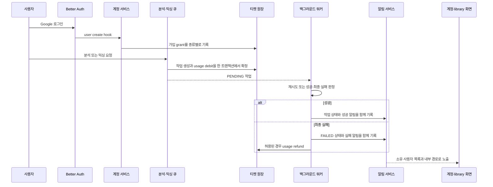

# 계정·티켓·알림 workflow

로그인한 사용자의 계정 부수효과를 추적할 때 이 페이지를 읽는다. Google 로그인으로 세션을 만들면 사용자 생성 hook이 분석·믹싱 티켓을 보장하고, 사용자가 분석 또는 AI 믹싱을 요청할 때 작업 생성과 비용 차감을 함께 확정한다. 워커는 성공 또는 최종 실패를 소유 사용자 알림으로 전달하며, 실패 환불은 작업 종류와 외부 제출 여부에 따라 달라진다.

작업 자체의 큐·lease·워커 운영은 [보컬 프로필 분석](/openwiki/workflows/vocal-profile-analysis.md)과 [추천에서 믹싱까지](/openwiki/workflows/recommendation-to-mixing.md), 데이터 관계는 [데이터 모델](/openwiki/architecture/data-model.md), 사용자 경계는 [접근 제어](/openwiki/concepts/access-control.md)에서 이어서 확인한다.

## 로그인과 신규 사용자 onboarding

인증은 Better Auth의 Google provider만 활성화한다. email/password 로그인은 비활성화되어 있고, Google scope는 `openid`, `email`, `profile`이다. 로그인 화면은 `callbackURL`을 유지해 원래 진입점으로 돌아가게 하며 `/terms` 이용 약관과 `/privacy` 개인정보 처리방침 링크를 공개 진입점에 표시한다. Google 인증에 필요한 환경 변수가 모두 없으면 `googleAuthConfigured()`가 false를 반환한다.

`databaseHooks.user.create.after`는 새 사용자 생성 뒤 `ensureSignupTicketGrants(user.id)`를 호출한다. 세션을 읽는 `getRequestSession`도 기존 사용자의 가입 grant가 누락된 경우를 보완하도록 같은 함수를 호출한다. 분석 grant와 믹싱 grant는 환경 설정에서 읽으며 기본값은 각각 5장과 1장이다. 값은 0~1000의 안전한 정수여야 한다.

가입 grant는 두 지갑에 따로 기록된다.

- `TicketWallet`의 복합 기본 키는 `(userId, kind)`이고 `kind`는 `VOCAL_ANALYSIS` 또는 `AI_MIXING`이다.
- `TicketLedger`의 `SIGNUP_GRANT`는 양수이며, idempotency key는 `signup:vocal-analysis:${userId}`와 `signup:ai-mixing:${userId}`다.
- 믹싱 grant는 기존 최초 `SIGNUP_GRANT`를 재사용하는 확인도 하므로 hook 재실행과 동시 실행이 중복 지급으로 이어지지 않는다.

인증 후 product shell은 `onboardingCompletedAt`이 없는 사용자에게 onboarding dialog를 연다. dialog는 목소리 분석 → 노래 추천 → AI 믹싱의 세 단계를 보여준다. 노래 추천 자체에는 티켓을 사용하지 않고, 분석과 믹싱 단계에는 해당 지갑의 현재 잔액을 표시한다. `POST /api/account/onboarding/completion`은 세션 사용자의 `onboardingCompletedAt`을 null일 때만 기록하고, 이미 완료된 동시 요청에도 같은 `completedAt`을 반환한다. 비인증 요청은 401이다.

## 인증에서 작업·알림까지

*로그인부터 가입 grant, 작업 비용, 최종 결과 알림과 실패 환불까지의 현재 런타임 순서다.*

## 작업 생성과 원장 차감

실제 비용은 큐에서 작업을 만들 때 고정해 작업 레코드의 `ticketCost`에 저장한다. 기본 비용은 분석과 믹싱 모두 1장(`VOCAL_PROFILE_ANALYSIS_TICKET_COST`, `MIXING_TICKET_COST`)이지만 운영 환경 값은 배포 설정을 확인해야 한다.

분석 큐는 먼저 같은 사용자·`idempotencyKey`의 작업을 찾고, 활성 분석 작업이 있으면 거부한다. 파일 형식·크기와 잔액을 확인한 뒤 `VocalProfileAnalysisJob` 생성 및 `VOCAL_ANALYSIS`의 음수 `USAGE_DEBIT`를 `Serializable` 트랜잭션에서 수행한다. 믹싱 큐도 요청 key로 기존 작업을 되찾고, 사용자 소유 `VocalProfile`, READY 분석, 현재 catalog와 target asset을 검증한 뒤 `MixingJob` 생성 및 `AI_MIXING`의 `USAGE_DEBIT`를 같은 트랜잭션에서 처리한다. stale 추천은 작업과 차감 전에 거부한다.

모든 일반 잔액 변경은 `applyTicketChange` 또는 `applyTicketChangeInTransaction`을 통한다.

1. `idempotencyKey`와 `reason`은 필수이고 `amount`는 안전한 정수여야 한다.
2. 같은 key의 원장이 있으면 사용자·종류·type·amount가 모두 같은지 확인하고 기존 행을 반환한다. 값이 다르면 key 재사용 오류다.
3. 음수 변경은 `balance >= abs(amount)` 조건부 갱신으로 수행해 잔액이 음수가 되지 않게 한다.
4. 지갑 갱신과 함께 그 시점의 잔액을 `TicketLedger.balanceAfter`로 기록한다.

트랜잭션은 `Serializable` 격리 수준이고 write conflict/deadlock을 최대 3회 시도한다. unique 충돌도 동일 입력의 기존 원장이면 멱등 성공으로 흡수한다. 따라서 지갑만 갱신하거나 ledger만 생성하는 우회 경로를 만들지 않는다. 잔액 부족은 `InsufficientTicketsError`이며 작업을 만들기 전에 반환한다.

## 최종 실패와 환불 lifecycle

원장 type은 다음 네 가지다.

| type | amount | 의미 |
| --- | ---: | --- |
| `SIGNUP_GRANT` | 양수 | 가입 시 지급 |
| `USAGE_DEBIT` | 음수 | 작업 생성 시 사용 |
| `USAGE_REFUND` | 양수 | 허용된 최종 실패의 비용 복구 |
| `ADMIN_ADJUSTMENT` | 양수 또는 음수 | 관리자가 actor와 사유를 남기는 조정 |

분석 워커가 재시도 가능한 오류를 만나면 작업은 다시 `PENDING`이 될 수 있으므로 즉시 환불하지 않는다. 최종 실패 트랜잭션은 작업을 `FAILED`로 바꾸고, 비용이 양수이면 `refundState: REQUIRED`로 설정한 뒤 실패 알림을 기록한다. 이후 `refundRequiredVocalProfileAnalysisTicket`가 `USAGE_REFUND`를 적용하고 `REFUNDED`로 바꾼다. 비용이 0이면 원장 없이 상태만 `REFUNDED`로 바꾼다. 환불 key는 `vocal-analysis-refund:${job.id}`다.

믹싱은 변환 서비스에 제출되기 전(`submitted === false`) 최종 실패만 `refundState: REQUIRED`가 된다. `ensureMixingRefund`가 `USAGE_REFUND`를 추가한 뒤 `REFUNDED`로 바꾼다. 이미 제출된 작업의 최종 실패는 `refundState: NONE`이므로 자동 환불하지 않는다. 믹싱 환불 key는 `mixing:refund:${job.id}`다. 두 워커는 중단·재시작 뒤 `REQUIRED` 작업을 다시 처리하는 reconcile 함수도 제공한다.

성공 상태와 성공 알림, 최종 실패 상태와 실패 알림은 각각 같은 트랜잭션에 묶인다. 환불은 후속 작업이므로 환불 오류가 발생해도 실패 상태와 실패 알림을 잃지 않으며, `REQUIRED` 상태를 reconcile 대상으로 남긴다.

## 알림 생성과 사용자 소유권

`Notification.dedupeKey`는 unique다. `createNotification`은 중복 삽입을 건너뛴 뒤 기존 행의 `userId`, type, 문구, 내부 경로, source를 요청과 대조한다. href는 `//`가 아닌 `/`로 시작하는 상대 경로만 허용하고 최대 길이는 500이다.

현재 작업 결과 알림은 다음과 같다.

- 분석 성공: `VOCAL_PROFILE_SUCCEEDED`, `/vocal-profiles/{profileId}`
- 분석 최종 실패: `VOCAL_PROFILE_FAILED`, `/library?tab=profiles`
- 믹싱 성공: `MIXING_SUCCEEDED`, `/library/mixes/{jobId}`
- 믹싱 실패: `MIXING_FAILED`, `/library/mixes/{jobId}`
- 관리자 양수 조정: `TICKET_CREDIT`, `/account`

알림 모델은 `sourceId`로 작업 또는 원장과 연결할 수 있고 `readAt`으로 읽음 상태를 저장한다. `GET /api/notifications`는 세션을 요구하고 `page`, `pageSize`, `unreadOnly`를 받는다. page size는 1~50으로 정규화되고 최신 `createdAt`·id 순으로 반환된다. 응답에는 `total`, `pageCount`, `unreadCount`가 포함된다. `PATCH /api/notifications/{id}`와 `POST /api/notifications/read-all`도 `session.user.id` 조건으로 갱신하므로 다른 사용자의 알림은 읽을 수 없다.

`manage-notifications` 클라이언트는 목록을 30초마다 polling하고 창이 다시 활성화되면 갱신한다. 읽음 mutation 성공 후 목록 query를 무효화한다. 알림 href는 결과 화면 이동용이고 티켓 잔액은 계정 API에서 조회한다.

## 계정 화면과 API 경계

`/account`는 `requirePageSession("/account")`로 인증한 뒤 인증 요약과 `getTicketAccount`를 병렬 조회한다. 화면은 이름·이메일·로그인 방식, 분석·믹싱 잔액과 원장 내역을 보여준다. `GET /api/account/tickets`도 `requireApiSession`을 통과한 `session.user.id`만 사용하고, 비인증 요청은 401이다. 응답 `createdAt`은 ISO 문자열이다.

`getTicketAccount`는 사용자 존재를 확인하고 없는 지갑을 잔액 0으로 채워 항상 두 종류를 반환한다. 원장 내역은 기본 20건씩 최신순이고 page size는 최대 100이다. 요청 page는 1 이상으로 보정하고 마지막 페이지를 넘으면 마지막 페이지로 보정한다. 항목에는 작업 id와 actor id가 포함되지만 secret은 노출하지 않는다.

관리자 조정은 `adjustUserTickets`가 0이 아닌 -10000~10000 정수와 3~500자 사유를 요구한다. idempotency key에 actor를 포함하고, 양수 조정에만 대상 사용자에게 `TICKET_CREDIT` 알림을 보낸다. 음수 조정은 원장에 남지만 알림은 만들지 않는다.

## 변경 불변식과 집중 테스트

- 분석(`VOCAL_ANALYSIS`)과 믹싱(`AI_MIXING`) 지갑을 섞지 않는다. 종류·비용·환불 key·작업 foreign key를 함께 검토한다.
- 지갑 변경과 원장 생성은 `applyTicketChangeInTransaction` 또는 `applyTicketChange`를 통해 원자적으로 수행한다.
- 같은 idempotency key에 다른 사용자·종류·type·amount의 의미를 재사용하지 않는다.
- 환불은 작업의 `ticketCost`와 `refundState`를 기준으로 하며, 분석은 최종 실패 후, 믹싱은 외부 제출 전 최종 실패 후에만 자동 환불한다.
- 알림은 소유 사용자와 내부 href를 검증하고 작업 상태 변경과 같은 트랜잭션에서 생성한다.
- 계정·알림 API와 읽음 갱신은 항상 세션 소유자 범위로 제한한다.

다음 테스트를 변경의 안전망으로 사용한다.

- `tests/ticket-ledger.integration.ts`: 동시 가입 grant의 종류별 1회 지급, 지갑 종류 격리, 중복 차감의 동일 원장 반환, 잔액 부족과 페이지 보정을 검증한다.
- `tests/new-user-onboarding.integration.ts`: 기존 사용자 migration의 backfill, onboarding completion route의 401, 동시 completion의 동일 timestamp와 사용자별 소유권을 검증한다.
- `tests/notification-service.integration.ts`: 영속성·dedupe, pagination·unread filter, 소유자 범위, 단건·전체 읽음 처리와 외부 href 거부를 검증한다.
- `tests/notification-routes.integration.ts`: 인증된 route가 세션 소유자의 알림만 반환하고 비인증 요청은 401인지 검증한다.
- `tests/account-ui.test.tsx`와 `tests/ticket-ledger-ui.test.tsx`: 계정 정보, 두 잔액, 원장 표시와 페이지 이동을 검증한다.

티켓 정책이나 환불을 바꿀 때는 서비스만 수정하지 말고 해당 queue·worker의 상태 전이, schema의 unique/관계 제약, 위 integration test를 함께 확인한다.
