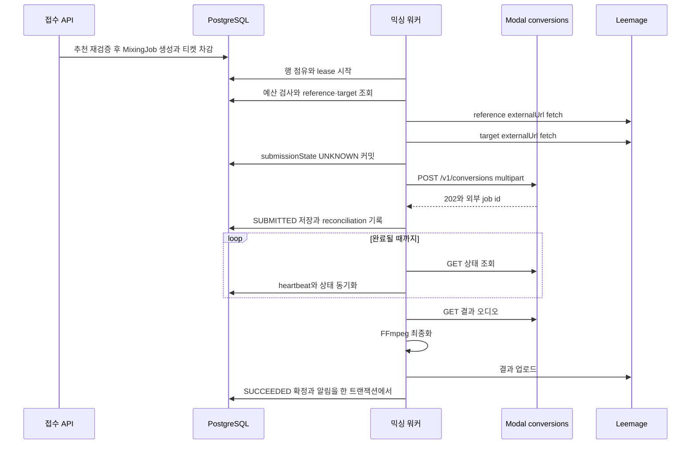
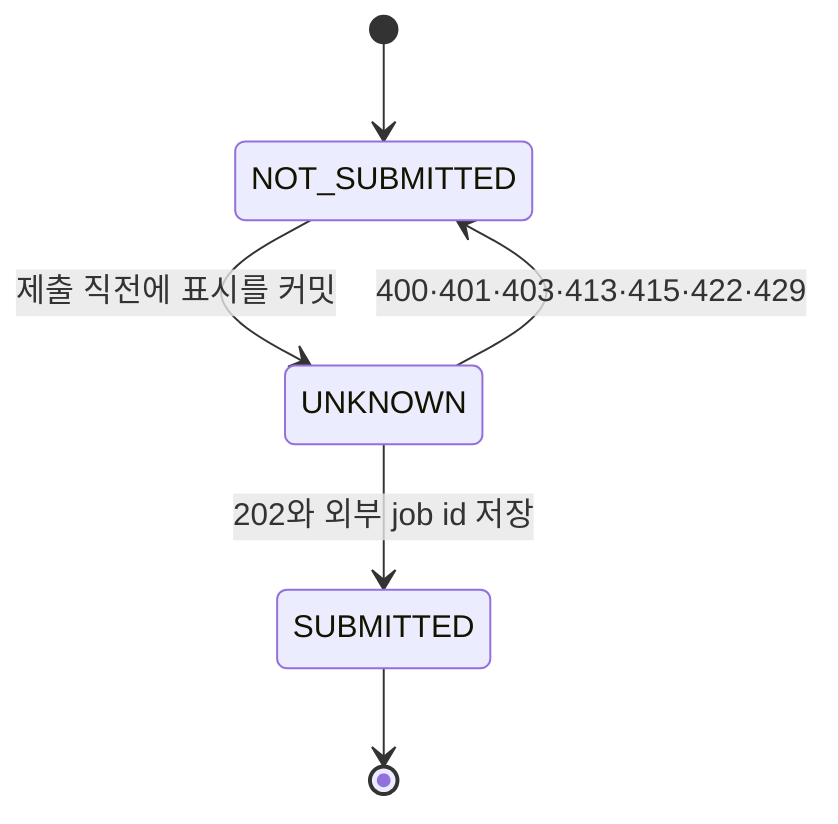

# AI 믹싱 작업 흐름

한 번의 AI 믹싱 요청은 "요청 시점의 추천 근거를 굳힌 `MixingJob` 행"과 "그 행을 처리하는 믹싱 워커의 반복"으로 나뉘어 진행돼요. 접수는 카탈로그와 자산 상태를 그 순간 다시 확인한 뒤 작업 행과 티켓 차감을 한 트랜잭션에서 확정하고, 워커는 저장된 근거만 보고 움직여요. 그래서 접수 뒤에 추천 카탈로그가 바뀌어도 이미 만든 작업은 흔들리지 않아요.

결과는 `SUCCEEDED` 상태, `MIX_RESULT` 자산, 그리고 같은 트랜잭션에서 만든 알림으로 남아요. 티켓이 돌아오는 경우는 외부 변환 서비스에 접수되기 전에 실패가 확정됐을 때뿐이에요. 접수 여부가 불확실하면 아무것도 되돌리지 않고 `MODAL_SUBMISSION_UNCONFIRMED`로 남겨 운영자 판단을 기다려요. 두 경로의 근거는 [mixing-queue.ts](repo://src/features/create-mixing/api/mixing-queue.ts#L20-L165)와 [worker.ts](repo://src/_app/background-jobs/mixing/worker.ts#L293-L561)에 있어요.

## 이 흐름이 지키는 불변식

세 가지 규칙이 나머지 세부를 결정해요.

1. 접수 시점의 추천 근거를 복사해 두고, 워커는 그 사본만 사용해요. 카탈로그가 바뀌어도 진행 중인 작업의 레퍼런스·타깃·키 이동값은 그대로예요.
2. 외부 서비스에 요청이 닿았는지 먼저 확정하고, 확정하지 못하면 재시도하거나 운영자에게 넘겨요. 추측으로 환불하지 않아요.
3. 결과 자산을 저장한 트랜잭션과 종료 상태·알림을 쓰는 트랜잭션을 나누고, 확정이 실패하면 저장한 자산을 폐기해요. "성공했는데 결과가 없는" 상태를 남기지 않으려는 규칙이에요.

티켓 원장과 멱등성 규칙 자체는 [티켓 원장과 멱등성](../concepts/ticket-ledger.md)이, 점유·lease·재시도 알고리즘은 [Job 큐와 lease 복구 계약](../operations/job-processing.md)이 소유해요. 이 페이지는 믹싱 요청 하나가 어떤 순서와 조건으로 그 규칙을 지나가는지를 설명해요.

## 접수: 추천 결과를 스냅샷 작업 행으로 고정해요

브라우저는 `POST /api/mixing-jobs`에 `vocalProfileId`, `songAnalysisId`, `idempotencyKey`를 보내고, 성공하면 `202`와 소문자 상태로 직렬화한 작업을 받아요([mixing-jobs-route.ts](repo://src/_app/api-routes/mixing-jobs/mixing-jobs-route.ts#L27-L44)). 접수 함수 `enqueueMixingJob`은 이 순서로 진행해요([mixing-queue.ts](repo://src/features/create-mixing/api/mixing-queue.ts#L40-L148)).

1. `lockQueueAdmission(tx, "MIXING")`으로 큐 종류별 advisory lock을 먼저 잡아요. 동시에 들어온 다른 접수가 같은 시점의 개수를 보지 않게 하는 장치예요.
2. 같은 `(userId, idempotencyKey)` 행이 이미 있으면 그 행을 그대로 돌려줘요. 다만 저장된 `vocalProfileId`나 `songAnalysisId`가 다르면 `IDEMPOTENCY_CONFLICT` 409로 거절해요([mixing-queue.ts](repo://src/features/create-mixing/api/mixing-queue.ts#L29-L36)).
3. 트랜잭션 밖에서 다시 계산해 둔 추천 항목을, 저장된 카탈로그 값과 다시 대조해요. 하나라도 어긋나면 `MIXING_RECOMMENDATION_STALE` 409(`retryable: true`)예요.
4. 레퍼런스 음성을 고르고, 없으면 `MIXING_REFERENCE_UNAVAILABLE` 422로 거절해요.
5. 큐 용량을 확인하고 `MixingJob`을 만든 뒤, 같은 트랜잭션에서 `mixing:debit:{jobId}` 키로 티켓을 차감해요.

트랜잭션은 `Serializable`로 열고, 스냅샷·쓰기 충돌이면 최대 3회 다시 시도해요. 3회를 다 쓰면 `MIXING_ENQUEUE_FAILED` 503(`retryable: true`)로 끝나요.

### 다시 확인하는 카탈로그 조건

추천은 캐시된 계산 결과이므로, 접수 시점에 아래 조건을 다시 대조해요. 이 검사가 실패하면 사용자는 최신 추천을 다시 받아야 해요.

| 확인 대상 | 요구 조건 |
| --- | --- |
| 곡 | `lifecycleStatus`가 `ACTIVE`예요 |
| 분석 | `song.currentAnalysisId`가 요청한 `songAnalysisId`와 같고 `status`가 `READY`예요 |
| 카탈로그 항목 | `PUBLISHED` 항목의 `catalogId`·`revision`·`position`이 추천 결과와 같아요 |
| 타깃 자산 | `targetAsset.id`가 추천의 `targetAssetId`와 같고, `sourceId`가 분석의 출처와 같으며 `status`가 `READY`예요 |

접수 시 고정하는 스냅샷 값은 나중에 카탈로그가 개정돼도 유지돼요.

| 고정 값 | 나중에 쓰이는 곳 |
| --- | --- |
| `songAnalysisId`, `referenceAssetId`, `targetAssetId` | 워커가 다시 조회할 대상 자산을 특정해요 |
| `catalogPosition`, `catalogRevision` | 어느 개정의 추천이었는지 남겨요 |
| `recommendedShift` | Modal에 보내는 `pitch_shift` 값이에요 |
| `scoringVersion` | 어떤 점수 계약으로 계산한 추천인지 남겨요 |

`recommendedShift`를 만드는 계산 자체는 [추천과 키 적합도 계산](recommendation-and-key-fit.md)이 설명해요. 스냅샷 컬럼의 관계와 제약은 [데이터 모델과 수명 주기 상태](../architecture/data-model.md)에 있어요.

### 레퍼런스 선택 우선순위

레퍼런스는 두 후보 중에서 골라요. 스마트 합성 레퍼런스가 준비돼 있으면 그것을 쓰고, 없으면 사용자가 올린 원본 녹음을 써요([reference.ts](repo://src/features/create-mixing/model/reference.ts#L12-L29)).

| 순위 | 후보 | 조건 | 결과 |
| --- | --- | --- | --- |
| 1 | `SYNTHESIS_REFERENCE` | `status`가 `READY`이고 소유자가 요청자와 같아요 | 그 자산을 써요 |
| 2 | `REFERENCE` | `status`가 `READY`이고 소유자가 요청자와 같아요 | 그 자산을 써요 |
| — | 둘 다 없음 | 계약 버전이 `smart-reference-mid-v1`이면 2순위로 내려가지 않아요 | `MIXING_REFERENCE_UNAVAILABLE` |

스마트 레퍼런스 계약이 중음 구간 전용인 프로필에서는 2순위 대체를 막아요. 대체하면 합성 품질 계약이 깨지기 때문이에요([contract.ts](repo://src/entities/vocal-profile/model/contract.ts#L201-L212)). 이 규칙은 [tests/mixing-reference.test.ts](repo://tests/mixing-reference.test.ts#L24-L68)가 검증해요.

### 접수가 실패할 때 남는 것

거절은 모두 트랜잭션 롤백으로 끝나므로 작업 행도 티켓 차감도 남지 않아요. 레퍼런스가 없어 422로 거절된 경우 잔액과 원장 행 수가 그대로인지도 [tests/mixing-queue.integration.ts](repo://tests/mixing-queue.integration.ts#L135-L148)가 확인해요.

| 응답 | 코드 | 조건 |
| --- | --- | --- |
| 400 | `INVALID_REQUEST` | 본문 스키마 위반, 요청 키가 비었거나 200자를 넘어요 |
| 402 | `INSUFFICIENT_TICKETS` | 차감 시 잔액이 모자라요 |
| 404 | `MIXING_SOURCE_NOT_FOUND` | 요청자의 `USER` 프로필이나 `READY` 분석을 찾지 못했어요 |
| 409 | `MIXING_RECOMMENDATION_STALE` | 카탈로그 조건이 어긋나요(`retryable: true`) |
| 409 | `IDEMPOTENCY_CONFLICT` | 같은 요청 키를 다른 입력에 썼어요 |
| 422 | `MIXING_REFERENCE_UNAVAILABLE` | 쓸 수 있는 레퍼런스가 없어요 |
| 429 | `USER_QUEUE_CAPACITY` | 사용자별 진행 중 작업 한도를 넘었어요 |
| 503 | `QUEUE_CAPACITY` | 전역 큐 한도를 넘었어요 |
| 503 | `MIXING_ENQUEUE_FAILED` | 쓰기 충돌 재시도를 모두 썼어요 |

큐 한도 숫자와 응답 헤더는 [Job 큐와 lease 복구 계약](../operations/job-processing.md)이, 요청 제한과 오류 봉투 규약은 [HTTP API 표면과 요청 접수 규칙](../architecture/http-api-surface.md)이 정리해요.

## 워커 한 반복: fetch → 제출 → poll → 저장

점유와 lease 관리는 워커 공통 규칙이라 [Job 큐와 lease 복구 계약](../operations/job-processing.md)에 있어요. 여기서는 믹싱 워커가 점유한 뒤 실제로 하는 일만 순서대로 봐요.

접수 표시를 먼저 커밋한 뒤 외부 요청을 보내고, 성공하면 외부 job id와 함께 작업 상태를 올리는 순서예요.

### 입력 fetch와 예산 검사

워커는 점유 직후 작업 행을 다시 읽어 소유권·lease·상태를 확인하고, `attempts > maxAttempts`이거나 외부 job id 없이 접수를 시도한 지 300초가 넘었으면 `JobDeadlineError`를 던져요([worker.ts](repo://src/_app/background-jobs/mixing/worker.ts#L302-L318)). 예산 정책의 일반형은 [Job 큐와 lease 복구 계약](../operations/job-processing.md)을 보세요.

외부 job id가 아직 없으면 저장된 `externalUrl` 두 개를 fetch해요. 레퍼런스와 타깃 모두 타임아웃 60초에 `cache: "no-store"`를 걸어요. 타깃은 가져오기 전에 `status`가 `READY`인지 확인하고, 아니면 `CATALOG_TARGET_UNAVAILABLE`로 실패시켜요([worker.ts](repo://src/_app/background-jobs/mixing/worker.ts#L320-L357)). 응답 본문이 비어 있으면 재시도 대상이 아닌 같은 단계의 fetch 오류로 처리해요.

### Modal 제출과 접수 확정

multipart 본문에는 `SYNTHESIS_PRESET`을 그대로 붙이고, 그 위에 `auto_pitch_shift`를 `"false"`로, `pitch_shift`를 `String(job.recommendedShift)`로 덮어써요([worker.ts](repo://src/_app/background-jobs/mixing/worker.ts#L358-L367), [synthesis-state.ts](repo://src/entities/recommendation/model/synthesis-state.ts#L1-L9)). endpoint 기본값과 달라지는 지점이라 [tests/mixing-queue.integration.ts](repo://tests/mixing-queue.integration.ts#L468-L475)가 이 값을 확인해요. 폼 필드의 기본값과 허용 범위는 [Modal 서비스와 외부 계약](../integrations/modal-services.md)이 소유해요.

`request_id`에는 작업 id를 넣어요. 그래서 접수 응답을 놓친 뒤 같은 작업으로 다시 제출해도 Modal 쪽에서 같은 작업으로 취급돼요. 제출 타임아웃은 120초예요.

응답을 받으면 외부 job id가 있고 상태가 `queued`, `processing`, `succeeded`, `failed` 중 하나인지 확인한 뒤, `ExternalJobReconciliation` 행을 `reason: "OBSERVED_SUBMISSION"`으로 upsert하고 작업을 `SUBMITTED`로 올려요([worker.ts](repo://src/_app/background-jobs/mixing/worker.ts#L415-L445)). 무효한 응답이면 `MODAL_SUBMIT_INVALID_RESPONSE`로 실패시켜요.

### poll과 결과 저장

poll 루프는 `GET {MODAL_API_URL}/v1/conversions/{modalJobId}`를 30초 타임아웃으로 호출하고, 외부 상태가 `processing`이면 작업을 `PROCESSING`으로, 아니면 `SUBMITTED`로 맞추면서 heartbeat을 갱신해요([worker.ts](repo://src/_app/background-jobs/mixing/worker.ts#L448-L465), [worker.ts](repo://src/_app/background-jobs/mixing/worker.ts#L542-L543)). 폴링 간격은 `MIXING_POLL_INTERVAL_MS` 기본 5초예요.

외부 상태가 `failed`면 `MODAL_JOB_FAILED`로 실패해요. `succeeded`면 결과 오디오를 내려받아 FFmpeg으로 최종화하고, 그 결과를 `MIX_RESULT` 자산으로 Leemage에 올려요([worker.ts](repo://src/_app/background-jobs/mixing/worker.ts#L466-L506)). 최종화는 `clarity-normal-v1` 체인을 고정한 필터 그래프로 AAC 44.1kHz 스테레오 m4a를 만들고, `FFMPEG_TIMEOUT_MS`를 넘기거나 lease가 끊기면 하위 프로세스를 종료해요([compress-mixing-result.ts](repo://src/shared/lib/audio/compress-mixing-result.ts#L9-L90)). 최종화가 실패하면 `MIXING_FINALIZATION_FAILED`(`retryable: true`)가 되고, 결과 자산은 아직 만들어지지 않아요.

저장한 자산을 가리키는 `SUCCEEDED` 확정과 `MIXING_SUCCEEDED` 알림은 한 트랜잭션에서 함께 써요. 확정 트랜잭션이 실패하면 워커는 방금 올린 결과 자산을 폐기하고 오류를 다시 던져요([worker.ts](repo://src/_app/background-jobs/mixing/worker.ts#L507-L539)). 폐기 자체가 외부 삭제까지 끝내지 못하면 `MediaOperation`에 재시도 의도가 남고, 워커가 다음 반복에서 마저 처리해요. 그 규칙은 [미디어 저장과 정리 의도](../operations/media-storage.md)에 있어요.

알림의 종류·문구·`dedupeKey` 중복 규칙은 [알림과 중복 방지](../concepts/notifications.md)가 소유해요. 이 페이지는 그 알림이 성공 확정과 종료 확정 트랜잭션 안에서 만들어진다는 점만 기억하면 돼요.

## submissionState: 접수 전인지 후인지가 환불을 가려요

외부 요청은 한 번 보내고 끝나지 않아요. 타임아웃이나 연결 실패처럼 "보냈는지 모르는" 결과가 있으므로, 워커는 제출 전에 의도를 먼저 기록해요. 그 컬럼이 `submissionState`이고 기본값은 `NOT_SUBMITTED`예요.

제출 표시가 `UNKNOWN`을 거쳐 `SUBMITTED`로 확정되는 경로와, 명확한 클라이언트 오류에서 접수되지 않았음을 확정하는 경로예요.

| 상태 | 언제 쓰나요 | 이 상태에서 실패하면 |
| --- | --- | --- |
| `NOT_SUBMITTED` | 기본값. 제출을 시도하기 전이에요 | 접수 전 실패로 보고 환불해요 |
| `UNKNOWN` | 제출 직전 커밋. 요청을 보냈지만 응답을 확정하지 못했어요 | 재시도하고, 시도를 다 쓰면 환불을 보류해요 |
| `SUBMITTED` | 202와 외부 job id를 저장했어요 | 접수 후 실패로 보고 환불하지 않아요 |

`UNKNOWN`은 위험한 중간 상태예요. 서버는 이 상태에서 티켓을 돌려주지 않아요. 대신 재시도로 같은 작업을 다시 제출하고, 재시도를 다 써도 확정하지 못하면 `refundState`를 `NONE`으로 두고 `errorCode`를 `MODAL_SUBMISSION_UNCONFIRMED`로 남겨요([worker.ts](repo://src/_app/background-jobs/mixing/worker.ts#L209-L215), [worker.ts](repo://src/_app/background-jobs/mixing/worker.ts#L266-L276)). 작업은 `FAILED`로 마감되지만 티켓은 사용자에게 남아 있고, 운영자가 외부 서비스에서 실제 접수를 확인한 뒤에야 판단이 끝나요.

운영자 해소 명령과 요구 인자는 [복구 스크립트 운영 절차](../operations/recovery-runbook.md)에 있어요. `MODAL_SUBMISSION_UNCONFIRMED` 작업은 그 확인이 끝날 때까지 사용자가 삭제할 수도 없어요.

정리 기록도 접수와 함께 남아요. 성공적으로 접수한 시점에는 `OBSERVED_SUBMISSION`을, 종료로 마감할 때는 `TERMINAL_EXTERNAL_CLEANUP` 또는 접수 미확인을 뜻하는 `SUBMISSION_UNKNOWN_REFUND_HELD`를 적어요. 외부 작업 취소 절차는 [Job 큐와 lease 복구 계약](../operations/job-processing.md)이 다뤄요.

## 실패 분류와 환불 경계

환불은 외부 접수 전에 끝난 실패에서만 일어나요. 종료 확정 트랜잭션은 `refundState`만 `REQUIRED`로 표시하고, 실제 지급은 고정된 `mixing:refund:{jobId}` 키를 쓰는 별도 단계에서 한 번만 실행돼요([worker.ts](repo://src/_app/background-jobs/mixing/worker.ts#L156-L172)). 원장 규칙은 [티켓 원장과 멱등성](../concepts/ticket-ledger.md)을 보세요.

워커의 한 반복은 새 작업을 점유하기 전에 앞선 반복의 뒷정리를 먼저 해요. 남은 환불, 외부 작업 정리, 미디어 정리를 한 번씩 처리하고 나서 `claimNextMixingJob`을 불러요([worker.ts](repo://src/_app/background-jobs/mixing/worker.ts#L563-L581)). 그래서 확정과 환불 사이에 프로세스가 죽어도 티켓은 결국 사용자에게 돌아와요.

| 단계 | 오류 코드 | 재시도 | 환불 |
| --- | --- | --- | --- |
| 레퍼런스 fetch | `REFERENCE_FETCH_FAILED` | 네트워크 오류와 408·425·429·5xx는 예 | 접수 전이므로 환불 대상이에요 |
| 타깃 확인 | `CATALOG_TARGET_UNAVAILABLE` | 아니요 | 접수 전이므로 환불 대상이에요 |
| 타깃 fetch | `CATALOG_TARGET_FETCH_FAILED` | 네트워크 오류와 408·425·429·5xx는 예 | 접수 전이므로 환불 대상이에요 |
| Modal 제출 — 명확한 4xx/429 | `MODAL_SUBMIT_FAILED` | 429만 예 | 400·401·403·413·415·422·429는 접수되지 않았으므로 환불 대상이에요 |
| Modal 제출 — 연결 실패·타임아웃·5xx | `MODAL_SUBMIT_FAILED` | 접수 미확인 경로로 예 | 접수 여부가 불확실하므로 보류해요 |
| 응답 검증 | `MODAL_SUBMIT_INVALID_RESPONSE` | 접수 미확인 경로로 예 | 접수 여부가 불확실하므로 보류해요 |
| poll 상태 조회 | `MODAL_STATUS_FETCH_FAILED` | 네트워크 오류와 408·425·429·5xx는 예 | 접수 후이므로 환불하지 않아요 |
| 외부 작업 실패 | `MODAL_JOB_FAILED` | 아니요 | 접수 후이므로 환불하지 않아요 |
| 결과 다운로드 | `MODAL_RESULT_FETCH_FAILED` | 네트워크 오류와 408·425·429·5xx는 예 | 접수 후이므로 환불하지 않아요 |
| 최종화 | `MIXING_FINALIZATION_FAILED` | 예 | 접수 후이므로 환불하지 않아요 |
| 예산 초과 | `JOB_DEADLINE_EXCEEDED` | 아니요 | 접수 여부로 갈려요 |

"접수 미확인 경로로 예"는 오류 자체가 재시도 불가로 분류돼도 `submissionState`가 `UNKNOWN`이라 재시도가 열린다는 뜻이에요. 접수 여부를 모르는 채로 끝내는 것보다 같은 작업을 다시 시도하는 편이 안전하다는 판단이에요([worker.ts](repo://src/_app/background-jobs/mixing/worker.ts#L209-L214)).

재시도가 열려 있으면 작업은 접수 전이면 `PENDING`, 접수 후면 `SUBMITTED`로 돌아가고 lease를 비워요. 접수 후 재시도가 `SUBMITTED`에서 시작하는 이유는 폴링부터 이어가면 되기 때문이에요([worker.ts](repo://src/_app/background-jobs/mixing/worker.ts#L212-L249)). 백오프와 `maxAttempts` 기본값 3 같은 수치는 [Job 큐와 lease 복구 계약](../operations/job-processing.md)이 정리해요.

최종화 실패는 접수 후 실패의 성격을 잘 보여줘요. 외부 작업은 이미 성공했고 서버만 결과를 다듬지 못한 상태라, 재시도해도 환불은 열리지 않아요. [tests/mixing-queue.integration.ts](repo://tests/mixing-queue.integration.ts#L365-L443)가 시도 소진 뒤에도 `refundState`가 `NONE`으로 남고 결과 자산이 생기지 않는지 확인해요.

## 결과 접근과 삭제

결과 음원은 `GET /api/mixing-jobs/[id]/audio`로 받아요. 이 handler는 세션과 소유권을 확인하고 `SUCCEEDED` 작업의 `READY` 결과 자산만 프록시해요. 요청에 `Range` 헤더가 있으면 그대로 전달하고, 응답에는 `Content-Range`·`Accept-Ranges` 같은 헤더를 옮긴 뒤 `Cache-Control: private, no-store`를 붙여요([mixing-job-audio-route.ts](repo://src/_app/api-routes/mixing-jobs/mixing-job-audio-route.ts#L5-L38)). 조건이 맞지 않으면 `MIXING_RESULT_NOT_FOUND` 404, 외부 저장소가 응답하지 않으면 `MIXING_RESULT_UNAVAILABLE` 502예요.

작업 이력은 `GET /api/mixing-jobs`가 페이지 단위로 돌려줘요. 직렬화할 때 DB 상태를 소문자로 바꾸고, `SUCCEEDED`이면서 결과 자산이 `READY`일 때만 `audioUrl`을 채워요([history.ts](repo://src/entities/mixing-job/api/history.ts#L47-L91)). 추천 응답에 들어가는 화면용 상태는 이 DB 상태를 `pending`·`preparing` → `preparing`, `submitted` → `queued`로 축약한 값이라, API의 `submitted`와 표기가 달라요([recommendation-service.ts](repo://src/features/create-recommendation/api/recommendation-service.ts#L70-L82), [contract.ts](repo://src/entities/mixing-job/model/contract.ts#L4-L20)). 화면이 이 상태를 어떤 주기로 다시 받고 언제 폴링을 멈추는지는 [브라우저 상태와 API 오류 계약](../architecture/client-data-flow.md)이 정리해요.

삭제는 `DELETE /api/mixing-jobs/[id]`이고, 종료 상태인 작업만 지울 수 있어요. 결과 자산이 있으면 그 삭제 의도를 작업 행 삭제와 같은 트랜잭션에서 예약하고, 커밋한 뒤 외부 삭제를 시도해요([deletion.ts](repo://src/entities/mixing-job/api/deletion.ts#L9-L48)).

| 상황 | 결과 |
| --- | --- |
| 진행 중인 작업 | `MIXING_ACTIVE` 409로 거부해요 |
| `refundState`가 `REQUIRED`이거나 `errorCode`가 `MODAL_SUBMISSION_UNCONFIRMED` | `MIXING_RECONCILIATION_PENDING` 409로 거부해요 |
| 종료 상태이고 티켓 확인이 끝남 | 행을 지우고 `mediaCleanupPending`을 응답에 담아요 |

`mediaCleanupPending: true`는 외부 파일 삭제가 아직 끝나지 않았다는 뜻이에요([contract.ts](repo://src/entities/mixing-job/model/contract.ts#L105-L111)). 이 값이 참이면 파일은 워커가 이어서 지워요.

## 이 흐름을 확인하는 테스트

`pnpm run test:mixing:db`가 믹싱 통합 시나리오 전체를 돌려요([package.json](repo://package.json#L67-L67)). 한 파일에서 접수·점유·환불 경계·최종화·결과 저장·삭제를 순서대로 재현해요.

- 동시 접수 두 건이 같은 행을 돌려주고 원장 행이 하나만 생기는지, 레퍼런스가 없으면 차감 없이 거절되는지 ([tests/mixing-queue.integration.ts](repo://tests/mixing-queue.integration.ts#L178-L196))
- preflight 실패와 재시도 소진이 각각 환불로 이어지고, 접수 후 실패는 환불되지 않는지 ([tests/mixing-queue.integration.ts](repo://tests/mixing-queue.integration.ts#L202-L355))
- 접수 응답을 놓친 작업이 `MODAL_SUBMISSION_UNCONFIRMED`와 `SUBMISSION_UNKNOWN_REFUND_HELD` 기록으로 남는지 ([tests/mixing-queue.integration.ts](repo://tests/mixing-queue.integration.ts#L262-L296))
- 최종화 실패가 재시도되고, 성공 경로가 `MIX_RESULT` 자산과 알림을 남기며, 삭제가 `mediaCleanupPending`을 돌려주는지 ([tests/mixing-queue.integration.ts](repo://tests/mixing-queue.integration.ts#L395-L586))

FFmpeg 최종화 계약은 [tests/compress-mixing-result.test.ts](repo://tests/compress-mixing-result.test.ts#L42-L101)가 필터 체인 고정, AAC 44.1kHz 스테레오 출력, 중단 시 하위 프로세스 종료를 확인해요. 이 파일들은 `pnpm test`에 포함돼 있어요. 변경 범위에 맞는 명령 선택은 [변경 검증 경로](../testing/verification.md)를 보세요.

## 다음에 볼 문서

- 외부 endpoint 계약과 폼 필드 기본값은 [Modal 서비스와 외부 계약](../integrations/modal-services.md)에 있어요.
- 점유·lease·재시도·외부 작업 정리 규칙은 [Job 큐와 lease 복구 계약](../operations/job-processing.md)이에요.
- 결과 업로드와 삭제 의도 처리는 [미디어 저장과 정리 의도](../operations/media-storage.md)를 보세요.
- 작업 스냅샷 컬럼과 관계는 [데이터 모델과 수명 주기 상태](../architecture/data-model.md)에 있어요.
- 접수 미확인 작업의 해소 절차는 [복구 스크립트 운영 절차](../operations/recovery-runbook.md)에 있어요.
