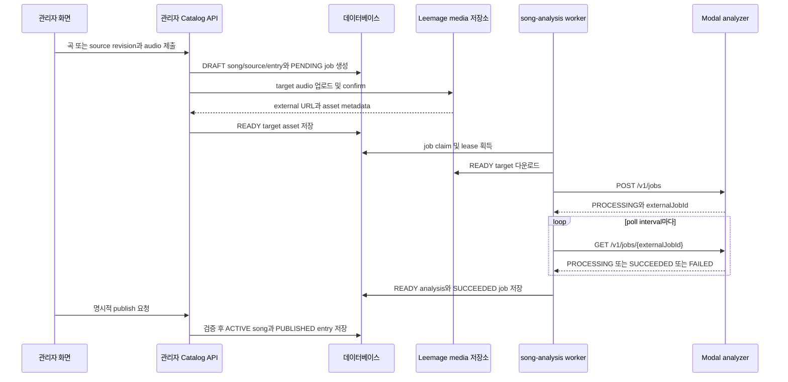

# 관리자 카탈로그 운영 워크플로

관리자 카탈로그의 변경은 **관리자 조작**, **background worker의 분석**, **명시적 공개**를 서로 다른 단계로 유지한다. `/admin/songs`는 관리자 전용 화면이며, 서버는 관리자 세션을 요구한다. 카탈로그가 아직 없으면 화면은 새 곡을 받지 않고 snapshot을 먼저 가져오도록 안내한다.

관련 개념은 [카탈로그와 추천](/openwiki/concepts/catalog-and-recommendations.md), worker 운영은 [job processing](/openwiki/operations/job-processing.md), 외부 파일 저장소와 Modal 경계는 [외부 서비스](/openwiki/integrations/external-services.md)를 참고한다.

## 전체 경로

관리자는 `POST /api/admin/catalog`으로 새 곡을 등록하거나 `POST /api/admin/catalog/:songId/source`로 기존 곡의 source revision을 추가한다. 두 요청 모두 multipart form의 `audio` 파일과 source 정보 및 `idempotencyKey`를 받는다. 서버는 곡, `SongSource`, `CatalogEntry`, `SongAnalysisJob`을 생성한 뒤 target asset을 외부 media 저장소에 업로드한다. 새 곡과 source는 처음에는 `DRAFT`다.

이 diagram은 관리자 등록에서 비동기 분석 job의 제출·polling을 거쳐 공개되는 순서를 보여준다.

### 1. 관리자 등록과 target asset

- 새 곡 등록은 제목, 아티스트, YouTube `sourceUrl`/`sourceVideoId`, source label, 순위와 idempotency key를 검증한다. 서버 transaction은 카탈로그 존재를 확인하고, 위치를 지정하지 않으면 마지막 위치 다음을 사용한다.
- 기존 곡에 source를 교체할 때는 이전 source를 덮어쓰지 않고 가장 큰 `revision + 1`인 새 `SongSource`와 새 분석 job을 만든다. source와 job 생성은 같은 transaction에 있다.
- `audio`는 지원 MIME type이어야 하고 0보다 크며 49MB 이하여야 한다. WAV는 `RIFF` header도 검사한다. 파일 bytes는 SHA-256으로 중복을 판별한다. 같은 source에 같은 digest의 `READY` asset이 있으면 외부 업로드를 반복하지 않는다.
- 새 asset은 `CatalogTargetAsset`으로 저장되며 `externalProjectId`, `externalFileId`, URL, 파일명, MIME type, 크기, digest, `sourceVideoId`를 가진다. 데이터베이스 저장에 실패하면 이미 외부에 올린 파일을 삭제한다.

등록 API는 먼저 `requireAdminApi`를 통과해야 하며, 인증되지 않은 요청은 mutation 전에 거부된다. idempotency key를 재사용한 동일 요청은 기존 결과를 돌려주지만, 다른 곡·source·제목·아티스트에 사용하면 conflict(409)다. 이 규칙은 네트워크 재시도에서 중복 곡과 중복 파일을 막는다.

### 2. worker의 job claim, 제출, polling

`scripts/song-analysis-worker.ts`는 `runSongAnalysisWorker()`를 시작한다. runner는 `SONG_ANALYSIS_WORKER_CONCURRENCY`만큼 lane을 만들고, 각 lane이 job을 반복해서 claim한다. claim query는 다음 조건을 모두 요구한다.

- `attempts < maxAttempts`
- `nextAttemptAt`가 현재 시각 이전
- source에 `READY` target asset 존재
- `PENDING`이거나 lease가 만료된 `PROCESSING`

claim은 `FOR UPDATE SKIP LOCKED`로 동시 worker가 같은 job을 잡지 않게 하고, `PROCESSING`, lease owner/만료 시각, heartbeat, attempt를 원자적으로 갱신한다. 처리 중에는 heartbeat가 60초마다 lease를 연장한다. `SONG_ANALYSIS_LEASE_SECONDS` 기본값은 300초이고 허용 범위는 180~3600초다.

worker는 READY target URL을 받아 bytes를 내려받고, `POST ${SONG_ANALYSIS_MODAL_URL}/v1/jobs`에 `X-API-Key`와 함께 `requestId`, `sourceVideoId`, audio multipart를 전송한다. Modal API는 `externalJobId`를 반환하며 같은 `requestId`가 이미 있으면 기존 job을 재사용한다. worker는 그 ID를 DB에 저장한 뒤 `GET /v1/jobs/{externalJobId}`를 `SONG_ANALYSIS_POLL_INTERVAL_MS`(기본 2,500ms) 간격으로 호출한다.

Modal analyzer는 API key를 요구한다. 분석 함수는 ffmpeg로 WAV를 만들고 librosa로 key를 추정한 다음 Demucs `htdemucs`로 vocals를 분리하고 vocal analysis core를 실행한다. temporary directory가 정리되었음을 `cleanupConfirmed: true`로 확인해야 성공 결과가 된다. 결과에는 pitch/tessitura, voiced ratio, pitch stability, clipping, RMS, 추정 key와 confidence, analyzer 및 pipeline metadata가 포함된다.

- `SUCCEEDED`면 worker는 pipeline contract별 `SongAnalysis`를 `READY`로 upsert하고 `SongAnalysisJob`을 `SUCCEEDED`로 확정한다.
- `FAILED` 또는 transport 오류는 reason code, detail, retryable을 저장한다. retryable이고 최대 시도 전이면 exponential backoff 후 job을 `PENDING`으로 되돌리고, 그렇지 않으면 `FAILED`로 끝낸다.
- 관리자의 retry API는 `FAILED` job만 `PENDING`으로 되돌리며 attempt, 외부 job ID, 오류와 lease 정보를 초기화한다. 설정된 Modal URL/API key가 없으면 재시도 가능한 오류가 아니라 `ANALYZER_NOT_CONFIGURED`로 실패한다.

필수 설정은 `SONG_ANALYSIS_MODAL_URL`과 `SONG_ANALYSIS_MODAL_API_KEY`이며 후자는 `MODAL_API_KEY`로 대체할 수 있다. worker 수와 polling 주기는 각각 `SONG_ANALYSIS_WORKER_CONCURRENCY`, `SONG_ANALYSIS_POLL_INTERVAL_MS`로 조정한다. Modal 쪽은 최대 4개 container, 8 CPU core, 16,384MB memory, 1시간 timeout과 최대 2회 retry로 분석 함수를 실행한다.

## 공개와 lifecycle 규칙

분석이 끝났다는 사실만으로 추천에 공개되지 않는다. `POST /api/admin/catalog/:songId/:sourceId/publish`의 `publishAdminSongSource`가 다음을 transaction 안에서 모두 확인해야 한다.

1. 지정한 source가 해당 song에 속한다.
2. 현재 pipeline contract의 analysis가 `READY`이고 `cleanupConfirmed === true`다.
3. 같은 source의 `READY` target asset이 있고, asset의 `sourceVideoId`가 source와 일치한다.
4. 해당 song의 카탈로그 entry가 존재한다.

검증을 통과하면 다른 `READY` source는 `SUPERSEDED`가 되고 지정 source는 `READY`가 된다. entry는 `PUBLISHED`와 `publishedAt`으로 바뀌며 song은 `ACTIVE`가 된다. 동시에 `activeSourceId`, `currentAnalysisId`, `targetAssetId`, `originalKey`를 공개 revision으로 갱신한다. 공개 결과가 실제로 바뀐 경우에만 catalog `revision`을 1 증가시킨다. 이전 target asset이 더 이상 mixing job이나 song에서 참조되지 않으면 외부 파일도 정리하며, 삭제 실패 시 `DELETE_PENDING`과 오류를 남긴다.

`archiveAdminSong`은 song과 연결된 아직 보관되지 않은 모든 catalog entry를 `ARCHIVED`로 바꾸고 song lifecycle도 `ARCHIVED`로 바꾼다. 영향을 받은 카탈로그 revision을 증가시킨다. 보관은 source, analysis, target 연결을 삭제하지 않는다. 따라서 다시 publish하면 공개 조건을 재검사한 뒤 `ACTIVE`와 `PUBLISHED`로 복귀할 수 있다. publish와 archive 모두 관리자 API 인증을 통과해야 한다.

## snapshot 교환

관리자 화면의 snapshot toolbar는 다음 경로를 사용한다.

- `GET /api/admin/catalog/export`: 완전하고 공개된 카탈로그만 JSON attachment `catalog-snapshot-YYYY-MM-DD.json`으로 내보낸다.
- `POST /api/admin/catalog/import`: multipart의 `file`을 받아 JSON과 snapshot schema를 검증한 뒤 DB에 import한다. snapshot 크기는 20MB 이하이어야 한다.

export는 먼저 모든 published row가 준비되었는지 확인한다. 위치가 정수가 아니거나 1 미만이거나 중복되거나, published row 수와 ready row 수가 다르면 export를 거부한다. 각 song에는 active source metadata, current analysis 결과, target asset metadata가 모두 있어야 한다.

snapshot에는 **분석 결과와 asset metadata가 포함되지만 원본 음원 bytes는 포함되지 않는다**. 분석 결과에는 크기(`sourceSizeBytes`), key, pitch 지표와 descriptors가 들어갈 수 있고, asset에는 외부 project/file ID, URL, 파일명, MIME type, 크기, SHA-256, `sourceVideoId`, status가 들어간다. `audioBytes`, base64, temporary/storage path 같은 키는 제거하며 pipeline metadata도 allowlist만 남긴다. 즉 import는 원본 파일을 복제하지 않고 snapshot의 외부 asset 연결과 metadata를 복원한다.

import는 schema 검증 후 song, source, analysis, target asset, catalog entry를 한 카탈로그에 복원하고 공개 상태로 만든다. position, `sourceVideoId`, target과 source의 video ID가 중복되거나 일치하지 않으면 거부한다. 같은 snapshot을 다시 import해도 생성 수가 0인 idempotent 결과를 내며, 기존 catalog revision을 더 낮은 snapshot revision으로 내리지 않는다. snapshot 안의 target asset은 bytes가 없으므로 import 후 실제 외부 URL이 유효하고 서비스가 해당 파일을 보존하는지 운영자가 확인해야 한다.

## 변경 시 확인할 테스트

- `tests/admin-song-catalog.integration.ts`: missing catalog의 초기 import 상태, 관리자 인증 거부, idempotent 등록과 asset 업로드 중복 방지, 지원하지 않는 audio 거부, 분석/target 준비 전 publish 차단, publish 시 ACTIVE/PUBLISHED 필드와 revision 갱신, archive 후 재공개를 검증한다.
- `tests/catalog-snapshot.integration.ts`: export JSON에 raw bytes·base64·temporary path가 없는지, pipeline metadata allowlist, fresh catalog 복원, 동일 snapshot 재import, 잘못된 URL/metadata와 중복 position·video ID·target 불일치 거부, 낮은 revision으로의 하향 방지를 검증한다.

분석기 계약이나 snapshot schema를 변경할 때는 worker의 submit/poll schema, `SongAnalysis` 저장 필드, readiness 검증, import/export 테스트를 함께 갱신해야 한다. 공개 조건을 우회해 DB에서 status만 바꾸면 `verifyDatabaseSongCatalog`가 export를 막을 수 있으며, 추천 소비자는 공개된 `ACTIVE`/`PUBLISHED` 연결만 신뢰해야 한다.
