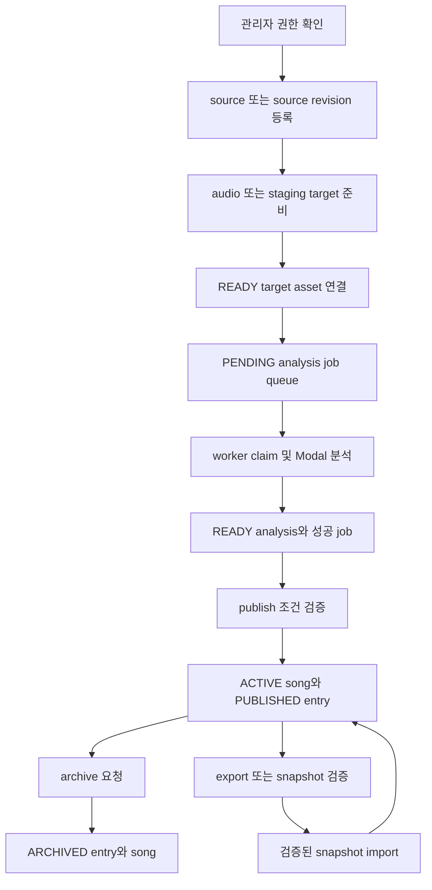

# 관리자 카탈로그 관리 workflow

이 페이지는 관리자가 카탈로그의 곡 identity, source revision, 원곡 target asset, 분석 결과를 연결하고 공개하는 방법을 설명한다. 핵심 원칙은 **관리자 mutation**, **비동기 분석**, **명시적 publish**를 분리하는 것이다. 분석이 끝나도 publish 전에는 추천에 공개되지 않는다.

관리자 화면은 `/admin/songs`이며 관리자 session이 필요하다. 대상 catalog가 없으면 목록을 보여 주지 않고 초기 snapshot import 상태를 반환한다. 카탈로그와 추천 소비 모델은 [카탈로그와 추천](/openwiki/concepts/catalog-and-recommendations.md), 권한 경계는 [access control](/openwiki/concepts/access-control.md), 외부 media와 Modal 경계는 [외부 서비스](/openwiki/integrations/external-services.md)에서 확인한다.

## 운영 lifecycle

두 가지 입력 경로가 있다.

- 관리자 API는 업로드한 audio를 source 생성 직후 target asset으로 외부 media에 올린다.
- 기존 catalog를 파일로 채우는 staging 경로는 `tmp/catalog-targets`의 파일을 catalog position과 active source의 YouTube ID로 찾아 업로드한다. 이 경로는 target asset만 교체하며, 분석 job 생성은 관리자 source 등록 경로에서 수행된다.



*이 lifecycle은 관리자 권한 확인부터 target 연결, 분석 queue, publish/archive, snapshot 교환까지의 상태 전이를 보여 준다.*

## 1. 관리자 권한과 identity 등록

모든 관리자 catalog mutation route는 먼저 `requireAdminApi(request)`를 호출한다. 인증이 없으면 body 파싱이나 DB mutation 전에 `401 UNAUTHENTICATED` 응답을 반환한다. `GET /api/admin/catalog`은 검색어와 `DRAFT`·`ACTIVE`·`ARCHIVED` 상태로 목록을 조회하며, catalog가 없으면 초기 import을 의미하는 `null` 결과를 돌려준다.

새 곡은 `POST /api/admin/catalog`의 multipart form으로 `audio`, `title`, `artist`, `sourceUrl`, `idempotencyKey`를 받는다. `sourceUrl`은 HTTPS YouTube URL이어야 하며 `youtu.be`, `youtube.com/watch`, `shorts`, `live` 형식에서 11자리 `sourceVideoId`를 추출한다. source label은 요청자가 보내는 값이 아니라 schema transform이 `관리자 업로드`로 정한다.

서버는 하나의 transaction에서 다음을 만든다.

1. `Song`을 `DRAFT`로 만든다.
2. `revision: 1`인 `SongSource`를 `DRAFT`로 만든다.
3. catalog position을 지정하지 않으면 현재 가장 큰 position 다음으로 `DRAFT CatalogEntry`를 만든다.
4. `SongAnalysisJob`을 `PENDING`으로 만든다.

기존 곡의 `POST /api/admin/catalog/:songId/source`는 `sourceUrl`과 `idempotencyKey`를 받아 이전 source를 덮어쓰지 않는다. 가장 큰 revision에 1을 더한 새 `SongSource`와 새 분석 job을 같은 transaction에서 만든다. 새 source는 target 업로드와 분석을 거쳐야 하므로 처음에는 `DRAFT`다. source 등록과 target 업로드는 route 수준에서 연속 실행되므로 target 업로드가 실패하면 source와 job이 이미 DB에 남을 수 있다. 운영자는 같은 source에 target을 다시 업로드하거나, 실패한 분석 job을 retry해야 하며 자동으로 source revision을 삭제하거나 되돌리지는 않는다.

`idempotencyKey`를 같은 곡·제목·아티스트·sourceVideoId 조합으로 재사용하면 기존 결과를 반환한다. 다른 곡, source 또는 identity와 함께 재사용하면 `409` conflict다. race로 unique constraint가 발생한 경우에도 일치하는 요청이면 기존 결과를 재사용한다.

## 2. target asset staging과 업로드

### 관리자 API 업로드

`POST /api/admin/catalog`과 `POST /api/admin/catalog/:songId/source`는 source 생성 후 `uploadAdminCatalogTarget`을 호출한다. 별도 교체가 필요하면 `POST /api/admin/catalog/target/:sourceId`로 target만 업로드할 수 있다. 이 route도 관리자 권한을 먼저 확인한다.

업로드 검사는 외부 요청 전에 수행한다.

- normalize한 audio MIME type이 지원 형식이어야 한다.
- 파일 크기는 0보다 크고 49,000,000 bytes 이하여야 한다.
- WAV는 최소 header와 `RIFF` marker를 가져야 한다.
- bytes의 SHA-256이 같은 source의 `READY` asset에 이미 있으면 Leemage 업로드를 생략하고 그 asset을 반환한다.

새 파일명은 `catalog-target-${sourceVideoId}${extension}` 형태로 외부 media에 업로드하고 confirm한다. DB에 `CatalogTargetAsset`을 저장하는 과정이 실패하면 방금 외부에 올린 file을 삭제한다. 이후 publish가 새 target으로 바뀌어 이전 target이 mixing job이나 song에서 더 이상 참조되지 않으면 외부 파일을 정리한다. 삭제나 DB 정리가 실패하면 asset을 즉시 잊지 않고 `DELETE_PENDING`과 오류를 남긴다.

### 기존 catalog의 staging 파일

staging utility의 기본 디렉터리는 `tmp/catalog-targets`다. `catalogTargetStem(position, sourceVideoId)`는 `001-ABCDEFGHIJK` 같은 stem을 만든다. 허용 확장자는 `wav`, `mp3`, `m4a`, `aac`, `webm`, `flac`이다.

`findStagedSource`는 다음 순서로 파일을 선택한다.

1. 확장자가 허용된 파일 중 이름의 stem이 `[sourceVideoId]`로 끝나는 파일을 찾는다. 이는 yt-dlp가 만드는 `제목 [videoId].m4a` 같은 이름을 지원한다.
2. 그런 파일이 없으면 정확히 `${position padded}-${sourceVideoId}`인 파일을 찾는다.
3. 어느 규칙에서도 찾지 못하면 authorized source file 누락으로 실패한다.
4. 같은 video ID 또는 같은 exact stem이 둘 이상이면 임의 선택하지 않고 실패한다.

선택한 파일은 비어 있지 않고 49MB 이하여야 하며, WAV이면 `RIFF` header를 검사한다. `importCatalogTargetAsset`은 bytes를 SHA-256으로 계산한 뒤 Leemage에 업로드하고, DB transaction에서 `READY CatalogTargetAsset`을 만들고 `Song.targetAssetId`를 연결한다. 현재 song의 target이 다른 asset이면 mixing job 참조가 없는 경우에만 이전 외부 file을 삭제한다. 업로드 또는 DB transaction이 실패하면 새 외부 file을 삭제하고, 성공하면 파생된 `${position padded}-${sourceVideoId}.wav`만 원본 staging 파일과 다를 때 제거한다.

이 staging 경로에는 원본 YouTube URL을 다운로드하는 runtime이 없다. URL 다운로드와 yt-dlp의 임시 파일 생성은 별도 pipeline이 담당하고, staging utility는 결과 파일명과 active source의 ID를 대조한다. 따라서 파일을 업로드하기 전에 catalog position, active source가 `READY`인지, 파일명에 해당 sourceVideoId가 있는지를 확인해야 한다.

## 3. 분석 queue와 실패 복구

`runSongAnalysisWorker()`는 `SONG_ANALYSIS_WORKER_CONCURRENCY`만큼 lane을 만들고 각 lane이 job을 claim한다. claim 대상은 다음 조건을 모두 만족해야 한다.

- `attempts < maxAttempts`
- `nextAttemptAt <= now`
- source에 `READY` target asset 존재
- `PENDING` job 또는 lease가 만료된 `PROCESSING` job

claim query는 `FOR UPDATE SKIP LOCKED`를 사용한다. worker는 job을 `PROCESSING`으로 바꾸고 owner, lease 만료 시각, heartbeat, attempt를 원자적으로 기록한다. 기본 lease는 300초이며 180~3600초 범위다. 처리 중 heartbeat는 60초마다 lease를 연장한다.

worker는 최신 `READY` target URL의 bytes를 내려받아 `POST ${SONG_ANALYSIS_MODAL_URL}/v1/jobs`로 보낸다. 요청에는 `X-API-Key`, DB job ID를 `requestId`, source의 `sourceVideoId`, target filename과 MIME type이 포함된다. Modal은 `externalJobId`를 반환하고, 같은 `requestId`가 다시 오면 기존 job을 재사용한다. worker는 ID를 저장한 뒤 `GET /v1/jobs/{externalJobId}`를 기본 2,500ms 간격으로 polling한다.

Modal analyzer는 API key가 없거나 틀리면 요청을 거부한다. 분석 함수는 임시 디렉터리에 업로드 bytes를 쓰고 ffmpeg로 WAV를 만든다. librosa로 key를 추정하고 Demucs `htdemucs`로 vocals stem을 분리한 뒤 vocal analysis core를 실행한다. temporary directory가 실제로 제거된 경우에만 `cleanupConfirmed: true`가 된다. 결과에는 duration·sample rate·pitch/tessitura·voiced ratio·pitch stability·clipping·RMS·estimated key·confidence와 analyzer/pipeline metadata가 포함된다.

- Modal polling이 `SUCCEEDED`면 worker는 현재 pipeline contract의 `SongAnalysis`를 `READY`로 upsert하고 job을 `SUCCEEDED`로 확정한다.
- 분석기 오류와 transport 오류는 code, detail, retryable을 저장한다. 재시도 가능하고 최대 attempt 전이면 exponential backoff 뒤 `PENDING`으로 돌아간다. 그 밖에는 analysis와 job 모두 `FAILED`로 끝난다.
- 관리자 retry endpoint는 `FAILED` job만 `PENDING`으로 되돌린다. attempts, external job ID, 오류 및 lease 정보를 초기화한다. Modal URL 또는 API key가 없으면 `ANALYZER_NOT_CONFIGURED`인 비재시도 실패다.

운영 설정은 `SONG_ANALYSIS_MODAL_URL`, `SONG_ANALYSIS_MODAL_API_KEY`(없으면 `MODAL_API_KEY`), `SONG_ANALYSIS_WORKER_CONCURRENCY`, `SONG_ANALYSIS_LEASE_SECONDS`, `SONG_ANALYSIS_POLL_INTERVAL_MS`로 제공된다. Modal function은 최대 4개 container, 8 CPU core, 16,384MB memory, 1시간 timeout, 최대 2회 retry로 설정되어 있다.

## 4. publish와 archive

`POST /api/admin/catalog/:songId/:sourceId/publish`는 transaction 안에서 다음을 모두 검증한다.

1. source가 지정한 song에 속한다.
2. 현재 `SONG_ANALYSIS_PIPELINE_CONTRACT`의 analysis가 `READY`이고 `cleanupConfirmed === true`다.
3. 해당 source의 `READY` target asset이 존재하고 asset의 `sourceVideoId`가 source와 일치한다.
4. song의 catalog entry가 존재한다.

검증에 성공하면 다른 `READY` source는 `SUPERSEDED`가 되고 지정 source는 `READY`가 된다. entry는 `PUBLISHED`와 `publishedAt`으로 바뀌며 song은 `ACTIVE`가 된다. `activeSourceId`, `currentAnalysisId`, `targetAssetId`, `originalKey`도 함께 갱신한다. 공개 연결이 실제로 바뀐 경우에만 catalog `revision`을 1 증가시킨다. 이전 target을 외부에서 지우는 작업은 transaction 뒤에 수행되므로, 삭제 실패가 이미 완료된 publish를 rollback하지 않는다. 대신 `DELETE_PENDING`으로 후속 정리를 남긴다.

`archiveAdminSong`은 아직 보관되지 않은 연결 catalog entry를 `ARCHIVED`로 바꾸고 song lifecycle도 `ARCHIVED`로 바꾼다. 영향을 받은 catalog revision을 증가시킨다. source, analysis, target 연결은 삭제하지 않는다. 따라서 같은 source를 다시 publish하면 조건을 재검사한 뒤 `ACTIVE`와 `PUBLISHED`로 복귀할 수 있다. publish와 archive 모두 관리자 API 인증이 필요하다.

## 5. snapshot 교환과 검증

- `GET /api/admin/catalog/export`는 완전하고 공개된 catalog만 `catalog-snapshot-YYYY-MM-DD.json` attachment로 내보낸다.
- `POST /api/admin/catalog/import`는 `file` multipart를 받아 20MB 제한, JSON parsing, snapshot schema를 순서대로 검사한다.

export 전 `verifyDatabaseSongCatalog`는 published row가 모두 준비되었는지 확인한다. position은 양의 정수이고 중복이 없어야 하며, 각 row의 active source, 현재 analysis, target asset readiness가 충족되어야 한다. published row 수와 실제 ready row 수가 다르면 export를 거부한다. 운영 점검은 다음 명령으로 실행한다.

```bash
pnpm tsx scripts/verify-database-song-catalog.ts
```

검증 결과가 invalid이거나 total이 0이면 process exit code가 1이다. DB status만 직접 바꿔 공개 조건을 우회하면 이 검증에서 export가 막힐 수 있다.

snapshot은 source metadata, analysis 결과, target asset metadata를 포함하지만 원본 audio bytes는 포함하지 않는다. `audioBytes`, base64, `tempPath`, `filePath`, `storagePath` 계열 key는 제거하고 pipeline metadata는 `ytDlpVersion`, separator, analyzer 관련 allowlist만 남긴다. target metadata에는 외부 project/file ID, URL, filename, MIME type, 크기, SHA-256, sourceVideoId, status가 들어간다. import는 파일 bytes를 복제하지 않으므로 import 뒤 외부 URL이 실제로 유효하고 media 서비스가 file을 보존하는지 운영자가 확인해야 한다.

import는 uniqueness와 schema를 검증한 뒤 하나의 transaction에서 catalog, song, source, analysis, target asset, entry를 복원한다. snapshot 안의 position·sourceVideoId·target/source ID 관계가 중복되거나 불일치하면 거부한다. 같은 snapshot을 다시 import해도 이미 일치하는 row를 재생성하지 않으며, 기존 catalog revision을 snapshot의 더 낮은 revision으로 내리지 않는다.

## 변경 전후에 실행할 집중 테스트

- `tests/admin-song-catalog.integration.ts`: catalog 부재의 초기 import 상태, unauthenticated mutation 거부, idempotent 등록, MIME/WAV 검사, SHA-256 기반 업로드 중복 방지, analysis·target 준비 전 publish 차단, ACTIVE/PUBLISHED 갱신, archive 후 재공개를 검증한다.
- `tests/catalog-target-assets.integration.ts`: `Fixture Song [sourceVideoId].m4a` staging filename 매칭, active source와 identity 일치, pre-upload target의 Leemage presign/upload/confirm, `Song.targetAssetId` 연결, 같은 digest 재실행 skip을 검증한다.
- `services/vocal-analysis-core/tests/test_song_pipeline.py`: yt-dlp 다운로드 output을 `source.wav`로 찾고 임시 job 디렉터리를 정리하는 pipeline과 실패 경계를 검증한다.
- `tests/catalog-snapshot.integration.ts`: raw bytes/base64/temp path 제거, metadata allowlist, fresh catalog 복원, 동일 snapshot 재import, 잘못된 metadata·중복 position·video ID·target 불일치 거부, 낮은 revision 방지를 검증한다.

분석기 계약을 바꾸면 worker의 submit/poll response, `SongAnalysis` 저장 필드, `cleanupConfirmed` readiness와 snapshot allowlist를 함께 검토한다. source revision을 바꾸면 이전 source를 보존하면서 새 target과 새 job이 올바른 source에 연결되는지 확인한다. target 업로드 실패 시 외부 orphan 삭제와 `DELETE_PENDING` 기록, 분석 실패 시 retry/backoff와 관리자 retry 상태를 함께 점검해야 한다.
