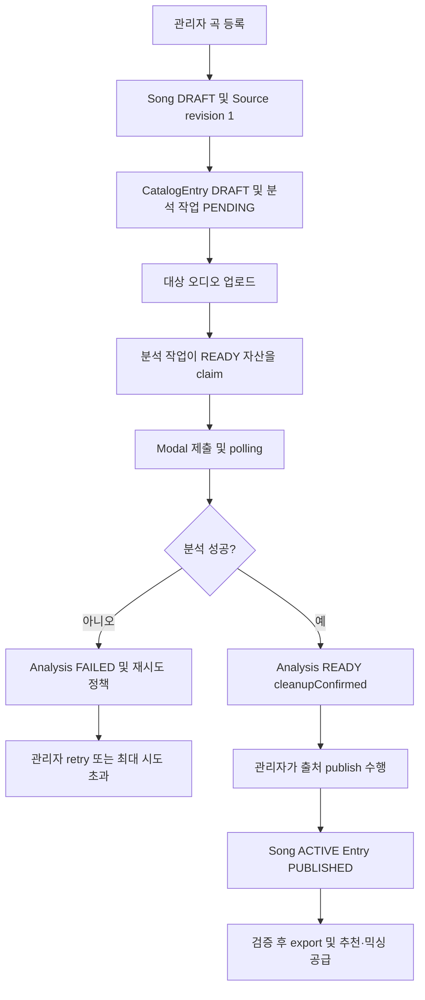
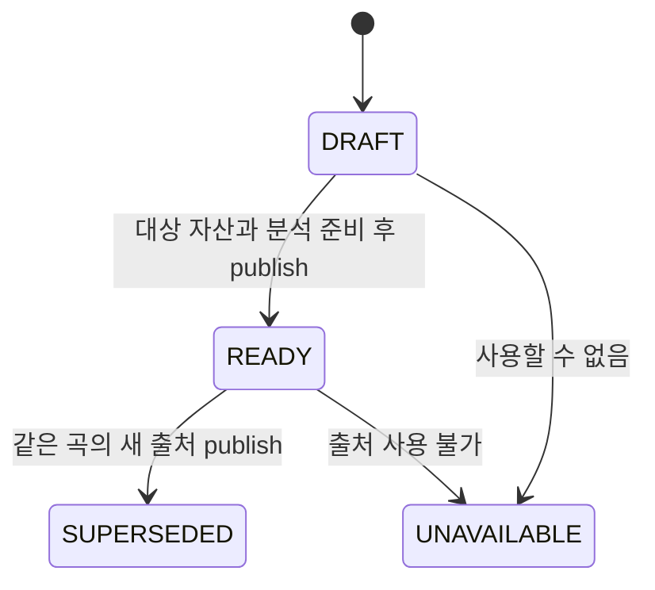
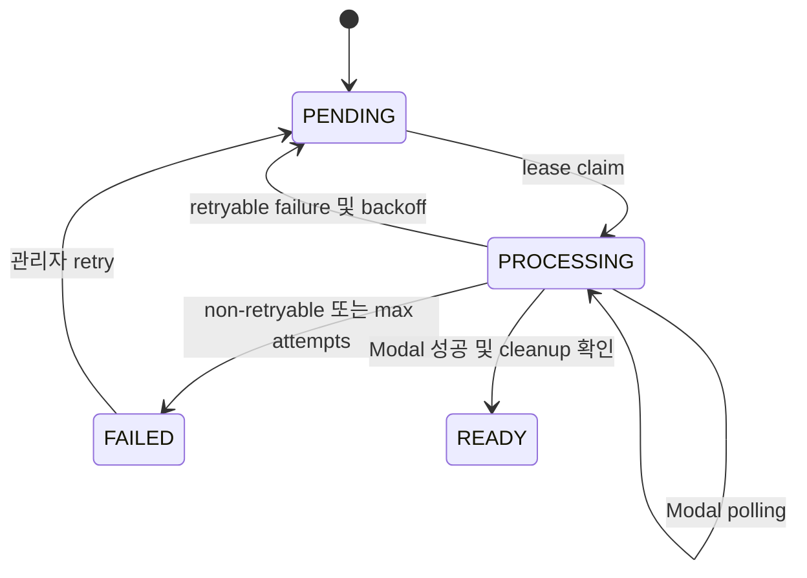
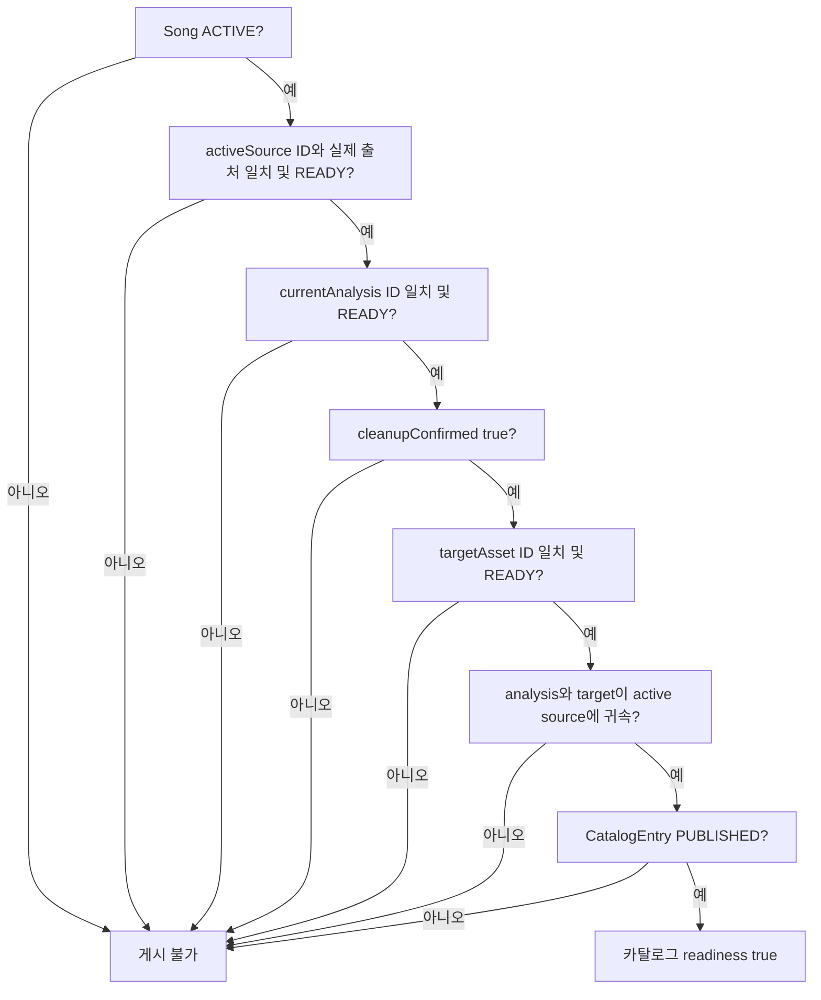

# Song Catalog Ingestion, Analysis, and Publishing

이 워크플로는 `Song`(곡의 정체성)과 그 곡의 `SongSource`(출처 리비전), `SongAnalysis`(분석 결과), `CatalogTargetAsset`(분석·믹싱에 사용할 외부 저장 오디오), `CatalogEntry`(카탈로그 내 위치와 게시 상태)를 분리한다. 곡은 `(title, artist)`로 유일하고 출처는 YouTube video ID가 유일하다. 따라서 같은 곡의 원본 영상 교체는 곡을 새로 만드는 일이 아니라 더 높은 `revision`의 출처를 추가하는 일이다. [schema](repo://prisma/schema.prisma#L188-L239)

## 전체 수명주기

캡션: 곡 등록부터 분석, 출처 게시, 검증 및 소비까지의 제어 흐름이다.

### 1. 등록과 식별

`POST /api/admin/catalog`는 관리자 인증 후 multipart form의 `title`, `artist`, `sourceUrl`, `idempotencyKey`와 `audio` 파일을 받는다. 서비스는 카탈로그가 먼저 초기화되었는지 확인하고, 곡을 `DRAFT`, 출처 revision 1을 `DRAFT`, 카탈로그 항목을 `DRAFT`로 한 트랜잭션에 만들며 `SongAnalysisJob`을 만든다. `idempotencyKey`가 같은 기존 작업이면 동일한 곡·출처인지 확인해 기존 결과를 반환하고, 다른 요청이면 충돌(409)이다. [admin service](repo://src/features/manage-song-catalog/api/admin-service.ts#L72-L137) [route](repo://src/_app/api-routes/admin/catalog/catalog-route.ts#L12-L45)

새 음원 파일은 지원 MIME인지, 비어 있지 않고 49MB 이하인지 확인한다. WAV라면 최소 헤더와 `RIFF`도 검사한다. SHA-256이 같은 READY 자산이 이미 그 출처에 있으면 재사용하고, 아니면 media-storage 경계를 통해 업로드한다. DB 생성이 실패하면 외부 파일을 best-effort 삭제한다. [target asset](repo://src/features/manage-song-catalog/api/target-assets.ts#L10-L67) 자세한 저장소 API/인증은 [media-storage](/openwiki/integrations/media-storage.md)를 참고한다.

### 2. 출처 리비전 교체

관리자 출처 교체 API는 기존 곡의 최대 revision에 1을 더한 출처를 만들고, 그 출처 전용 분석 작업을 큐에 넣는다. 새 출처는 처음부터 `DRAFT`이며, 이전 출처를 자동으로 활성화하지 않는다. 동일 idempotency key는 같은 곡과 video ID에만 멱등적으로 허용된다. [admin service](repo://src/features/manage-song-catalog/api/admin-service.ts#L139-L190)

캡션: `SongSource.status`의 스키마상 상태와 출처 교체 시의 전이를 나타낸다.

### 3. 오디오 분석과 실패 처리

워커는 `attempts < maxAttempts`, `nextAttemptAt` 조건과 대상 출처의 READY 자산 존재를 확인하고 `FOR UPDATE SKIP LOCKED`로 작업 하나를 claim한다. lease owner·만료 시각·heartbeat를 기록하므로 만료된 PROCESSING 작업은 다시 선택될 수 있다. 설정된 analyzer URL/API key가 없으면 재시도 불가 오류다. READY 외부 자산을 다운로드한 뒤 `submitSongAnalysis`로 Modal에 `requestId=job.id`, source video ID, 바이트, 파일명, MIME을 전달하고, 완료될 때까지 polling한다. [worker](repo://src/_app/background-jobs/song-analysis/worker.ts#L30-L60) [worker control flow](repo://src/_app/background-jobs/song-analysis/worker.ts#L127-L199)

성공 시 분석 레코드를 pipeline contract별로 upsert하고 지표·키·descriptor·파이프라인 메타데이터를 저장하며 `status=READY`, `cleanupConfirmed=true`로 만든다. 실패는 분석을 FAILED로 기록하고 오류 코드·상세·retryable을 남긴다. 재시도 가능한 실패는 지수 backoff(최대 60초)로 PENDING에 되돌리고, 그렇지 않거나 최대 시도에 도달하면 작업도 FAILED가 된다. 관리자 retry는 FAILED 작업만 attempts를 0으로 초기화한다. [worker success](repo://src/_app/background-jobs/song-analysis/worker.ts#L200-L295) [retry](repo://src/features/manage-song-catalog/api/admin-service.ts#L192-L213)

캡션: 분석 결과와 분석 작업의 핵심 상태 흐름이다. 분석 레코드의 최종 READY와 작업의 SUCCEEDED는 서로 다른 저장 상태다.

## 게시 게이트: 왜 여러 불변조건을 따로 검사하는가

게시 가능 여부는 단일 `status` 플래그가 아니다. `catalogReadiness`는 다음을 각각 검사하고 실패 이유 코드를 누적한다. 즉, 아래 조건들은 서로 대체할 수 없는 별도 불변조건이다. [readiness](repo://src/entities/song-catalog/lib/readiness.ts#L3-L45) [contract](repo://src/entities/song-catalog/model/contract.ts#L29-L63)

1. **활성 출처**: `Song.activeSourceId`가 존재하고 조인된 출처 ID와 같으며 출처 상태가 READY여야 한다. 출처가 READY라는 사실만으로 해당 출처가 현재 곡에 선택됐다고 추론하지 않는다.
2. **현재 분석**: `Song.currentAnalysisId`와 실제 분석 ID가 같고 분석이 READY여야 한다. 분석은 출처와 pipeline contract에 귀속되므로 `currentAnalysis.sourceId === activeSourceId`도 별도로 맞아야 한다.
3. **정리 확인**: 분석 결과가 READY여도 `cleanupConfirmed === true`가 아니면 외부/임시 처리물이 안전하게 정리됐다고 볼 수 없으므로 게이트를 통과하지 못한다. 이 필드는 분석 상태와 의도적으로 분리돼 있다.
4. **READY 대상 자산**: `Song.targetAssetId`와 자산 ID가 같고 자산 상태가 READY여야 하며, 자산의 source ID도 활성 출처와 같아야 한다. 파일이 존재하는 것과 현재 출처의 대상 파일인 것은 다르다.
5. **곡 및 카탈로그 상태**: 곡은 ACTIVE이고 `CatalogEntry`는 PUBLISHED여야 한다. 항목 게시 상태와 곡 lifecycle은 서로 다른 행의 상태다.

캡션: 현재 리비전 일치와 게시 상태를 각각 검증하는 카탈로그 게시 게이트다.

`POST /api/admin/catalog/:songId/sources/:sourceId/publish`는 같은 트랜잭션 안에서 지정 출처의 contract 분석 READY·cleanup 확인, 해당 출처의 sourceVideoId와 일치하는 READY target을 확인한다. 통과하면 다른 READY 출처를 SUPERSEDED로 바꾸고 지정 출처를 READY, 항목을 PUBLISHED, 곡을 ACTIVE로 갱신하며 active/current/target FK를 함께 설정한다. 게시 결과가 실제로 바뀐 경우 카탈로그 revision을 증가시킨다. 이전 target이 더 이상 곡이나 mixing job에서 참조되지 않으면 외부 삭제를 시도하고, 실패하면 `DELETE_PENDING`으로 남긴다. [publish](repo://src/features/manage-song-catalog/api/admin-service.ts#L215-L262) [cleanup](repo://src/features/manage-song-catalog/api/target-assets.ts#L69-L92)

아카이브는 곡을 ARCHIVED로 만들고 해당 곡의 아직 아카이브되지 않은 모든 카탈로그 항목을 ARCHIVED로 바꾸며 관련 카탈로그 revision을 증가시킨다. 이는 자산 삭제 정책을 의미하지 않는다. 코드가 보장하는 것은 항목·곡 상태 갱신뿐이다. [archive](repo://src/features/manage-song-catalog/api/admin-service.ts#L264-L274)

## 스냅샷 export/import

export는 먼저 게시 카탈로그를 검증한다. published row가 없거나 invalid row가 하나라도 있으면 실패한다. 검증에는 위치의 양의 정수·중복 여부와 위 readiness 조건이 포함된다. 성공한 JSON은 schema version 3, 카탈로그 slug/name/issue/revision, 생성 시각, 위치 순서의 곡 배열을 포함하며 source, current analysis, target asset을 함께 담는다. descriptor는 위험 키와 과대 문자열을 제거하고 pipeline metadata는 allowlist만 남긴다. 원시 오디오 바이트나 임시 경로를 스냅샷에 넣지 않는다. [snapshot API](repo://src/entities/song-catalog/api/catalog-snapshot.ts#L45-L189) [snapshot schema](repo://src/entities/song-catalog/model/snapshot.ts#L29-L156)

import는 schema 검증 후 position, `(title, artist)`, source video ID, 외부 target 키의 중복과 source-target ID 일치를 검사한다. 하나의 DB transaction에서 카탈로그와 곡·출처·분석·target·entry를 upsert하며, 기존 카탈로그 revision보다 낮추지 않는다. 각 곡은 source READY, analysis READY+cleanup, target READY이고 서로 일치할 때만 ACTIVE/PUBLISHED로 복원된다. 그렇지 않으면 분석 상태만 갱신하고 entry는 DRAFT로 둔다. [import](repo://src/entities/song-catalog/api/catalog-import.ts#L22-L45) [import transaction](repo://src/entities/song-catalog/api/catalog-import.ts#L93-L300)

## 추천과 믹싱으로의 공급

게시 카탈로그 로더는 catalog와 entry가 PUBLISHED이고 곡이 ACTIVE이며 source·analysis·target이 READY인 행만 읽는다. 추천 빌더는 다시 FK ID, source 귀속, cleanup 확인, 분석 지표의 유한값, analyzer와 analyzerVersion을 점검한다. 하나라도 맞지 않거나 위치가 중복되면 `CATALOG_NOT_READY`(503 retryable)로 중단한다. 따라서 게시됨은 추천에 충분조건이 아니며, 최신 분석의 수치 프로필까지 필요하다. [published loader](repo://src/entities/song-catalog/api/published-catalog.ts#L6-L61) [recommendation validation](repo://src/features/create-recommendation/lib/recommendation-data.ts#L17-L67) 자세한 스코어링은 [recommendation-and-mixing](/openwiki/workflows/recommendation-and-mixing.md)을 참고한다.

믹싱 큐도 분석이 현재 곡 분석인지, READY인지, cleanup이 확인됐는지, source와 target이 현재 분석/출처와 일치하는지 확인한 뒤 작업을 만든다. 그러므로 source를 교체하거나 target을 정리하는 변경은 추천뿐 아니라 믹싱 입력 identity도 바꿀 수 있다. [mixing queue](repo://src/features/create-mixing/api/mixing-queue.ts#L55-L100)

## 운영 체크리스트와 확장 경계

- 관리 API는 `requireAdminApi`를 통과해야 한다. 등록·교체에는 재시도 시 중복 생성을 막을 idempotency key를 항상 제공한다.
- 분석 워커는 `SONG_ANALYSIS_PIPELINE_CONTRACT`, Modal URL/API key, lease와 polling 설정을 서버 설정에서 읽는다. Modal 처리 계약과 응답 형식 변경은 [modal-processing](/openwiki/integrations/modal-processing.md) 및 analyzer 서비스와 함께 변경한다. [worker config](repo://src/_app/background-jobs/song-analysis/worker.ts#L3-L11)
- export 전에는 `verifyDatabaseSongCatalog` 결과의 invalid 항목을 우선 조사한다. READY 자산이 있어도 source video ID가 다르면 게시하지 않는다.
- target 삭제는 mixing job 참조가 있거나 어떤 Song이 가리키면 건너뛴다. 외부 삭제 실패는 `DELETE_PENDING`이므로 저장소 정리 작업에서 재처리할 수 있지만, 이 코드만으로 재처리 스케줄러가 존재한다고 가정하지 않는다.
- 핵심 회귀 범위는 관리자 등록·게시, target 자산 검증/cleanup, DB identity와 readiness, 분석 큐 lease·retry, snapshot의 멱등 import/export다. 특히 snapshot 통합 테스트는 raw bytes·금지 메타데이터 차단, source URL/ID 불일치, 중복 position/video/target, revision 하향 방지를 검증한다. [snapshot tests](repo://tests/catalog-snapshot.integration.ts#L8-L149) [domain tests](repo://tests/song-catalog-domain.test.ts#L1-L220)
