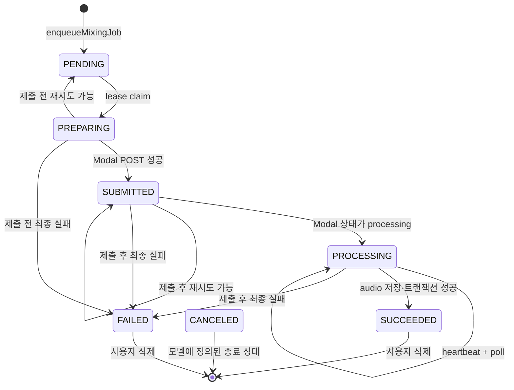
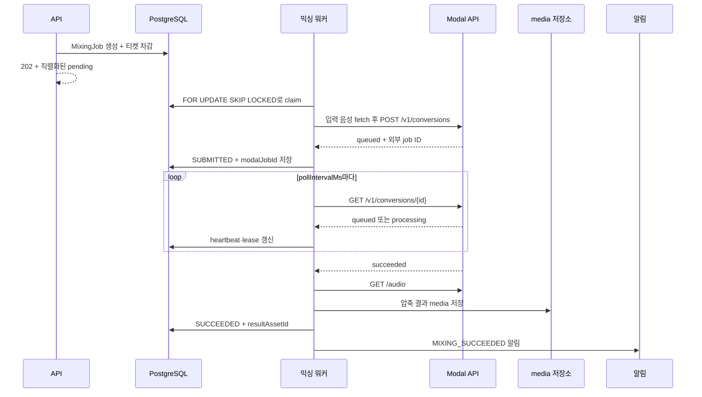

믹싱 요청은 웹 요청이 오래 걸리는 변환을 직접 수행하지 않고 `MixingJob`으로 저장한 뒤 `202`를 반환해요. 워커는 PostgreSQL에서 한 작업의 소유권을 lease로 확보하고, Modal의 외부 job ID가 있으면 그 작업을 다시 조회해요. 따라서 장애가 나도 **제출 전 실패만 환불**하고, Modal에 제출한 뒤의 실패는 환불하지 않아요.

새 요청을 만들거나 결과 상태를 확인하려면 인증된 세션으로 `POST /api/mixing-jobs`와 `GET /api/mixing-jobs/[id]`를 사용하세요. 구현을 따라갈 때는 [믹싱 워커의 claim·poll·복구 코드](repo://src/_app/background-jobs/mixing/worker.ts#L92-L145)를 가장 먼저 확인하세요. `MixingJob`의 저장 필드와 관계는 [Prisma 모델](repo://prisma/schema.prisma#L569-L617)에서 확인할 수 있어요.

## 요청 접수와 티켓 차감

`POST /api/mixing-jobs`는 세션을 확인하고 `vocalProfileId`, `songAnalysisId`, `idempotencyKey`를 검증해요. 요청 키가 비어 있거나 200자를 넘으면 `400`을 반환해요. 유효한 요청은 `enqueueMixingJob`으로 넘어가요.

`enqueueMixingJob`은 추천 결과와 분석이 최신인지 먼저 확인해요. 분석 상태가 `READY`이고 곡이 `ACTIVE`여야 하며, 추천의 카탈로그 revision·순서·target asset이 현재 곡과 일치하고 target asset 상태가 `READY`여야 해요. 저장된 사용자 보컬 레퍼런스도 선택할 수 있어야 해요. 하나라도 맞지 않으면 작업을 만들거나 티켓을 차감하지 않고 `MIXING_SOURCE_NOT_FOUND`, `MIXING_RECOMMENDATION_STALE`, `MIXING_REFERENCE_UNAVAILABLE` 같은 오류를 반환해요.

작업 생성과 티켓 차감은 `Serializable` 트랜잭션 안에서 함께 일어나요. `(userId, idempotencyKey)`가 이미 있으면 같은 입력의 기존 작업을 돌려주고, 다른 입력이 같은 키를 쓰면 `IDEMPOTENCY_CONFLICT`를 반환해요. 동시 요청으로 쓰기 충돌이 나면 최대 세 번 트랜잭션을 다시 시도해요. 비용이 0보다 클 때만 `AI_MIXING` 사용 차감 ledger를 한 번 기록하고, 잔액이 부족하면 `402 INSUFFICIENT_TICKETS`를 반환해요. 자세한 입력 경계와 원자적 저장은 [믹싱 큐 구현](repo://src/features/create-mixing/api/mixing-queue.ts#L19-L148)을 확인하세요.

## 상태와 외부 호출 순서

내부 상태는 `PENDING → PREPARING → SUBMITTED → PROCESSING → SUCCEEDED` 흐름을 따라가요. 실패하면 `FAILED`가 되고, `CANCELED`도 종료 상태로 정의돼요. 다만 현재 사용자 삭제 코드는 종료 작업을 삭제할 뿐 상태를 `CANCELED`로 바꾸지는 않아요. API는 내부 대문자 상태를 소문자 `pending`, `preparing`, `submitted`, `processing`, `succeeded`, `failed`, `canceled`로 직렬화해요. API 응답에는 작업 ID, 티켓 비용, 오류 코드·상세, 생성·갱신·완료 시각이 포함돼요.

워커는 제출 전 `referenceAsset.externalUrl`과 `targetAsset.externalUrl`에서 음성을 받아요. target asset이 없거나 `READY`가 아니면 제출하지 않아요. 두 파일과 `SYNTHESIS_PRESET`을 multipart form으로 묶고 `auto_pitch_shift=false`, 추천 `pitch_shift`를 넣어 `POST {MODAL_API_URL}/v1/conversions`에 `X-API-Key`로 제출해요. Modal이 `queued` 상태와 job ID를 돌려준 뒤에만 내부 작업을 `SUBMITTED`로 저장해요.

이후 워커는 외부 job ID로 `GET /v1/conversions/{id}`를 반복 조회해요. 외부 상태가 `processing`이면 내부 상태도 `PROCESSING`으로 바꾸고 heartbeat를 갱신해요. 아직 `queued`이면 내부 상태는 `SUBMITTED`로 유지해요. `succeeded`가 되면 `/audio`에서 결과를 받아 압축하고 media 저장소에 `MIX_RESULT` asset으로 저장한 뒤, 같은 데이터베이스 트랜잭션에서 `SUCCEEDED`와 `resultAssetId`를 기록하고 성공 알림을 만들어요. 저장 후 상태 트랜잭션이 실패하면 방금 만든 media asset을 폐기해요.

Modal 서비스는 API key를 검사하고 입력을 `/jobs/{job_id}`에 저장한 다음 `SoulXModel.convert.spawn`으로 GPU 작업을 큐에 넣어요. 외부 서비스의 상태 조회가 Modal 호출을 `timeout`으로 만나면 `processing`으로 보고, 결과는 24시간 TTL 뒤 정리돼요. 제출·상태·오디오 endpoint의 실제 계약은 [Modal 애플리케이션](repo://services/soulx-singer-svc/modal_app.py#L220-L341)을 확인하세요.

## lease와 워커 복구

`claimNextMixingJob`은 `attempts < maxAttempts`, `nextAttemptAt <= 현재 시각`인 작업 중 `PENDING` 또는 lease가 만료된 `PREPARING`·`SUBMITTED`·`PROCESSING` 작업을 오래된 순서로 고르고, `FOR UPDATE SKIP LOCKED`로 다른 워커가 잠근 행을 건너뛰어요. claim은 `leaseOwner`, `leaseExpiresAt`, `heartbeatAt`, `startedAt`을 갱신하고 시도 횟수를 1 증가시켜요. 여러 워커가 동시에 실행돼도 한 행을 동시에 처리하지 않는 경계예요.

외부 조회가 계속되는 동안 `heartbeat`는 소유 워커인지 `leaseOwner`로 확인하면서 heartbeat와 lease 만료 시각을 연장해요. 갱신 행 수가 1이 아니면 lease를 잃은 것으로 보고 오류를 내요. 워커 한 번의 실행은 먼저 `REQUIRED` 환불을 보정하고 media 정리를 처리한 뒤 작업을 claim해요. lease가 만료되면 다음 실행이 같은 `modalJobId`를 사용해 재제출하지 않고 외부 job을 다시 poll해요.

## 재시도와 환불 경계

네트워크 오류와 기본 HTTP 상태 `408`, `425`, `429`, `5xx`는 재시도 가능해요. 다만 Modal 제출 endpoint는 `429`만 재시도 가능하고, 외부 job이 `failed`가 된 경우나 잘못된 응답·설정 누락은 재시도하지 않아요. 결과 압축 실패는 재시도 가능하지만 이미 제출된 작업으로 취급해요.

재시도 가능하고 `maxAttempts`에 도달하지 않았다면 제출 전 작업은 `PENDING`, 제출 후 작업은 `SUBMITTED`로 돌려요. 다음 시각은 `min(30초, 2 ** (attempts - 1)초)` 뒤로 설정해요. 이때 lease 소유권을 비우고 오류 코드를 저장하지만 완료 시각은 비워 둬요.

최종 실패는 `FAILED`로 저장하고 오류 코드·상세, 재시도 가능 여부, 완료 시각을 기록해요. 제출 전 최종 실패는 `refundState=REQUIRED`로 표시한 뒤 `mixing:refund:{job.id}` idempotency key를 사용해 티켓을 환불하고 `REFUNDED`로 바꿔요. 제출 후 최종 실패는 `refundState=NONE`으로 남기고 환불하지 않아요. `MIXING_FAILED` 알림은 최종 실패 때 한 번 만들어요. 별도 보정 루틴은 `REQUIRED` 작업을 오래된 순서로 최대 10개씩 환불해요.

## 삭제와 확인할 테스트

사용자는 작업이 종료 상태(`SUCCEEDED`, `FAILED`, `CANCELED`)일 때만 삭제할 수 있어요. 진행 중인 작업은 `409 MIXING_ACTIVE`예요. 삭제는 결과 asset을 정리하고, 즉시 삭제하지 못하면 `mediaCleanupPending=true`로 반환해 다음 워커의 media 정리가 이어지게 해요. 이 경계는 [사용자 작업 삭제 코드](repo://src/entities/mixing-job/api/deletion.ts#L7-L47)에 있어요.

변경 뒤에는 [믹싱 큐 통합 테스트](repo://tests/mixing-queue.integration.ts#L7-L40)를 변경 범위 테스트로 실행하세요. 이 테스트는 동시 idempotency, 단일 lease claim, 만료 lease 복구, 제출 전 환불, 지수 지연 재시도, 제출 후 무환불, 결과 압축 실패, 알림을 함께 확인해요. 화면은 서버가 관찰한 상태만 표시하고 진행률 퍼센트를 만들어 내지 않으므로, 상태 표시를 바꾸는 변경은 [상태 표시 테스트](repo://tests/mixing-status-presentation.test.ts#L25-L89)를 함께 확인하세요. 결과 압축 계약은 [압축 결과 테스트](repo://tests/compress-mixing-result.test.ts)를 기준으로 삼으세요.

다음으로 작업의 관계와 티켓 ledger를 이해하려면 [도메인 데이터 모델](../concepts/domain-data-model.md)을 읽고, Modal·media 경계를 운영하려면 [외부 서비스 연동](../integrations/external-services.md)과 [런타임 설정](../operations/configuration-and-runtime.md)을 이어서 확인하세요.
