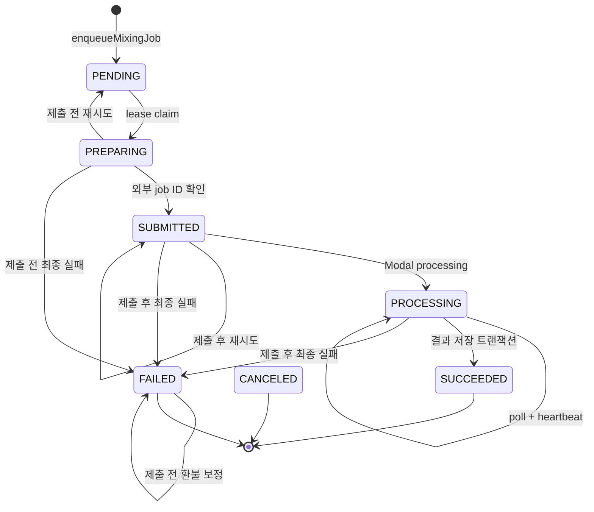
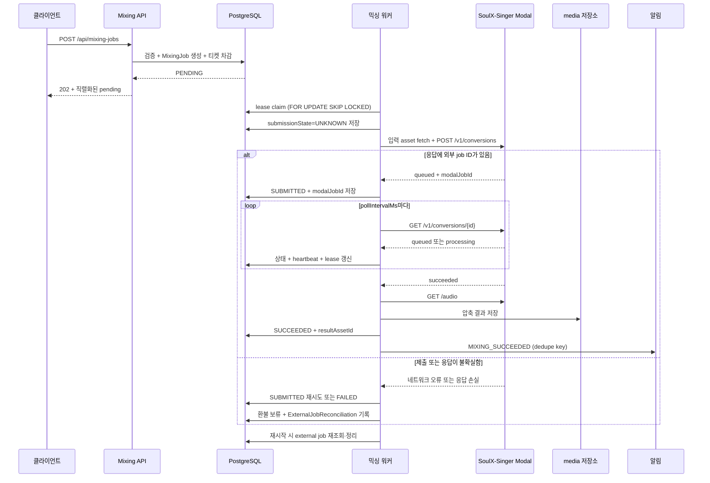

이 페이지의 질문은 **“믹싱 작업이 어떻게 접수되고 외부 실패·lease 손실·재시작에서 안전하게 복구되나요?”**예요. 핵심 결론은 웹 요청과 긴 외부 변환을 분리하고, `MixingJob`의 `modalJobId`와 lease 소유권을 복구 기준으로 삼는다는 점이에요. 그래서 Modal 제출 여부가 확실하지 않은 실패는 일반 실패와 다르게 다뤄지고, 제출 전 최종 실패만 환불 대상이 돼요.

새 작업은 인증된 세션에서 `POST /api/mixing-jobs`로 만들고, 응답의 소문자 상태는 `GET /api/mixing-jobs/[id]` 또는 이력 API에서 확인하세요. 구현을 추적하려면 [믹싱 워커의 claim·poll·복구 코드](repo://src/_app/background-jobs/mixing/worker.ts#L97-L170)와 [`MixingJob` 저장 모델](repo://prisma/schema.prisma#L577-L627)을 먼저 읽으세요.

## 접수: 검증과 차감을 한 트랜잭션으로 묶어요

`POST /api/mixing-jobs`는 세션과 JSON 입력을 확인해요. `vocalProfileId`, `songAnalysisId`, `idempotencyKey`가 유효하지 않으면 `400`을 반환하고, 티켓이 부족하면 `402 INSUFFICIENT_TICKETS`를 반환해요.

`enqueueMixingJob`은 최신 추천과 분석을 다시 확인해요. 분석은 `READY`여야 하고 곡은 `ACTIVE`여야 해요. 카탈로그의 `PUBLISHED` 상태, revision, 순서, 추천의 `targetAssetId`와 실제 target asset의 source가 모두 일치해야 하며 target asset은 `READY`여야 해요. 사용자 보컬 프로필에서 선택 가능한 레퍼런스가 없으면 접수하지 않아요.

작업 생성과 `AI_MIXING` 사용 차감은 `Serializable` 트랜잭션에서 함께 수행해요. 비용이 0보다 클 때만 `mixing:debit:{job.id}` 키를 가진 차감 ledger를 기록해요. `(userId, idempotencyKey)`가 이미 같은 입력에 쓰였다면 기존 작업을 반환하고, 다른 입력에 쓰였다면 `IDEMPOTENCY_CONFLICT`를 반환해요. 동시 쓰기 충돌은 최대 세 번 재시도해요. 이 원자성의 구현은 [믹싱 큐](repo://src/features/create-mixing/api/mixing-queue.ts#L20-L164)에서 확인하세요.

## 워커가 외부 작업을 처리하는 순서

`MixingJob`은 보통 `PENDING → PREPARING → SUBMITTED → PROCESSING → SUCCEEDED`로 이동해요. 실패는 `FAILED`, 취소는 모델에 정의된 종료 상태 `CANCELED`예요. 공개 계약은 내부 대문자 상태를 `pending`, `preparing`, `submitted`, `processing`, `succeeded`, `failed`, `canceled`로 직렬화해요. 응답에는 작업 ID, 티켓 비용, 오류 정보와 생성·갱신·완료 시각이 포함돼요.

워커는 제출 전 저장된 레퍼런스와 `READY` target asset을 내려받아요. 두 파일과 `SYNTHESIS_PRESET`을 multipart로 묶고 `auto_pitch_shift=false`, 추천 `pitch_shift`, `request_id=job.id`를 넣어 `POST {MODAL_API_URL}/v1/conversions`에 `X-API-Key`로 보내요. Modal이 유효한 `queued`·`processing`·`succeeded`·`failed` 응답과 외부 job ID를 반환한 뒤에 `modalJobId`와 `SUBMITTED`를 저장해요.

Modal은 API key를 확인하고 업로드 파일을 job volume에 저장한 뒤 `SoulXModel.convert.spawn`으로 비동기 실행을 큐에 넣어요. 상태 조회의 `queued`는 `SUBMITTED`로, `processing`은 `PROCESSING`으로 관찰돼요. `succeeded`가 되면 워커가 `/audio`를 내려받고 결과를 압축한 뒤 media 저장소에 `MIX_RESULT` asset으로 저장해요. 같은 데이터베이스 트랜잭션에서 `resultAssetId`, `SUCCEEDED`, 성공 알림을 기록하고, 그 트랜잭션이 실패하면 방금 만든 media asset을 폐기해요. 외부 입력과 결과 파일은 24시간 TTL 정리 대상이에요. 실제 endpoint 계약은 [SoulX-Singer Modal 애플리케이션](repo://services/soulx-singer-svc/modal_app.py#L233-L380)에서 확인하세요.

## lease 손실과 재시작을 안전하게 처리해요

`claimNextMixingJob`은 `nextAttemptAt`이 지난 작업 중 `PENDING` 또는 lease가 만료된 `PREPARING`, `SUBMITTED`, `PROCESSING` 작업을 생성 시각 순서로 골라요. `FOR UPDATE SKIP LOCKED`로 다른 워커가 잠근 행을 건너뛰고, claim 때 `leaseOwner`, `leaseExpiresAt`, `heartbeatAt`, `startedAt`, `deadlineAt`과 `attempts`를 갱신해요.

heartbeat 갱신은 현재 `leaseOwner`이고 lease가 아직 만료되지 않았다는 조건을 사용해요. 갱신된 행이 하나가 아니면 워커는 `Mixing job lease was lost.` 오류로 중단해요. lease를 잃은 워커는 실패 처리를 덮어쓰지 않아요. 다음 워커는 이미 저장된 `modalJobId`를 사용해 외부 상태를 다시 조회하므로, 확인된 외부 작업을 다시 제출하지 않아요.

단, POST를 시작하기 직전에 `submissionState=UNKNOWN`을 저장하기 때문에 외부 응답을 잃으면 `modalJobId`가 없을 수 있어요. 이 `submission unknown`은 제출되지 않았다고 단정하면 안 되는 경계예요. 재시도 가능한 동안에는 제출 후 경로인 `SUBMITTED`로 재시도하고, 최종화하면 `MODAL_SUBMISSION_UNCONFIRMED`와 `SUBMISSION_UNKNOWN_REFUND_HELD` reconciliation 기록을 남겨 환불을 보류해요.

워커 한 번의 실행은 먼저 `REQUIRED` 환불을 보정하고, 외부 job reconciliation과 media cleanup을 처리한 뒤 새 작업을 claim해요. [reconciliation 구현](repo://src/_app/background-jobs/mixing/reconciliation.ts#L5-L63)은 종료된 내부 작업의 외부 job ID를 최대 20개씩 골라 Modal DELETE를 호출해요. 외부 job ID가 없으면 `UNRESOLVED`로 남기고, 정리가 실패해도 `UNRESOLVED`와 `AUTO_CLEANUP_FAILED_REQUIRES_OPERATOR`를 기록해 운영자 확인 대상으로 남겨요.

## 재시도와 환불의 경계

네트워크 오류와 일반 단계의 `408`, `425`, `429`, `5xx`는 재시도 가능해요. Modal 제출 단계는 네트워크 오류를 자동 재시도하지 않고 `429`만 재시도 가능으로 분류해요. Modal이 `failed`를 반환하거나 잘못된 응답·설정 누락이 발생하면 재시도하지 않아요. 결과 압축 실패는 재시도 가능하지만 이미 제출된 경로로 처리해요.

재시도 횟수가 남아 있으면 제출 전 작업은 `PENDING`, 제출 후 작업은 `SUBMITTED`로 되돌려요. 다음 시각은 `min(30초, 2 ** (attempts - 1)초)` 뒤로 설정하고 lease 소유권을 비워요. `maxAttempts`를 넘거나 deadline에 도달하면 `FAILED`로 저장해요.

제출 전 최종 실패는 `refundState=REQUIRED`로 저장한 뒤 `mixing:refund:{job.id}` idempotency key로 티켓을 환불하고 `REFUNDED`로 바꿔요. 제출 후 최종 실패는 `refundState=NONE`으로 남겨 환불하지 않아요. 제출 여부가 불확실한 최종 실패도 외부 작업이 실행됐을 가능성이 있어 환불을 보류해요. 최종 실패와 성공 알림에는 각각 `mixing:{jobId}:failed`, `mixing:{job.id}:succeeded` 중복 방지 키를 사용해요.

## 삭제와 변경 확인

사용자 삭제는 `SUCCEEDED`, `FAILED`, `CANCELED` 같은 종료 상태에서만 허용돼요. 진행 중인 작업은 `409 MIXING_ACTIVE`예요. 결과 media를 즉시 지우지 못하면 `mediaCleanupPending=true`를 반환하고, 다음 워커 실행의 media cleanup이 이어가요. 이 경계는 [믹싱 작업 삭제 API](repo://src/entities/mixing-job/api/deletion.ts#L7-L47)에서 확인하세요.

변경 뒤에는 [믹싱 큐 통합 테스트](repo://tests/mixing-queue.integration.ts#L193-L399)를 변경 범위 테스트로 실행하세요. 동시 idempotency, 단일 lease claim, 만료 lease 복구, 제출 전·후 환불 차이, 지연 재시도, 결과 압축 실패와 알림을 확인해요. 상태 표시를 바꾸면 서버가 관찰한 상태만 사용하고 관찰되지 않은 진행률을 만들지 않는지 [상태 표시 테스트](repo://tests/mixing-status-presentation.test.ts#L25-L89)도 확인하세요.

작업과 티켓 ledger의 관계는 [도메인 데이터 모델](../concepts/domain-data-model.md)에서, Modal·media 운영 경계는 [외부 서비스 연동](../integrations/external-services.md)과 [런타임 설정](../operations/configuration-and-runtime.md)에서 이어서 확인하세요.
