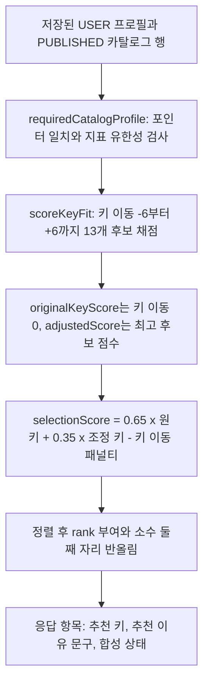

# 추천과 키 적합도 계산

추천 결과는 DB에 저장되지 않아요. 요청이 들어올 때마다 저장된 USER 보컬 프로필과 공개 카탈로그의 곡 분석값을 읽어, 곡마다 13개 키 이동 후보를 채점하고 점수·순위·추천 키·이유 문구를 그 자리에서 만들어요. 그래서 독자가 알아야 할 것은 "어떤 입력이 허용되고, 어떤 산식과 가중치로 순위가 정해지는가"예요. 핵심 구현은 [key-fit-scorer.ts](repo://src/entities/recommendation/lib/key-fit-scorer.ts#L135-L264)와 [ranking.ts](repo://src/entities/recommendation/lib/ranking.ts#L7-L85)에 있어요.

그림: 저장된 프로필과 공개 카탈로그 행이 추천 응답 항목이 되기까지의 계산 순서예요.

## 입력 검증: 어떤 프로필이 점수를 만들 수 있어요

추천은 두 층에서 입력을 검사해요. 서비스 계층은 저장된 행에서 점수 입력을 꺼낼 때, 채점 계층은 실제 계산 직전에 값을 다시 확인해요.

[requiredProfile](repo://src/features/create-recommendation/api/recommendation-service.ts#L27-L68)이 먼저 거르는 규칙은 두 가지예요. `sourceType`이 `USER`인 프로필만 추천을 만들 수 있고, 누락되거나 무한한 수치가 하나라도 있으면 `INVALID_PROFILE` 422로 끝나요. 그 프로필의 수치를 어떤 분석기가 채우는지는 [보컬 프로필 분석 흐름](vocal-profile-analysis.md)이 설명해요.

| 검증 대상 | 규칙 |
| --- | --- |
| 프로필 출처 | `sourceType`이 `USER`여야 해요. 곡 쪽 `SONG` 프로필은 추천 입력이 될 수 없어요 |
| 수치 유한성 | `minMidi`, `maxMidi`, `p10Midi`, `medianMidi`, `p90Midi`, `tessituraLowMidi`, `tessituraHighMidi`, `voicedRatio`, `pitchStability`, `clippingRatio`가 모두 유한한 수여야 해요 |
| 비율 범위 | `voicedRatio`, `pitchStability`, `clippingRatio`는 0 이상 1 이하여야 해요 |
| 백분위 순서 | `minMidi <= p10Midi <= medianMidi <= p90Midi <= maxMidi`를 지켜야 해요 |
| 주요 음역 | `minMidi <= tessituraLowMidi < tessituraHighMidi <= maxMidi`인 비어 있지 않은 구간이어야 해요 |
| 분석기 신원 | `analyzer`와 `analyzerVersion`이 비어 있지 않은 문자열이어야 해요 |
| 분석기 계약 | 사용자 프로필과 곡 프로필의 `analyzer`·`analyzerVersion`이 서로 같아야 해요 |

뒤의 다섯 규칙은 [validateKeyFitProfile](repo://src/entities/recommendation/lib/key-fit-scorer.ts#L47-L106)이 채점 직전에 확인해요. 곡 프로필의 유한성은 그 전에 [requiredCatalogProfile](repo://src/features/create-recommendation/lib/recommendation-data.ts#L17-L68)이 공개 카탈로그 행을 순회하며 확인해요.

오류 코드가 두 계층에서 다르게 나타나는 점을 구분하세요. 서비스 계층 위반은 `RecommendationError`의 `INVALID_PROFILE` 422로 응답에 실려요. 반면 채점 계층의 `INVALID_PROFILE`, `INCOMPATIBLE_ANALYZER`, `SONG_PROFILE_NOT_READY`는 [KeyFitScoringError](repo://src/entities/recommendation/model/key-fit-contract.ts#L74-L86)로 던져지고, 추천 라우트의 오류 처리기는 `RecommendationError`만 상태 코드로 매핑해요([recommendations-route.ts](repo://src/_app/api-routes/recommendations/recommendations-route.ts#L8-L27)). 그래서 이 오류들은 HTTP 응답에서 `RECOMMENDATION_CALCULATION_FAILED` 500(`retryable: true`)으로 바뀌어요.

## 한 곡 안에서 13개 키 이동 후보를 채점해요

[scoreKeyFit](repo://src/entities/recommendation/lib/key-fit-scorer.ts#L239-L264)은 `KEY_SHIFT_MIN`(-6)부터 `KEY_SHIFT_MAX`(+6)까지 1반음 간격으로 후보를 만들어요([key-fit-contract.ts](repo://src/entities/recommendation/model/key-fit-contract.ts#L3-L6)). 후보 하나는 곡의 주요 음역과 최저·최고 음을 이동값만큼 평행 이동한 뒤 사용자 프로필과 비교해요([scoreKeyFitCandidate](repo://src/entities/recommendation/lib/key-fit-scorer.ts#L135-L190)).

점수는 세 성분의 가중 합이에요. `tessituraOverlapRatio`는 두 주요 음역이 겹친 길이의 2배를 두 구간 길이 합으로 나눈 대칭 비율이라, 곡 음역이 사용자 음역에 완전히 들어가도 1을 넘지 않아요. `highTessituraExcess`, `lowTessituraExcess`, `highExtremeExcess`, `lowExtremeExcess`는 이동한 곡이 사용자 범위를 넘어간 반음 수예요. `tessituraFit`과 `extremeFit`은 그 부담을 12반음에서 자른 값으로 감소시켜요.

| 성분 | 계산 |
| --- | --- |
| `tessituraOverlapRatio` | `clamp((2 * overlap) / (두 구간 길이 합), 0, 1)` |
| `tessituraFit` | `1 - clamp((highTessituraExcess + lowTessituraExcess) / 12, 0, 1)` |
| `extremeFit` | `1 - clamp((highExtremeExcess + lowExtremeExcess) / 12, 0, 1)` |
| `rawScore` | `clamp(58 * tessituraOverlapRatio + 26 * tessituraFit + 16 * extremeFit, 0, 100)` |
| `score` | `rawScore`를 소수 둘째 자리로 반올림한 값 |

13개 후보 중 세 값만 곡의 대표값이 돼요. `shift`가 0인 후보의 점수가 `originalKeyScore`, 가장 좋은 후보의 점수가 `adjustedScore`, 그 후보의 `shift`가 `recommendedShift`예요. 겹침을 대칭으로 계산하기 때문에 폭이 좁은 곡이 안에 들어간다는 이유만으로 만점을 받지는 않아요([tests/key-fit-scoring.test.ts](repo://tests/key-fit-scoring.test.ts#L103-L121)).

### 후보 동률은 결정적 순서로 깨요

[compareCandidates](repo://src/entities/recommendation/lib/key-fit-scorer.ts#L192-L208)가 후보를 이 순서로 비교해요. `1e-9` 이내 차이는 동률로 봐요.

1. `rawScore`가 큰 후보
2. `highTessituraExcess`가 작은 후보
3. `highExtremeExcess + lowExtremeExcess`가 작은 후보
4. `|shift|`가 작은 후보
5. `shift`가 더 작은 후보

4번째 규칙이 평평한 동률 구간에서 추천 키를 원키 쪽으로 붙여요. 5번째 규칙은 부호만 다른 같은 크기의 이동이 완전히 동률일 때 적용돼요.

## 신뢰도는 점수가 아니라 표시 근거예요

`confidence`는 후보 점수에 들어가지 않아요. [calculateProfileConfidence](repo://src/entities/recommendation/lib/key-fit-scorer.ts#L129-L133)가 `0.6 * pitchStability + 0.4 * clamp((voicedRatio - 0.25) / 0.5, 0, 1)`로 사용자 프로필만 보고 계산하고, 후보의 점수 성분은 그대로 둬요. 같은 음역이라도 `voicedRatio`와 `pitchStability`가 낮으면 `confidence`만 내려가고 `rawScore`는 변하지 않아요([tests/key-fit-scoring.test.ts](repo://tests/key-fit-scoring.test.ts#L156-L171)).

입력이 사용자 프로필뿐이므로 한 요청의 모든 곡이 같은 `confidence`를 가져요. 그래서 응답 전체의 `profileConfidence`는 첫 항목 값으로 정하고, 0.6 미만이면 `lowConfidence`가 `true`예요([recommendation-service.ts](repo://src/features/create-recommendation/api/recommendation-service.ts#L215-L224)). 추천 이유 쪽에서도 같은 값이 0.6 미만일 때 `LOW_PROFILE_CONFIDENCE`가 붙어요.

## selectionScore 계약과 카탈로그 순위

곡별 채점 결과를 카탈로그 전체 순서로 바꾸는 단계는 [rankRecommendations](repo://src/entities/recommendation/lib/ranking.ts#L47-L85)예요. 원키 점수를 우선하고, 조정 키 점수는 보조로 반영하고, 이동이 클수록 계단식 패널티를 빼요.

| 항목 | 값 |
| --- | --- |
| 원키 가중치 | `ORIGINAL_KEY_SELECTION_WEIGHT = 0.65` |
| 조정 키 가중치 | `ADJUSTED_KEY_SELECTION_WEIGHT = 0.35` |
| 키 이동 패널티 | `KEY_SHIFT_SELECTION_PENALTIES = [0, 1, 3, 7, 12, 20, 30]`을 `abs(recommendedShift)` 인덱스로 조회해요 |
| 하한 | 0, `Math.max(0, …)`로 잘라요 |
| 출력 반올림 | 소수 둘째 자리 |
| 지원 범위 | `recommendedShift`의 절대값이 6 이하여야 해요. 배열 인덱스가 없으면 `CATALOG_NOT_READY` 503(`retryable: true`)이에요 |

원키 가중치가 더 크기 때문에 원키 점수가 높은 곡이 큰 이동으로 조정된 곡보다 앞서요. 같은 값에 키 이동이 붙으면 패널티가 그대로 순위를 밀어내요.

| 순서 | tie-break 기준 |
| --- | --- |
| 1 | `selectionScore` 내림차순 |
| 2 | `originalKeyScore` 내림차순 |
| 3 | `adjustedScore` 내림차순 |
| 4 | `abs(recommendedShift)` 오름차순 |
| 5 | `catalogOrder` 오름차순 |

`rank`는 정렬이 끝난 뒤 `index + 1`로 붙어요. 반올림은 정렬 뒤에 적용되므로 응답의 `selectionScore`는 소수 둘째 자리까지지만, 동률 판정은 반올림 전 값으로 이뤄져요. 순위를 응답 값만으로 다시 계산할 때는 위 다섯 단계를 그대로 따라가세요.

순위를 만들기 전에 입력도 확인해요. 목록이 비었거나, `catalogOrder`가 정수가 아니거나 중복이거나, 점수가 유한하지 않거나, `recommendedShift`가 정수가 아니면 부분 결과를 내보내지 않고 `CATALOG_NOT_READY` 503으로 끝나요([ranking.ts](repo://src/entities/recommendation/lib/ranking.ts#L47-L72)).

원키 점수 50, 조정 키 점수 100, 추천 키 이동 0이면 `0.65 * 50 + 0.35 * 100 = 67.5`예요. 같은 점수 조합에 이동 4가 붙으면 패널티 12를 빼서 55.5가 돼요([tests/recommendation-ranking.test.ts](repo://tests/recommendation-ranking.test.ts#L79-L86)).

## 추천할 수 있는 곡은 공개 카탈로그 조건을 통과한 곡뿐이에요

[loadPublishedCatalog](repo://src/entities/song-catalog/api/published-catalog.ts#L6-L21)가 조회 단계에서 `PUBLISHED` 항목, `PUBLISHED` 카탈로그, `ACTIVE` 곡, `READY` active source, `READY`이면서 `cleanupConfirmed`인 현재 분석, `READY` 타깃 자산을 모두 요구하고 `position` 오름차순으로 돌려줘요. 조회를 통과한 행도 [buildRankedDatabaseRecommendations](repo://src/features/create-recommendation/lib/recommendation-data.ts#L70-L97)가 포인터 일치(`activeSourceId`, `currentAnalysisId`, `targetAssetId`와 `sourceId` 연결), 지표 유한성, 분석기 신원을 다시 확인해요. 하나라도 어긋나면 `CATALOG_NOT_READY` 503(`retryable: true`)이에요([recommendation-data.ts](repo://src/features/create-recommendation/lib/recommendation-data.ts#L17-L68)).

같은 조건을 [catalogReadiness](repo://src/entities/song-catalog/lib/readiness.ts#L5-L45)가 이유 코드와 함께 판정해요. 어긋난 항목마다 아래 코드가 `reasons` 배열에 담기고, 하나도 없을 때만 `{ ready: true, reasons: [] }`를 돌려줘요. 코드 목록은 [catalogReadinessCodeSchema](repo://src/entities/song-catalog/model/contract.ts#L55-L63)가 고정해요.

| 이유 코드 | 어긋난 조건 |
| --- | --- |
| `SONG_NOT_ACTIVE` | `lifecycleStatus`가 `ACTIVE`가 아니에요 |
| `SOURCE_NOT_READY` | `activeSourceId`나 `activeSource`가 없거나, `activeSource.id`가 `activeSourceId`와 다르거나, `activeSource.status`가 `READY`가 아니에요 |
| `ANALYSIS_NOT_READY` | `currentAnalysisId`나 `currentAnalysis`가 없거나, 분석 `id`가 포인터와 다르거나, `status`가 `READY`가 아니거나, `cleanupConfirmed`가 `true`가 아니에요 |
| `ANALYSIS_SOURCE_MISMATCH` | `ANALYSIS_NOT_READY`가 아닌데 `currentAnalysis.sourceId`가 `activeSourceId`와 달라요 |
| `TARGET_NOT_READY` | `targetAssetId`나 `targetAsset`이 없거나, 자산 `id`가 포인터와 다르거나, `status`가 `READY`가 아니에요 |
| `TARGET_SOURCE_MISMATCH` | `TARGET_NOT_READY`가 아닌데 `targetAsset.sourceId`가 `activeSourceId`와 달라요 |
| `CATALOG_ENTRY_NOT_PUBLISHED` | `catalogEntry`가 없거나 그 `status`가 `PUBLISHED`가 아니에요 |

이 판정을 소비하는 곳은 [verifyDatabaseSongCatalog](repo://src/entities/song-catalog/api/catalog-snapshot.ts#L45-L78)예요. 공개 행마다 준비 여부와 `position` 유효성을 확인해 `ready` 개수와 `invalid` 목록을 만들고, 하나라도 남으면 스냅샷을 내보내지 않아요. 곡을 `ACTIVE`·`PUBLISHED`로 만드는 등록·공개 절차는 [곡 카탈로그 등록과 공개](song-catalog-lifecycle.md)가 소유해요.

오프라인 아티팩트 경로인 [scoreCatalogKeyFits](repo://src/entities/recommendation/lib/key-fit-catalog.ts#L18-L42)는 준비되지 않은 곡을 조용히 건너뛰지 않아요. `status`가 `READY`가 아니거나 `profile`이 없으면 `SONG_PROFILE_NOT_READY`로 실패해요.

## 추천 이유: 코드가 조건으로 붙고 문구가 따라와요

[buildReasonCodes](repo://src/entities/recommendation/lib/key-fit-scorer.ts#L210-L237)가 추천 키와 원키의 차이를 비교해 이유 코드를 만들고, [formatRecommendationReasons](repo://src/entities/recommendation/lib/ranking.ts#L93-L141)가 코드를 사용자 문구로 바꿔요. 한 곡에 여러 코드가 함께 붙을 수 있어요.

| 코드 | 붙는 조건 | 사용자 문구 |
| --- | --- | --- |
| `ORIGINAL_KEY_BEST` | 추천 키 이동이 0이에요 | 이번 녹음의 주요 음역에는 원키가 가장 잘 맞았어요. |
| `KEY_SHIFT_IMPROVES_FIT` | 이동이 0이 아니고 추천 후보 점수가 원키보다 높아요 | -2키로 조정하면 음역 적합도 점수가 68.6점에서 100.0점으로 높아져요. |
| `HIGH_TESSITURA_OVERLAP` | 추천 후보의 `tessituraOverlapRatio`가 0.8 이상이에요 | 이번 녹음의 주요 음역과 곡의 주요 음역이 약 100% 겹쳐요. |
| `HIGH_RANGE_BURDEN` | 추천 키에서도 고음 부담이 남아 있어요 | 추천 키에서도 고음 부담이 약 2.0반음 남아 있어요. |
| `LOW_RANGE_BURDEN` | 추천 키에서도 저음 부담이 남아 있어요 | 추천 키에서도 저음 부담이 약 2.0반음 남아 있어요. |
| `HIGH_NOTES_REDUCED` | 추천 키의 고음 부담이 원키보다 줄었어요 | 키를 조정해 고음 부담을 약 2.0반음 줄였어요. |
| `LOW_NOTES_REDUCED` | 추천 키의 저음 부담이 원키보다 줄었어요 | 키를 조정해 저음 부담을 약 2.0반음 줄였어요. |
| `LOW_PROFILE_CONFIDENCE` | 추천 후보의 `confidence`가 0.6 미만이에요 | 이번 녹음에서는 추천 근거가 충분하지 않아 더 긴 소절로 다시 분석하면 결과가 달라질 수 있어요. |

표의 문구는 [ranking.ts](repo://src/entities/recommendation/lib/ranking.ts#L103-L131)의 문자열을 그대로 옮긴 거예요. 키 표기, 점수, 겹침 비율, 반음 수는 계산값으로 채워지므로 표의 숫자는 자리 표시자예요. 키 표기는 [formatRecommendedShift](repo://src/entities/recommendation/lib/ranking.ts#L87-L91)가 `원키`, `+2키`, `-3키` 형태로 만들어요. 부담을 줄인 양은 원키와 추천 키의 차이로 구하고 0 아래로 내려가지 않게 잘라요.

응답에는 코드 배열 `reasonCodes`와 문구 배열 `reasons`가 같은 순서로 담겨요. `reasons`는 `reasonCodes`를 순서대로 문구로 바꾼 결과라서 두 배열의 같은 인덱스가 같은 이유를 가리켜요([ranking.ts](repo://src/entities/recommendation/lib/ranking.ts#L134-L141)). 화면은 그 인덱스로 두 배열을 짝지어 [visibleRecommendationReasons](repo://src/entities/recommendation/lib/presentation.ts#L99-L105)로 걸러요. 노출 여부는 [HIDDEN_RECOMMENDATION_REASON_CODES](repo://src/entities/recommendation/lib/presentation.ts#L15-L21)에 있는지로만 갈려요.

| 이유 코드 | 사용자 화면 노출 |
| --- | --- |
| `KEY_SHIFT_IMPROVES_FIT` | 숨김 |
| `HIGH_RANGE_BURDEN` | 숨김 |
| `LOW_RANGE_BURDEN` | 숨김 |
| `HIGH_NOTES_REDUCED` | 숨김 |
| `LOW_NOTES_REDUCED` | 숨김 |
| `ORIGINAL_KEY_BEST` | 노출 |
| `HIGH_TESSITURA_OVERLAP` | 노출 |
| `LOW_PROFILE_CONFIDENCE` | 노출 |

곡 선택 상세는 노출된 이유를 최대 3개까지 보여줘요([recommendation-selection.tsx](repo://src/_pages/recommendation-detail/ui/recommendation-selection.tsx#L62-L78)).

## 응답이 되는 순간: 어떤 값이 이후 믹싱 검증 기준이 돼요

[getRecommendationResult](repo://src/features/create-recommendation/api/recommendation-service.ts#L84-L237)는 순위 결과를 항목 목록으로 투영해요. 항목은 곡 단위 값과 응답 전체 값으로 나뉘어요.

| 항목 값 | 담기는 내용 |
| --- | --- |
| `rank` | 정렬이 끝난 순위예요 |
| `selectionScore` | 가중 합산 뒤 반올림한 선택 점수예요 |
| `originalKeyScore` | 키 이동 0 후보의 점수예요 |
| `adjustedScore` | 가장 좋은 후보의 점수예요 |
| `recommendedShift` | 추천 키 이동 반음 수예요 |
| `reasonCodes`·`reasons` | 같은 순서로 짝지어진 이유 코드와 문구예요 |
| `metrics.original`·`metrics.recommended` | 원키와 추천 키의 상세 분해예요 |
| `catalogOrder` | 공개 카탈로그의 `position`이에요 |
| `targetAssetId` | 믹싱 대상 자산의 ID예요 |
| `songAnalysisId` | 현재 분석의 ID이며 항목 `id`이기도 해요 |

| 응답 값 | 담기는 내용 |
| --- | --- |
| `catalogId` | 점수 계산에 쓴 공개 카탈로그의 ID예요 |
| `catalogRevision` | 그 카탈로그의 개정 번호예요 |
| `scoringVersion` | 채점 계약 버전이고 현재 상수 `key-fit-v3`예요([key-fit-contract.ts](repo://src/entities/recommendation/model/key-fit-contract.ts#L3)) |
| `calculatedAt` | 응답을 만든 시각이에요 |
| `profileConfidence` | 첫 항목의 `metrics.confidence`예요 |
| `lowConfidence` | `profileConfidence`가 0.6 미만인지 여부예요 |

여기서 만들어진 값이 다음 요청의 검증 기준이 돼요. 믹싱 접수는 `catalogId`로 공개 항목을 찾고, `catalogRevision`, `position`, `targetAssetId`, 분석의 `sourceId` 연결을 다시 대조해요. 어긋나면 `MIXING_RECOMMENDATION_STALE` 409(`retryable: true`)로 거절하고, 통과하면 `catalogPosition`, `catalogRevision`, `scoringVersion`, `recommendedShift`를 `MixingJob` 행에 복사해요([mixing-queue.ts](repo://src/features/create-mixing/api/mixing-queue.ts#L81-L133)). 그래야 접수 뒤에 카탈로그가 개정돼도 진행 중인 작업의 키 이동값이 흔들리지 않아요. 이 흐름 전체는 [AI 믹싱 작업 흐름](ai-mixing.md)이, 스냅샷 컬럼의 제약은 [데이터 모델과 수명 주기 상태](../architecture/data-model.md)가 설명해요.

추천 자체는 저장되지 않으므로 같은 입력이면 매번 같은 결과를 다시 계산해요. 같은 프로필로 두 번 호출하면 항목 목록이 완전히 같고, 카탈로그 `revision`을 올리면 `catalogRevision`만 바뀌어요([tests/recommendation-persistence.integration.ts](repo://tests/recommendation-persistence.integration.ts#L62-L90)). 브라우저 캐시 키에도 `catalogRevision`과 `scoringVersion`이 들어가서, 둘 중 하나가 바뀌면 새 계산 결과를 받아요([client.ts](repo://src/entities/recommendation/api/client.ts#L7-L13)).

## 화면용 상태 축약과 mixing job API 상태

응답 항목의 `synthesis.status`는 `MixingJob` DB 상태를 축약한 값이에요. 같은 DB 상태를 믹싱 job API는 더 자세한 소문자 상태로 직렬화하므로 두 표면의 값이 같지 않아요. 작업이 아예 없으면 추천 응답은 `not_started`예요.

| DB 상태 | 추천 응답 `synthesis.status` | mixing job API `status` |
| --- | --- | --- |
| 작업 없음 | `not_started` | 해당 없음 |
| `PENDING` | `preparing` | `pending` |
| `PREPARING` | `preparing` | `preparing` |
| `SUBMITTED` | `queued` | `submitted` |
| `PROCESSING` | `processing` | `processing` |
| `SUCCEEDED` | `succeeded` | `succeeded` |
| `FAILED` | `failed` | `failed` |
| `CANCELED` | `failed` | `canceled` |

축약 규칙은 [publicMixingStatus](repo://src/features/create-recommendation/api/recommendation-service.ts#L70-L82)에 있고, 응답 스키마는 `not_started`에 5개 상태를 더한 목록이에요([recommendation/model/contract.ts](repo://src/entities/recommendation/model/contract.ts#L5-L27)). 믹싱 job API 쪽은 7개 상태를 정의하고 DB 값을 `toLowerCase()`로 직렬화해요([mixing-job/model/contract.ts](repo://src/entities/mixing-job/model/contract.ts#L4-L20), [contract.ts](repo://src/entities/mixing-job/model/contract.ts#L125-L146)). 추천 응답에서는 `CANCELED`가 `failed`로 접히므로 취소와 실패를 구분할 수 없어요. 그 대신 프런트는 `preparing`, `queued`, `processing`이 하나라도 있으면 5초 간격으로 추천을 다시 조회해요([client.ts](repo://src/entities/recommendation/api/client.ts#L5-L21)).

## 이 계산을 검증하는 테스트

계산 계약을 바꿀 때는 아래 변경 범위 테스트로 결과를 확인하세요. 실행 명령과 전체 테스트 계층은 [변경 검증 경로](../testing/verification.md)에 있어요.

- [tests/key-fit-scoring.test.ts](repo://tests/key-fit-scoring.test.ts#L103-L171): 대칭 겹침, 부담이 점수를 올리지 않는 성질, `confidence`가 점수를 바꾸지 않는 성질을 확인해요.
- [tests/key-fit-scoring.test.ts](repo://tests/key-fit-scoring.test.ts#L251-L289): 합성 카탈로그 100곡을 100ms 이내에 결정적으로 채점하고, 준비 안 된 곡을 `SONG_PROFILE_NOT_READY`로 거부해요.
- [tests/recommendation-ranking.test.ts](repo://tests/recommendation-ranking.test.ts#L53-L86): 다섯 단계 tie-break, 패널티 적용, 지원 범위를 벗어난 이동의 `CATALOG_NOT_READY`를 확인해요.
- [tests/recommendation-ranking.test.ts](repo://tests/recommendation-ranking.test.ts#L146-L251): 빈 입력·중복 `catalogOrder`, active 개정 불일치를 순위 생성 전에 거부해요.
- [tests/recommendation-presentation.test.ts](repo://tests/recommendation-presentation.test.ts#L143-L163): 노출되는 이유 코드와 점수 상한·하한을 확인해요.
