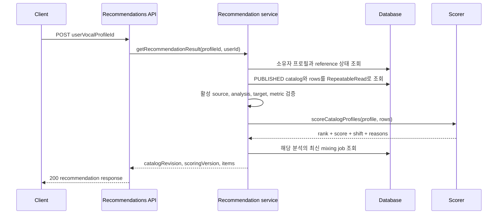
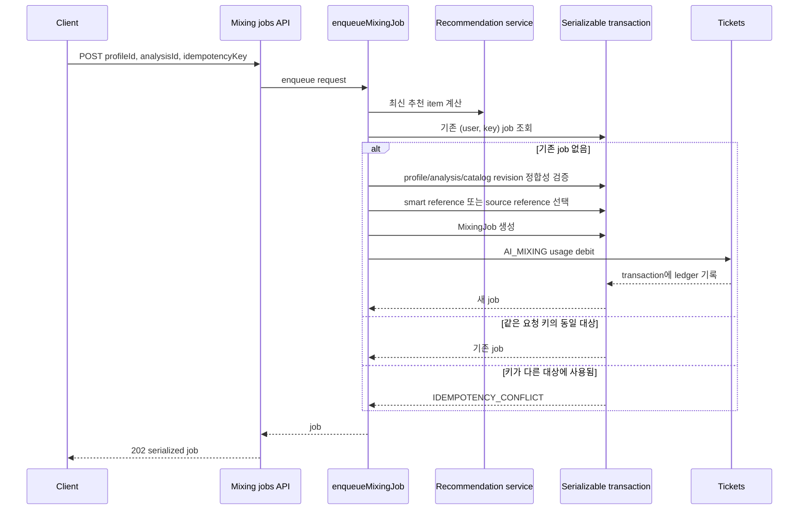
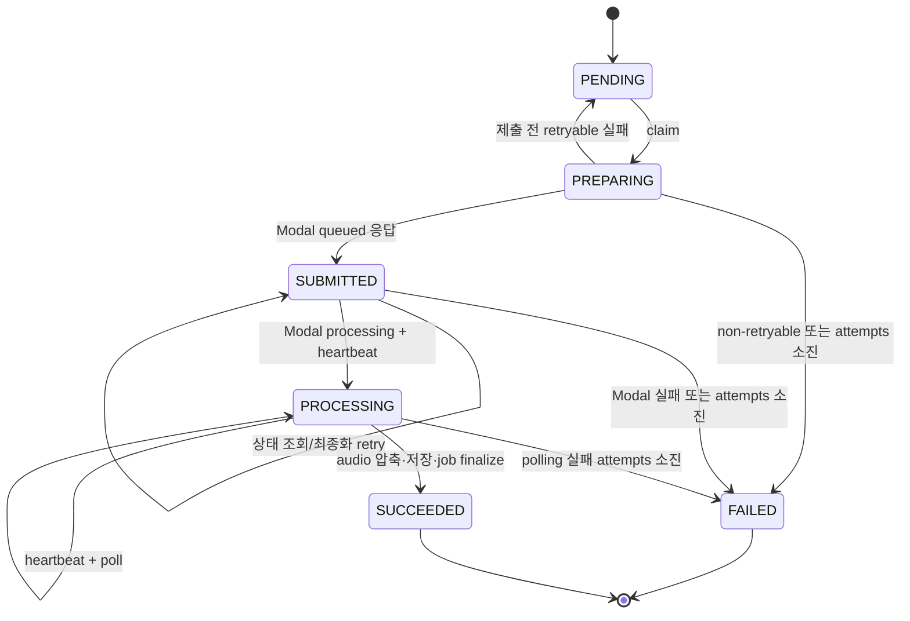

# Recommendation to AI Mixing

이 기능은 **추천을 매번 계산하는 읽기 흐름**과 **믹싱을 영속적인 비동기 작업으로 만드는 쓰기 흐름**으로 나뉜다. 인증된 사용자는 `POST /api/recommendations`에 `userVocalProfileId`를 보내 추천을 얻고, 선택한 `songAnalysisId`와 고유 `idempotencyKey`로 `POST /api/mixing-jobs`를 호출한다. 두 API 모두 세션이 없으면 unauthorized 응답을 반환한다.

## 1. 공개 카탈로그 검증과 추천 계산

추천 서비스는 사용자 소유의 `USER` 보컬 프로필만 허용하고, MIDI 범위·분위수·tessitura·`voicedRatio`·`pitchStability`·`clippingRatio`가 유한한지 확인한다. 프로필의 분위수는 `minMidi ≤ p10Midi ≤ medianMidi ≤ p90Midi ≤ maxMidi`여야 하며 tessitura는 비어 있지 않고 전체 범위 안에 있어야 한다. 곡 쪽에서도 다음 활성 revision 정합성을 확인한다.

- active source가 READY이고 `song.activeSourceId`와 일치한다.
- current analysis가 READY이고 `currentAnalysisId`, source ID와 일치하며 cleanup이 확인됐다.
- mixing target asset이 READY이고 활성 source에 속한다.
- 곡 분석의 모든 스코어링 수치와 `analyzer`/`analyzerVersion`이 존재한다.

발행 카탈로그가 없거나 READY 곡이 없거나 위 정합성이 깨지면 `CATALOG_NOT_READY`(503, retryable)이다. 사용자와 곡의 analyzer 계약(이름과 버전)이 다르면 `INCOMPATIBLE_ANALYZER`로 거부한다. 공개 카탈로그는 repeatable-read transaction으로 읽으므로 한 계산 안에서 catalog와 곡 행의 snapshot이 섞이지 않는다.

위 시퀀스는 추천 검증, 계산, 현재 작업 상태를 하나의 응답으로 합치는 경계를 보여준다.

### 스코어의 의미와 identity

스코어러는 호환되는 두 프로필을 검증한 뒤 `shift = -6..6`의 정수 반음 후보를 모두 평가한다. 점수는 tessitura 대칭 overlap 58점, tessitura 초과 부담 26점, 극단 범위 부담 16점의 가중 합(0~100)이다. 과도한 고음·저음은 각각 최대 12반음까지 감점되며, 동점이면 고음 부담, 전체 극단 부담, 절대 shift 크기, shift 순서로 결정한다. `recommendedShift`, 원키/조정 점수, breakdown과 reason code를 함께 반환한다.

`pitchStability`와 voiced 비율로 계산한 profile confidence는 진단값이다. confidence가 낮으면 `LOW_PROFILE_CONFIDENCE`를 붙일 수 있지만 후보 fit 점수 자체를 바꾸지 않는다. 현재 알고리즘의 **scoring identity**는 `key-fit-v3`이며, 카탈로그의 **catalog revision**과 별개다. 응답과 작업에는 둘 다 기록한다. revision은 어떤 공개 곡/asset snapshot인지, scoring version은 어떤 점수 계약인지 식별한다. 추천 결과 자체는 별도 추천 row로 저장하지 않고 요청 시 계산한다.

## 2. 추천에서 ticketed mixing job으로

클라이언트는 추천 item의 분석 ID를 그대로 쓰되 요청 키를 재사용 가능하게 생성한다. enqueue는 먼저 최신 추천을 다시 계산해 선택 항목을 찾고, 그 결과의 `catalogRevision`, `scoringVersion`, catalog position을 저장 시점에 재검증한다. 따라서 추천을 본 뒤 카탈로그가 바뀌면 `MIXING_RECOMMENDATION_STALE`(409, retryable)이고 오래된 추천으로 작업을 만들지 않는다.

reference 선택은 사용자 소유·READY인 `SYNTHESIS_REFERENCE`를 우선하고, 없으면 사용자 소유·READY인 원본 `REFERENCE` media asset으로 fallback한다. synthesis contract가 지원되지 않거나 둘 다 없으면 `MIXING_REFERENCE_UNAVAILABLE`이며 job과 debit을 만들지 않는다. 선택한 `referenceAssetId`와 카탈로그의 `targetAssetId`는 작업에 고정된다.

작업 생성과 티켓 debit은 `Serializable` transaction 안에서 함께 수행된다. `(userId, idempotencyKey)`가 이미 있으면 같은 profile/analysis 조합일 때 기존 job을 그대로 반환하고, 다른 조합이면 `IDEMPOTENCY_CONFLICT`(409)다. serializable write conflict는 최대 3회 재시도하며, unique race 후에도 기존 job을 조회해 반환한다. debit은 job ID 기반 ledger idempotency key로 한 번만 기록되고 잔액 부족은 402 `INSUFFICIENT_TICKETS`다.

이 시퀀스에서 ticket debit은 job 생성과 원자적이며, reference 검증 실패는 결제 경계 이전에 끝난다.

## 3. 워커: claim, Modal 제출·폴링, 최종화

`runMixingWorkerOnce`는 먼저 필요한 환불을 보정하고 media cleanup을 처리한 뒤 작업을 claim한다. claim은 `FOR UPDATE SKIP LOCKED`로 가장 오래된 eligible job 하나를 잡고 lease owner/만료, heartbeat, attempt를 갱신한다. `PENDING`은 `PREPARING`이 되고, lease가 만료된 `PREPARING`·`SUBMITTED`·`PROCESSING`도 재획득할 수 있다.

제출 전에는 고정된 reference URL과 target asset URL을 다운로드하고 빈 audio를 거부한다. `MODAL_API_URL`과 `MODAL_API_KEY`가 없으면 non-retryable 오류다. Modal `POST /v1/conversions`에 `prompt_audio`, `target_audio`와 `SYNTHESIS_PRESET`을 보내며 `auto_pitch_shift=false`, 추천 `pitch_shift`를 명시한다. 응답은 `queued` 상태의 job ID여야 하고, 성공하면 외부 ID와 함께 `SUBMITTED`로 저장한다.

그 뒤 `GET /v1/conversions/{modalJobId}`를 poll한다. Modal이 `processing`이면 내부 상태를 `PROCESSING`으로 바꾸고 heartbeat하며, queued/processing이 아니면 설정된 poll interval만큼 기다린다. `failed`는 실패로 종료한다. `succeeded`이면 `/audio`를 가져와 압축한 다음 `storeMixingResult`로 media storage에 업로드·확정한다. 결과 asset 저장과 job의 `SUCCEEDED`, `resultAssetId`, 완료 시각, 성공 notification은 transaction으로 묶으며 transaction이 실패하면 업로드한 asset을 폐기한다. 결과는 job detail/history와 추천 item의 `/api/mixing-jobs/{id}/audio` URL로 노출된다(결과 asset이 READY일 때만 audio URL을 준다).

상태 diagram은 내부 상태를 나타낸다. 공개 응답에서는 `PENDING`/`PREPARING`이 `preparing`, `SUBMITTED`가 `queued`, `PROCESSING`이 `processing`으로 매핑되고 `SUCCEEDED`/`FAILED`/`CANCELED`는 각각 `succeeded`/`failed`로 노출된다.

## 4. 실패, 재시도, 환불과 운영 계약

HTTP 408·425·429·5xx와 네트워크 오류 같은 일시적 preflight 오류는 retryable일 수 있다. 남은 시도가 있으면 exponential delay(최대 30초) 후 제출 전 오류는 `PENDING`, 이미 Modal에 제출된 오류는 `SUBMITTED`로 되돌린다. Modal에 제출된 뒤에는 외부 작업을 중복 제출하지 않고 저장된 `modalJobId`를 사용해 이어서 poll한다. 시도 소진 또는 non-retryable 실패는 `FAILED`와 error code/detail, notification을 기록한다.

- **제출 전 실패:** job은 `refundState=REQUIRED`로 확정되고 `ensureMixingRefund`가 `USAGE_REFUND`를 ledger idempotency key `mixing:refund:{job.id}`로 기록한 뒤 `REFUNDED`로 표시한다. 환불 보정은 worker 시작 때도 재실행된다.
- **제출 후 실패:** 외부 서비스에 이미 접수됐으므로 환불하지 않고 `refundState=NONE`을 유지한다. 최종화(압축 또는 결과 저장) 재시도도 이 규칙을 따른다.
- **lease/동시성:** lease 만료는 작업 유실을 복구하지만, 활성 lease를 잃은 worker는 heartbeat에서 실패한다. `SKIP LOCKED`는 두 worker가 같은 job을 동시에 claim하지 않도록 한다.
- **설정:** `MIXING_TICKET_COST`, `MIXING_MAX_ATTEMPTS`, `MIXING_LEASE_SECONDS`, `MIXING_POLL_INTERVAL_MS`, `MODAL_API_URL`, `MODAL_API_KEY`가 비용·시도·lease·poll·Modal 연결을 결정한다. worker는 `reconcileRequiredRefunds`와 media cleanup을 매 실행 전에 수행한다.

## 5. API와 검증 지점

- `POST /api/recommendations`: 세션과 body를 검증하고 계산된 catalog revision, scoring version, ranked item, score breakdown, synthesis 상태를 반환한다.
- `POST /api/mixing-jobs`: 세션·profile·analysis·idempotency key를 검증하고 202를 반환한다. 잔액 부족은 402, stale recommendation/키 충돌은 409다.
- `GET /api/mixing-jobs` 및 `GET /api/mixing-jobs/{id}`: 사용자 자신의 history/detail만 조회한다. `status`, 검색어, 페이지 필터를 지원한다.
- `DELETE /api/mixing-jobs/{id}`: 사용자 작업을 삭제하고 필요하면 media cleanup pending을 반환한다.
- `GET /api/mixing-jobs/{id}/audio`: 성공했고 결과 asset이 READY인 작업만 최종 오디오를 제공한다.

## 6. 집중 테스트

`tests/key-fit-scoring.test.ts`는 profile 수치/순서와 analyzer 호환성, symmetric overlap, 고·저음 부담, confidence의 진단 성격, -6..6 후보와 tie-break, reason code를 고정한다. `tests/recommendation-persistence.integration.ts`는 추천이 on-demand 계산되고 반복 호출의 snapshot identity 및 catalog revision 변경을 확인한다. `tests/mixing-queue.integration.ts`는 동시 idempotent enqueue, serializable debit, reference 우선순위, stale/preflight 실패, lease recovery, Modal 제출 후 재시도, 제출 전 환불·제출 후 무환불, finalization 실패와 성공 결과 저장까지 검증한다. `tests/compress-mixing-result.test.ts`는 최종 음원 압축 계약을, `tests/mixing-reference.test.ts`는 smart reference 우선 및 source fallback 경계를 검증한다.
