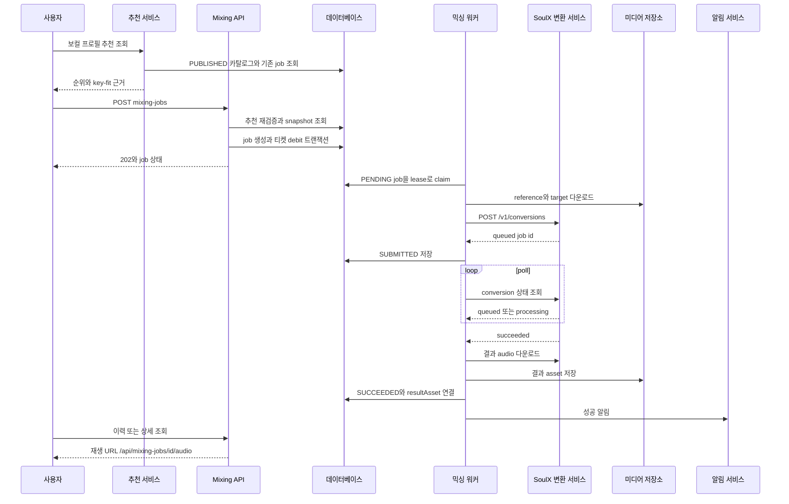
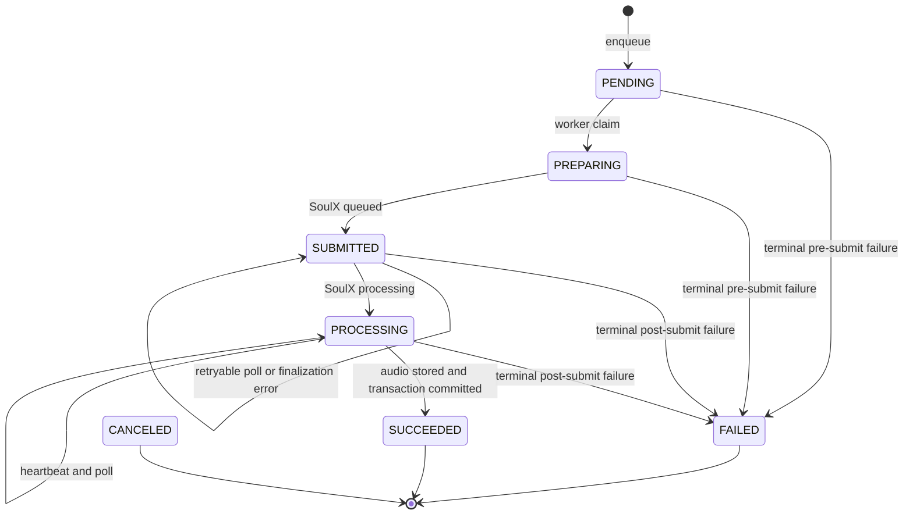

# 추천, 레퍼런스 선택과 AI 믹싱 워크플로

## 범위와 진입점

사용자는 인증된 상태에서 `POST /api/mixing-jobs`에 `vocalProfileId`, `songAnalysisId`, `idempotencyKey`를 보낸다. 추천 화면의 곡은 `getRecommendationResult`가 현재 `PUBLISHED` 카탈로그를 읽고 보컬 프로필과 곡 프로필의 key-fit을 계산해 정렬한 결과다. 추천 응답은 해당 곡의 합성 상태를 별도로 투영하며, 실제 작업의 전체 상태를 숨기지 않고 믹싱 상세·이력 API가 더 풍부한 표현을 제공한다.

*그림은 추천 조회부터 SoulX 제출, 결과 영속화와 사용자 조회까지의 주요 호출 순서를 보여준다.*

## 추천과 key-fit 설명

`getRecommendationResult`는 먼저 사용자 소유이며 `sourceType: USER`인 프로필을 요구하고, MIDI 범위·tessitura·voiced ratio·pitch stability·clipping ratio 등 필수 분석값이 유한한지 검사한다. 카탈로그는 `RepeatableRead` 트랜잭션에서 공개된 하나를 고르고, 각 곡에 대해 다음을 검증한다.

- 활성 source가 READY이고, 현재 분석이 그 source를 가리키며 READY이고 `cleanupConfirmed`여야 한다.
- target asset이 현재 source에 연결되고 READY여야 한다.
- 분석의 점수 필드와 analyzer 식별자가 존재해야 한다.

그 뒤 `scoreKeyFit`은 설정된 이동 범위의 모든 정수 반음 후보를 계산하고, 원키 점수(`originalKeyScore`)와 최적 이동 점수(`adjustedScore`), `recommendedShift`, confidence, reason code를 반환한다. 점수가 비슷하면 높은 tessitura 부담, 극단 음역 부담, 이동량 순으로 결정해 설명이 임의적이지 않게 한다. 따라서 추천 이유는 단순한 곡 순위가 아니라 “키를 조정하면 음역 적합도가 개선되는지”, 높은 음/낮은 음 부담이 줄었는지, 프로필 신뢰도가 낮은지를 포함한다.

응답은 카탈로그 revision·scoring version과 각 항목의 `targetAssetId`, 분석 ID, 추천 이동량을 함께 보존한다. 사용자에게 이미 존재하는 최신 job이 있으면 분석별로 가장 최근 job을 골라 `synthesis.jobId`와 상태를 투영한다. 추천 조회는 새 job을 만들거나 티켓을 차감하지 않는다.

### 추천 상태와 전체 믹싱 상태의 차이

추천 응답의 `synthesis.status`는 UI용 축약 projection이다.

| 실제 MixingJob 상태 | 추천 synthesis 상태 |
|---|---|
| `PENDING`, `PREPARING` | `preparing` |
| `SUBMITTED` | `queued` |
| `PROCESSING` | `processing` |
| `SUCCEEDED` | `succeeded` |
| `FAILED`, `CANCELED` | `failed` |
| job 없음 | `not_started` |

반면 `GET /api/mixing-jobs`, `GET /api/mixing-jobs/:id`와 이력 모델은 `pending`, `preparing`, `submitted`, `processing`, `succeeded`, `failed`, `canceled`를 모두 공개한다. 특히 `submitted`와 `canceled`는 추천 projection에서 각각 큐 대기와 실패로 합쳐지므로, 운영·상세 화면에서는 full API를 사용해야 한다. 활성 상태는 pending/preparing/submitted/processing이고, 나머지는 terminal이다. 성공했더라도 결과 asset이 READY가 아니면 재생 URL을 노출하지 않는다.

## 생성 전 검증, snapshot과 티켓 원자성

`enqueueMixingJob`은 추천 결과를 다시 계산한 뒤 다음을 한 번 더 확인한다. 사용자 프로필 소유권과 USER source type, 분석 READY, 곡 ACTIVE, 현재 분석 ID, 추천에 사용된 카탈로그의 published 상태·revision·position, target ID/source/READY가 모두 일치해야 한다. 하나라도 달라졌으면 `MIXING_RECOMMENDATION_STALE`을 반환해 오래된 추천으로 작업하지 않는다.

레퍼런스는 `selectMixingReference`가 **합성용 reference만** 고른다.

1. 사용자 소유의 READY `SYNTHESIS_REFERENCE`가 있으면 우선한다.
2. 프로필 descriptor가 `smart-reference-mid-v1`이면 smart asset이 없을 때 일반 `REFERENCE`로 fallback하지 않는다. 이 계약은 mid band만 포함하는 합성 reference를 요구하며, 없으면 `missing_mid_reference`/`MIXING_REFERENCE_UNAVAILABLE`이다.
3. 구형 `smart-reference-v1` 계약에서만 사용자 소유 READY `REFERENCE`를 fallback으로 쓴다.

이 검증을 통과해야 job snapshot에 `referenceAssetId`, `targetAssetId`, catalog position/revision, scoring version, recommended shift, ticket cost가 기록된다. 외부 파일 자체를 큐에 복사하는 대신 asset ID와 당시 추천 메타데이터를 고정하므로 카탈로그가 나중에 바뀌어도 실행 입력은 변하지 않는다.

job 생성과 debit은 `Serializable` Prisma 트랜잭션 안에서 수행한다. 먼저 `(userId, idempotencyKey)`로 기존 job을 찾고, 같은 키가 동일 입력이면 그 job을 반환하며 다른 프로필/분석이면 `IDEMPOTENCY_CONFLICT`다. 동시 쓰기 충돌은 제한적으로 재시도하고 unique 충돌도 기존 job을 회수한다. 새 job 생성 직후 비용(`MIXING_TICKET_COST`, 기본 1)이 양수이면 `AI_MIXING` 지갑에서 `USAGE_DEBIT`을 같은 트랜잭션으로 기록한다. 잔액 부족은 402이고 job·debit 모두 없다.

## 내구성 있는 큐, lease와 SoulX 처리

워커는 `runMixingWorkerOnce`에서 미처리 환불과 media cleanup을 먼저 조정한 다음 작업을 claim한다. `claimNextMixingJob`은 `FOR UPDATE SKIP LOCKED`로 가장 오래된 eligible job 하나를 잡고, `PENDING`을 `PREPARING`으로 바꾸며 owner, lease 만료 시각, heartbeat, 시작 시각을 기록하고 attempt를 증가시킨다. 만료된 lease의 PREPARING/SUBMITTED/PROCESSING도 회수할 수 있어 워커 장애 후 다른 worker가 이어받는다. heartbeat update에는 owner 조건이 있으므로 lease를 잃은 worker는 계속 진행할 수 없다.

제출 전에는 snapshot reference URL과 target URL을 각각 내려받고 빈 응답을 거부한다. target은 추가로 DB status가 READY인지 확인한다. 두 파일과 `SYNTHESIS_PRESET`을 multipart로 보내며 `auto_pitch_shift=false`, snapshot의 `recommendedShift`를 `pitch_shift`로 고정한다. `MODAL_API_URL`과 `MODAL_API_KEY`가 없으면 제출하지 않는다. SoulX 경계는 다음과 같다.

- `POST /v1/conversions`가 `queued` 상태와 ID를 반환해야 `modalJobId`를 저장하고 `SUBMITTED`로 전환한다.
- 이후 `/v1/conversions/:id`를 폴링한다. 외부 `processing`이면 내부 `PROCESSING`, 그 밖의 queued 계열이면 `SUBMITTED`로 heartbeat를 갱신한다.
- `succeeded`이면 `/audio`를 내려받아 압축/최종화한 후 결과 asset을 저장한다.
- 결과 저장과 job의 `SUCCEEDED`, `resultAssetId`, 완료 시각 및 성공 알림은 DB 트랜잭션으로 묶는다. DB 커밋 실패 시 방금 만든 media asset은 폐기한다.

워커 동시성은 `MIXING_WORKER_CONCURRENCY`(기본 1, 최대 32), 시도 횟수는 `MIXING_MAX_ATTEMPTS`(기본 3), lease는 `MIXING_LEASE_SECONDS`(기본 120초), 폴링 간격은 `MIXING_POLL_INTERVAL_MS`(기본 5초)다. 네트워크/408/425/429/5xx 같은 재시도 가능 오류는 지수형 지연(최대 30초) 후 제출 전이면 PENDING, 제출 후면 SUBMITTED로 되돌린다.

## 상태와 실패·환불 경계

*그림은 내부 MixingJob 상태와 제출 전·후 실패 경계를 보여준다.*

시도 횟수 소진 또는 재시도 불가 오류는 `FAILED`가 된다. 제출 여부가 핵심이다. reference/target fetch, 설정 누락, SoulX 접수 실패처럼 **SoulX에 접수되기 전** terminal failure는 `refundState: REQUIRED`로 저장한 뒤 idempotency key `mixing:refund:<jobId>`로 원래 ticket cost를 `USAGE_REFUND`한다. 환불은 재시작에 안전하며 worker 시작 시 `reconcileRequiredRefunds`가 누락된 환불을 보충한다. 반대로 SoulX job ID가 저장된 뒤의 외부 실패·최종화 실패는 이미 외부 처리가 시작된 것이므로 환불하지 않는다(`refundState: NONE`). 최종화 실패는 재시도 가능하면 SUBMITTED에 남고, 소진되면 실패·알림만 남긴다.

실패를 terminal로 확정하면 중복 알림을 막는 dedupe key로 `MIXING_FAILED` 알림을 만든다. 성공 시에는 `MIXING_SUCCEEDED` 알림과 `/library/mixes/:id` 링크를 만든다. `CANCELED`는 데이터 모델과 공개 상태·terminal 삭제 규칙에는 포함되지만 현재 worker/API에 사용자 취소 동작은 구현되어 있지 않다. 취소 상태가 다른 운영 경로에서 기록된 경우 추천에서는 failed로 보이고, full history에서는 canceled로 필터링·표시된다.

## 이력, 재생, 다운로드와 삭제

`GET /api/mixing-jobs`는 인증 사용자 자신의 job만 대상으로 하며 제목·아티스트·보컬 프로필 이름 검색, 상태 필터, 페이지네이션(기본 20, 최대 100)을 지원한다. 이력 row에는 곡, 프로필 이름과 분석 artwork, 비용, 오류, 제출/시작/완료 시각이 포함된다. 클라이언트는 활성 row가 있으면 5초마다 이력을 갱신하고, 상세도 활성 상태 동안 5초마다 폴링한다.

성공 상태이고 결과 asset이 READY일 때만 이력·추천이 `/api/mixing-jobs/:id/audio` URL을 제공한다. 따라서 오디오 접근은 job과 asset의 사용자 소유권을 다시 확인하는 다운로드 경계에서 처리해야 하며, DB가 성공이어도 asset 준비 전에는 빈 URL을 보낸다. terminal job만 `DELETE /api/mixing-jobs/:id`로 삭제할 수 있고 진행 중 job은 409다. 결과 asset이 있으면 외부 media 삭제를 시도하며, 삭제가 즉시 되지 않으면 cleanup job을 예약하고 `mediaCleanupPending`을 반환한다. job 삭제와 asset 정리의 분리로 외부 저장소 일시 장애가 이력 삭제를 막지 않는다.

## 변경 시 지켜야 할 불변식과 테스트

- 추천·큐 사이의 revision, current analysis, source/target identity 검증을 우회하지 않는다. 공개 카탈로그의 READY 및 cleanup 조건은 추천 계산과 enqueue 양쪽에서 방어한다.
- debit은 job과 같은 Serializable 트랜잭션에 있고, refund/debit idempotency key는 변경하지 않는다. 동일 요청의 동시 POST가 두 job이나 두 debit을 만들면 안 된다.
- lease owner 조건과 heartbeat를 유지한다. 외부 호출 중 lease가 만료되면 재처리될 수 있으므로 `modalJobId`가 있으면 새 제출 대신 상태 조회로 재개해야 한다.
- 제출 전 terminal failure만 환불한다. 제출 후 실패와 결과 최종화 실패를 환불하도록 바꾸면 외부 비용과 티켓 원장이 어긋난다.
- 결과 asset 저장 뒤 job/알림 트랜잭션이 실패하면 asset을 폐기하고, READY가 아닌 결과는 재생하지 않는다.

핵심 회귀 테스트는 `tests/key-fit-scoring.test.ts`와 `tests/recommendation-ranking.test.ts`의 이동 후보·tie-break·이유 코드 검증, `tests/recommendation-persistence.integration.ts`의 catalog revision과 추천 persistence, `tests/mixing-queue.integration.ts`의 원자적 enqueue/debit, idempotency, mid-only reference, lease recovery, 제출 전/후 환불 경계, finalization 재시도와 결과 저장 검증이다. UI 계약은 `tests/mixing-status-presentation.test.ts`에서 full 상태의 표현을, `tests/mixing-history-ui.test.tsx`에서 이력·폴링·재생/삭제 흐름을 검증한다.
