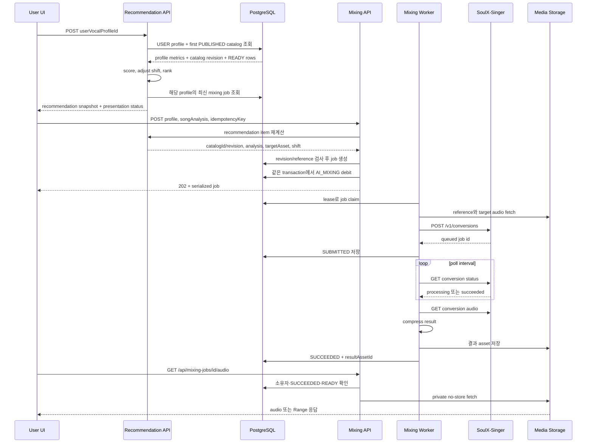
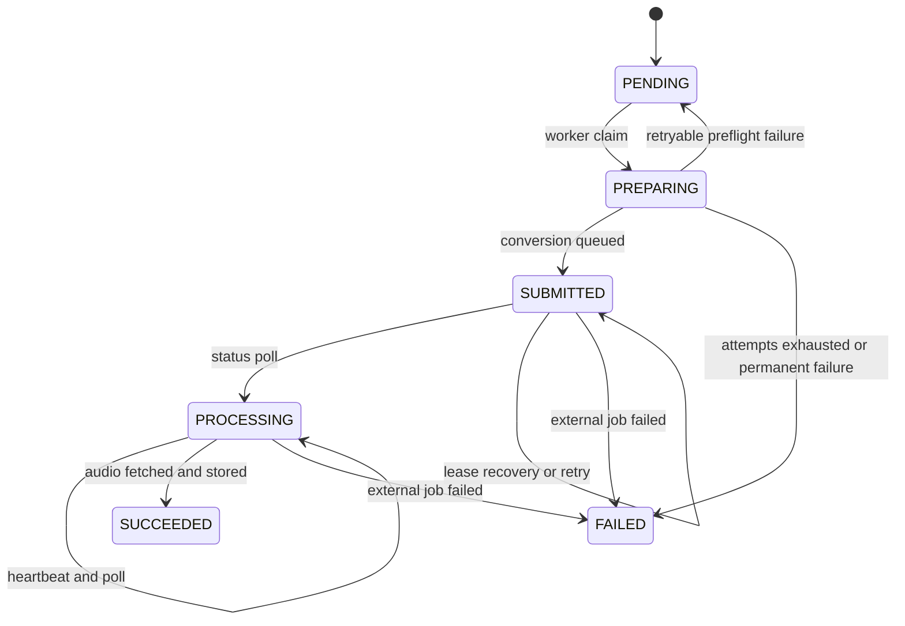

# 추천에서 AI 믹싱 결과까지

이 문서는 **저장된 사용자 보컬 프로필 → 추천 결과 → AI 믹싱 작업 → 결과 오디오 재생**의 현재 런타임 흐름을 설명한다. 추천은 별도 추천 행을 영구 저장하지 않고 요청 시 계산한다. 응답의 `catalogRevision`과 각 항목의 곡·분석 식별자가 믹싱 요청으로 전달되는 snapshot 역할을 하며, 믹싱 enqueue 단계에서 다시 검증한다.

보컬 분석이 프로필을 만드는 과정은 [보컬 분석 workflow](/openwiki/workflows/vocal-analysis.md), 도메인 객체의 의미는 [domain-data-model.md](/openwiki/concepts/domain-data-model.md), worker의 lease와 복구 모델은 [durable-workers.md](/openwiki/architecture/durable-workers.md), 외부 서비스 설정은 [external-services.md](/openwiki/integrations/external-services.md)에서 이어서 확인한다.

## 전체 control/data flow

이 다이어그램은 추천 계산과 믹싱 enqueue가 같은 요청의 내부 호출이 아니라는 점도 보여준다. UI가 추천 응답을 근거로 enqueue하고, enqueue는 현재 catalog를 다시 읽어 stale 결과를 거부한다.

## 1. 추천 snapshot 만들기

클라이언트는 인증 세션으로 `POST /api/recommendations`에 `userVocalProfileId`를 보낸다. `GET /api/recommendations/:id`도 같은 결과를 조회하는 상세 진입점이다. 두 route는 세션 사용자를 확인하고 `getRecommendationResult`를 호출한다. 잘못된 JSON·프로필은 400 또는 404/422 계열의 `RecommendationError`로, catalog 준비 실패는 재시도 가능한 503으로 응답한다. [recommendations-route.ts](repo://src/_app/api-routes/recommendations/recommendations-route.ts#L27-L49)

`getRecommendationResult`는 다음 순서로 데이터를 구성한다.

1. 요청한 프로필을 사용자 소유 범위에서 읽고, `sourceType: USER`인지와 MIDI 범위·음성 비율·pitch 안정성·clipping 비율 및 analyzer 정보를 검사한다.
2. 가장 이른 `PUBLISHED` catalog 하나를 `RepeatableRead` transaction에서 선택하고, 그 catalog의 published rows를 읽는다.
3. 각 row에서 active source, current analysis, target asset이 서로 같은 revision을 가리키고 모두 `READY`인지 확인한다. 분석 metric·analyzer identity·catalog position이 빠졌거나 중복되면 `CATALOG_NOT_READY`를 반환한다.
4. key-fit scoring을 적용하고 추천 key shift와 score를 계산해 rank 순서로 만든다. 결과에는 `catalogId`, `catalogRevision`, `scoringVersion`, profile confidence, 각 항목의 `songAnalysisId`, `targetAssetId`, `recommendedShift`, 점수·이유가 들어간다.
5. 로그인 사용자라면 같은 보컬 프로필과 분석에 대한 mixing job을 최신 생성 순으로 읽어, 각 항목에 가장 최근 job 하나를 연결한다.

추천 결과의 `calculatedAt`은 계산 시각이며 결과 snapshot을 저장했다는 뜻이 아니다. 같은 catalog revision에서 반복 호출한 결과는 동일한 catalog revision과 scoring version을 사용하지만, catalog revision이 증가하면 다음 호출은 새 revision을 반환한다. 이 동작은 [recommendation-persistence.integration.ts](repo://tests/recommendation-persistence.integration.ts#L8-L15)와 [recommendation-persistence.integration.ts](repo://tests/recommendation-persistence.integration.ts#L62-L90)에서 확인한다.

### 화면용 projection과 DB 상태 직렬화는 다르다

추천 화면은 `synthesis.status`를 다음처럼 축약한다.

| DB mixing job 상태 | 추천 항목 `synthesis.status` |
| --- | --- |
| job 없음 | `not_started` |
| `PENDING`, `PREPARING` | `preparing` |
| `SUBMITTED` | `queued` |
| `PROCESSING` | `processing` |
| `SUCCEEDED` | `succeeded` |
| `FAILED`, `CANCELED` | `failed` |

이 매핑은 추천 화면의 필터와 카드 표시를 위한 projection이다. 반면 mixing API의 `POST /api/mixing-jobs` 응답은 `serializeMixingJob`을 통해 DB enum을 소문자 public 상태로 직렬화한다(`pending`, `preparing`, `submitted`, `processing`, `succeeded`, `failed`, `canceled`). API 응답에는 `ticketCost`, ISO 날짜, `{ code, detail }` 형태의 error가 포함된다. 두 계약을 하나의 상태 enum으로 취급하면 polling UI 또는 오류 표시가 어긋난다. [recommendation-service.ts](repo://src/features/create-recommendation/api/recommendation-service.ts#L70-L81) · [contract.ts](repo://src/entities/mixing-job/model/contract.ts#L46-L57) · [contract.ts](repo://src/entities/mixing-job/model/contract.ts#L125-L145)

## 2. 추천 항목을 믹싱 job으로 전환하기

UI는 선택한 항목의 프로필 ID·`songAnalysisId`와 새 `idempotencyKey`를 `POST /api/mixing-jobs`에 보낸다. API는 인증, body schema, ticket 부족을 먼저 처리하고 성공 시 `202 Accepted`를 반환한다. [mixing-jobs-route.ts](repo://src/_app/api-routes/mixing-jobs/mixing-jobs-route.ts#L24-L67)

`enqueueMixingJob`은 핵심 invariant를 하나의 `Serializable` transaction으로 묶는다.

- 요청 키는 공백이 아니고 200자 이하여야 한다. `(userId, idempotencyKey)`가 이미 있으면 같은 profile/song 요청은 기존 job을 반환한다. 다른 요청에 사용된 키면 `IDEMPOTENCY_CONFLICT`다. 동시 생성의 write conflict는 재시도하고 unique conflict도 기존 row를 다시 읽는다.
- 먼저 추천을 다시 계산해 선택 항목의 `catalogId`, `catalogRevision`, position, analysis를 얻는다. 현재 곡이 `ACTIVE`이고 analysis가 current인지, catalog가 여전히 `PUBLISHED`이며 revision·position이 snapshot과 같은지, target asset이 같은 source의 `READY`인지 모두 확인한다. 하나라도 바뀌면 `MIXING_RECOMMENDATION_STALE`(409, retryable)이다.
- 사용자 소유의 `USER` 프로필에서 synthesis reference를 우선 선택하고, contract version에 맞는 저장 레퍼런스가 없으면 `MIXING_REFERENCE_UNAVAILABLE`(422)로 끝낸다. 이 경우 job과 debit을 만들지 않는다.
- 검증을 통과하면 job에 reference asset, target asset, catalog position/revision, scoring version, recommended shift, ticket cost, max attempts를 기록한다. 이어 같은 transaction에서 `AI_MIXING` `USAGE_DEBIT` ledger를 `mixing:debit:<jobId>` 키로 만든다. 비용이 0이면 ledger debit을 생략한다.

즉 `catalogRevision`은 단순 표시용 메타데이터가 아니라 추천과 실제 synthesis target의 결합을 보호하는 검증 값이다. 추천을 오래 열어 둔 뒤 catalog가 바뀌면 사용자는 새 추천을 다시 받아야 한다. enqueue의 검사와 idempotency는 [mixing-queue.ts](repo://src/features/create-mixing/api/mixing-queue.ts#L28-L43) 및 [mixing-queue.ts](repo://src/features/create-mixing/api/mixing-queue.ts#L66-L135)에 있다.

## 3. worker의 SoulX-Singer 처리와 polling

worker는 `claimNextMixingJob`에서 아직 시도 횟수가 남고 `nextAttemptAt`이 지난 job을 오래된 생성 순으로 고른다. PostgreSQL `FOR UPDATE SKIP LOCKED`로 한 worker만 row를 claim하고 lease owner, expiry, heartbeat, attempts를 갱신한다. 만료된 `PREPARING`·`SUBMITTED`·`PROCESSING` job은 다른 worker가 회수할 수 있다. lease를 갱신하지 못하면 처리를 중단한다.

claim한 job에 `modalJobId`가 없으면 worker는 다음을 수행한다.

1. 저장된 reference asset을 가져온다. synthesis reference가 선택됐다면 그 asset이 사용된다.
2. catalog target asset이 `READY`인지 확인하고 target audio를 가져온다.
3. `SYNTHESIS_PRESET`을 form에 넣고 `auto_pitch_shift=false`, `pitch_shift=job.recommendedShift`를 설정한다.
4. `MODAL_API_URL/v1/conversions`에 `X-API-Key`와 함께 `prompt_audio`, `target_audio`를 POST한다. 반환값은 `queued` 상태의 외부 job이어야 하며, 그 ID를 DB에 `SUBMITTED`로 기록한다.

이미 `modalJobId`가 있으면 재제출하지 않고 `GET /v1/conversions/:id`를 polling한다. `processing`이면 heartbeat 후 `pollIntervalMs`만큼 기다리고, `succeeded`이면 `/audio`를 받아 비어 있지 않은지 검사한다. 네트워크 및 HTTP 408·425·429·5xx는 stage별 retryable 조건에 따라 재시도 대상이 될 수 있다. 설정 누락, 빈 오디오, 외부 job 실패 같은 비재시도 오류는 실패로 확정한다. 핵심 구현은 [worker.ts](repo://src/_app/background-jobs/mixing/worker.ts#L257-L448)이다.

위 상태는 DB lifecycle의 중요한 전이만 표시한다. `SUBMITTED` 이후 실패는 외부 변환이 접수됐을 수 있으므로 자동 환불하지 않는다. 변환 서비스 접수 전 최종 실패만 `refundState: REQUIRED`로 표시하고 `ensureMixingRefund`가 `USAGE_REFUND`를 한 번 적용한다. refund idempotency key는 `mixing:refund:<jobId>`다. retryable 실패는 attempts가 남아 있으면 exponential backoff(최대 30초)로 pre-submit은 `PENDING`, post-submit은 `SUBMITTED`로 되돌린다. [worker.ts](repo://src/_app/background-jobs/mixing/worker.ts#L146-L255)

## 4. 결과 저장, polling 응답, 재생과 cleanup

외부 audio를 받으면 worker는 `compressMixingResult`로 최종 음원을 보정한 뒤 `storeMixingResult`로 media asset을 만든다. asset 저장 뒤 DB transaction이 job을 `SUCCEEDED`로 바꾸고 `resultAssetId`와 완료 시각을 기록하며 성공 notification을 생성한다. 이 transaction이 실패하면 방금 저장한 asset을 `discardMediaAsset`으로 버려 DB가 성공을 가리키지 않는 고아 asset을 남기지 않는다.

추천 응답은 성공하고 asset 상태가 `READY`일 때만 `/api/mixing-jobs/:id/audio`를 `audioUrl`로 노출한다. 상세 mixing API는 소유자 조건으로 job을 조회하며, history API는 페이지·검색어·상태 필터를 적용한다. 완료 오디오 route는 `SUCCEEDED` job과 `READY` result asset만 허용하고, 외부 URL을 `cache: no-store`로 가져온다. 요청에 `Range`가 있으면 upstream에 전달해 206 재생을 지원하고, `Content-Type`, 길이·범위·accept-ranges를 전달한다. 응답은 `private, no-store`다. [mixing-job-audio-route.ts](repo://src/_app/api-routes/mixing-jobs/mixing-job-audio-route.ts#L4-L36)

사용자가 mixing job을 삭제하면 API는 media cleanup이 보류됐는지 함께 반환한다. worker의 매 실행은 `refundState: REQUIRED`를 먼저 reconcile하고 `processOneMediaCleanup`을 실행한 뒤 새 job을 claim한다. 따라서 외부 media 삭제가 일시적으로 실패해도 cleanup queue가 다음 worker 실행에서 재처리할 수 있다. 성공 finalization 후 DB commit 실패 시의 즉시 discard도 같은 경계를 보호한다. [worker.ts](repo://src/_app/background-jobs/mixing/worker.ts#L405-L470)

## 실패와 운영 점검

- `CATALOG_NOT_READY`: published catalog, active revision, 분석 metric, target asset 중 하나가 준비되지 않은 상태다. catalog ingestion과 revision 일관성을 먼저 확인하고 요청을 재시도한다.
- `MIXING_RECOMMENDATION_STALE`: 추천을 계산한 뒤 catalog revision 또는 song analysis/target이 변경됐다. 이전 항목을 강제로 enqueue하지 말고 추천 API를 다시 호출한다.
- `MIXING_REFERENCE_UNAVAILABLE`: 프로필 소유권·asset kind·`READY` 상태 또는 synthesis reference 품질을 확인한다. ticket은 차감되지 않는다.
- `INSUFFICIENT_TICKETS`(402): enqueue transaction이 debit을 만들 수 없다. 사용자 잔액을 보충한 뒤 새 idempotency key로 재시도한다.
- 접수 전 permanent failure: job은 `FAILED`가 되고 refund reconciliation 대상이 된다. 접수 후 실패: `FAILED`지만 자동 환불하지 않는다.
- 결과 404: job이 사용자 소유가 아니거나 아직 `SUCCEEDED`/asset `READY`가 아니다. 결과 502: 외부 media URL을 현재 읽을 수 없는 상태다.

집중 테스트는 [mixing-queue.integration.ts](repo://tests/mixing-queue.integration.ts#L7-L40)에서 enqueue·동시 idempotency·lease 경쟁·reference 실패·ticket debit/refund 경계를 검증하고, [mixing-queue.integration.ts](repo://tests/mixing-queue.integration.ts#L172-L260)에서 retry/backoff와 접수 전 환불을 검증한다. 외부 변환이 이미 접수된 뒤의 실패와 환불 없음은 [mixing-queue.integration.ts](repo://tests/mixing-queue.integration.ts#L291-L340), reference 선택 계약은 [mixing-reference.test.ts](repo://tests/mixing-reference.test.ts), scoring 순서와 tie-break는 [recommendation-ranking.test.ts](repo://tests/recommendation-ranking.test.ts)에서 확인한다.
