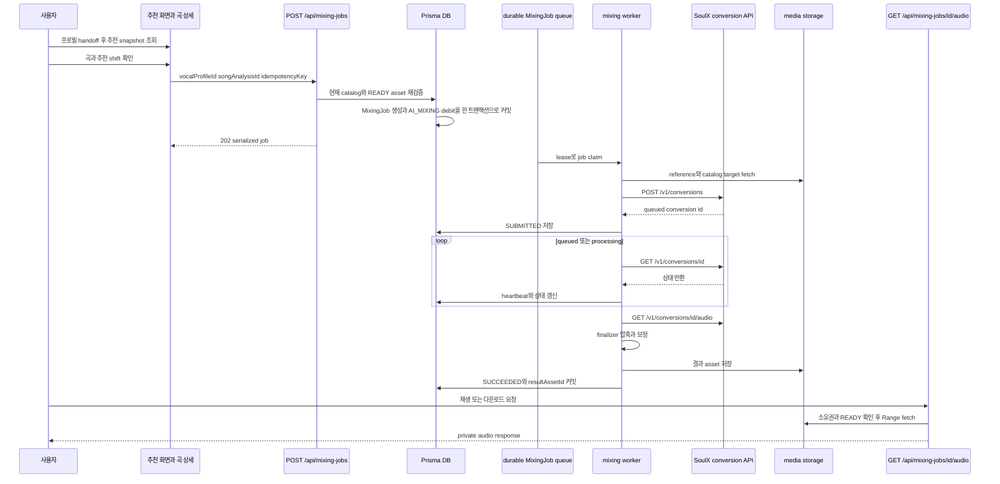

# 추천 선택에서 AI 믹싱 결과까지

이 페이지는 보컬 프로필 분석 완료 handoff 이후의 한 작업을 설명한다. 사용자는 추천 결과에서 곡을 고르고, 곡 상세에서 **원키와 추천 shift를 비교**한 뒤 AI 믹싱을 시작한다. 실제 믹싱 요청은 화면의 점수나 키를 그대로 믿지 않고 서버가 현재 추천과 catalog를 다시 검증한다.

추천 계산과 보컬 분석의 의미는 [보컬 분석과 추천](../concepts/vocal-analysis-and-recommendations.md), 외부 서비스 경계는 [외부 서비스](../integrations/external-services.md), worker 운영은 [작업 처리](../operations/job-processing.md), 티켓 원장은 [계정과 티켓](./account-and-tickets.md)에서 이어서 확인한다.

## 한눈에 보는 cross-system sequence

*그림은 추천 완료부터 ticket mutation, durable queue, SoulX/finalizer, terminal result와 사용자 재생까지의 호출 순서를 보여준다.*

## 1. 추천 완료 handoff: snapshot은 선택 근거다

`getRecommendationResult`는 로그인한 `USER` 프로필의 분석 지표를 확인하고, `PUBLISHED` catalog를 `RepeatableRead` 트랜잭션에서 읽어 순위를 계산한다. 각 item에는 `songAnalysisId`, catalog 순서, `catalogRevision`, `targetAssetId`, `scoringVersion`, `recommendedShift`가 포함된다. 추천 화면은 이 응답을 `recommendationDetailQueryOptions`로 보관하며, 현재 선택한 item은 목록의 `id`로 곡 상세 `/recommendations/<id>/songs/<itemId>`에 전달된다.

추천 키를 다음처럼 구분한다.

| 값 | 의미 | 사용 위치 |
| --- | --- | --- |
| 원키 | 곡 metadata의 `originalKey` | 곡 상세의 원키 배지와 원키 적합도 비교 |
| 추천 shift | 음역 적합도 계산이 제안한 반음 이동량 `recommendedShift` | 추천 키 표시, job snapshot, SoulX의 `pitch_shift` |
| 사용자가 선택한 곡 | `songAnalysisId`로 식별한 catalog item | `POST /api/mixing-jobs` 입력 |
| profile의 mid-only reference | profile의 `SYNTHESIS_REFERENCE` asset 또는 원본 `REFERENCE` asset | SoulX `prompt_audio` 입력 |

현재 UI에는 임의의 키 입력 컨트롤이 없다. 사용자가 곡을 선택한다는 것은 추천 item을 선택하는 것이며, 믹싱 worker는 생성된 job의 `recommendedShift`를 사용한다. 즉 원키, 추천 shift, profile reference를 서로 바꾸어 해석하면 안 된다. `recommendedShift`는 pitch 변환 파라미터이고 vocal balance나 final audio 품질 점수가 아니다.

곡 상세는 원본 영상, 원키, 추천 shift, 원키 적합도·shift 적용 적합도, 사용자와 곡의 주요 음역을 함께 보여준다. `profile.mixing.available`이 false이면 reference contract 또는 READY asset이 부족하므로 시작 버튼 대신 프로필 재분석 안내를 표시한다.

## 2. 시작 버튼은 API mutation을 만든다

`RecommendationMixingAction`의 확인 대화상자를 통과해야 `useRecommendationMixing.startMixing`이 실행된다. 클라이언트는 `crypto.randomUUID()`로 `idempotencyKey`를 만들고 `vocalProfileId`, `songAnalysisId`를 `POST /api/mixing-jobs`에 보낸다. `catalogRevision`과 `scoringVersion`은 클라이언트 타입에도 있지만, enqueue 서버는 추천 서비스를 다시 호출해 얻은 값을 기준으로 검증한다.

`app/api/mixing-jobs/route.ts`는 세션을 요구한다. 요청이 유효하면 `enqueueMixingJob`을 호출하고 `serializeMixingJob` 결과를 HTTP `202`로 반환한다. 응답 계약은 DB enum을 소문자 public status로 바꾸고, `Date`를 ISO 문자열로 직렬화한다. `ticketCost`, `error`, `createdAt`, `updatedAt`, `completedAt`도 이 계약에 포함된다.

## 3. enqueue가 snapshot과 ticket mutation을 원자적으로 만든다

`enqueueMixingJob`은 `Serializable` Prisma transaction 안에서 다음을 수행한다.

1. `(userId, idempotencyKey)`로 기존 job을 조회한다. 같은 프로필·분석이면 기존 job을 반환하고, 다른 요청에 재사용하면 `IDEMPOTENCY_CONFLICT`(409)다.
2. 사용자 소유의 `USER` profile과 `READY` 분석을 읽는다.
3. 현재 게시 catalog의 revision·position, 곡의 `ACTIVE` 상태와 current analysis, target asset의 ID·source·`READY` 상태를 추천 결과와 대조한다.
4. profile reference를 선택한다. `SYNTHESIS_REFERENCE`가 우선이고, 없으면 같은 소유자의 `REFERENCE` asset을 사용한다. 둘 다 없으면 `MIXING_REFERENCE_UNAVAILABLE`(422)이며 job과 차감은 생기지 않는다.
5. job에 reference/target ID, catalog position·revision, scoring version, `recommendedShift`, ticket cost, 최대 시도 횟수를 snapshot으로 저장한다.
6. 비용이 양수이면 `AI_MIXING` wallet에 `USAGE_DEBIT`를 `-cost`로 기록한다. ledger idempotency key는 `mixing:debit:<job id>`다.

추천 결과가 오래됐으면 `MIXING_RECOMMENDATION_STALE`(409)다. 서버는 오래된 item을 현재 곡으로 대체하지 않는다. 잔액이 부족하면 `INSUFFICIENT_TICKETS`(402)이며 job 생성 전이므로 wallet과 ledger가 바뀌지 않는다. Serializable write conflict는 최대 세 번 재시도하고 unique 충돌에서도 동일 key의 job을 반환한다.

> **불변식:** 한 사용자와 idempotency key 조합에는 한 job만 존재하며 debit ledger도 중복되지 않는다. 외부 변환 서비스에 접수되기 전 최종 실패만 자동 환불 대상이다.

## 4. durable queue와 SoulX worker

DB의 `MixingJob`은 `PENDING → PREPARING → SUBMITTED → PROCESSING → SUCCEEDED` 또는 `FAILED`/`CANCELED` lifecycle을 가진다. `claimNextMixingJob`은 `FOR UPDATE SKIP LOCKED`로 한 worker만 claim하고 `leaseOwner`, 만료 시각, heartbeat, attempts를 기록한다. lease가 만료된 준비·접수·처리 job은 다른 worker가 회수할 수 있다.

`modalJobId`가 없을 때만 worker가 제출한다. 저장된 reference URL을 `prompt_audio`, catalog target을 `target_audio`로 보내고 `SYNTHESIS_PRESET`을 적용한다. `auto_pitch_shift`는 `false`이며 job snapshot의 `recommendedShift`를 `pitch_shift`로 보낸다. SoulX가 `queued` 상태와 ID를 돌려줘야 `modalJobId`와 `submittedAt`을 저장하고 `SUBMITTED`로 전환한다. lease 회수 뒤 `modalJobId`가 이미 있으면 새 변환을 만들지 않고 기존 SoulX job을 polling한다.

Polling은 `GET /v1/conversions/<modalJobId>`로 수행한다. `queued`와 `processing` 동안 heartbeat를 갱신한다. `succeeded`가 되면 `/audio`에서 결과를 받고, `failed`는 worker 실패로 기록한다. fetch와 polling에는 timeout이 있고 네트워크 및 408·425·429·5xx는 단계별 retry 정책을 따른다. 제출 POST는 429만 retryable이다.

- 접수 전 retryable 실패: backoff 후 `PENDING`으로 되돌린다.
- 접수 후 retryable 실패: `SUBMITTED`로 남겨 같은 SoulX ID를 다시 조회한다.
- 최대 attempts 도달 또는 비재시도 실패: `FAILED`로 terminal 처리한다.
- 접수 전 terminal 실패: `refundState = REQUIRED`를 거쳐 `USAGE_REFUND`를 한 번 기록한다.
- 접수 후 실패: 자동 환불하지 않고 `refundState = NONE`으로 둔다.

worker run은 먼저 `REQUIRED` 환불을 reconcile하고 media cleanup을 처리한 뒤 job을 claim한다. 따라서 worker 중단은 메모리 큐의 유실이 아니라 lease 만료 후 재처리 경계로 다뤄진다.

## 5. finalizer와 terminal result

SoulX audio를 받으면 `compressMixingResult`가 최종 audio의 압축·MIME·확장자를 정한다. 그 다음 `storeMixingResult`가 media storage에 `MIX_RESULT` asset을 만들고, DB transaction이 `resultAssetId`, `SUCCEEDED`, 완료 시각과 `MIXING_SUCCEEDED` notification을 함께 커밋한다. 이 transaction이 실패하면 새 asset을 폐기해 고아 결과를 남기지 않는다. 실패 notification도 job별 dedupe key를 사용한다.

`GET /api/mixing-jobs/[id]/audio`는 세션 사용자가 소유한 `SUCCEEDED` job과 `resultAsset.status === READY` 결과만 허용한다. 결과가 없거나 아직 READY가 아니면 404, storage upstream 실패는 502다. 요청의 `Range`를 upstream에 전달하고 `Content-Range`, `Accept-Ranges` 등을 보존하므로 브라우저 재생과 부분 다운로드를 지원한다. 응답은 `Content-Disposition: inline`, `Cache-Control: private, no-store`를 사용한다.

상세 화면의 public status는 `pending`, `preparing`, `submitted`, `processing`, `succeeded`, `failed`, `canceled`를 구분하고, `presentMixingJob`은 이 값과 `submittedAt`·`startedAt`·`resultReady`로 실제 timeline을 만든다. 임의의 진행률을 표시하지 않는다. 결과가 READY일 때만 audio URL을 노출한다.

## 6. 화면·API·DB 상태 동기화

추천 응답의 `synthesis.status`는 화면용 축약 상태다. DB의 `PENDING`/`PREPARING`은 `preparing`, `SUBMITTED`는 `queued`, `PROCESSING`은 `processing`, `SUCCEEDED`는 `succeeded`, `FAILED`와 `CANCELED`는 `failed`로 매핑된다. 반대로 mixing job API는 `submitted`를 별도 public 상태로 직렬화한다. 따라서 추천 화면의 `queued`와 API의 `submitted`를 같은 문자열이라고 가정하지 않는다.

mutation의 동기화 순서는 다음과 같다.

1. `onMutate`가 recommendation query의 해당 item을 낙관적으로 `preparing`으로 바꾼다.
2. 성공하면 recommendation profile query와 mixing history query를 invalidate한다.
3. API가 반환한 job ID로 `/library/mixes/<jobId>`로 이동한다.
4. 실패하면 recommendation cache에 구조화된 error와 `retryable`을 기록해 재시도 버튼을 결정한다.

추천 filter는 recommendation route의 URL query에 저장되며 `replaceState`와 custom event로 같은 화면의 컴포넌트를 동기화한다. 새 route나 query cache key를 추가할 때는 이 URL 상태, `recommendationKeys`, mixing history invalidation을 함께 확인해야 한다.

## 변경 시 집중해서 볼 테스트

- `tests/recommendation-synthesis.test.ts`: recommendation 응답의 synthesis 상태, job 연결, READY 결과의 `audioUrl`과 profile mixing capability를 확인한다.
- `tests/mixing-detail-ui.test.tsx`: owner-scoped 상세 route, 실제 timeline, terminal action과 임의 진행률 미표시를 확인한다.
- `tests/mixing-queue.integration.ts`: 동시 enqueue idempotency, Serializable 경쟁, lease 회수, preflight·접수 전 환불, retry backoff와 접수 후 경계를 DB로 검증한다.
- `tests/admin-custom-mixing.integration.ts`: 관리자 custom mixing 경로가 사용자 추천 enqueue와 섞이지 않으면서 동일한 job/티켓 경계를 지키는지 확인할 때 사용한다.
- `tests/compress-mixing-result.test.ts`: finalizer의 압축·MIME·확장자 계약을 확인한다.

외부 입력 계약을 바꾸면 `createMixingRequestSchema`, `serializeMixingJob`, worker의 제출·polling·finalizer, audio route의 owner/READY 검증을 한 변경으로 다룬다. 특히 추천 키를 수정할 때는 추천 계산의 shift와 job snapshot의 `pitch_shift`만 바꾸고, profile reference와 final audio 변환의 책임을 혼동하지 않는다.
