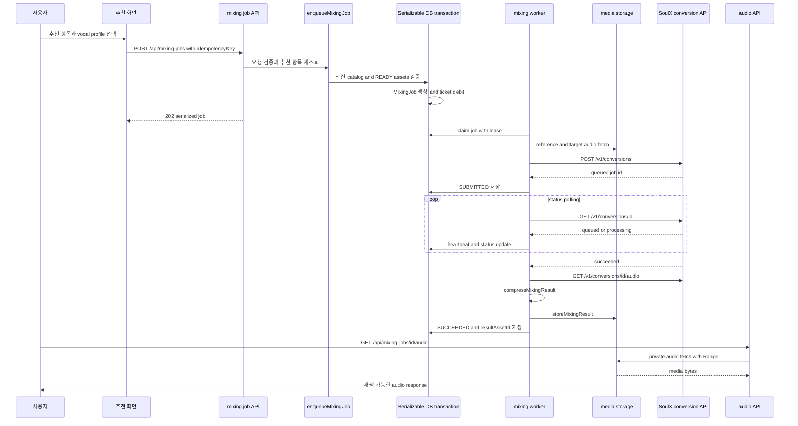

# 추천에서 AI 믹싱 결과까지

이 문서는 추천 화면에서 곡을 선택한 사용자가 AI 믹싱 결과를 듣기까지의 현재 구현을 설명한다. 추천 결과는 화면에 표시된 순간부터 고정된 주문서가 아니다. `POST /api/mixing-jobs`가 추천을 다시 계산하고 현재 카탈로그를 검증하므로, 카탈로그가 바뀌면 티켓을 차감하지 않고 요청을 거절한다.

추천 계산의 입력과 점수 체계는 [카탈로그와 추천](../concepts/catalog-and-recommendations.md), 보컬 분석 결과는 [보컬 분석과 추천](../concepts/vocal-analysis-and-recommendations.md)을 참고한다. 외부 변환 서비스의 운영 경계는 [외부 서비스](../integrations/external-services.md), 워커 운영은 [작업 처리](../operations/job-processing.md), 티켓 원장은 [계정과 티켓](./account-and-tickets.md)에서 이어서 확인할 수 있다.

## 전체 흐름

*그림은 요청 접수부터 SoulX 외부 job, 결과 media 저장, 사용자 재생까지의 호출 순서를 보여준다.*

## 1. 추천 항목을 다시 확인한다

추천 서비스 `getRecommendationResult`는 로그인한 프로필을 소유권과 함께 읽고 `sourceType === "USER"` 및 분석 지표의 유효성을 확인한다. 게시된 카탈로그를 `RepeatableRead` 트랜잭션에서 읽어 점수를 계산하고, 각 항목에 카탈로그 순서·revision·`songAnalysisId`·`targetAssetId`·`recommendedShift`를 포함한다. `getRecommendationItem`은 그 결과에서 요청한 분석 ID를 찾아 믹싱 요청의 근거로 반환한다.

따라서 믹싱 enqueue는 클라이언트가 보낸 점수나 shift를 신뢰하지 않는다. 다음 조건을 하나라도 만족하지 않으면 `MIXING_RECOMMENDATION_STALE`(409)를 반환한다.

- 곡의 `lifecycleStatus`가 `ACTIVE`이고 분석 ID가 곡의 `currentAnalysisId`여야 한다.
- 추천의 `catalogId`, `catalogRevision`, 카탈로그 순서가 현재 게시된 catalog entry와 일치해야 한다.
- 추천의 target asset ID가 곡의 target asset과 같고, target asset의 `sourceId`가 분석의 source와 같아야 한다.
- catalog와 target asset 모두 현재 게시 상태이며 target asset은 `READY`여야 한다.

이 검증은 티켓 차감과 같은 트랜잭션 안에서 수행되므로, 오래된 추천을 최신 곡으로 바꾸어 처리하지 않는다. 사용자는 최신 추천 결과를 다시 조회한 뒤 재시도해야 한다.

## 2. reference와 target을 선택한다

믹싱 job은 `referenceAssetId`와 `targetAssetId`를 생성 시점에 스냅샷처럼 저장한다. reference 선택 우선순위는 다음과 같다.

1. 같은 사용자 소유이고 `kind === "SYNTHESIS_REFERENCE"`, `status === "READY"`인 smart reference
2. 같은 사용자 소유이고 `kind === "REFERENCE"`, `status === "READY"`인 원본 recording asset

둘 다 없으면 `MIXING_REFERENCE_UNAVAILABLE`(422)로 끝나며 job을 만들지 않는다. target은 추천 항목에 연결된 catalog target이어야 하며 enqueue 검증과 워커 preflight 모두 `READY` 조건을 확인한다. 즉, 화면에서 믹싱 가능으로 보였더라도 실제 파일이 준비되지 않았다면 외부 서비스에 제출하지 않는다.

## 3. idempotent enqueue와 티켓 차감

진입점은 `app/api/mixing-jobs/route.ts`의 `POST`이며 세션을 요구한다. 요청 본문은 `vocalProfileId`, `songAnalysisId`, `idempotencyKey`를 포함해야 하고 키는 공백이 아니며 200자를 넘지 않아야 한다. 성공 응답은 HTTP `202`이고 `serializeMixingJob`이 공개 job 상태와 ISO 시각만 반환한다.

`enqueueMixingJob`은 다음 작업을 하나의 `Serializable` Prisma 트랜잭션으로 묶는다.

1. 사용자·프로필·분석·현재 카탈로그·READY asset을 검증한다.
2. `(userId, idempotencyKey)`로 기존 job을 조회한다. 같은 키가 같은 프로필·분석에 이미 쓰였다면 기존 job을 그대로 반환한다. 다른 요청에 재사용하면 `IDEMPOTENCY_CONFLICT`(409)다.
3. job을 생성하고 당시의 reference, target, 카탈로그 revision, scoring version, 추천 shift, 티켓 비용, 최대 시도 횟수를 기록한다.
4. 비용이 0보다 크면 `AI_MIXING` 원장의 `USAGE_DEBIT`를 `-cost`로 기록한다. 원장 키는 `mixing:debit:<job id>`다.

동시 요청에서 Serializable write conflict는 최대 3회 재시도한다. unique 충돌이 나도 이미 생성된 동일한 idempotency key의 job을 돌려주므로 중복 job이나 중복 차감이 생기지 않는다. 잔액이 부족하면 `INSUFFICIENT_TICKETS`(402)이고, job 생성 전에 실패하므로 잔액과 원장은 변하지 않는다.

> **불변식:** 한 idempotency key에는 한 job만 존재하고, 한 job의 debit ledger entry는 최대 하나다. 접수 전 실패한 job은 비용을 최종적으로 사용자에게 돌려주며, 외부 변환 서비스에 접수된 뒤의 실패에는 자동 환불하지 않는다.

## 4. 워커가 SoulX job을 제출하고 polling한다

`runMixingWorkerOnce`는 먼저 `REQUIRED` 환불을 보정하고 media cleanup을 처리한 뒤 다음 job을 claim한다. `claimNextMixingJob`은 `FOR UPDATE SKIP LOCKED`로 경쟁 워커 중 하나만 선택하고 lease owner·만료 시각·heartbeat·시도 횟수를 갱신한다. 만료된 `PREPARING`, `SUBMITTED`, `PROCESSING` lease는 회수할 수 있다.

아직 `modalJobId`가 없으면 워커는 저장된 reference URL과 target URL을 각각 가져온다. target이 `READY`가 아니거나 파일이 비어 있으면 preflight 실패다. 이후 `MODAL_API_URL`과 `MODAL_API_KEY`가 필요하며, `POST ${MODAL_API_URL}/v1/conversions`에 다음을 보낸다.

- reference는 `prompt_audio`로 보낸다.
- catalog target은 `target_audio`로 보낸다.
- `SYNTHESIS_PRESET`을 적용한다.
- `auto_pitch_shift`는 `false`, `pitch_shift`는 job에 저장된 `recommendedShift`다.

SoulX가 `status === "queued"`와 job ID를 반환해야만 `modalJobId`와 `submittedAt`을 저장하고 job을 `SUBMITTED`로 바꾼다. 응답이 잘못되면 `MODAL_SUBMIT_INVALID_RESPONSE`다. 그 뒤 `GET /v1/conversions/<modalJobId>`를 polling한다. `queued`/`processing` 중에는 lease heartbeat를 갱신하고, `succeeded`가 되면 audio endpoint에서 결과를 가져온다. 외부 상태 조회와 결과 다운로드에는 timeout과 HTTP/network 재시도 판정이 적용된다.

외부 접수 전의 retryable 실패는 job을 `PENDING`으로 되돌리고 backoff 후 재시도한다. 접수 후 retryable 실패는 `SUBMITTED`로 남겨 같은 SoulX job을 다시 조회한다. 최대 시도 횟수에 도달하거나 비재시도 실패면 `FAILED`가 된다. 접수 전 최종 실패는 `refundState = REQUIRED`로 표시한 다음 환불하고, 접수 후 실패는 `refundState = NONE`으로 둔다.

## 5. 결과 media를 저장하고 재생한다

성공한 외부 audio는 `compressMixingResult`로 보정·압축한 뒤 `storeMixingResult`로 media storage에 저장한다. 저장된 asset ID를 `MixingJob.resultAssetId`에 연결하고 job을 `SUCCEEDED`로 바꾸는 DB 트랜잭션을 알림(`MIXING_SUCCEEDED`)과 함께 커밋한다. 이 커밋이 실패하면 새 media asset을 폐기하여 고아 결과를 남기지 않는다. 실패 알림도 dedupe key로 한 번만 만든다.

`GET /api/mixing-jobs/[id]/audio`는 세션 사용자 소유의 `SUCCEEDED` job과 `resultAsset.status === "READY"`인 결과만 허용한다. 결과가 없거나 준비되지 않았으면 404다. storage 응답이 실패하면 502다. 요청의 `Range` 헤더를 upstream에 전달하고 `Content-Range`, `Accept-Ranges` 등을 보존하므로 부분 재생을 지원한다. 응답은 `Content-Disposition: inline`과 `Cache-Control: private, no-store`를 사용한다.

## 화면 상태와 API 상태는 다르다

추천 화면의 `synthesis.status`는 사용자 경험을 위한 축약 상태다. job이 없으면 `not_started`, 내부 `PENDING`/`PREPARING`은 `preparing`, `SUBMITTED`는 `queued`, 나머지는 `processing`·`succeeded`·`failed`로 매핑된다. 결과 asset이 READY일 때만 `audioUrl`을 `/api/mixing-jobs/<id>/audio`로 채운다.

반면 mixing job API의 `serializeMixingJob`은 `pending`, `preparing`, `submitted`, `processing`, `succeeded`, `failed`, `canceled`를 구분하고 `ticketCost`, 구조화된 error, 생성·갱신·완료 시각을 직렬화한다. 상세/이력 화면은 이 상태를 바탕으로 `presentMixingJob`의 타임라인과 설명을 표시한다. 따라서 추천 화면의 `queued`를 API의 `submitted`와 같은 문자열이라고 가정하거나, 추천 화면의 축약 상태만으로 운영 상태를 판단하면 안 된다.

## 실패·환불 운영 규칙

- `MODAL_NOT_CONFIGURED`, 잘못된 제출 응답, 비재시도 외부 실패는 자동 재시도 대상이 아니다.
- reference/target fetch, polling, 결과 fetch처럼 일시적일 수 있는 네트워크 또는 408·425·429·5xx 응답은 설정된 최대 시도 전 재시도할 수 있다. 제출 POST는 429만 retryable로 판정한다.
- 워커가 중단되어 lease가 만료되면 다른 워커가 job을 claim한다. `modalJobId`가 저장된 job은 다시 제출하지 않고 기존 외부 job을 polling한다.
- 최종 실패 시 `ensureMixingRefund`는 `refundState === "REQUIRED"`인 job에 `USAGE_REFUND`를 한 번 기록하고 `REFUNDED`로 바꾼다. 환불 원장 키는 `mixing:refund:<job id>`다. `reconcileRequiredRefunds`가 다음 worker run에서도 미완료 환불을 회수한다.

## 변경 시 확인할 테스트

- `tests/mixing-reference.test.ts`: smart reference 우선순위, 소유자·kind·READY 검증, contract capability 조건을 확인한다.
- `tests/mixing-queue.integration.ts`: 동시 enqueue idempotency, Serializable 경쟁, lease 회수, preflight/제출 전 환불, retry backoff와 접수 후 경계를 데이터베이스로 검증한다.
- `tests/mixing-status-presentation.test.ts`: 추천 축약 상태와 상세 타임라인·실패 문구의 표시 규칙을 검증한다.
- `tests/compress-mixing-result.test.ts`: 외부 결과의 압축·MIME·확장자 계약을 검증한다.

큐 입력이나 상태를 추가할 때는 enqueue의 스냅샷 검증, 원장 idempotency key, `submitted` 경계를 함께 갱신해야 한다. 외부 API 계약을 바꿀 때는 환경 변수와 timeout·retry 판정뿐 아니라 결과 저장 트랜잭션과 audio route의 READY 검증도 함께 확인한다.
