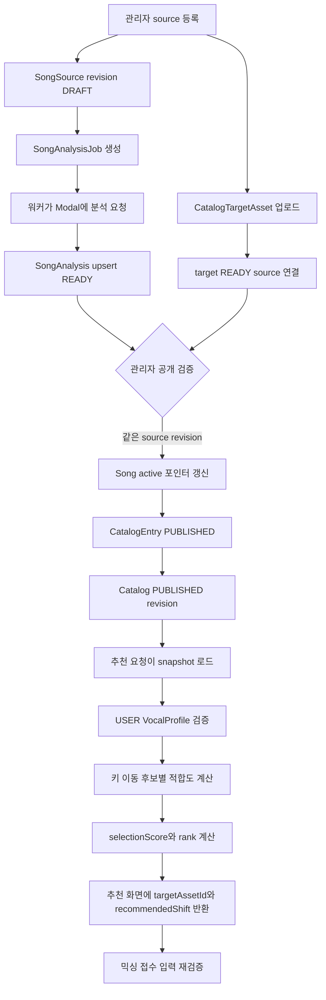

이 페이지의 질문은 **“카탈로그 source·분석 revision이 어떻게 추천과 믹싱 가능한 target을 만들까요?”**예요. 핵심 결론은 source, target asset, 분석 결과, 공개 상태가 각각 따로 저장되고, 관리자가 검증된 같은 revision을 활성 포인터로 묶어 공개해야 추천 입력이 된다는 점이에요. 추천 요청은 공개 카탈로그를 일관된 snapshot으로 읽고 `USER` VocalProfile과 곡 분석을 비교해 추천 반음 이동을 계산해요. 응답은 그 `targetAssetId`와 추천 이동량을 함께 제공하므로 믹싱 접수의 입력이 돼요.

변경을 추적할 때는 [관리자 카탈로그 서비스의 생성·공개 경계](repo://src/features/manage-song-catalog/api/admin-service.ts#L73-L180)와 [추천 결과 조립 코드](repo://src/features/create-recommendation/api/recommendation-service.ts#L84-L236)를 먼저 읽으세요. 다음 단계에서 추천을 믹싱으로 넘기는 조건은 [믹싱과 복구](mixing-and-recovery.md)에서 확인하세요.

## 전체 데이터 흐름

이 흐름에서 `sourceVideoId`는 source와 target을 연결하는 식별자예요. `SongSource`는 곡의 출처 이력을, `CatalogTargetAsset`은 재생·믹싱에 사용할 저장 파일을, `SongAnalysis`는 특정 source와 pipeline contract에 속한 분석 결과를 소유해요. [`schema.prisma`](repo://prisma/schema.prisma#L188-L283)의 `activeSourceId`, `currentAnalysisId`, `targetAssetId`는 현재 공개할 조합을 가리키는 포인터이지 revision 이력 자체가 아니에요.

## 관리자가 revision을 준비하고 공개해요

새 곡을 만들 때 `createAdminSong`은 `Song`을 `DRAFT`로 만들고 `revision: 1`인 `SongSource`, `DRAFT` `CatalogEntry`, `SongAnalysisJob`을 한 트랜잭션에서 생성해요. 같은 `idempotencyKey`로 동일한 입력이 다시 들어오면 기존 곡을 돌려줘요. source video나 곡 제목·아티스트가 다르면 `409` 충돌이에요.

기존 곡의 `replaceAdminSongSource`는 가장 큰 revision보다 1 큰 새 `SongSource`와 분석 job을 만들어요. 이 단계에서는 새 source를 `activeSourceId`로 지정하지 않아요. 따라서 새 파일을 등록했다고 기존 추천이 즉시 다른 source를 가리키지는 않아요. 큐 수용량 확인이 트랜잭션 안에서 함께 실행되므로, 분석 job을 만들 수 없는 상태에서는 등록이 완료되지 않아요.

target asset은 활성 source가 `READY`인지와 카탈로그 position을 확인한 뒤 staging 파일을 검증하고 업로드해요. 허용 확장자는 `wav`, `mp3`, `m4a`, `aac`, `webm`, `flac`이고 파일은 49,000,000바이트를 넘을 수 없어요. 업로드할 때 SHA-256, MIME type, `sourceVideoId`, `sourceId`를 `CatalogTargetAsset`에 저장하고 `Song.targetAssetId`를 연결해요. 같은 digest와 같은 source 연결의 `READY` asset이면 업로드를 건너뛰므로 반복 import가 중복 파일을 만들지 않아요. 이 동작은 [target asset import 통합 테스트](repo://tests/catalog-target-assets.integration.ts#L10-L92)에서 확인하세요.

공개는 `publishAdminSongSource(songId, sourceId)`가 담당해요. 다음 조건을 모두 확인하세요.

- 요청한 source가 해당 곡에 속해야 해요.
- 해당 source의 `SONG_ANALYSIS_PIPELINE_CONTRACT` 분석이 `READY`이고 `cleanupConfirmed`가 `true`여야 해요.
- 같은 source의 `READY` target이 있고, target의 `sourceVideoId`가 source와 같아야 해요.
- 해당 곡의 `CatalogEntry`가 있어야 해요.

검증을 통과하면 다른 source의 `READY` 상태를 `SUPERSEDED`로 바꾸고, 선택한 source를 `READY`로 저장해요. 이어서 `lifecycleStatus: ACTIVE`, `activeSourceId`, `currentAnalysisId`, `targetAssetId`, `originalKey`를 한 번에 갱신하고 항목을 `PUBLISHED`로 만들어요. 이전 공개 조합과 달라진 경우에만 `Catalog.revision`을 증가시켜요. 이전 target이 새 target으로 대체되면 참조되지 않는 asset 정리도 시도해요. 분석이나 target이 준비되지 않으면 공개를 완료하지 말고 각각 `ANALYSIS_NOT_READY` 또는 `TARGET_NOT_READY`를 확인하세요.

## 워커가 source별 분석을 저장해요

`claimNextSongAnalysisJob`은 처리 시각이 된 `PENDING` job 또는 lease가 만료된 `PROCESSING` job을 생성 시각 순으로 찾고 `FOR UPDATE SKIP LOCKED`로 다른 워커가 잠근 행을 건너뛰어요. claim 때 `status: PROCESSING`, `leaseOwner`, lease 만료 시각, `heartbeatAt`, `startedAt`, `attempts`를 저장해요. 처리 함수는 lease를 시작하고 heartbeat를 유지하며 lease를 잃은 뒤 결과를 덮어쓰지 않도록 저장 시점에도 job을 fence해요.

워커는 `READY`인 target을 내려받아 `requestId`, source의 `sourceVideoId`, 파일 정보와 함께 Modal의 분석 제출 API로 보내요. 제출 뒤 외부 job ID를 `SongAnalysisJob`과 `ExternalJobReconciliation`에 기록하고, Modal 상태가 `PROCESSING`이면 poll interval마다 다시 조회해요. 외부 분석이 실패하면 분석 오류와 job 오류를 저장하고, retryable이며 `maxAttempts` 안이면 지연 후 `PENDING`으로 돌려요. 최종 실패는 `FAILED`로 저장하고 외부 작업 reconciliation도 남겨요.

성공하면 워커는 source와 `SONG_ANALYSIS_PIPELINE_CONTRACT`의 조합으로 `SongAnalysis`를 upsert해요. 음역 통계, `voicedRatio`, `pitchStability`, `clippingRatio`, `estimatedKey`, analyzer 식별자와 버전을 저장하고 `status: READY`, `cleanupConfirmed: true`로 기록해요. 이후 job에 분석 ID를 연결하고 `SUCCEEDED`로 종료해요. `cleanupConfirmed`가 실제 파일 삭제 절차를 이 페이지의 코드만으로 상세히 증명하는 필드는 아니므로, 공개 조건에서 요구하는 저장된 확인값으로 이해하세요. 워커의 lease·Modal·성공 저장 순서는 [song-analysis worker](repo://src/_app/background-jobs/song-analysis/worker.ts#L129-L325)에서 확인하세요.

## 공개 상태와 추천 화면 상태를 분리해요

DB의 대문자 상태는 수명 주기와 운영 판단에 사용해요. 예를 들면 `SongAnalysisJob`은 `PENDING`, `PROCESSING`, `SUCCEEDED`, `FAILED`를 저장하고, `CatalogEntry`와 `Catalog`는 각각 `PUBLISHED` 상태를 저장해요. 반면 추천 응답의 `synthesis.status`는 믹싱 job의 내부 상태를 화면용 값으로 축약해요. `PENDING`·`PREPARING`은 `preparing`, `SUBMITTED`는 `queued`, `PROCESSING`은 `processing`, `SUCCEEDED`는 `succeeded`, `FAILED`·`CANCELED`는 `failed`가 돼요. 값이 없으면 `not_started`를 반환해요.

추천 API `POST /api/recommendations`는 세션을 확인하고 `userVocalProfileId`를 읽어요. 프로필이 없거나 다른 사용자의 것이면 `404`이고, `sourceType`이 `USER`가 아니거나 10개 음성 수치가 유한하지 않으면 `422 INVALID_PROFILE`이에요. 서비스는 `PUBLISHED` 카탈로그 중 가장 이른 항목을 선택하고 `RepeatableRead` 트랜잭션에서 공개 행을 읽어요. 조회 조건은 활성 곡, `READY` active source, `READY` current analysis와 cleanup 확인, `READY` target이에요.

화면용 `PUBLISHED`만으로는 충분하지 않아요. 추천 데이터 조립 단계에서 source·analysis·target의 ID와 source 연결을 다시 비교하고, 분석 metric이나 analyzer identity가 빠졌는지도 확인해요. position이 중복되거나 1보다 작거나, 공개 행이 없거나, ranking 뒤 identity가 달라지면 `CATALOG_NOT_READY`와 재시도 가능한 `503`을 반환해요. 응답에는 `catalogRevision`과 `scoringVersion`을 함께 넣어 어떤 카탈로그와 점수 정책을 사용했는지 표시해요. 이 DB 상태와 화면 상태의 경계는 [공개 카탈로그 조회](repo://src/entities/song-catalog/api/published-catalog.ts#L6-L61)와 [추천 응답 조립](repo://src/features/create-recommendation/api/recommendation-service.ts#L70-L112)에서 확인하세요.

## VocalProfile로 추천 키를 계산해요

곡 분석과 사용자 프로필은 같은 `analyzer`와 `analyzerVersion`이어야 해요. key-fit 계산은 설정된 `KEY_SHIFT_MIN`부터 `KEY_SHIFT_MAX`까지 정수 반음 이동을 후보로 만들고 원키 후보도 보존해요. 각 후보는 tessitura 겹침, 주요 음역을 벗어나는 부담, 전체 극단 음역 부담을 비교해요. 가중치는 겹침 `58`, tessitura 적합도 `26`, 극단 적합도 `16`이고 결과는 0부터 100 사이로 제한해요. 프로필 신뢰도는 `pitchStability`와 `voicedRatio`에서 계산되며 0.6 미만이면 낮은 신뢰도 이유가 붙어요.

최종 `selectionScore`는 `originalKeyScore * 0.65 + adjustedScore * 0.35 - shiftPenalty`예요. 이동량에 따라 정책 penalty를 차감하고, 동점이면 원키 점수, 조정 점수, 이동량 절댓값, catalog position 순으로 비교해요. 순위는 1부터 다시 부여해요. 응답 item은 `originalKeyScore`, `adjustedScore`, `selectionScore`, `recommendedShift`, reason codes와 계산 metrics를 함께 제공해요. 실제 식과 변경 범위 테스트는 [추천 ranking 테스트](repo://tests/recommendation-ranking.test.ts#L53-L102)에서 확인하세요.

## 추천 결과가 믹싱 입력이 되는 조건

추천 결과의 `songAnalysisId`, `targetAssetId`, `recommendedShift`는 믹싱 접수에 필요한 식별자와 이동량이에요. 다만 추천 응답을 오래 보관한 뒤 그대로 제출하지 마세요. 믹싱 접수는 최신 추천·카탈로그 revision·분석·active source·target 연결을 다시 확인하므로, 관리자가 source를 새로 공개한 사이에는 이전 결과가 거부될 수 있어요. 이런 재검증이 다른 revision의 target URL이나 분석을 믹싱에 넘기지 않는 안전장치예요.

`CATALOG_NOT_READY`가 나오면 공개 카탈로그 존재 여부, entry position, active 포인터, source 연결, 분석 metric과 target 상태를 순서대로 확인하세요. `ANALYSIS_NOT_READY`면 해당 source의 분석 job과 pipeline contract를 확인하고, `FAILED` job일 때만 관리자 retry를 실행하세요. `TARGET_NOT_READY`면 source에 대응하는 승인된 오디오 파일과 `sourceVideoId`를 다시 확인하세요. 추천 화면에서 `queued`나 `processing`을 보더라도 그것은 DB의 내부 상태를 그대로 보여주는 값이 아니라 화면용 축약값이에요.

변경 뒤에는 [카탈로그 target asset 통합 테스트](repo://tests/catalog-target-assets.integration.ts#L69-L92)와 [추천 ranking 변경 범위 테스트](repo://tests/recommendation-ranking.test.ts#L227-L251)를 실행하세요. 전자는 SHA-256 기반 idempotency와 Song 연결을, 후자는 결정적 순위와 빈 카탈로그·revision 불일치 경계를 확인해요. 관리자 공개의 포인터·revision·선행 조건까지 바꿨다면 저장소에 추적된 관리자 카탈로그 통합 테스트도 함께 확인하세요.

곡·프로필 엔터티 관계는 [도메인 데이터 모델](../concepts/domain-data-model.md)에서, 외부 분석·저장소 경계는 [외부 서비스 연동](../integrations/external-services.md)에서 이어서 읽으세요.
