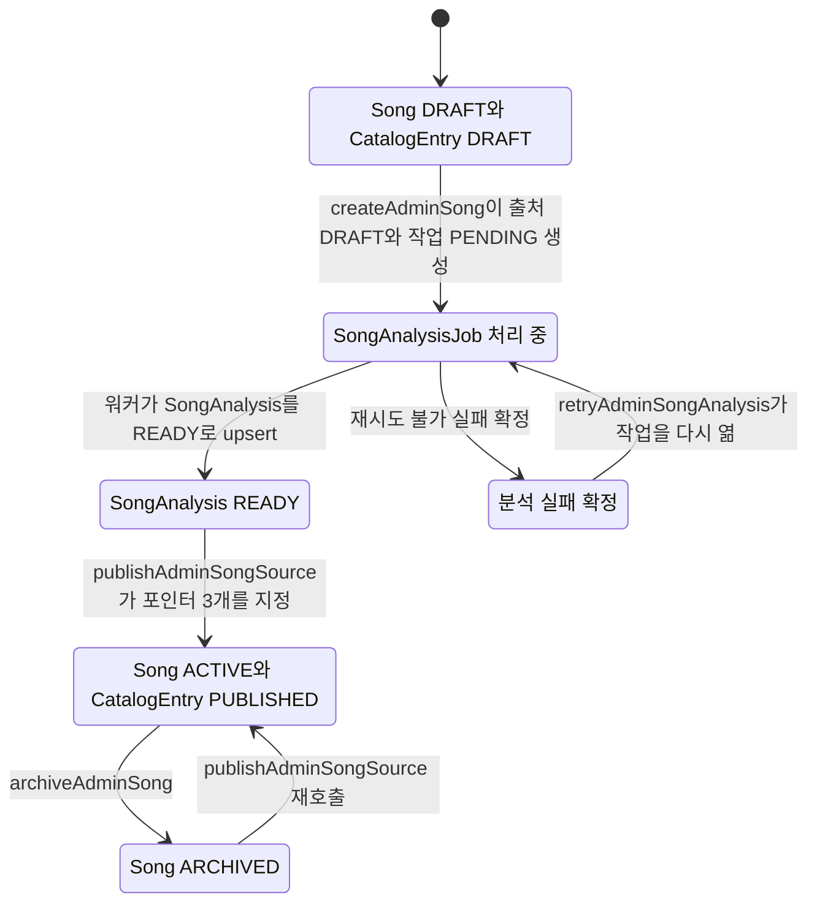

# 곡 카탈로그 등록과 공개

곡이 추천 대상이 되려면 `Song.lifecycleStatus`가 `ACTIVE`여야 해요. `activeSourceId`, `currentAnalysisId`, `targetAssetId` 세 포인터가 모두 채워져 그 id가 가리키는 active source·현재 분석·원곡 자산이 각각 `READY`여야 하고, 분석은 `cleanupConfirmed`가 `true`여야 해요. 분석과 자산의 `sourceId`는 `activeSourceId`와 같아야 하고, `CatalogEntry.status`는 `PUBLISHED`, 그 항목이 속한 `Catalog.status`도 `PUBLISHED`여야 해요.

이 조건을 이유 코드와 함께 판정하는 함수가 [catalogReadiness](repo://src/entities/song-catalog/lib/readiness.ts#L5-L45)예요. 추천 조회 [loadPublishedCatalog](repo://src/entities/song-catalog/api/published-catalog.ts#L6-L21)는 같은 조건을 where 절로 걸되 `Catalog.status`가 `PUBLISHED`라는 조건을 더하고, 포인터가 가리키는 행의 id 일치와 `sourceId` 연결 검사는 하지 않아요. 그 두 검사까지 포함해 전체를 판정하는 곳이 `catalogReadiness`이고, [verifyDatabaseSongCatalog](repo://src/entities/song-catalog/api/catalog-snapshot.ts#L45-L78)가 이 함수로 공개 행을 다시 검사해요. 그래서 등록·공개 절차의 목표는 "조건을 만족하는 행을 만들고 그 포인터를 명시적으로 연결하는 것"이에요. 점수 계산 자체는 [추천과 키 적합도 계산](recommendation-and-key-fit.md)이 맡고, 여기서는 공개 조건만 다뤄요.

그림: `Song`의 `DRAFT`·`ACTIVE`·`ARCHIVED`와 `SongAnalysis`의 분석 진행, `CatalogEntry`의 공개 상태를 합쳐 본 곡 하나의 진행 단계예요.

등록부터 공개까지는 네 단계예요. 1단계는 한 트랜잭션에서 `Song`, `SongSource`(`DRAFT`), `CatalogEntry`(`DRAFT`), `SongAnalysisJob`(`PENDING`)을 만들어요. 2단계는 원곡 음원 파일을 올려 그 출처에 `READY`인 `CatalogTargetAsset`을 붙여요. 3단계는 분석 워커가 그 출처를 분석해 `SongAnalysis`를 `READY`와 `cleanupConfirmed: true`로 남겨요. 4단계는 [publishAdminSongSource](repo://src/features/manage-song-catalog/api/admin-service.ts#L229-L276)가 포인터 세 개를 지정하고 `CatalogEntry.status`를 `PUBLISHED`로 바꿔요.

## 등록: 한 트랜잭션이 네 행을 만들어요

관리자 API `POST /api/admin/catalog`는 [handlePOST](repo://src/_app/api-routes/admin/catalog/catalog-route.ts#L25-L46)에서 [createAdminSong](repo://src/features/manage-song-catalog/api/admin-service.ts#L73-L140)을 부른 뒤 원곡 파일을 업로드해요. 요청에 `audio` 파일이 없으면 곡을 만들기 전에 `AUDIO_REQUIRED` 400으로 끝나요. 반대로 업로드 단계가 실패하면 곡과 출처·항목은 이미 만들어진 상태로 남고, 그 곡의 공개는 `TARGET_NOT_READY`로 막혀요.

`createAdminSong`은 하나의 트랜잭션에서 이 순서로 진행해요. `SONG` 큐의 advisory lock을 먼저 잡고, `TJ_2607_CATALOG_SLUG`로 `Catalog` 행을 찾아요. 없으면 `CATALOG_NOT_FOUND` 409예요. 저장소의 제품 코드에서 이 행을 만드는 곳은 스냅샷 가져오기뿐이므로, 곡을 직접 등록하기 전에 스냅샷을 한 번 가져와 카탈로그를 준비해 두세요([catalog-import.ts](repo://src/entities/song-catalog/api/catalog-import.ts#L268-L284)).

1. 마지막 `CatalogEntry.position`을 읽어 `input.catalogPosition ?? (마지막 position + 1)`로 순위를 정해요. 관리자 라우트는 `catalogPosition`을 보내지 않으므로 API로 등록하면 항상 마지막 순위 다음 값이 붙어요([catalog-route.ts](repo://src/_app/api-routes/admin/catalog/catalog-route.ts#L32-L37)).
2. `Song`을 `lifecycleStatus: "DRAFT"`로 만들어요.
3. `SongSource`를 `revision: 1`, `status: "DRAFT"`로 만들어요. `sourceVideoId`는 요청의 YouTube URL에서 파생하고, `sourceLabel`은 `관리자 업로드`예요([schema.ts](repo://src/features/manage-song-catalog/model/schema.ts#L28-L40)).
4. `CatalogEntry`를 `status: "DRAFT"`로 만들어요.
5. 큐 용량을 확인한 뒤 `SongAnalysisJob`을 `PENDING`으로 만들어요.

`CatalogEntry`의 유일성은 스키마가 지켜요. `@@unique([catalogId, position])`이 순위 중복을, `@@unique([catalogId, songId])`가 같은 곡의 중복 등록을 막아요([prisma/schema.prisma](repo://prisma/schema.prisma#L330-L346)). `SongAnalysisJob`은 `sourceId`가 unique라 출처 하나에 작업 하나만 붙어요.

출처를 교체할 때는 [replaceAdminSongSource](repo://src/features/manage-song-catalog/api/admin-service.ts#L142-L195)가 마지막 `revision`에 1을 더한 새 `SongSource`(`DRAFT`)와 새 `SongAnalysisJob`을 만들어요. 기존 출처 행과 그 분석 결과는 그대로 남고, 교체 공개가 성공하면 이전 출처의 상태만 바뀌어요.

### 같은 요청을 두 번 보내도 안전한 이유

두 함수 모두 `SongAnalysisJob.idempotencyKey`를 먼저 조회해 같은 요청을 알아봐요. 입력이 같으면 새 행을 만들지 않고 기존 결과를 돌려줘요.

| 상황 | 결과 |
| --- | --- |
| 같은 키, 같은 입력 | 기존 곡 또는 출처를 그대로 반환해요 |
| 같은 키, 다른 제목·아티스트·영상 ID | `IDEMPOTENCY_CONFLICT` 409 |
| 같은 키를 다른 곡에서 사용 | `IDEMPOTENCY_CONFLICT` 409 |
| 트랜잭션 경쟁으로 `P2002`가 나고 입력이 같음 | 경쟁 상대가 만든 행을 반환해요 |
| 경쟁 후 입력이 다름 | `SONG_CONFLICT` 또는 `SOURCE_CONFLICT` 409 |

`idempotencyKey` 자체의 unique 제약이 경쟁을 막고, 애플리케이션은 `P2002`를 잡아 다시 조회하는 방식으로 그 경쟁을 처리해요([admin-service.ts](repo://src/features/manage-song-catalog/api/admin-service.ts#L124-L139)).

## 분석 계약을 고정하는 두 상수

분석 결과를 어느 행에 쓸지, 어느 카탈로그를 대상으로 하는지는 환경 변수가 아니라 코드 상수 두 개가 정해요([catalog.ts](repo://src/shared/config/catalog.ts#L1-L2)).

| 상수 | 값 | 쓰이는 곳 |
| --- | --- | --- |
| `TJ_2607_CATALOG_SLUG` | `tj-2026-07-top-100` | 등록 시 `Catalog` 조회, 공개 항목 조회, 추천용 공개 카탈로그 조회, 스냅샷 검증 |
| `SONG_ANALYSIS_PIPELINE_CONTRACT` | `yt-dlp-demucs-librosa-pyin-v1` | 워커의 `SongAnalysis` upsert 키, 공개 시 분석 조회 키, 스냅샷에 기록되는 계약 이름 |

`SongAnalysis`에는 `@@unique([sourceId, pipelineContract])`가 걸려 있어요([prisma/schema.prisma](repo://prisma/schema.prisma#L241-L283)). 그래서 같은 출처를 같은 계약으로 다시 분석한 결과는 기존 행을 갱신하고, `SONG_ANALYSIS_PIPELINE_CONTRACT` 값을 바꾸면 같은 출처에 별도 분석 행이 생겨요. 재분석 결과가 이전 결과를 대체하는지 나란히 남는지를 이 키가 결정해요.

## 분석 워커가 하는 일

`pnpm run worker:song-analysis`가 [scripts/song-analysis-worker.ts](repo://scripts/song-analysis-worker.ts#L1-L6)를 실행해 [runSongAnalysisWorker](repo://src/_app/background-jobs/song-analysis/runner.ts#L11-L44)를 돌려요. 점유와 lease의 공통 규칙은 [Job 큐와 lease 복구 계약](../operations/job-processing.md)이, 동시성·lease 길이·poll 간격을 바꾸는 환경 변수는 [환경 변수와 런타임 한도](../operations/configuration.md)가 소유해요. 여기서는 곡 분석에만 있는 부분을 봐요.

### 점유 조건이 자산 준비를 기다려요

[claimNextSongAnalysisJob](repo://src/_app/background-jobs/song-analysis/worker.ts#L33-L64)은 `nextAttemptAt`이 지난 작업 중에서도 다음 중 하나일 때만 점유해요. `attempts >= maxAttempts`이거나, `deadlineAt`이 지났거나, 같은 `sourceId`에 `READY`인 `CatalogTargetAsset`이 있을 때예요. 그래서 원곡 음원이 아직 준비되지 않은 작업은 정상 경로로는 점유되지 않고 `PENDING`으로 남아요. 시도나 시간이 이미 소진된 작업만 예외적으로 점유돼 실패로 확정돼요.

점유할 때 `deadlineAt`을 `COALESCE(deadlineAt, COALESCE(startedAt, now) + interval '75 minutes')`로 한 번만 채우고, `attempts`를 1 늘려요. 같은 SQL이 `FOR UPDATE SKIP LOCKED`로 후보를 하나만 고르므로 워커를 여러 개 띄워도 같은 작업을 두 번 처리하지 않아요([tests/song-analysis-queue.integration.ts](repo://tests/song-analysis-queue.integration.ts#L60-L79)).

### Modal 제출과 결과 저장

[processClaimedSongAnalysisJob](repo://src/_app/background-jobs/song-analysis/worker.ts#L129-L325)은 분석기 설정이 없으면 `ANALYZER_NOT_CONFIGURED`로 실패하고, `READY` 자산이 없으면 `ANALYSIS_SOURCE_NOT_READY`로 실패해요. 정상 경로는 이 순서예요.

1. 활성화된 `READY` `CatalogTargetAsset`을 `createdAt` 내림차순으로 하나 골라 `externalUrl`에서 원곡 bytes를 내려받아요. 응답이 429이거나 5xx면 재시도 가능으로 표시해요.
2. 제출 직전 트랜잭션에서 `submissionState`를 `UNKNOWN`으로 쓰고 `submissionStartedAt`을 기록해요. 접수가 불확실한 구간을 남기는 장치예요.
3. [submitSongAnalysis](repo://src/features/manage-song-catalog/api/analyzer.ts#L81-L112)가 `POST /v1/jobs`에 multipart로 `audio`, `requestId`, `sourceVideoId`를 보내고 202 응답의 `externalJobId`를 받아요. `requestId`는 `externalRequestId`가 있으면 그 값, 없으면 작업 id예요.
4. `externalJobId`를 `ExternalJobReconciliation`에 `reason: "OBSERVED_SUBMISSION"`으로 남기고, `submissionState`를 `SUBMITTED`로 확정해요. 이 갱신이 실패하면 lease를 잃은 것으로 보고 오류를 던져요.
5. [pollSongAnalysis](repo://src/features/manage-song-catalog/api/analyzer.ts#L114-L138)로 `PROCESSING`이면 poll 간격만큼 기다렸다가 다시 조회하고, `FAILED`면 오류로 끝내고, `SUCCEEDED`면 결과를 받아요.
6. 결과를 `SongAnalysis`에 `status: "READY"`, `cleanupConfirmed: true`, 원키·신뢰도·음역 지표·`descriptors`·`pipelineMetadata`와 함께 upsert하고, 작업을 `SUCCEEDED`로 닫아요([worker.ts](repo://src/_app/background-jobs/song-analysis/worker.ts#L226-L312)).

`cleanupConfirmed`는 응답 스키마에서 `z.literal(true)`로 검증해요([analyzer.ts](repo://src/features/manage-song-catalog/api/analyzer.ts#L6-L25)). 그래서 공개 조건이 요구하는 이 값은 검증된 성공 응답으로만 `true`가 될 수 있어요. Modal 쪽 계약과 실패 코드는 [Modal 서비스 연동](../integrations/modal-services.md)이 설명해요.

### 실패를 기록하고 정리 대상을 남겨요

[failure](repo://src/_app/background-jobs/song-analysis/worker.ts#L66-L127)는 `JobDeadlineError`가 아니고 `retryable`이며 `attempts < maxAttempts`일 때만 재시도해요. 재시도 대기는 `min(60, 5 * 2^(attempts-1))`초이고, 재시도하면 작업이 `PENDING`으로 돌아가요. 그 외에는 실패를 확정하고, 같은 `@@unique([sourceId, pipelineContract])` 키로 `SongAnalysis`를 upsert하며 상태를 `FAILED`로 덮어쓰는 동시에 `ExternalJobReconciliation` 행을 만들어요.

정리 대상 키는 `externalRequestId`가 있으면 `SONG:{externalRequestId}`, 없으면 `SONG`이고 `reason`은 `TERMINAL_EXTERNAL_RECONCILIATION`이에요. 실패한 출처를 운영자가 다시 열려면 [retryAdminSongAnalysis](repo://src/features/manage-song-catalog/api/admin-service.ts#L197-L227)를 써요. `FAILED`인 작업만 대상으로 하고, `attempts`를 0으로, `submissionState`를 `NOT_SUBMITTED`로 되돌리면서 새 `externalRequestId`를 발급해 이전 접수와 구분해요. 같은 출처의 재분석 결과는 `@@unique([sourceId, pipelineContract])` 키로 갱신될 뿐 새 분석 행을 만들지 않아요. 남은 외부 작업 정리는 [장애 복구 런북](../operations/recovery-runbook.md)이 다뤄요.

## 공개: 포인터 세 개와 항목 상태를 한 번에 바꿔요

관리자 API `POST /api/admin/catalog/{songId}/sources/{sourceId}/publish`가 [publishAdminSongSource](repo://src/features/manage-song-catalog/api/admin-service.ts#L229-L276)를 불러요([publish-route.ts](repo://src/_app/api-routes/admin/catalog/publish-route.ts#L6-L17)). 이 함수는 트랜잭션 안에서 다음 네 가지를 확인하고, 하나라도 어긋나면 `SongCatalogAdminError`를 던져 트랜잭션을 되돌려요.

| 검사 | 실패 코드 |
| --- | --- |
| `songId` 아래에 해당 출처가 있는지 | `SOURCE_NOT_FOUND` 404 |
| `SONG_ANALYSIS_PIPELINE_CONTRACT` 키의 분석이 `READY`이고 `cleanupConfirmed === true`인지 | `ANALYSIS_NOT_READY` 409 |
| 같은 출처에 `READY`인 자산이 있고 그 `sourceVideoId`가 출처와 같은지 | `TARGET_NOT_READY` 409 |
| `TJ_2607_CATALOG_SLUG` 카탈로그의 항목이 있는지 | `CATALOG_ENTRY_NOT_FOUND` 404 |

통과하면 트랜잭션 안에서 이 순서로 상태를 바꿔요. 다른 `READY` 출처를 `SUPERSEDED`로 내리고, 대상 출처를 `READY`로 올리고, 항목을 `PUBLISHED`와 `publishedAt`으로 바꾸고, `Song`을 `ACTIVE`로 바꾸면서 `activeSourceId`, `currentAnalysisId`, `targetAssetId`, `originalKey`(분석의 `estimatedKey`)를 지정해요.

카탈로그 `revision`은 공개 결과가 실제로 바뀔 때만 1 증가해요. 증가 조건은 항목이 아직 `PUBLISHED`가 아니거나, `activeSourceId`·`currentAnalysisId`·`targetAssetId` 중 하나가 이번에 지정한 행과 달랐을 때예요. 그래서 같은 출처를 다시 공개해도 `revision`은 오르지 않아요([tests/admin-song-catalog.integration.ts](repo://tests/admin-song-catalog.integration.ts#L121-L140)). 추천 응답이 `catalogRevision`을 함께 돌려주는 이유가 여기 있어요.

`CatalogEntry`만 `PUBLISHED`로 바꾼다고 추천이 시작되지는 않아요. 추천 조회는 `Catalog.status`도 `PUBLISHED`인 카탈로그를 요구해요([published-catalog.ts](repo://src/entities/song-catalog/api/published-catalog.ts#L10-L20)). `Catalog.status`를 `PUBLISHED`로 쓰는 코드 경로는 스냅샷 가져오기뿐이고([catalog-import.ts](repo://src/entities/song-catalog/api/catalog-import.ts#L269-L284)), 공개 함수는 항목과 곡만 바꿔요. 그래서 `Catalog` 행이 `DRAFT`로 남아 있으면 항목을 아무리 공개해도 추천 대상이 되지 않아요.

### 공개가 막혔을 때 무엇을 고쳐야 하는지

관리자 화면은 상태 라벨과 발행 차단 사유로 같은 조건을 알려줘요([presentation.ts](repo://src/features/manage-song-catalog/model/presentation.ts#L27-L35), [presentation.ts](repo://src/features/manage-song-catalog/model/presentation.ts#L42-L102)).

| 화면에 보이는 문구 | 원인 | 고치는 방법 |
| --- | --- | --- |
| 원곡 파일 필요 / 원곡 음원 파일을 업로드해야 해요. | 그 출처에 `READY`인 `CatalogTargetAsset`이 없어요 | `POST /api/admin/catalog/sources/{sourceId}/target`으로 원곡 파일을 올려요 |
| 분석 실패 / 실패한 음원 분석을 다시 시도해야 해요. | 출처의 작업이 `FAILED`예요 | `POST /api/admin/catalog/sources/{sourceId}/retry`를 호출해요 |
| 음원 분석 중 / 원곡 음원을 분석하고 있어요. | 출처의 작업이 `PROCESSING`이에요 | 워커가 끝날 때까지 기다려요 |
| 분석 대기 중 / 원곡 음원 분석이 시작되기를 기다리고 있어요. | 작업이 `PENDING`이거나 아직 없어요 | 원곡 파일이 준비됐는지 확인하고 기다려요 |
| 사용할 수 있는 음원 분석 결과가 필요해요. | 작업은 끝났지만 그 출처에 계약에 맞는 `READY` 분석이 없어요 | 재시도로 분석을 다시 실행해요 |

원곡 파일과 분석이 모두 준비되면 발행 차단 사유가 사라지고 발행 버튼이 열려요. 이미 active source인 버전은 `추천에 공개 중`, 보관된 곡의 버전은 `보관됨`, 아직 공개 전인 버전은 `공개 준비 완료`로 표시돼요.

원곡 파일 업로드 규칙은 [uploadAdminCatalogTarget](repo://src/features/manage-song-catalog/api/target-assets.ts#L17-L66)에 있어요. 지원 대상 오디오 형식만 받고, 49,000,000 bytes를 넘으면 `PAYLOAD_TOO_LARGE` 413이에요. 같은 출처·같은 `sha256`의 `READY` 자산이 이미 있으면 업로드를 건너뛰고 그 행을 재사용해요. 같은 파일을 두 번 올려도 외부 저장소 호출이 한 번만 일어나는지가 변경 범위 테스트로 확인돼요([tests/admin-song-catalog.integration.ts](repo://tests/admin-song-catalog.integration.ts#L115-L120)). 자산 행과 외부 bytes의 대응은 [미디어 저장과 정리 의도](../operations/media-storage.md)가 설명해요.

### 원곡 자산을 교체해도 남는 것

공개로 `targetAssetId`가 다른 행으로 바뀌면 이전 자산의 삭제를 시도해요([admin-service.ts](repo://src/features/manage-song-catalog/api/admin-service.ts#L273-L274)). 이때 [scheduleAssetDeletion](repo://src/shared/media/operations.ts#L63-L111)이 그 자산을 참조하는 진행 중 `SongAnalysisJob`, `Song.targetAssetId`, `MixingJob.targetAssetId`를 확인하고, 참조가 하나라도 있으면 삭제를 거부해요. [cleanupUnreferencedCatalogTarget](repo://src/features/manage-song-catalog/api/target-assets.ts#L68-L81)은 이 거부를 오류로 올리지 않고 `false`로 돌려줘요.

그래서 출처와 자산을 교체해도 이미 접수된 `MixingJob`의 `targetAssetId`가 가리키는 행은 남아요. 접수 시점에 `catalogPosition`, `catalogRevision`, `recommendedShift`까지 작업 행에 복사되기 때문에([mixing-queue.ts](repo://src/features/create-mixing/api/mixing-queue.ts#L81-L133)), 나중에 곡을 다시 공개해도 진행 중이던 작업의 스냅샷 근거는 흔들리지 않아요. 스냅샷 컬럼의 의미는 [데이터 모델과 수명 주기 상태](../architecture/data-model.md)가 소유해요.

## 보관과 복원

[archiveAdminSong](repo://src/features/manage-song-catalog/api/admin-service.ts#L278-L288)은 아직 `ARCHIVED`가 아닌 항목을 모두 `ARCHIVED`로 바꾸고, 항목이 있던 카탈로그마다 `revision`을 1 올리고, 곡을 `ARCHIVED`로 바꿔요. `activeSourceId`, `currentAnalysisId`, `targetAssetId` 포인터는 그대로 두기 때문에 이미 만들어진 `MixingJob`의 참조는 유지돼요. 이미 `ARCHIVED`인 곡을 다시 보관하면 `revision`은 오르지 않아요.

보관한 곡을 다시 추천에 넣으려면 같은 출처로 `publishAdminSongSource`를 다시 호출하세요. 항목이 `PUBLISHED`로, 곡이 `ACTIVE`로 돌아오고, 이번에는 결과가 바뀌었으므로 `revision`이 오르고 그 뒤 같은 요청은 다시 올리지 않아요([tests/admin-song-catalog.integration.ts](repo://tests/admin-song-catalog.integration.ts#L141-L172)).

## 스냅샷으로 카탈로그를 옮겨요

`GET /api/admin/catalog/export`는 카탈로그 전체를 JSON 파일로 내려주고, `POST /api/admin/catalog/import`는 그 파일로 새 환경을 채워요([export-route.ts](repo://src/_app/api-routes/admin/catalog/export-route.ts#L6-L22), [import-route.ts](repo://src/_app/api-routes/admin/catalog/import-route.ts#L12-L65)). 가져오기 본문 상한은 20MiB예요.

내보내기 전에 [verifyDatabaseSongCatalog](repo://src/entities/song-catalog/api/catalog-snapshot.ts#L45-L78)가 공개 행마다 준비 조건과 `position` 유효성을 검사해요. `total`이 0이거나 `invalid`가 하나라도 있으면 [exportDatabaseSongCatalog](repo://src/entities/song-catalog/api/catalog-snapshot.ts#L80-L86)는 스냅샷을 만들지 않고 예외를 던져요. 그래서 스냅샷 파일은 항상 준비 조건을 통과한 곡만 담아요.

스냅샷에는 분석 결과와 외부 자산 metadata만 들어가요. 오디오 bytes와 경로류 키는 담지 않아요.

| 구분 | 규칙 |
| --- | --- |
| 내보내기 제외 키 | `descriptors`와 `pipelineMetadata`에서 `audioBytes`, `audio_bytes`, `base64`, `tempPath`, `tmpPath`, `filePath`, `storagePath` 패턴에 걸리는 키는 빼고 써요([catalog-snapshot.ts](repo://src/entities/song-catalog/api/catalog-snapshot.ts#L7-L22)) |
| `pipelineMetadata` | `ytDlpVersion`, `separator`, `separatorVersion`, `separatorModel`, `analyzer`, `analyzerVersion`만 남겨요 |
| 내보내기 큰 문자열 | 길이가 20,000자를 넘거나, 4,096자를 넘으면서 base64처럼 보이는 문자열은 버려요 |
| 가져오기 검증 | 같은 금지 키가 들어 있으면 스키마 검증이 실패해 `INVALID_SNAPSHOT` 400이에요([snapshot.ts](repo://src/entities/song-catalog/model/snapshot.ts#L128-L143), [import-route.ts](repo://src/_app/api-routes/admin/catalog/import-route.ts#L46-L58)) |
| 스키마 버전 | `CATALOG_SNAPSHOT_SCHEMA_VERSION = 3`([snapshot.ts](repo://src/entities/song-catalog/model/snapshot.ts#L3-L3))이므로 다른 버전 파일은 `INVALID_SNAPSHOT`으로 거절해요 |

이 필터는 키 이름만 봐요. 자산의 `externalUrl`, `fileName`, `sha256`같은 계약 필드는 그대로 담기므로, 스냅샷 파일 자체는 외부 저장소 위치를 포함하는 신뢰된 운영 산출물로 다루세요.

가져오기는 곡마다 출처·분석·자산을 upsert하고, 세 행이 모두 `READY`이고 자산의 `sourceVideoId`가 출처와 같을 때만 `CatalogEntry`를 `PUBLISHED`로, `Song`을 `ACTIVE`로 만들어요. 하나라도 어긋나면 항목은 `DRAFT`로 남고 곡의 `analysisStatus`만 갱신돼요([catalog-import.ts](repo://src/entities/song-catalog/api/catalog-import.ts#L211-L257)). 순위·출처·자산의 중복과 영상 ID 불일치는 트랜잭션을 시작하기 전에 걸러요([catalog-import.ts](repo://src/entities/song-catalog/api/catalog-import.ts#L22-L45)).

가져오기는 멱등해요. 같은 스냅샷을 두 번 넣으면 두 번째 호출에서는 다섯 종류의 행이 새로 만들어지지 않아요.

| 두 번째 호출의 결과 필드 | 기대값 | 기존 행을 찾는 키 |
| --- | --- | --- |
| `songsCreated` | 0 | `Song.title_artist` |
| `sourcesCreated` | 0 | `SongSource.sourceVideoId` |
| `analysesCreated` | 0 | `SongAnalysis.sourceId_pipelineContract` |
| `targetsCreated` | 0 | `CatalogTargetAsset.externalProjectId_externalFileId` |
| `entriesCreated` | 0 | `CatalogEntry.catalogId_songId` |

생성 개수는 각 upsert가 기존 행을 찾았을 때만 늘어요([catalog-import.ts](repo://src/entities/song-catalog/api/catalog-import.ts#L105-L113), [catalog-import.ts](repo://src/entities/song-catalog/api/catalog-import.ts#L209-L243)). 그래서 두 번째 호출의 `published`도 첫 번째와 같은 값이고, 항목은 그대로 `PUBLISHED`로 남아요. 카탈로그 `revision`은 스냅샷 값과 기존 값 중 큰 쪽으로 맞추므로 낮아지지 않아요([tests/catalog-snapshot.integration.ts](repo://tests/catalog-snapshot.integration.ts#L64-L96), [tests/catalog-snapshot.integration.ts](repo://tests/catalog-snapshot.integration.ts#L173-L215)).

## 이 절차를 확인하는 변경 범위 테스트

| 명령 | 확인하는 것 |
| --- | --- |
| `pnpm run test:admin` | 관리자 화면과 관리자 작업 통합 흐름([package.json](repo://package.json#L69-L69)) |
| `pnpm run test:song-analysis-queue` | Modal adapter 계약, 점유·lease·재시도, 공개와 멱등성([package.json](repo://package.json#L51-L51), [admin-song-catalog.integration.ts](repo://tests/admin-song-catalog.integration.ts#L23-L194)) |
| `pnpm run catalog:db:verify` | 공개 카탈로그가 준비 조건을 모두 만족하는지([scripts/verify-database-song-catalog.ts](repo://scripts/verify-database-song-catalog.ts#L5-L13)) |

스냅샷 계약은 [catalog-snapshot.integration.ts](repo://tests/catalog-snapshot.integration.ts#L8-L96)가 직접 검증해요. 이 파일은 내보내기 필터, 가져오기 멱등성, 중복 거부, `revision` 하향 방지를 확인하지만 `package.json` 스크립트에는 연결되어 있지 않으므로 `node --conditions react-server --import tsx --test tests/catalog-snapshot.integration.ts`로 직접 실행하세요.

공개 절차를 바꿀 때는 `pnpm run test:song-analysis-queue`를 먼저 돌려서 실패 코드, `SUPERSEDED` 전이, `revision` 증가 멱등성이 그대로인지 확인하세요.
